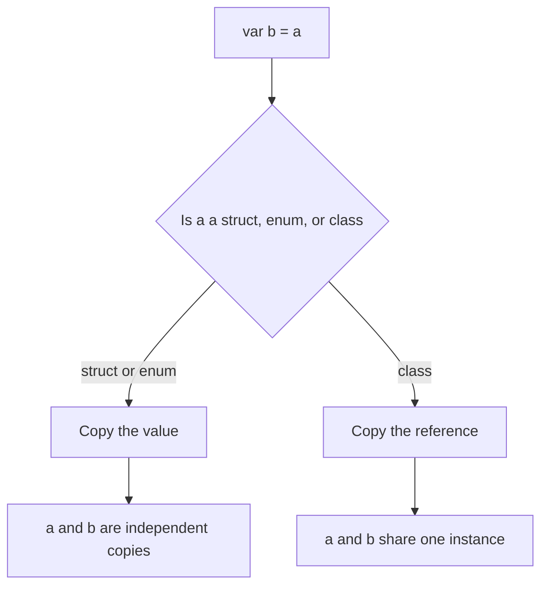
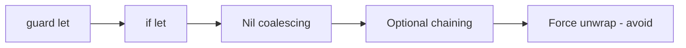

# Lecture 1 — Swift for the Typed-OOP Engineer: What Maps and What Breaks

> **Duration:** ~2 hours of reading + hands-on.
> **Outcome:** You can read idiomatic Swift, predict whether a given construct behaves like the typed-OOP language you already know, and name the three places where your existing instincts will actively hurt you — optionals, value types, and the absence of `null`.

If you only remember one thing from this lecture, remember this:

> **Swift has no `null`. It has `Optional`, which is an ordinary `enum`, and a syntax (`?`, `!`, `if let`, `guard let`) for working with it. Everything else in Swift you can pattern-match against your existing language. The optional model you have to learn fresh, because getting it wrong is how you ship the exact crash — the null-pointer dereference — that Swift was built to prevent.**

You arrive at Swift fluent in at least one of Java, Kotlin, C#, TypeScript, Go, or Rust. That is an enormous head start. Functions, classes, generics, closures, exceptions-or-results, collections — you have all of those concepts already, and Swift's versions are close enough that you can read them on day one. This lecture is not a from-scratch tour. It is a **diff** against the language in your head, organized into "this maps cleanly" and "this will break your instincts."

We move fast. The official *Swift Programming Language* book is the reference; this lecture is the senior-engineer's annotated map.

---

## 1. The five-minute syntax map

Before the conceptual material, here is enough syntax to read every example in this lecture. If you know Kotlin or TypeScript, most of this is muscle memory with the keywords moved around.

```swift
// Constants and variables. Prefer `let`; reach for `var` only when you mutate.
let maxRetries = 3            // inferred Int, immutable
var attempt = 0               // inferred Int, mutable

// Explicit types when inference isn't enough or for documentation.
let timeout: Double = 5
let name: String = "Ada"

// Functions. Argument labels are part of the API.
func greet(_ name: String, loudly: Bool = false) -> String {
    let base = "Hello, \(name)"
    return loudly ? base.uppercased() + "!" : base
}

greet("Ada")                  // "Hello, Ada"
greet("Ada", loudly: true)    // "HELLO, ADA!"

// String interpolation with \(...). No format-string footguns.
let msg = "attempt \(attempt) of \(maxRetries)"

// Control flow needs no parentheses; braces are mandatory.
if attempt < maxRetries {
    attempt += 1
}

// for-in over a range or any Sequence.
for i in 0..<maxRetries {      // 0, 1, 2 (half-open range)
    print(i)
}
```

Three things a newcomer trips on immediately:

1. **`let` is not `final` bolted on as an afterthought — it is the default mindset.** You declare `let` first and only widen to `var` when you genuinely mutate. A Swift code reviewer will challenge a `var` that is never reassigned.
2. **Argument labels are part of the function's name.** `greet(_:loudly:)` is the function. The `_` means "no label at the call site for this parameter." This reads strangely at first and becomes one of the things you miss in other languages within a month.
3. **String interpolation is `\(expr)`**, not `${expr}` or `{}` or `%s`. There is no positional-format-string class of bug in idiomatic Swift.

---

## 2. What maps cleanly from your old language

These constructs you already understand. Swift's spelling differs; the semantics do not surprise you.

### Classes, inheritance, and methods

```swift
class Animal {
    let name: String
    init(name: String) { self.name = name }
    func speak() -> String { "..." }
}

final class Dog: Animal {
    override func speak() -> String { "Woof" }
}
```

`class`, single inheritance, `override`, `init` as the constructor, `self` as the receiver. If you write Java or C#, this is home. Two notes: Swift uses `final` to seal a class (and you should, by default, for performance and clarity), and `init` is a keyword, not a method named after the class.

### Generics

```swift
func firstOrDefault<Element>(_ items: [Element], default fallback: Element) -> Element {
    items.first ?? fallback
}
```

Angle-bracket generics with constraints (`<T: Comparable>`), exactly like Java/C#/Kotlin/TypeScript. Swift's generics are reified — they are not erased like Java's — but for Week 1 you only need to know they read the way you expect. Week 2 goes deep on generics, protocols, `some`, and `any`.

### Closures (lambdas)

```swift
let names = ["ada", "grace", "edsger"]
let capitalized = names.map { $0.capitalized }      // trailing-closure syntax
let longOnes = names.filter { $0.count > 4 }
let total = [1, 2, 3].reduce(0, +)
```

`map`, `filter`, `reduce`, `sorted`, `compactMap` — the standard higher-order toolkit, the same one you reach for in Kotlin's `let`/`map` or C#'s LINQ or JavaScript's array methods. `$0` is the implicit first argument; trailing-closure syntax (`names.map { ... }`) lets you drop the parentheses when the last argument is a closure.

### Enums (but richer than you expect)

```swift
enum Direction {
    case north, south, east, west
}
```

A plain enum looks like every enum you've met. But Swift enums carry **associated values** and are the backbone of the language's modeling power — closer to a Rust enum or a Kotlin sealed class than a Java enum. We use this in §6 (optionals are an enum) and lean on it all track.

### Exhaustive `switch`

```swift
func describe(_ d: Direction) -> String {
    switch d {
    case .north: return "up"
    case .south: return "down"
    case .east:  return "right"
    case .west:  return "left"
    }
}
```

Here is the first place Swift is stricter than Java or C#: **`switch` must be exhaustive.** No `default` is required if every case is covered, and the compiler errors if you miss one. Add a fifth direction later and every non-exhaustive switch becomes a compile error pointing you at the code to update. This is a feature, not a nuisance — it is how you refactor a large codebase fearlessly. If you've written Kotlin `when` on a sealed class or Rust `match`, you already love this.

---

## 3. What breaks: the three big ones

Now the part you came for. These three are where your instincts from a `null`-bearing OOP language will mislead you.

1. **There is no `null`.** "No value" is modeled by `Optional`, an ordinary enum, and the type system forces you to handle the empty case before you use the value.
2. **`struct` and `enum` are value types, copied on assignment.** Most of the types you'll write and most of the standard library are value types, not reference types. Sharing-by-reference is the exception, not the default.
3. **Immutability is the default posture.** `let` everywhere; `var` only when you mean it. Value types plus `let` give you compile-time-checked immutability that a Java `final` field only approximates.

The rest of this lecture is these three, in depth.

---

## 4. Value types vs reference types — the distinction that trips up everyone

This is the type-system distinction that trips up engineers from Java, C#, Python, and JavaScript the most, because in those languages "an object" almost always means "a heap reference you share."

| | Reference type | Value type |
|--|----------------|-----------|
| Keyword | `class`, `actor` | `struct`, `enum` |
| Lives | On the heap, reference-counted (ARC) | Inline — in its container, on the stack, or in a struct that holds it |
| Variable holds | A reference to the instance | The bytes of the value itself |
| Copy on assignment | Copies the reference (two names, one instance) | Copies the value (two independent values) |
| Identity | `===` checks reference identity | No identity — only equality of contents |
| Mutability | A `let` reference can still mutate the instance's `var` properties | A `let` value is fully immutable, top to bottom |

```swift
struct PointValue { var x: Int; var y: Int }
class  PointRef   { var x: Int; var y: Int; init(x: Int, y: Int) { self.x = x; self.y = y } }

var a = PointValue(x: 1, y: 2)
var b = a            // b is an independent COPY
b.x = 99
print(a.x)           // 1  — a is untouched

let c = PointRef(x: 1, y: 2)
let d = c            // d and c reference the SAME instance
d.x = 99
print(c.x)           // 99 — surprise, or not, if you're used to references
```

If you come from Java or C#, the `class` behaviour is what you expect and the `struct` behaviour is the surprise. **Internalize the struct behaviour, because in Swift the struct behaviour is the common case.** `String`, `Array`, `Dictionary`, `Set`, `Int`, `Bool`, `Date`, your model types — all value types. You will write `struct` far more often than `class`.


*Assigning a struct or enum copies the value; assigning a class copies only the reference.*

### `let` on a value type is total immutability

```swift
let frozen = PointValue(x: 1, y: 2)
// frozen.x = 5    // ❌ compile error: cannot assign to property; 'frozen' is a 'let' constant
```

A `let` on a value type freezes the whole value. A `let` on a reference type only freezes the reference — you can still mutate the instance's `var` properties. This is one of the strongest reasons to default to value types: `let myStruct` means it cannot change, period, and the compiler enforces it.

### `mutating` methods

Because a `struct` is a value, a method that changes `self` must say so:

```swift
struct Counter {
    private(set) var count = 0
    mutating func increment() { count += 1 }
}

var counter = Counter()
counter.increment()    // ok — counter is var
print(counter.count)   // 1

let fixed = Counter()
// fixed.increment()   // ❌ cannot call mutating method on a 'let' value
```

The `mutating` keyword is the compiler making you declare intent. A class method never needs it because mutating an instance through a reference does not change the reference.

### When to use which

- **`struct` by default.** Models, DTOs, configuration, coordinates, money amounts, anything that is "a bundle of values."
- **`enum`** for "one of a fixed set," especially with associated values (a parse result, a network state, a unit).
- **`class`** when you genuinely need shared, mutable, referenced identity: a long-lived service, a cache, an object whose identity matters more than its contents, or interop with reference-based frameworks. We meet `actor` (a reference type for concurrency) in Weeks 3–4.

> **The mental flip.** In Java/C#/TypeScript you reach for `class` first and consider value-like behaviour an exception. In Swift you reach for `struct` first and consider reference behaviour the exception. Make that flip now; everything downstream — SwiftUI state, SwiftData models, Sendable conformance — assumes it.

---

## 5. Copy-on-write — why value-type collections aren't slow

"If `Array` is a value type, doesn't copying a million-element array on every assignment cost a fortune?" No, and the reason is **copy-on-write (COW)**.

The standard-library collections — `Array`, `String`, `Dictionary`, `Set` — are value types whose storage lives in a reference-counted buffer behind the scenes. When you assign or pass one, only the buffer reference is copied (cheap, O(1)). The actual elements are duplicated **only when you mutate a copy** while another copy still references the same buffer.

```swift
var a = [1, 2, 3, 4, 5]
var b = a            // O(1) — b shares a's buffer, no element copy yet
print(a == b)        // true, same contents

b.append(6)          // NOW b's buffer is uniquely copied, then mutated
print(a)             // [1, 2, 3, 4, 5]   — a is untouched
print(b)             // [1, 2, 3, 4, 5, 6]
```

So you get value semantics (no spooky action at a distance) with reference-like performance (no copy unless you actually fork the data). You do not implement COW yourself for the standard collections — it is built in. You *can* implement it for your own types, but that is a Week 6+ topic. For now: **value-type collections are not a performance problem; share them freely and mutate copies safely.**

---

## 6. Optionals and the absence of `null`

This is the single most important section of the week. Read it twice.

In Java a `String` can be a real string or `null`, and nothing in the type tells you which. In C# without nullable reference types, same. In TypeScript with `strictNullChecks` off, same. The result is the most common crash in the history of OOP: the null-pointer / null-reference dereference, the "billion-dollar mistake" its inventor apologized for.

Swift's answer: **a `String` is always a real string. If a value might be absent, its type is `String?` — a different type — and you cannot use it as a `String` until you have unwrapped it.** The compiler enforces this. There is no `null`. There is only `Optional`.

### `Optional` is just an enum

```swift
// Conceptually, this is what the standard library defines:
enum Optional<Wrapped> {
    case none
    case some(Wrapped)
}
```

`String?` is sugar for `Optional<String>`. `nil` is sugar for `Optional.none`. A non-nil optional is `Optional.some(value)`. That's it — there is no magic. You can read the real definition in `stdlib/public/core/Optional.swift` in the Swift repo, and it is shorter than you expect.

```swift
let present: Int? = 42      // Optional.some(42)
let absent:  Int? = nil     // Optional.none
```

### Why you cannot just use an optional

```swift
let maybeName: String? = readName()
// print(maybeName.count)   // ❌ value of optional type 'String?' must be unwrapped
```

The compiler refuses. You must handle the `nil` case. There are five idiomatic ways, in roughly the order you should reach for them.

### 6.1 `if let` — bind and use in a scope

```swift
if let name = maybeName {
    print("Hello, \(name) — \(name.count) characters")   // name is a non-optional String here
} else {
    print("No name given")
}

// Swift 5.7+ shorthand when the names match:
if let maybeName {
    print(maybeName.count)   // maybeName is non-optional inside this block
}
```

### 6.2 `guard let` — unwrap-or-leave, the senior engineer's default

`guard let` unwraps into the *enclosing* scope and forces you to exit if the value is absent. It keeps the happy path un-indented — the opposite of the "arrow code" you get from nested `if let`.

```swift
func sendGreeting(to maybeName: String?) {
    guard let name = maybeName, !name.isEmpty else {
        print("Refusing to greet an empty name")
        return   // guard MUST exit the scope: return, throw, break, or continue
    }
    // `name` is a non-optional, non-empty String for the rest of the function
    print("Hello, \(name)")
}
```

`guard let` is the idiomatic choice at the top of a function: validate inputs, bail early, and let the rest of the body assume everything is present and valid. If you write one optional-handling pattern this week, write this one.

### 6.3 Nil-coalescing `??` — supply a default

```swift
let display = maybeName ?? "(anonymous)"     // use the right side if the left is nil
```

`??` is the clean way to provide a fallback. It is clearer than `maybeName == nil ? "(anonymous)" : maybeName!` and it does not introduce a force-unwrap.

### 6.4 Optional chaining `?.` — reach through, short-circuit on nil

```swift
struct User { let profile: Profile? }
struct Profile { let bio: String? }

let user: User? = currentUser()
let bioLength: Int? = user?.profile?.bio?.count   // Int? — nil if any link is nil
```

Each `?.` short-circuits to `nil` the moment any link in the chain is `nil`. The whole expression's type is optional. This is Swift's answer to Kotlin's `?.` and C#'s `?.` — same idea, same syntax.

### 6.5 Force-unwrap `!` — the one to avoid

```swift
let name = maybeName!     // 💥 crashes at runtime if maybeName is nil
```

`!` says "I promise this is not nil — crash if I'm wrong." It reintroduces exactly the null-dereference crash optionals exist to prevent. **Treat every `!` as a code smell that a reviewer must justify.** There are a handful of legitimate uses — a value you set up two lines ago, an `@IBOutlet`, a programmer-error invariant the type system can't see — but in application code the right count of force-unwraps is usually zero. Exercise 2 this week is specifically about refactoring force-unwrap-heavy code to be crash-safe.

> **The discipline.** When you see a nullability problem, reach for `guard let`, then `if let`, then `??`, then `?.` — in that order — before you ever consider `!`. We will hold this line in code review all track.


*The order to reach for optional-handling tools, from safest first to last resort.*

### `nil` is not `0`, `false`, or `""`

Coming from C or JavaScript, you might expect "falsy" coercion. Swift has none. `nil` is its own thing; `Optional<Int>.none` is not `0`; `Optional<Bool>.none` is not `false`. There is no implicit truthiness anywhere in Swift. An `if` condition must be a `Bool`, full stop.

---

## 7. Type inference — and when to write the type anyway

Swift infers types aggressively. `let x = 42` is an `Int`; `let y = 3.14` is a `Double`; `let s = "hi"` is a `String`; `let xs = [1, 2, 3]` is `[Int]`. You rarely write a type for a local.

But inference is not a license to omit types everywhere. Write the type explicitly when:

- **It is part of a public API.** Function parameters and return types are always explicit (the compiler requires it). Stored properties on public types benefit from explicit types for readability.
- **Inference would pick the wrong type.** `let n = 5` is `Int`; if you want a `Double`, write `let n: Double = 5` or `let n = 5.0`.
- **An empty literal has no element to infer from.** `let names: [String] = []` — the compiler cannot guess the element type of an empty array.
- **It documents intent.** `let timeout: TimeInterval = 30` reads better than a bare `30` whose meaning is unclear.

```swift
let count = 0                    // inferred Int — fine
let ratio: Double = 0            // explicit — we want Double, not Int
let empty: [String] = []         // explicit — no element to infer
let labels: [Int: String] = [:]  // explicit — empty dictionary literal
```

A good heuristic: **infer locals, annotate boundaries.** Inside a function body, let inference work. At any API surface — parameters, returns, public properties — be explicit so readers don't have to run the inference algorithm in their heads.

---

## 8. The map, summarized

Here is the diff you came for, on one screen.

| Concept | Your old language | Swift | Verdict |
|---------|-------------------|-------|---------|
| Functions, methods | familiar | `func`, argument labels | **maps** (labels are new) |
| Classes, inheritance | familiar | `class`, `final`, `override` | **maps** |
| Generics | familiar | `<T>`, constraints, reified | **maps** |
| Closures / lambdas | familiar | `{ $0 ... }`, trailing closures | **maps** |
| `switch` | optional `default` | exhaustive, pattern-matching | **stricter — a feature** |
| Enums | simple constants | associated values, like sealed classes | **richer** |
| Immutability | `final`, `readonly`, `const` | `let` as the default posture | **breaks habits** |
| Objects | reference by default | **value types by default** (`struct`/`enum`) | **breaks habits** |
| "No value" | `null` | **no `null`** — `Optional`, an enum | **learn fresh** |
| Truthiness | varies | none — `if` needs a `Bool` | **stricter** |
| Collections | reference, may share | value types with copy-on-write | **breaks habits, then delights** |

The right way to spend Week 1 is: skim past the four "maps" rows, and spend your hours on the three "breaks habits" rows and the one "learn fresh" row. That is exactly how the exercises are weighted — Exercise 1 proves value-vs-reference, Exercise 2 is optionals, Exercise 3 is collections.

---

## 9. A small example using everything

Here is a single file that uses value types, optionals, exhaustive switching, and closures together. Read it slowly.

```swift
// A tiny CSV-ish line classifier. No `null`, no force-unwrap, value types throughout.

enum Token {
    case credit(amount: Double, memo: String)
    case debit(amount: Double, memo: String)
    case blank
    case malformed(line: String)
}

func parse(_ line: String) -> Token {
    let trimmed = line.trimmingCharacters(in: .whitespaces)
    guard !trimmed.isEmpty else { return .blank }

    let fields = trimmed.split(separator: ",", maxSplits: 1).map(String.init)
    guard fields.count == 2, let amount = Double(fields[0]) else {
        return .malformed(line: line)
    }

    let memo = fields[1]
    return amount >= 0
        ? .credit(amount: amount, memo: memo)
        : .debit(amount: -amount, memo: memo)
}

func render(_ token: Token) -> String {
    switch token {           // exhaustive — the compiler checks every case is handled
    case let .credit(amount, memo):  return "+\(amount)  \(memo)"
    case let .debit(amount, memo):   return "-\(amount)  \(memo)"
    case .blank:                     return "(blank)"
    case let .malformed(line):       return "?? malformed: \(line)"
    }
}

let lines = ["10.0,Coffee", "-5.0,Refund", "", "garbage"]
for line in lines {
    print(render(parse(line)))
}
```

Output:

```
+10.0  Coffee
-5.0  Refund
(blank)
?? malformed: garbage
```

Count the features in thirty lines: an `enum` with associated values modeling four outcomes, a `guard let` that validates and bails, `Double(fields[0])` returning an `Optional` (string-to-number can fail), an exhaustive `switch`, value-type `String` and `Array`, and a closure passed to `map`. No `null`. No force-unwrap. No mutable state. That is the Swift baseline, and the mini-project this week extends this exact shape.

---

## 10. Recap

You should now be able to:

- Read idiomatic Swift syntax: `let`/`var`, `func` with argument labels, string interpolation, control flow.
- Name the four constructs that map cleanly from your old language (functions, classes, generics, closures) and not waste time re-learning them.
- Explain the difference between a value type (`struct`/`enum`) and a reference type (`class`), and predict copy-vs-share behaviour in a snippet.
- Explain copy-on-write and why value-type collections are not a performance problem.
- Handle an optional with `if let`, `guard let`, `??`, and `?.`, and explain why `!` is a code smell.
- Decide when to let type inference work and when to annotate the type.

Next up: the toolchain, the package manager, the REPL, and how to write a Swift Testing target. Continue to [Lecture 2 — SwiftPM, the REPL, and the Swift Testing target](./02-swiftpm-the-repl-and-swift-testing.md).

---

## References

- *The Swift Programming Language — The Basics*: <https://docs.swift.org/swift-book/documentation/the-swift-programming-language/thebasics/>
- *The Swift Programming Language — Structures and Classes*: <https://docs.swift.org/swift-book/documentation/the-swift-programming-language/classesandstructures/>
- *The Swift Programming Language — Optional Chaining*: <https://docs.swift.org/swift-book/documentation/the-swift-programming-language/optionalchaining/>
- *The Swift Programming Language — Enumerations*: <https://docs.swift.org/swift-book/documentation/the-swift-programming-language/enumerations/>
- *Optional.swift in the standard library*: <https://github.com/swiftlang/swift/blob/main/stdlib/public/core/Optional.swift>
- *About Swift (swift.org)*: <https://www.swift.org/about/>
