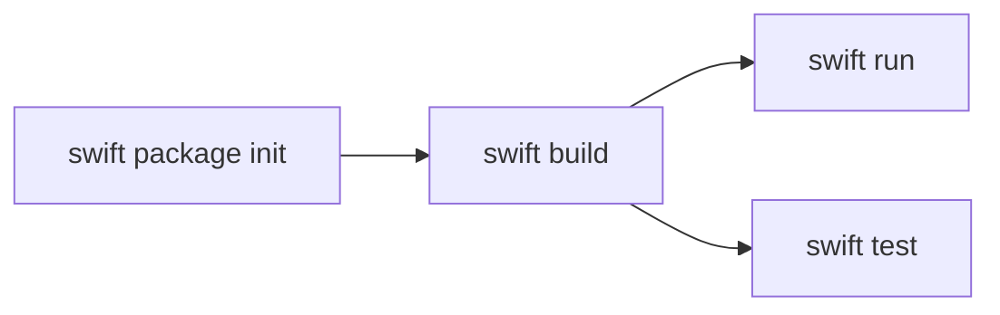
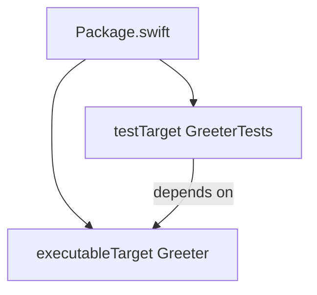

# Lecture 2 — SwiftPM Executables, the REPL, and the Swift Testing Target

> **Duration:** ~2 hours of reading + hands-on.
> **Outcome:** You can install the open-source Swift toolchain on Linux and macOS, explore a value in the REPL, scaffold a SwiftPM executable from a blank folder, read `Package.swift` line by line, and write a Swift Testing target that `swift test` runs green.

If you only remember one thing from this lecture, remember this:

> **The toolchain is one download, the package manager is built into it, and everything you'll do for the next six weeks happens at the terminal with four commands: `swift build`, `swift run`, `swift test`, and `swift package`. No Xcode, no Mac, no IDE required.**

This lecture is the operational half of Week 1. Lecture 1 was the language; this is the tooling that lets you write, run, and test it on any machine.

---

## 1. What "the Swift toolchain" actually is

When you install Swift you get a single **toolchain** — one bundle that contains everything:

| Component | What it is |
|-----------|-----------|
| `swiftc` | The compiler. Turns `.swift` files into a binary. |
| `swift` | The driver. Dispatches to the compiler, the REPL, or SwiftPM depending on arguments. |
| **SwiftPM** | Swift Package Manager — the build system and dependency manager. Invoked as `swift build`, `swift run`, `swift test`, `swift package`. |
| **The REPL** | An interactive prompt. Run `swift` with no arguments. |
| **LLDB** | The debugger, integrated. |
| **The standard library** | `Int`, `String`, `Array`, `Optional`, `Sequence`, and everything else you `import`-nothing to use. |
| **Foundation** | The cross-platform `Foundation` library — `Data`, `URL`, `Date`, `JSONDecoder`, `FileManager`. Open-source on Linux. |
| **Swift Testing** | The modern test framework — `@Test`, `#expect`. Bundled since the Swift 6 toolchain. |
| **XCTest** | The older test framework, still shipped for compatibility. |

That is the key fact for an engineer coming from another ecosystem: **there is no separate "SDK" vs "runtime" vs "build tool" install.** One toolchain, one version number, everything inside. In 2026 the current release is **Swift 6.1**, and `swift --version` reports it.

> **Swift is not Apple-only.** The language, the compiler, SwiftPM, the standard library, Foundation, and Swift Testing are all open-source under Apache-2.0, developed at `github.com/swiftlang`. The toolchain ships official builds for Linux (Ubuntu, Amazon Linux, RHEL-family, Debian), macOS, Windows, and WebAssembly. The Apple-only parts — SwiftUI, SwiftData, UIKit, Xcode — come in Phase II. Everything in Phase I (Weeks 1–6) runs on a Linux box.

---

## 2. Installing on Linux

The recommended path in 2026 is **Swiftly**, the official toolchain installer (it manages multiple toolchains the way `rustup` does for Rust or `nvm` for Node).

```bash
# Install Swiftly, which then installs the latest stable toolchain.
curl -O https://download.swift.org/swiftly/linux/swiftly-$(uname -m).tar.gz
tar zxf swiftly-$(uname -m).tar.gz
./swiftly init
# Restart your shell (or `source` the env file Swiftly prints), then:
swiftly install latest
swiftly use latest
```

Verify:

```bash
swift --version
```

You should see something like:

```
Swift version 6.1 (swift-6.1-RELEASE)
Target: x86_64-unknown-linux-gnu
```

### The no-install path: Docker

If you do not want to touch your host, the official image is the fastest way to a working Swift on Linux — and it is exactly how you'll prove cross-platform behaviour from a Mac later this week:

```bash
docker run --rm -it -v "$PWD":/work -w /work swift:6.1 swift --version
```

That mounts your current directory into a container with the Swift 6.1 toolchain and runs `swift --version` inside it. Swap the final argument for `swift build` or `swift test` to build and test your package on Linux without installing anything.

---

## 3. Installing on macOS

Two options. For Weeks 1–6 you do **not** need Xcode; the standalone toolchain is enough.

**Option A — Swiftly (matches Linux, no Xcode required):**

```bash
curl -O https://download.swift.org/swiftly/darwin/swiftly.pkg
installer -pkg swiftly.pkg -target CurrentUserHomeDirectory
~/.swiftly/bin/swiftly init
swiftly install latest && swiftly use latest
swift --version
```

**Option B — Xcode (if you already have it, or will in Phase II):**

Xcode bundles a Swift toolchain. Install Xcode from the Mac App Store, then make sure the command-line tools are selected:

```bash
xcode-select --install        # if you don't have the CLT yet
swift --version               # uses the toolchain inside the selected Xcode
```

Either way, `swift --version` should report 6.1. On macOS the target reads `arm64-apple-macosx` on Apple Silicon. Every example this week assumes `swift --version` shows 6.1.

---

## 4. The REPL — explore before you commit to a file

Run `swift` with no arguments to drop into the **Read-Eval-Print Loop**. It is the fastest way to answer "what does this API return?" without scaffolding a project.

```
$ swift
Welcome to Swift version 6.1.
Type :help for assistance.
  1> let xs = [3, 1, 2]
xs: [Int] = 3 values {
  [0] = 3
  [1] = 1
  [2] = 2
}
  2> xs.sorted()
$R0: [Int] = 3 values {
  [0] = 1
  [1] = 2
  [2] = 3
}
  3> "Hello, World".split(separator: ", ")
$R1: [Substring] = 2 values {
  [0] = "Hello"
  [1] = "World"
}
```

A few moves worth knowing:

- The REPL **prints the type** of every result (`[Int]`, `[Substring]`). This is the single best way to build an intuition for what the standard library returns — including when something returns an `Optional`.
- `$R0`, `$R1`, … name the previous results so you can reuse them: `$R0.count`.
- Multi-line input works — start a `func` or a `struct` and the prompt indents until you close the braces.
- `import Foundation` pulls in `Date`, `URL`, `Data`, etc.
- `:type expr` prints the static type without evaluating. `:help` lists the commands. `:quit` (or Ctrl-D) exits.

```
  4> import Foundation
  5> :type Date()
Date
  6> Int("42")
$R2: Int? = 42
  7> Int("nope")
$R3: Int? = nil
```

Note line 6 and 7: `Int(String)` returns an **`Optional`** because the conversion can fail. The REPL shows you `Int? = 42` and `Int? = nil` — a perfect, instant demonstration of the optional model from Lecture 1.

---

## 5. Scaffold a SwiftPM executable from scratch

SwiftPM is built into the toolchain. There is no separate install. Make a package now — this is the canonical layout for every executable mini-project in C20.

```bash
mkdir Greeter && cd Greeter
swift package init --type executable --name Greeter
```

That produces:

```
Greeter/
├── Package.swift
├── Sources/
│   └── main.swift            (or Sources/Greeter/Greeter.swift, see below)
└── Tests/
    └── GreeterTests/
        └── GreeterTests.swift
```

> **Layout note.** SwiftPM's executable templates have evolved. Recent toolchains put a single `Sources/main.swift` for a simple executable, or `Sources/<Name>/` for a named target. Either is fine; what matters is that the `Sources/` directory contains your executable target's code and `Tests/` contains the test target. Run `swift package init --help` to see the templates your installed toolchain offers.

Build, run, and test:

```bash
swift build      # compiles into .build/
swift run        # builds (if needed) and runs the executable
swift test       # builds and runs the test target
```

`swift build` ends with the line you'll learn to look for:

```
Build complete! (1.42s)
```

`swift run` prints the program's output (the template prints `Hello, world!`). `swift test` runs the bundled test and reports a pass.


*The everyday SwiftPM workflow: scaffold once, then compile before every run or test.*

---

## 6. Reading `Package.swift` line by line

Open `Package.swift`. Unlike `package.json` (JSON) or a `pom.xml` (XML), the SwiftPM manifest is **Swift code** that builds a `Package` value. It looks like this for a small executable with a test target:

```swift
// swift-tools-version: 6.1
import PackageDescription

let package = Package(
    name: "Greeter",
    targets: [
        .executableTarget(
            name: "Greeter",
            path: "Sources"
        ),
        .testTarget(
            name: "GreeterTests",
            dependencies: ["Greeter"]
        ),
    ]
)
```

Every line matters; nothing here is decoration.

- **`// swift-tools-version: 6.1`** — the first line, a magic comment. It declares the minimum SwiftPM version and unlocks the manifest API features available at that version. It is **not** optional and **must** be the first line.
- **`import PackageDescription`** — the API for describing a package. SwiftPM compiles and runs this file to learn your package's shape.
- **`name`** — the package name.
- **`targets`** — the units of build. Three kinds matter this week:
  - **`.executableTarget`** — produces a runnable binary. The target containing your `main` logic.
  - **`.target`** — a library target (no `main`). You depend on it from other targets.
  - **`.testTarget`** — a target that runs under `swift test`. It `dependencies` on the target it tests so it can `@testable import` it.
- **`dependencies: ["Greeter"]`** on the test target — declares that the tests link against the `Greeter` target. This is what lets the test file `import Greeter` (or `@testable import Greeter`).


*The manifest declares two targets, and the test target names its dependency on the executable target.*

### Adding an external dependency

To pull a package from GitHub, add it to `dependencies` at the package level and to the target's `dependencies`:

```swift
// swift-tools-version: 6.1
import PackageDescription

let package = Package(
    name: "Greeter",
    dependencies: [
        .package(url: "https://github.com/apple/swift-argument-parser", from: "1.5.0"),
    ],
    targets: [
        .executableTarget(
            name: "Greeter",
            dependencies: [
                .product(name: "ArgumentParser", package: "swift-argument-parser"),
            ],
            path: "Sources"
        ),
        .testTarget(
            name: "GreeterTests",
            dependencies: ["Greeter"]
        ),
    ]
)
```

`from: "1.5.0"` means "1.5.0 up to but not including 2.0.0" — SwiftPM uses semantic-version ranges. The next `swift build` resolves the dependency, writes a `Package.resolved` lockfile, and downloads sources into `.build/`. Commit `Package.resolved`; do not commit `.build/`.

---

## 7. The build directory and `.gitignore`

When you build, SwiftPM writes everything into `.build/` at the package root:

```
Greeter/
├── Package.swift
├── Package.resolved          (the lockfile — DO commit this)
├── Sources/
├── Tests/
└── .build/                   (artifacts, caches, resolved deps — DO NOT commit)
    ├── debug/
    │   └── Greeter            (the debug binary)
    └── release/
```

Add `.build/` to your `.gitignore`. A minimal Swift `.gitignore`:

```gitignore
.build/
.swiftpm/
*.xcodeproj
DerivedData/
.DS_Store
```

`swift build` defaults to a **debug** configuration (fast compile, no optimization). For a shipping binary, build release:

```bash
swift build -c release
.build/release/Greeter           # run the optimized binary directly
```

The `-c` flag is `--configuration`; the two values are `debug` and `release`. For Week 1 you build debug while developing and run `swift build -c release` once at the end of the mini-project to confirm the optimized build is clean.

---

## 8. The SwiftPM CLI — your daily driver

Everything you do for six weeks is one of these:

```bash
swift package init --type executable --name Foo   # scaffold a package
swift build                                       # compile (debug)
swift build -c release                            # compile (release, optimized)
swift run                                          # build + run the executable target
swift run Foo arg1 arg2                            # run with arguments
swift test                                         # build + run the test target
swift test --filter SomeTestName                   # run a subset of tests
swift package resolve                              # resolve & lock dependencies
swift package update                               # update deps within their version ranges
swift package clean                                # delete build artifacts
swift package describe                             # print the package's structure
```

If you've used `cargo` (Rust) or `dotnet`/`go`, this list will feel familiar. The verbs map almost one-to-one.

---

## 9. Swift Testing — the modern test framework

The Swift 6 toolchain bundles **Swift Testing**, the framework Apple introduced at WWDC 2024 to replace XCTest for new code. It is what we use all track. It is macro-driven, expressive, and far less boilerplate than XCTest.

### The smallest possible test

Put this in `Tests/GreeterTests/GreeterTests.swift`:

```swift
import Testing
@testable import Greeter

@Test func greetsByName() {
    #expect(greet("Ada") == "Hello, Ada")
}
```

Three things to see:

- **`import Testing`** — the framework. No subclassing, no `XCTestCase`.
- **`@Test`** — a macro that marks a function as a test. Any free function (or method on a `@Suite` type) with `@Test` is discovered automatically.
- **`#expect(...)`** — the assertion macro. You pass an ordinary boolean expression. On failure, the macro reports the expression *and the actual operand values* — `#expect(greet("Ada") == "Hello, Ada")` on failure tells you what `greet("Ada")` actually returned, with no extra arguments.

Run it:

```bash
swift test
```

```
◇ Test run started.
◇ Test greetsByName() started.
✔ Test greetsByName() passed after 0.001 seconds.
✔ Test run with 1 test passed after 0.002 seconds.
```

### `#expect` vs `#require`

- **`#expect(condition)`** — records a failure and **keeps going**. Use it for most assertions; one test can check several expectations.
- **`#require(condition)`** — records a failure and **stops the test** (it `throws`). Use it when continuing makes no sense — typically to unwrap an optional before you use it:

```swift
@Test func parsesAValidNumber() throws {
    let value = try #require(Int("42"))   // stops the test if Int("42") is nil
    #expect(value == 42)
}
```

`try #require(optional)` is the test-code equivalent of `guard let` — it unwraps or fails cleanly, with no force-unwrap `!` in sight.

### Parameterized tests

One of Swift Testing's best features: run the same test body across many inputs without copy-paste.

```swift
@Test(arguments: [
    ("ada",    "Ada"),
    ("grace",  "Grace"),
    ("edsger", "Edsger"),
])
func capitalizesFirstLetter(input: String, expected: String) {
    #expect(input.capitalized == expected)
}
```

That runs three cases and reports each independently — if `"edsger"` fails you see exactly which row failed. The XCTest equivalent would be three near-identical methods or a hand-rolled loop. Compare this to C#'s `[Theory]`/`[InlineData]` or JUnit's `@ParameterizedTest`; the idea is the same, the syntax is cleaner.

### Suites — grouping tests

Group related tests in a `struct` (a value type — a fresh instance per test, so no shared mutable state between tests):

```swift
@Suite struct GreeterTests {
    @Test func greetsByName() {
        #expect(greet("Ada") == "Hello, Ada")
    }

    @Test func greetsLoudly() {
        #expect(greet("Ada", loudly: true) == "HELLO, ADA!")
    }
}
```

`@Suite` is optional — a free `@Test` function works fine — but grouping into a `struct` is the idiomatic way to organize a file's worth of tests and share setup via the struct's `init`.

### A note on XCTest

You will still meet **XCTest** (`class FooTests: XCTestCase`, `XCTAssertEqual`, `func testX()`). It is not gone — it still runs under `swift test`, and UI testing (XCUITest) in Phase II is XCTest-based. But for unit tests, **Swift Testing is the default in C20**. When you see XCTest in older code, you'll recognize it; you won't write new XCTest unit tests unless a tool requires it.

---

## 10. Putting it together — a tested executable

Here's a complete, minimal package that demonstrates everything in this lecture: an executable target with a small piece of testable logic, and a Swift Testing target that covers it.

`Package.swift`:

```swift
// swift-tools-version: 6.1
import PackageDescription

let package = Package(
    name: "Greeter",
    targets: [
        .executableTarget(name: "Greeter", path: "Sources"),
        .testTarget(name: "GreeterTests", dependencies: ["Greeter"]),
    ]
)
```

`Sources/Greeter.swift` (the logic, kept separate from `main` so tests can import it):

```swift
/// Returns a greeting. Pure, deterministic, easy to test.
public func greet(_ name: String, loudly: Bool = false) -> String {
    let base = name.isEmpty ? "Hello, stranger" : "Hello, \(name)"
    return loudly ? base.uppercased() + "!" : base
}
```

`Sources/main.swift` (the entry point — reads an argument, calls the logic):

```swift
let name = CommandLine.arguments.dropFirst().first ?? ""
print(greet(name))
```

`Tests/GreeterTests/GreeterTests.swift`:

```swift
import Testing
@testable import Greeter

@Suite struct GreeterTests {
    @Test func greetsByName() {
        #expect(greet("Ada") == "Hello, Ada")
    }

    @Test(arguments: ["", " ".trimmingCharacters(in: .whitespaces)])
    func greetsStrangerWhenBlank(name: String) {
        #expect(greet(name) == "Hello, stranger")
    }

    @Test func loudlyUppercases() {
        #expect(greet("Ada", loudly: true) == "HELLO, ADA!")
    }
}
```

Build, run, test:

```bash
$ swift build
Build complete! (0.91s)

$ swift run Greeter Ada
Hello, Ada

$ swift test
✔ Test run with 4 tests passed after 0.003 seconds.
```

Note the design move: the logic lives in `greet(_:loudly:)` in its own file, and `main.swift` is a thin shell that reads input and calls it. That separation is what makes the logic testable — the test target imports `Greeter` and calls `greet` directly, never touching `main`. **Keep your `main` thin and your logic in functions you can import.** The mini-project this week is built exactly this way.

---

## 11. Recap

You should now be able to:

- State what a Swift toolchain contains and that it is one cross-platform, open-source download.
- Install Swift 6.1 on Linux (Swiftly or Docker) and macOS, and verify with `swift --version`.
- Use the REPL to inspect a value, see its type, and observe that fallible conversions return `Optional`.
- Scaffold an executable package with `swift package init`, and build/run/test it.
- Read `Package.swift` line by line, including adding an external dependency.
- Write a Swift Testing target with `@Test`, `#expect`, `try #require`, parameterized arguments, and a `@Suite`, and run it with `swift test`.
- Keep `main` thin so your logic stays testable.

Next, do the exercises — install the toolchain for real, prove value-vs-reference semantics, master optionals, and transform a dataset with the core collections.

---

## References

- *Install Swift (swift.org)*: <https://www.swift.org/install/>
- *Swiftly — the toolchain installer*: <https://www.swift.org/install/linux/swiftly/>
- *Swift Package Manager documentation*: <https://www.swift.org/documentation/package-manager/>
- *PackageDescription API reference*: <https://developer.apple.com/documentation/packagedescription>
- *Swift Testing documentation*: <https://developer.apple.com/documentation/testing>
- *Migrating from XCTest to Swift Testing*: <https://developer.apple.com/documentation/testing/migratingfromxctest>
- *Official Swift Docker images*: <https://hub.docker.com/_/swift>
