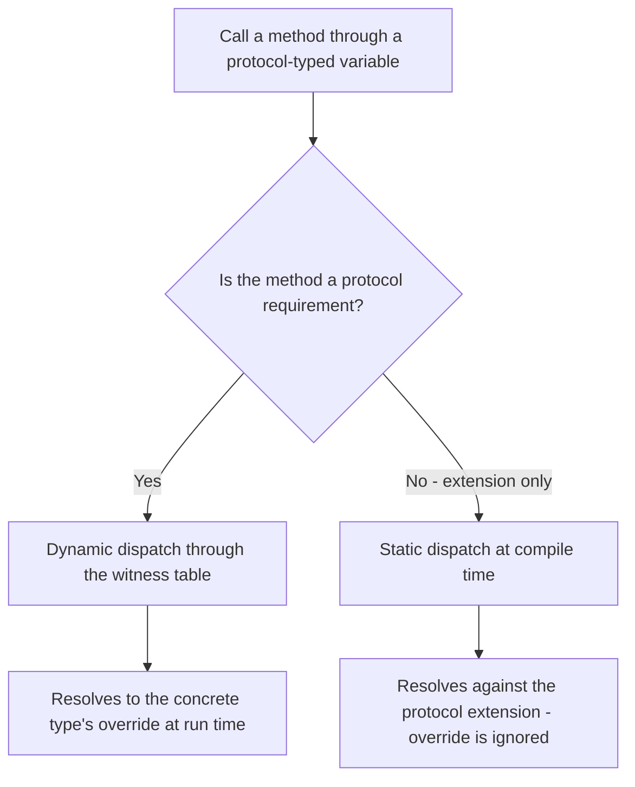
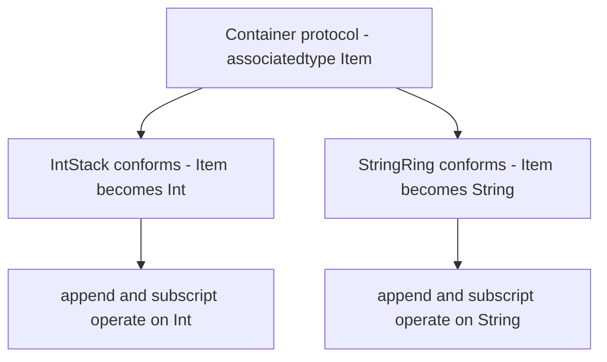

# Lecture 1 — Protocols and Generics: Why Swift Is Not Java With Cleaner Syntax

> **Duration:** ~2 hours of reading + hands-on.
> **Outcome:** You can design a generic, protocol-backed API in Swift — a protocol with an `associatedtype`, conforming types, and generic functions constrained by `where` clauses — and explain why the protocol-oriented model is a different thing from interface-plus-inheritance, not a prettier spelling of it.

If you only remember one thing from this lecture, remember this:

> **A Swift protocol is not a Java interface.** Java interfaces describe what an object *is* through a subtype relationship that is resolved at run time with a vtable. Swift protocols describe what a type *can do*, are routinely satisfied by `struct`s and `enum`s that have no inheritance at all, can carry default implementations, can require associated types the conforming type chooses, and — crucially — are usually used as **compile-time generic constraints**, not as boxed run-time values. When you reach for inheritance reflexively, you are writing Java in Swift's clothes. Reach for a protocol with a default implementation first.

This is the lecture where Phase I stops being "Swift is a typed language with optionals" and starts being "Swift has a type system with opinions." We are moving from the object-oriented inheritance thinking most of you arrived with — a base class, an override, a `super.foo()` call — to **protocol-oriented programming (POP)**, the model Apple has pushed since Dave Abrahams' 2015 WWDC talk "Protocol-Oriented Programming in Swift," and which the whole standard library is built on.

---

## 1. The inheritance reflex, and why it fights you in Swift

Here is the code a Java, Kotlin, or C# engineer writes on day one of Swift, because it is what they would write at home:

```swift
class Animal {
    func speak() -> String { "..." }
    func describe() -> String { "An animal that says \(speak())" }
}

final class Dog: Animal {
    override func speak() -> String { "Woof" }
}

final class Cat: Animal {
    override func speak() -> String { "Meow" }
}
```

This compiles. It runs. And it is the wrong instinct in Swift for three concrete reasons that bite within a week of real work:

1. **`Animal` has to be a `class`.** Inheritance is a class-only feature in Swift. The moment you base a design on inheritance, you have committed every participating type to reference semantics — shared mutable state, identity, ARC retain/release traffic, and the heap. Most of your model types want to be `struct`s (value types — Week 1). Inheritance forecloses that before you have written a single field.

2. **`Animal()` is instantiable and meaningless.** Nothing stops a caller from writing `Animal().speak()` and getting `"..."`. The base class is a real type that exists at run time and represents nothing in your domain. You end up bolting on `fatalError("abstract")` in the base method — Swift has no `abstract` keyword — which converts a design smell into a run-time crash.

3. **You can inherit from exactly one base.** A `Dog` that is both an `Animal` and a `Codable`-with-shared-logic type and a `Comparable`-with-shared-logic type cannot get all three through inheritance. Single inheritance is a hard ceiling.

The Swift answer is to invert the relationship. Instead of `Dog` *being an* `Animal` by extending a class, `Dog` *conforms to* a `Speaker` protocol, and the shared behaviour lives in a protocol extension that every conformer gets for free:

```swift
protocol Speaker {
    func speak() -> String
}

extension Speaker {
    func describe() -> String { "Something that says \(speak())" }
}

struct Dog: Speaker {
    func speak() -> String { "Woof" }
}

struct Cat: Speaker {
    func speak() -> String { "Meow" }
}

print(Dog().describe())  // "Something that says Woof"
print(Cat().describe())  // "Something that says Meow"
```

`Dog` and `Cat` are now `struct`s — value types, stack-friendly, no ARC, no identity. There is no instantiable, meaningless base type: `Speaker` is a protocol and you cannot write `Speaker()`. And a type can conform to as many protocols as you like — `struct Dog: Speaker, Codable, Comparable` is fine, where `class Dog: Animal, Codable, Comparable` is a compile error because you cannot inherit from a second class.

That is the whole pivot. The rest of this lecture is mechanics.

---

## 2. Protocols are requirements, not implementations

A protocol is a contract: a list of requirements a conforming type must satisfy. The requirements can be methods, properties, initializers, subscripts, and (we get to this) associated types.

```swift
protocol Identifiable {
    var id: String { get }
}

protocol Persistable {
    func save() throws
    static func load(id: String) throws -> Self
}
```

Read the property requirement carefully: `{ get }` means "must be readable." `{ get set }` would mean "must be readable *and* writable." A conformer can satisfy `{ get }` with a stored `let`, a stored `var`, or a computed property — the protocol does not care how, only that you can read it.

`Self` (capital S) in a protocol means "the conforming type." In `Persistable`, `static func load(id:) -> Self` means each conformer's `load` returns *its own* type — `User.load(id:)` returns a `User`, `Document.load(id:)` returns a `Document`. This is the first place Swift's type system goes somewhere Java's interfaces cannot follow: a Java interface method cannot say "returns the implementing type" without unsafe casts or recursive generics (`interface Foo<T extends Foo<T>>` — the famously ugly "curiously recurring template pattern"). Swift gives you `Self` directly.

### Conformance is structural-by-declaration

A type declares conformance and the compiler checks it:

```swift
struct User: Identifiable, Persistable {
    let id: String
    let name: String

    func save() throws { /* write to disk */ }
    static func load(id: String) throws -> User { /* read from disk */ User(id: id, name: "") }
}
```

If `User` forgot `save()`, the compiler would refuse to build with a precise error: *"Type 'User' does not conform to protocol 'Persistable'."* You do not find out at run time. You find out at the keyboard.

> **A note for the Go engineers in the room.** Go interfaces are satisfied *implicitly* — a type that has the right methods conforms without saying so. Swift is the opposite: conformance is **explicit**. You must write `: Identifiable`. This is deliberate. Explicit conformance lets the compiler attach protocol-specific default implementations and witness tables to exactly the types that opted in, and it makes intent legible in code review. There is no "accidental conformance" in Swift.

---

## 3. Protocol extensions: where the shared behaviour actually lives

This is the feature that makes POP a real paradigm rather than a renaming exercise. You can write an `extension` on a protocol that provides a **default implementation** of a requirement, or adds entirely new methods that every conformer inherits:

```swift
protocol Distance {
    var meters: Double { get }
}

extension Distance {
    var kilometers: Double { meters / 1000 }
    var miles: Double { meters / 1609.344 }

    func isFartherThan(_ other: some Distance) -> Bool {
        meters > other.meters
    }
}

struct Marathon: Distance {
    let meters: Double = 42_195
}

let m = Marathon()
print(m.kilometers)              // 42.195
print(m.miles)                   // 26.218...
print(m.isFartherThan(Marathon())) // false
```

`Marathon` declared only `meters`. It got `kilometers`, `miles`, and `isFartherThan` for free from the protocol extension. This is exactly what a base class gives you with inheritance — shared behaviour across many types — except:

- It works on `struct`s and `enum`s, not just classes.
- A type can pick up shared behaviour from *many* protocols.
- There is no instantiable base type and no `super`.

This is how the standard library is built. `Sequence` declares one requirement (`makeIterator()`) and a protocol extension hands every conforming type `map`, `filter`, `reduce`, `contains`, `first(where:)`, `prefix`, `dropFirst`, and dozens more. You write the iterator; you get the entire functional toolbox. We will build exactly such a `Sequence` in the exercises.

### The static-vs-dynamic dispatch gotcha you must internalise

Protocol extensions have one sharp edge that trips up everyone exactly once. There is a difference between a method that is **declared in the protocol** (a *requirement*) and one that **only exists in the extension**.

```swift
protocol Greeter {
    func hello() -> String          // a REQUIREMENT
}

extension Greeter {
    func hello() -> String { "hello from extension" }   // default for the requirement
    func goodbye() -> String { "bye from extension" }    // NOT a requirement, extension-only
}

struct French: Greeter {
    func hello() -> String { "bonjour" }
    func goodbye() -> String { "au revoir" }
}

let f: Greeter = French()       // note: typed as the protocol, not as French
print(f.hello())                // "bonjour"        — DYNAMIC dispatch (it's a requirement)
print(f.goodbye())              // "bye from extension" — STATIC dispatch (not a requirement!)
```

Read those last two lines until they stop surprising you. `hello()` is a protocol requirement, so it is dispatched through the protocol witness table — at run time, the call lands on `French.hello()`. `goodbye()` is **not** a requirement; it only exists in the extension. When the variable's static type is `Greeter`, the compiler resolves `goodbye()` against the protocol extension at *compile time* and never looks at `French`'s override. The fix is to add `goodbye()` to the protocol's requirement list so it becomes a customisation point. This is the single most common "why is the wrong method being called" bug in Swift, and now you have seen it before it costs you an afternoon.


*Why `hello` reaches French's override but `goodbye` does not.*

---

## 4. Generics: the same code, many types, checked at compile time

Generics let you write one piece of code that works for any type satisfying some constraints, with full type safety and no boxing. The canonical first example — and the one you should be able to write from memory — is `swap`:

```swift
func swapValues<T>(_ a: inout T, _ b: inout T) {
    let tmp = a
    a = b
    b = tmp
}

var x = 1, y = 2
swapValues(&x, &y)          // T is inferred as Int

var s = "a", t = "b"
swapValues(&s, &t)          // T is inferred as String
```

`<T>` introduces a **type parameter**. At each call site the compiler infers a concrete `T` and, conceptually, stamps out a specialised version. There is no `Object`, no boxing, no cast — `swapValues(&x, &y)` is as fast as a hand-written `Int` swap. This is the first big difference from pre-generics Java collections (`List` of `Object` with casts) and even from Java's type-erased generics, which throw the type away at run time. Swift keeps the type and specialises.

### Constraining a type parameter

An unconstrained `T` can do almost nothing — you do not know it is comparable, hashable, or anything. You add constraints to unlock operations:

```swift
func maximum<T: Comparable>(_ items: [T]) -> T? {
    guard var best = items.first else { return nil }
    for item in items.dropFirst() where item > best {
        best = item
    }
    return best
}

print(maximum([3, 1, 4, 1, 5, 9, 2]) ?? -1)   // 9
print(maximum(["pear", "apple", "fig"]) ?? "") // "pear"
```

`<T: Comparable>` says "`T` is some type that conforms to `Comparable`," which is exactly what lets us write `item > best`. Without the constraint, `>` would not type-check, because not every type is ordered.

For multiple or more elaborate constraints, use a `where` clause — it reads left to right and keeps the angle brackets uncluttered:

```swift
func summarise<C>(_ collection: C) -> String
where C: Collection, C.Element: CustomStringConvertible {
    let body = collection.map(\.description).joined(separator: ", ")
    return "[\(collection.count) items: \(body)]"
}

print(summarise([1, 2, 3]))             // "[3 items: 1, 2, 3]"
print(summarise(["a", "b"]))            // "[2 items: a, b]"
```

Notice `C.Element` — we are reaching into an *associated type* of the `Collection` protocol. That is the next section, and it is the one that separates engineers who "use generics" from engineers who "design generic APIs."

---

## 5. `associatedtype`: protocols with holes the conformer fills

A plain protocol describes concrete requirements. But often the requirement involves a type the protocol itself does not know — the element type of a container, the key type of a cache, the output of a parser. That placeholder is an **associated type**:

```swift
protocol Container {
    associatedtype Item
    var count: Int { get }
    mutating func append(_ item: Item)
    subscript(_ index: Int) -> Item { get }
}
```

`Container` says "a container has *some* item type, called `Item`, and you'll tell me what it is when you conform." Two conformers, two different `Item`s, zero shared base class:

```swift
struct IntStack: Container {
    private var storage: [Int] = []
    var count: Int { storage.count }
    mutating func append(_ item: Int) { storage.append(item) }
    subscript(index: Int) -> Int { storage[index] }
    // Swift INFERS that Item == Int from the method signatures. No need to write `typealias Item = Int`.
}

struct StringRing: Container {
    private var storage: [String] = []
    var count: Int { storage.count }
    mutating func append(_ item: String) { storage.append(item) }
    subscript(index: Int) -> String { storage[index] }
}
```

You almost never write the `typealias Item = Int` line — the compiler infers the associated type from how you used it in the requirement implementations. If you want to be explicit (or if inference can't decide), you can write it.


*One protocol with a hole, filled differently by each conformer.*

### Why associated types matter: type-safe generic algorithms

Once a protocol has an associated type, generic functions can constrain *both* the conforming type and its associated type, and the compiler tracks the relationship for you:

```swift
func allEqual<C: Container>(_ container: C) -> Bool
where C.Item: Equatable {
    guard container.count > 1 else { return true }
    let first = container[0]
    for i in 1..<container.count where container[i] != first {
        return false
    }
    return true
}

var s = IntStack()
s.append(7); s.append(7); s.append(7)
print(allEqual(s))   // true
```

`allEqual` works on *any* `Container` whose `Item` is `Equatable`. The compiler knows `container[i]` is of type `C.Item`, knows `C.Item: Equatable`, and therefore allows `!=`. This is the payoff of associated types: generic algorithms that are completely type-safe across an open set of conforming types you have never seen.

### The cost: a protocol with an associated type cannot be used as a plain type

Here is the wall everyone hits. You cannot write this:

```swift
// ERROR: 'Container' can only be used as a generic constraint
// because it has Self or associated type requirements.
let things: Container = IntStack()      // ❌ does not compile
```

A protocol with an associated type (or a `Self` requirement) is a **PAT** — a *protocol with associated type*. The compiler cannot lay out a `Container` value in memory because it does not know what `Item` is, and therefore does not know the size of the value `subscript` returns. PATs can be used as **generic constraints** (`func f<C: Container>(...)`) and, since Swift 5.7, as **constrained existentials** (`any Container<Item == Int>`) and **opaque returns** (`some Container`) — but not as a bare type annotation. This single constraint is the entire reason the `some` / `any` distinction exists, and it is the subject of Lecture 2. For now, internalise the rule:

> **A protocol with an `associatedtype` is a recipe for types, not a type itself.** Use it as a constraint. If you need a single value of "some container," you need `some Container` or `any Container` — which one, and why, is the next lecture.

---

## 6. Generic types: `Stack<Element>`, the shape you will write a hundred times

Functions are not the only thing you can make generic. Types can be too — and a generic `struct` is the single most common generic construct you will write. Here is the canonical generic stack:

```swift
struct Stack<Element> {
    private var storage: [Element] = []

    var isEmpty: Bool { storage.isEmpty }
    var count: Int { storage.count }

    mutating func push(_ element: Element) {
        storage.append(element)
    }

    mutating func pop() -> Element? {
        storage.popLast()
    }

    func peek() -> Element? {
        storage.last
    }
}

var ints = Stack<Int>()
ints.push(1); ints.push(2)
print(ints.pop() ?? -1)        // 2

var strings = Stack<String>()
strings.push("a")
print(strings.peek() ?? "")    // "a"
```

`Stack<Element>` is one definition that produces `Stack<Int>`, `Stack<String>`, `Stack<User>` — each a distinct, fully type-safe type. `Array`, `Dictionary`, `Set`, `Optional`, and `Result` (which you meet in Lecture 2) are all generic types in exactly this style. `Optional<Wrapped>` *is* a generic enum — `Int?` is sugar for `Optional<Int>`.

### Conditional conformance: behaviour that depends on the element type

A generic type can conform to a protocol *only when its element does*. This is one of Swift's most elegant features and has no clean Java equivalent:

```swift
extension Stack: Equatable where Element: Equatable {
    static func == (lhs: Stack, rhs: Stack) -> Bool {
        lhs.storage == rhs.storage
    }
}

extension Stack: CustomStringConvertible where Element: CustomStringConvertible {
    var description: String {
        "Stack(\(storage.map(\.description).joined(separator: ", ")))"
    }
}
```

Now `Stack<Int>` is `Equatable` (because `Int` is), and `Stack<SomeNonEquatableThing>` is *not* — and the compiler enforces exactly that. `Array` in the standard library uses this trick: `[T]` is `Equatable` if and only if `T` is `Equatable`. You get the same power in your own types with one `extension ... where` line.

---

## 7. The decision: protocol, generic, or class?

You now have three tools that overlap. A reasonable senior heuristic, which we will refine all week:

| Situation | Reach for |
|---|---|
| Shared behaviour across unrelated value types | **Protocol** + protocol extension |
| One data structure, many element types, no boxing | **Generic type** (`struct`/`enum`) |
| An algorithm that works over many conforming types, checked at compile time | **Generic function** constrained by a protocol |
| You genuinely need shared *identity* and reference semantics (a view controller, a long-lived service holding mutable state, Objective-C interop) | **Class** (and even then, prefer composition over deep hierarchies) |
| You need to override stored behaviour at run time per instance | Class inheritance — rare; usually a protocol with injected dependencies is cleaner |

The trap to avoid is the one we opened with: reaching for a class because that is what your previous language trained your fingers to type. In Swift the default is a `struct` conforming to one or more protocols, with shared behaviour in protocol extensions, and generics wherever the same logic spans many element types. You reach for a class deliberately, when reference semantics are the point — not by reflex.

> **The standard library is the proof.** `Int`, `Double`, `String`, `Array`, `Dictionary`, `Set`, `Optional`, `Result` — every one is a `struct` or `enum`, not a class. `Comparable`, `Equatable`, `Hashable`, `Codable`, `Sequence`, `Collection` — every one is a protocol, most with associated types and rich protocol extensions. Apple did not build the standard library on inheritance. Neither should you build your domain on it.

---

## 8. `Sequence` and `IteratorProtocol`: build the abstraction you've been consuming

To make all of this concrete, let's build a custom `Sequence` — the protocol behind every `for ... in` loop in Swift. It has one requirement (`makeIterator()`), and an associated type (`Element`), and once you conform you get `map`, `filter`, `reduce`, `contains`, and the rest from protocol extensions, plus `for`-loop support.

```swift
struct CountdownIterator: IteratorProtocol {
    var current: Int

    mutating func next() -> Int? {
        guard current > 0 else { return nil }
        defer { current -= 1 }
        return current
    }
}

struct Countdown: Sequence {
    let start: Int

    func makeIterator() -> CountdownIterator {
        CountdownIterator(current: start)
    }
}

for n in Countdown(start: 3) {
    print(n)                 // 3, 2, 1
}

// And, for free, everything Sequence's protocol extension provides:
let doubled = Countdown(start: 3).map { $0 * 2 }   // [6, 4, 2]
let total   = Countdown(start: 5).reduce(0, +)     // 15
let evens   = Countdown(start: 6).filter { $0.isMultiple(of: 2) } // [6, 4, 2]
```

`IteratorProtocol.next()` returns an `Optional`: a value while the sequence has more, `nil` when it is exhausted. `Sequence.makeIterator()` hands back a fresh iterator each time. We wrote `next()` and `makeIterator()` — about eight lines — and got `map`, `filter`, `reduce`, and `for`-loop support, all type-safe, all without boxing, all because of protocol extensions and associated types. That is protocol-oriented programming working for you instead of you working for it.

---

## 9. Recap

You should now be able to:

- Explain why a Swift protocol is not a Java interface, and why reaching for class inheritance by reflex fights the language.
- Write a protocol with method and property requirements, and provide shared behaviour in a protocol extension.
- Distinguish a protocol *requirement* (dynamic dispatch, overridable) from an *extension-only* method (static dispatch, not overridable) — and avoid the dispatch gotcha.
- Write generic functions with `<T>`, constrain them with `T: Protocol` and `where` clauses, and reach into associated types like `C.Element`.
- Write a protocol with an `associatedtype`, conform two different types to it, and write a generic algorithm constrained on the associated type.
- Write a generic type (`Stack<Element>`) and add conditional conformance (`extension Stack: Equatable where Element: Equatable`).
- Conform a type to `Sequence` via `IteratorProtocol` and inherit the whole functional toolbox.
- State the rule that a protocol with an associated type cannot be used as a bare type — which is the hook for Lecture 2.

Next: Lecture 2 takes the wall we hit in §5 — "a PAT can't be a plain type" — and shows you the two doors through it, `some` and `any`, with the decision matrix from the Swift Evolution proposals.

---

## References

- *Protocols* — The Swift Programming Language (Swift 6): <https://docs.swift.org/swift-book/documentation/the-swift-programming-language/protocols/>
- *Generics* — The Swift Programming Language: <https://docs.swift.org/swift-book/documentation/the-swift-programming-language/generics/>
- *Opaque and Boxed Protocol Types* — The Swift Programming Language: <https://docs.swift.org/swift-book/documentation/the-swift-programming-language/opaquetypes/>
- *Protocol-Oriented Programming in Swift* — WWDC 2015 (Dave Abrahams), archived: <https://developer.apple.com/videos/play/wwdc2015/408/>
- *Embrace Swift generics* — WWDC 2022: <https://developer.apple.com/videos/play/wwdc2022/110352/>
- `Sequence` and `IteratorProtocol` — Swift standard library: <https://developer.apple.com/documentation/swift/sequence>
