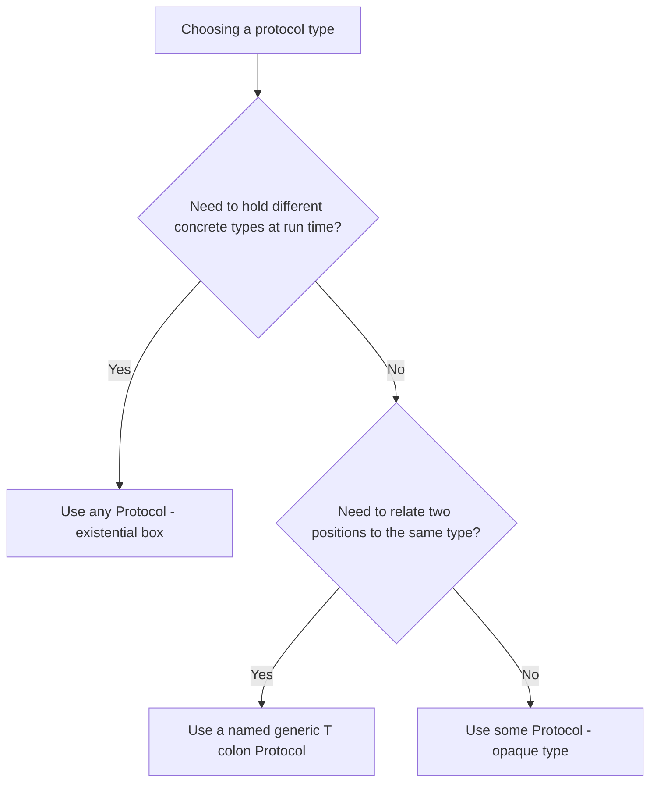
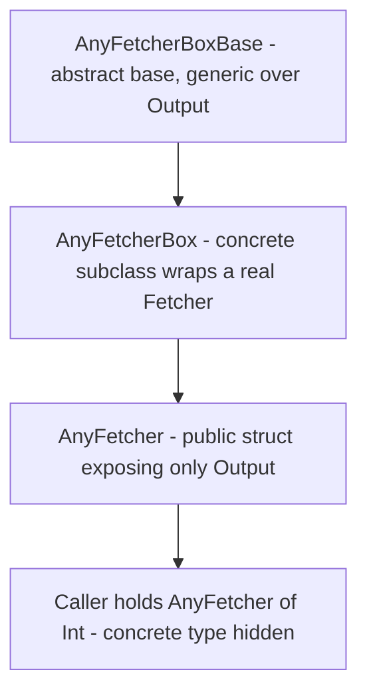

# Lecture 2 — `some` vs `any`, Type Erasure, and Swift's Error Model

> **Duration:** ~2 hours of reading + hands-on.
> **Outcome:** You can choose `some` (opaque) or `any` (existential) for a given API deliberately, explain the run-time cost difference, hand-write a type eraser when you need one, and design a custom error model with `throws`, `try` / `try?` / `try!`, and `Result<Success, Failure>` — knowing which to reach for and why.

If you only remember one thing from this lecture, remember this:

> **`some` is one specific type the compiler knows but the caller doesn't; `any` is a box that can hold different types at run time.** Reach for `some` by default — it is free, it preserves the concrete type, and it keeps generic relationships intact. Reach for `any` only when you genuinely need heterogeneity: a single variable or collection that holds values of *different* concrete types at run time. Most `any` you see in the wild should have been `some`, and the compiler now nudges you toward that.

Lecture 1 ended on a wall: a protocol with an `associatedtype` cannot be used as a bare type. This lecture is the two doors through that wall, the decision matrix Swift Evolution shipped to govern the choice, the escape hatch (type erasure) for when you need it, and then a clean pivot into the other half of the week — how Swift models failure.

---

## 1. The problem `some` and `any` solve

Recall the wall from Lecture 1. Start with a protocol that has *no* associated type and *no* `Self` requirement, so we can isolate the existential cost first:

```swift
protocol Animal {
    func makeNoise() -> String
}

struct Dog: Animal { func makeNoise() -> String { "Woof" } }
struct Cat: Animal { func makeNoise() -> String { "Meow" } }
```

Historically you could write `let a: Animal = Dog()`. As of Swift 6, that bare `Animal` is rejected — the compiler tells you to write `any Animal`. Why force the keyword? Because that bare-protocol-as-a-type was always doing something expensive and implicit, and the language designers decided the cost should be *spelled out at the use site*. That is the whole story of `some` and `any`: making an invisible, expensive default visible and choosable.

Two questions decide everything:

1. **Does this position need to hold values of different concrete types at run time?** If yes, you need `any` (an existential box). If no, you want `some` (a fixed, hidden concrete type).
2. **Do you need to preserve a relationship between types** — "the thing I return is the same type as the thing I took in," or "two of these are guaranteed to be the same type so I can compare them"? If yes, you need `some` or a named generic; `any` erases those relationships.

---

## 2. `some` — opaque types: "one specific type, name withheld"

`some Protocol` means: *there is exactly one concrete type here; the compiler knows precisely what it is; the caller is only promised it conforms to `Protocol`.* The classic use is a return type:

```swift
func makeAnimal() -> some Animal {
    Dog()        // the function ALWAYS returns the same concrete type: Dog
}
```

The caller sees `some Animal` and can call `makeNoise()`, but cannot rely on it being `Dog`. The key constraint — and the source of the most common `some` error — is that **every `return` in the function must produce the *same* concrete type.** This does not compile:

```swift
func makeAnimal(_ wantDog: Bool) -> some Animal {
    wantDog ? Dog() : Cat()   // ❌ ERROR: function returns opaque type but different concrete types
}
```

The compiler cannot pick a single hidden type, so it refuses. If you genuinely need to return different types depending on a condition, that is the signal you want `any`, not `some`.

### Why `some` is the default, especially in SwiftUI

`some` has **zero run-time cost**. The concrete type is fixed and known at compile time; the compiler specialises and inlines exactly as if you had written the concrete type. There is no box, no heap allocation, no dynamic dispatch, no witness-table lookup. You get abstraction at the API boundary and the performance of the concrete type underneath.

This is why every SwiftUI `body` you write in Phase II is `some View`:

```swift
var body: some View {
    VStack {
        Text("Hello")
        Button("Tap") { }
    }
}
```

The real type of that `body` is a deeply nested generic — something like `VStack<TupleView<(Text, Button<Text>)>>` — that you do not want to type and Apple does not want in its API surface. `some View` says "it's one specific `View` type; you don't need to know which." SwiftUI's diffing engine depends on that concrete type being preserved — it is how it knows two `body` evaluations produced the same structure. An `any View` would erase that and break diffing. **`some View`, never `any View`, in a `body`.**

### `some` as a parameter type (Swift 5.7+)

`some` also works in parameter position, where it is exactly equivalent to a generic with one unnamed type parameter — "lightweight generics":

```swift
func announce(_ animal: some Animal) {
    print(animal.makeNoise())
}

// is sugar for:
func announce<A: Animal>(_ animal: A) {
    print(animal.makeNoise())
}
```

Prefer `some Animal` when you only use the type once and do not need to name it; use the explicit `<A: Animal>` form when you must refer to the type more than once in the signature (two parameters of the *same* type, a return that matches a parameter, etc.).

---

## 3. `any` — existential types: "a box that can hold any conforming type"

`any Protocol` is an **existential**: a fixed-size box that can hold a value of *any* type conforming to `Protocol`, and can hold *different* such types over its lifetime or across a collection. This is the tool for genuine heterogeneity:

```swift
let zoo: [any Animal] = [Dog(), Cat(), Dog()]   // different concrete types in one array — needs `any`
for a in zoo {
    print(a.makeNoise())                        // dynamic dispatch through the box
}
```

You cannot do this with `some` — `[some Animal]` would force every element to be the *same* concrete type. The heterogeneous array is the textbook case where `any` is correct and unavoidable.

### What the box costs

An existential is not free, and understanding the cost is what separates a deliberate choice from cargo-culting:

- **A fixed-size box (the "existential container").** Swift reserves a small inline buffer (three words) for the value. If the value fits, it is stored inline; if it is larger, Swift **heap-allocates** it and stores a pointer. So `any Animal` holding a large `struct` causes a heap allocation you did not write.
- **A witness-table pointer.** The box carries a pointer to the protocol witness table so method calls dispatch dynamically. Every `a.makeNoise()` is an indirect call, not an inlined one.
- **Lost type identity.** Once a `Dog` is inside an `any Animal`, the compiler has forgotten it is a `Dog`. You cannot, in general, ask "are these two the same type?" or call a `Dog`-specific method without a dynamic `as?` cast.

None of this is catastrophic — dynamic dispatch ran Objective-C for thirty years — but it is *not what you want in a hot loop or a SwiftUI body*, and it is wasteful when you did not need heterogeneity in the first place.

### Constrained existentials (Swift 5.7+): `any` even works on PATs now

The wall from Lecture 1 — "a protocol with an associated type can't be a bare type" — was partially demolished in Swift 5.7. You can now write existentials over PATs, optionally pinning the associated type:

```swift
protocol Container {
    associatedtype Item
    var count: Int { get }
    subscript(_ i: Int) -> Item { get }
}

let c: any Container<Int>   // a box holding SOME Container whose Item is Int (primary-associated-type sugar)
```

That `Container<Int>` syntax relies on declaring `Item` as a **primary associated type**: `protocol Container<Item> { associatedtype Item; ... }`. It is genuinely useful — a heterogeneous collection of containers that all yield `Int` — but it carries the full existential cost, and you should still prefer `some Container` or a generic constraint when you do not need the heterogeneity.

---

## 4. The decision matrix (from the Swift Evolution proposals)

Swift's `some`/`any` story was designed across a handful of proposals you should know by number, because they come up in code review and interviews:

- **SE-0244 — Opaque Result Types** (introduced `some` in return position, Swift 5.1).
- **SE-0335 — Introduce existential `any`** (made `any` explicit and eventually required, Swift 5.6 → enforced under Swift 6 language mode).
- **SE-0341 — Opaque Parameter Declarations** (`some` in parameter position, Swift 5.7).
- **SE-0309 — Unlock existentials for all protocols** (let PATs be existentials, Swift 5.7).
- **SE-0346 — Primary associated types** (enabled the `any Container<Int>` / `some Container<Int>` lightweight syntax, Swift 5.7).

Boiled down to a table you can act on:

| You want… | Use | Cost | Why |
|---|---|---|---|
| To return "one specific type, hidden" (SwiftUI `body`, a factory that always builds the same type) | `some P` | **Zero** | Concrete type preserved; specialised and inlined |
| A parameter constrained to a protocol, used once | `some P` | **Zero** | Sugar for a generic; specialised per call |
| To preserve a type relationship (return matches input; two args the same type; compare two values) | generic `<T: P>` | **Zero** | The named type parameter ties the positions together |
| A heterogeneous collection / variable holding *different* concrete types at run time | `any P` | Box + dynamic dispatch (+ maybe heap) | Erasure is the point; you traded identity for flexibility |
| A stored property whose type is chosen at run time (a pluggable strategy from config) | `any P` | Box + dynamic dispatch | A run-time choice requires a run-time box |
| To call `P`-requirements on a PAT value without naming the associated type | `any P<…>` (constrained if possible) | Box + dynamic dispatch | The only way to have a single value of a PAT |

The senior heuristic, in one sentence:

> **Start with `some`. Move to a named generic when you need to relate two positions. Move to `any` only when run-time heterogeneity is the actual requirement — and write a one-line comment saying why, because the next reader will assume it should have been `some`.**


*The two questions that decide `some`, a named generic, or `any`.*

---

## 5. Type erasure: the hand-built `any` for stored, homogeneous-looking boxes

Before `any` could wrap PATs (pre-5.7), the community built **type erasers** by hand — and you still need the technique today, because some APIs want to fix their surface to specific concrete methods, interop with older code, or expose a clean published type. The standard library is full of them: `AnySequence`, `AnyIterator`, `AnyHashable`, `AnyView`; Combine publishes `AnyPublisher`.

The pattern has three layers. Suppose we want to erase this PAT:

```swift
protocol Fetcher {
    associatedtype Output
    func fetch() -> Output
}
```

**Layer 1 — an abstract "box" base class** that closes over the associated type as a concrete generic parameter:

```swift
private class AnyFetcherBoxBase<Output> {
    func fetch() -> Output { fatalError("abstract: subclass must override") }
}
```

**Layer 2 — a concrete box** that stores a real conformer and forwards to it:

```swift
private final class AnyFetcherBox<Concrete: Fetcher>: AnyFetcherBoxBase<Concrete.Output> {
    private let concrete: Concrete
    init(_ concrete: Concrete) { self.concrete = concrete }
    override func fetch() -> Concrete.Output { concrete.fetch() }
}
```

**Layer 3 — the public eraser** that holds the box and exposes only `Output`, hiding the concrete type entirely:

```swift
struct AnyFetcher<Output>: Fetcher {
    private let box: AnyFetcherBoxBase<Output>

    init<Concrete: Fetcher>(_ concrete: Concrete) where Concrete.Output == Output {
        self.box = AnyFetcherBox(concrete)
    }

    func fetch() -> Output { box.fetch() }
}
```


*Three layers of the hand-built type eraser, each hiding a bit more of the concrete type.*

Usage — now you *can* store and pass around "a fetcher of `Int`" without naming the concrete type, and you can put different fetchers of `Int` in one array:

```swift
struct ConstantFetcher: Fetcher { let value: Int; func fetch() -> Int { value } }
struct RandomFetcher: Fetcher { func fetch() -> Int { Int.random(in: 0...100) } }

let fetchers: [AnyFetcher<Int>] = [
    AnyFetcher(ConstantFetcher(value: 42)),
    AnyFetcher(RandomFetcher())
]
for f in fetchers { print(f.fetch()) }
```

In 2026 you reach for this **less often** than you used to — `any Fetcher<Int>` (with `Output` declared as a primary associated type) covers many cases the hand eraser used to. But you must be able to read it (it is everywhere in libraries like Combine, where `AnyPublisher` is the eraser you publish so callers do not depend on your operator chain's concrete type) and write it when a constrained existential will not do. We use the technique in the mini-project's stretch.

---

## 6. The other half of the week: Swift's error model

Swift does not use exceptions in the Java/C# sense. There is no `try`/`catch` that unwinds an arbitrary stack with hidden control flow. Instead, throwing is **part of a function's type**, errors are ordinary **values**, and the call site is **visibly marked** with `try`. It is closer to Rust's `Result` than to Java exceptions — and in fact Swift has both the `throws` machinery *and* `Result<Success, Failure>`, and you should know when each is idiomatic.

### Errors are values conforming to `Error`

Any type conforming to the empty `Error` protocol can be thrown. The idiomatic shape is an `enum` — one case per failure mode, with associated values carrying detail:

```swift
enum CacheError: Error, Equatable {
    case keyNotFound(String)
    case expired(key: String, ageSeconds: Double)
    case storeUnavailable(reason: String)
    case serializationFailed
}
```

This beats a stringly-typed message or a class-per-exception: each case is exhaustively switchable, carries typed payload, and (because we conformed to `Equatable`) is directly testable with `#expect(error == .keyNotFound("x"))`.

### `throws` and `try`

A function that can fail is marked `throws`; inside it you `throw` a value. At the call site you must write `try`:

```swift
func value(forKey key: String) throws -> Data {
    guard let data = store[key] else {
        throw CacheError.keyNotFound(key)
    }
    return data
}

do {
    let data = try value(forKey: "user")
    print("got \(data.count) bytes")
} catch CacheError.keyNotFound(let key) {
    print("no value for \(key)")
} catch {
    print("other error: \(error)")
}
```

The `try` keyword is not decoration — it is mandatory and marks *exactly which calls can fail*, so a reader scanning a function sees every failure point. `catch` clauses pattern-match on the error, with a bare `catch` binding the implicit `error` constant as the catch-all.

### Typed throws (Swift 6)

Swift 6 added **typed throws** — you can declare the *exact* error type a function throws, recovering the precision Rust's `Result<T, E>` always had:

```swift
func value(forKey key: String) throws(CacheError) -> Data {
    guard let data = store[key] else { throw CacheError.keyNotFound(key) }
    return data
}
```

Now `catch` can be exhaustive over `CacheError`'s cases with no catch-all needed, and callers know precisely what can go wrong. Use typed throws for **library-internal, closed error domains** (like a cache); keep untyped `throws` for **boundaries that aggregate many error sources** (networking, where a dozen subsystems each fail their own way and you do not want to enumerate them in your signature). This is a genuine 2026 judgement call — over-using typed throws couples your callers to your error enum, and sometimes the looseness is what you want.

### `try?` and `try!` — the two shortcuts, and when each is a smell

```swift
// try?  — turn a throw into nil. The error VALUE is discarded.
let data: Data? = try? value(forKey: "user")

// try!  — assert it cannot throw. If it does, the program CRASHES.
let data2: Data = try! value(forKey: "definitely-present")
```

`try?` is legitimate when you genuinely do not care *why* it failed, only that it did — e.g. "read the cache; if anything goes wrong, treat it as a miss." Its cost is that you throw away the diagnostic. Do **not** use `try?` to silence an error you should handle; that is Swift's equivalent of an empty `catch {}`.

`try!` says "I have an invariant the type system can't see: this *cannot* fail here." If you are wrong, you crash. The only defensible `try!` is over something like decoding a resource you shipped inside your own app bundle — if *that* fails, the build is broken and crashing is correct. `try!` against anything touching the network, the file system, or user input is a latent crash report waiting to happen. **Code review should challenge every `try!`.**

---

## 7. `Result<Success, Failure>` — errors as first-class values you can store and pass

`Result` is a generic enum in the standard library:

```swift
enum Result<Success, Failure: Error> {
    case success(Success)
    case failure(Failure)
}
```

`throws` is great for *synchronous, immediate* handling at a call site. `Result` shines when the outcome must be **stored, passed across a boundary, or handled later** — buffering an operation's result to inspect after the fact, a typed-error pipeline, or interop with callback-based APIs you do not own. (In modern code, `async throws` has largely replaced `Result` in completion handlers — but `Result` remains the right tool for storing an outcome and for typed-error pipelines.)

### Bridging `throws` ↔ `Result`

The standard library gives the bridge in both directions, and mapping failures into a `Result` is a core skill this week:

```swift
// throws -> Result: the throwing initializer captures success OR the thrown error.
let result: Result<Data, Error> = Result { try value(forKey: "user") }

// Result -> throws: .get() returns the success or re-throws the failure.
do {
    let data = try result.get()
    print(data.count)
} catch {
    print("failed: \(error)")
}
```

### `Result`'s functional surface

Because `Result` is just a value, you transform it without unwrapping — `map` over the success, `mapError` over the failure, `flatMap` to chain another fallible step:

```swift
func fetchData(for key: String) -> Result<Data, CacheError> {
    Result { try value(forKey: key) }
        .mapError { ($0 as? CacheError) ?? .storeUnavailable(reason: "\($0)") }
}

let lengths: Result<Int, CacheError> =
    fetchData(for: "user")            // Result<Data, CacheError>
        .map { $0.count }             // Result<Int, CacheError>  — transform the success
        .mapError { _ in CacheError.storeUnavailable(reason: "downstream") } // rewrite the failure

switch lengths {
case .success(let n): print("length \(n)")
case .failure(let e): print("error \(e)")
}
```

This is the pattern Exercise 3 drills directly: define a custom error enum, write throwing functions against it, exercise `try` / `try?` / `try!`, then map the throwing outcome into a `Result` and transform it.

### `defer` — cleanup that runs no matter how you leave

One more piece of the error model: `defer` schedules code to run when the current scope exits — *whether by normal return, by a `throw`, or by an early `guard`*. It is Swift's answer to `try`/`finally`:

```swift
func processFile(at path: String) throws {
    let handle = try openFile(path)
    defer { handle.close() }      // runs on every exit path, including a throw below

    let header = try handle.readHeader()   // if this throws, close() STILL runs
    try validate(header)                    // and if this throws, close() still runs
}
```

`defer` blocks run in **reverse order** of declaration (last-in, first-out), matching how you would hand-write nested cleanup. Use it for every "acquire then must-release" pair — file handles, locks, temporary directories — so a thrown error never leaks a resource.

---

## 8. Putting both halves together

`some`/`any` and the error model meet in the mini-project: a generic `Cache<Key, Value>` whose backing store is a `CacheStore` protocol (Lecture 1's associated-type design), whose store methods `throws` a `CacheError` (this lecture's error model), and whose API uses `some` where it can and `any CacheStore` only where pluggability genuinely requires a run-time choice. By Friday you will have made every one of these decisions on purpose and written a one-line justification for each — which is exactly the skill the syllabus says this week earns: *"can design a generic API with protocol-backed dependencies; can pick `some` over `any` deliberately."*

---

## 9. Recap

You should now be able to:

- Explain `some` as "one specific hidden concrete type, zero cost, type preserved" and `any` as "a run-time box, dynamic dispatch, possible heap allocation, type erased."
- Choose between `some`, a named generic, and `any` using the decision matrix, and justify the choice in one sentence.
- State why a SwiftUI `body` is `some View` and never `any View`.
- Hand-write a three-layer type eraser, and know that constrained existentials (`any P<…>`) now cover many cases that used to need one.
- Model an error domain as an `enum: Error`, throw and catch it, and use typed throws for closed domains.
- Use `try`, `try?`, and `try!` deliberately, and articulate why `try!` and silent `try?` are smells.
- Bridge `throws` and `Result` in both directions and transform a `Result` with `map` / `mapError` / `flatMap`.
- Use `defer` for resource cleanup that survives a thrown error.

Now do the exercises — three drills that isolate associated-type design, the `some`/`any` refactor, and the custom-error-into-`Result` pipeline — then build the cache.

---

## References

- *Opaque and Boxed Protocol Types* — The Swift Programming Language: <https://docs.swift.org/swift-book/documentation/the-swift-programming-language/opaquetypes/>
- *Error Handling* — The Swift Programming Language: <https://docs.swift.org/swift-book/documentation/the-swift-programming-language/errorhandling/>
- *SE-0244 Opaque Result Types*: <https://github.com/apple/swift-evolution/blob/main/proposals/0244-opaque-result-types.md>
- *SE-0335 Introduce existential `any`*: <https://github.com/apple/swift-evolution/blob/main/proposals/0335-existential-any.md>
- *SE-0341 Opaque Parameter Declarations*: <https://github.com/apple/swift-evolution/blob/main/proposals/0341-opaque-parameters.md>
- *SE-0309 Unlock existentials for all protocols*: <https://github.com/apple/swift-evolution/blob/main/proposals/0309-unlock-existential-types-for-all-protocols.md>
- *SE-0346 Lightweight same-type requirements for primary associated types*: <https://github.com/apple/swift-evolution/blob/main/proposals/0346-light-weight-same-type-syntax.md>
- *SE-0413 Typed throws*: <https://github.com/apple/swift-evolution/blob/main/proposals/0413-typed-throws.md>
- `Result` — Swift standard library: <https://developer.apple.com/documentation/swift/result>
