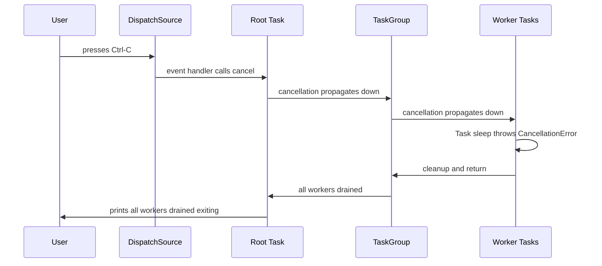
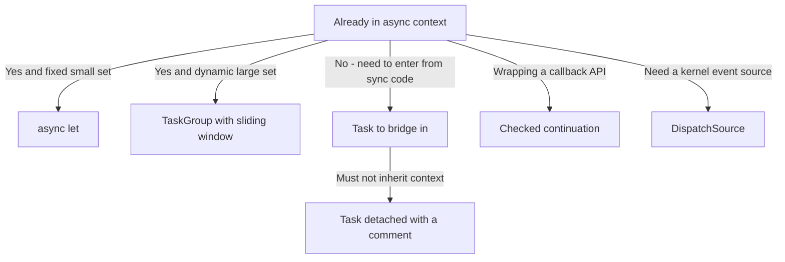

# Lecture 2 — `Task { }` vs `Task.detached`, and Why `DispatchQueue` Is the Past

> **Duration:** ~1 hour of reading + hands-on.
> **Outcome:** You can explain the difference between structured and unstructured tasks, choose `Task { }` over `Task.detached` (and know the rare case for the latter), reason about priority and task-local inheritance, and translate every common `DispatchQueue` pattern into structured concurrency — and name the three places GCD still legitimately lives.

Lecture 1 was the *structured* half: `async let`, `TaskGroup`, trees bounded by scope. This lecture is the *unstructured* half — the escape hatch — and an honest reckoning with the API it replaced.

The sentence to remember:

> **`Task { }` and `Task.detached { }` create tasks with no parent scope. You own their lifetime.** They are the bridge from synchronous code into the async world, and they are the *only* place in this week's material where "did it finish before I returned?" is a question the code can't answer for you. Use them sparingly, and almost always prefer `Task { }` over `Task.detached`.

---

## 1. Why unstructured tasks exist at all

Structured concurrency is great when you're *already* in an async context. But your program has to enter that world from somewhere synchronous: an `@IBAction`, a SwiftUI `Button` action, a `URLSessionDelegate` callback, the top of a CLI. Synchronous code cannot `await`. So how do you call an async function from a synchronous button tap?

```swift
// SwiftUI button — the action closure is synchronous and CANNOT await.
Button("Refresh") {
    Task {                      // ← bridge into async
        await viewModel.refresh()
    }
}
```

`Task { }` is that bridge. It creates a new **unstructured** task that immediately starts running the async closure, and it returns a `Task` handle synchronously so the button action can return. The async work continues independently.

That independence is the whole point — and the whole danger.

---

## 2. Structured vs unstructured, precisely

| | Structured (`async let`, `TaskGroup`) | Unstructured (`Task { }`, `Task.detached`) |
|---|---|---|
| Has a parent scope | Yes — bound to the enclosing `{ }` | No — lives until it finishes or you cancel it |
| Can outlive the function that made it | No | **Yes** |
| Cancelled automatically when parent is cancelled | Yes | `Task { }`: inherits cancellation only if you keep & cancel the handle; **not** auto from an enclosing scope. `Task.detached`: never |
| You must track completion yourself | No | Yes (keep the handle, `await` it, or `cancel()` it) |
| Inherits priority | Yes | `Task { }`: yes. `Task.detached`: no |
| Inherits task-locals | Yes | `Task { }`: yes. `Task.detached`: no |
| Inherits actor isolation (Week 4) | Yes | `Task { }`: yes. `Task.detached`: no |

The takeaway: **structured tasks are managed for you; unstructured tasks are your responsibility.** Every unstructured task is a small leak waiting to happen if you don't hold the handle and deal with its lifetime.

---

## 3. `Task { }` vs `Task.detached { }`

Both create unstructured tasks. The difference is **inheritance**.

### `Task { }` — inherits context

```swift
Task {
    await doWork()
}
```

A `Task { }` created from within some context **inherits**:

- **Priority** — the surrounding task's priority (or the current actor's, in UI code: `@MainActor`).
- **Task-local values** — the `@TaskLocal` bindings in scope at creation.
- **Actor isolation** — if created on the main actor, the closure runs on the main actor (Week 4 makes this precise; for now: a `Task { }` in a `@MainActor` context stays on the main actor).

This is almost always what you want, because inheriting context means a `Task { }` started from a UI tap stays on the main actor and a `Task { }` started inside a request handler keeps the request's trace context.

### `Task.detached { }` — inherits nothing

```swift
Task.detached {
    await doWork()        // no inherited priority, no task-locals, no isolation
}
```

`Task.detached` deliberately severs all three. It starts fresh: default priority, empty task-local table, no actor isolation. It is the right tool **only** when you genuinely want to escape the current context — e.g., kicking off truly independent background work from inside a `@MainActor` method where you specifically do *not* want to inherit `@MainActor` and pin the work to the UI thread.

> **Default to `Task { }`.** Reach for `Task.detached` only when you can articulate *which* of the three inheritances you're severing and *why*. In code review, an unexplained `Task.detached` is a flag — nine times out of ten the author wanted `Task { }` and cargo-culted the longer name because it "sounded more background-y." It isn't more background-y; it's less *contextual*.

### Holding the handle

An unstructured task returns a handle. Use it:

```swift
final class FeedController {
    private var refreshTask: Task<Void, Never>?

    func startRefresh() {
        refreshTask?.cancel()               // cancel any in-flight refresh
        refreshTask = Task {
            await self.refresh()
        }
    }

    func tearDown() {
        refreshTask?.cancel()               // don't leak past our lifetime
    }
}
```

In SwiftUI you usually don't manage this by hand — the `.task { }` view modifier creates an unstructured task *bound to the view's lifetime* and cancels it automatically when the view disappears. That's the structured-ish convenience layer over `Task { }`. Use `.task { }` in views; use explicit handles in controllers/services.

---

## 4. Reading a `Task`'s result and errors

A handle is generic over success and failure: `Task<Success, Failure>`.

```swift
let handle = Task { () async throws -> Int in
    try await compute()
}

// Elsewhere:
do {
    let value = try await handle.value      // awaits completion, rethrows
    print(value)
} catch {
    print("compute failed: \(error)")
}
```

- `Task<Int, Never>` — cannot throw; `await handle.value` returns `Int`, no `try`.
- `Task<Int, Error>` — can throw; `try await handle.value`.
- Awaiting `.value` more than once is fine; the result is cached.
- If you never read `.value` and never `cancel()`, the task still runs to completion in the background — which is exactly the "fire and forget" hazard. At least cancel it when its owner dies.

---

## 5. Priority, inheritance, and escalation — in practice

We touched priority in Lecture 1. Here's how it actually behaves with unstructured tasks.

```swift
@MainActor
func onAppear() {
    // Inherits .high-ish UI priority because it's on the main actor.
    Task {
        await loadVisibleContent()   // runs at the inherited priority
    }

    // Explicitly low — for prefetch that shouldn't compete with the above.
    Task(priority: .background) {
        await prefetchNextPage()
    }
}
```

- A bare `Task { }` inherits the creator's priority.
- You can override with `Task(priority:)`.
- **Escalation:** if higher-priority code later `await`s the result of a lower-priority task, Swift bumps the lower one so it can't be starved behind lower-priority work. You get this for free; it's why you should resist micro-managing priorities.

The anti-pattern: setting everything to `.high` "to be safe." Priority is *relative*. If everything is high, nothing is — you've just told the scheduler you have no opinion, the same as if everything were default, but now you've also lost a useful signal.

---

## 6. Why `DispatchQueue` is the past

Now the blunt part. Grand Central Dispatch (`DispatchQueue`, `dispatch_async`) shipped in 2009 and was the right answer for fifteen years. For **new code in 2026, it is the past.** Not "deprecated" — Apple hasn't deprecated it, and it still underpins parts of the runtime — but it is no longer the model you reach for, and writing new feature code against `DispatchQueue` is a code-review finding on a modern team.

Here's why, concretely:

### 6.1 GCD has no structure

```swift
// GCD: where does this work belong? When does it finish? Who cancels it?
DispatchQueue.global().async {
    let data = downloadSync()         // blocks a GCD thread
    DispatchQueue.main.async {
        self.update(with: data)       // hop back to main
    }
}
```

The closure you submit has **no relationship** to the function that submitted it. There is no parent, no tree, no scope. "Did all my background work finish before this function returned?" is unanswerable. Cancellation is a `DispatchWorkItem.cancel()` you have to wire and check by hand, with none of the automatic tree propagation. Errors are whatever you decide to smuggle through closures. The pyramid of nested `DispatchQueue.main.async` callbacks is the "callback hell" `async`/`await` was invented to kill.

### 6.2 GCD encourages thread explosions

`DispatchQueue.global().async` will happily spin up dozens of threads if you submit dozens of blocking work items, because each blocked item holds a thread. The structured-concurrency cooperative pool is *fixed-size* and assumes you never block — which is why a task group with 10,000 children uses ~10 threads, while 10,000 `DispatchQueue.global().async` blocks can balloon into hundreds of threads, context-switching themselves to death.

### 6.3 GCD has no compiler-enforced data-race safety

This is the big one, and it's the heart of Week 4. Swift 6's strict concurrency can *prove* — at compile time — that values crossing a task boundary are `Sendable`. GCD predates `Sendable` entirely; the compiler cannot help you, so GCD code is where data races breed. When you adopt strict concurrency (Week 4), GCD-style shared mutable state captured into `dispatch_async` closures becomes a wall of compiler errors. Structured concurrency + actors is the model the compiler was built to verify.

### The migration table

| You used to write (GCD) | You now write (structured concurrency) |
|---|---|
| `DispatchQueue.global().async { … }` | `Task { … }` (unstructured) or a child task in a group |
| `DispatchQueue.main.async { self.update() }` | `await MainActor.run { update() }`, or mark the method `@MainActor` (Week 4) |
| `DispatchQueue.global().asyncAfter(deadline: .now() + 1) { … }` | `Task { try await Task.sleep(for: .seconds(1)); … }` |
| `DispatchGroup` + `notify` (wait for N things) | `withTaskGroup` / `async let` (and you get cancellation + errors free) |
| `DispatchSemaphore` to cap concurrency | sliding window over a `TaskGroup` (Lecture 1, §8) |
| `DispatchWorkItem` + `.cancel()` | a `Task` handle + cooperative `Task.checkCancellation()` |
| `DispatchQueue(label:)` serial queue for mutual exclusion | an **actor** (Week 4) |
| `dispatch_once` / `static let` lazy init | `static let` (already thread-safe in Swift) |

Notice how many GCD primitives collapse into *one* structured construct that *also* gives you cancellation and error propagation for free. That's the value proposition: fewer concepts, more safety.

### The three places GCD still legitimately lives

Don't become a zealot who rewrites working GCD for its own sake. GCD is still correct in 2026 for:

1. **`DispatchSource`** — low-level kernel event sources (file-system events, signal handling, timers at the syscall level). There is no structured-concurrency replacement for `DispatchSourceSignal`, which is exactly why the mini-project uses it to trap `SIGINT` (Ctrl-C). You'll write that code this week.
2. **Interop with old frameworks** whose callbacks still hand you a `DispatchQueue` (some C-library bridges, some older AVFoundation/CoreBluetooth delegate setups). You bridge them into async with `withCheckedContinuation`, but the queue itself is still GCD underneath.
3. **`@Sendable` one-shot dispatch in code you haven't migrated yet.** Migrating is a project, not a religion. Leave working GCD alone until you're touching that code for another reason; rewrite it *when* you adopt strict concurrency in that module.

So: GCD isn't *gone*. It's *demoted* — from "the concurrency model" to "a low-level tool you reach for in three specific corners." New feature code is structured concurrency.

---

## 7. Trapping Ctrl-C with `DispatchSource` and bridging to a task

Because this is exactly the seam the mini-project lives on, here's the full, runnable pattern: catch `SIGINT`, and cancel a structured task tree cleanly.

```swift
import Foundation

@main
struct LinkChecker {
    static func main() async {
        // The top-level structured work, as an unstructured task we can cancel.
        let work = Task {
            await runCheck()
        }

        // Trap Ctrl-C with a GCD signal source — one of the three legit GCD uses.
        signal(SIGINT, SIG_IGN)                       // ignore default handler
        let sigint = DispatchSource.makeSignalSource(signal: SIGINT, queue: .main)
        sigint.setEventHandler {
            FileHandle.standardError.write(Data("\n^C — cancelling…\n".utf8))
            work.cancel()                             // propagates down the whole tree
        }
        sigint.resume()

        // Await the work. When cancelled, runCheck() drains its children and returns.
        await work.value
    }

    static func runCheck() async {
        await withTaskGroup(of: Void.self) { group in
            for i in 0..<8 {
                group.addTask {
                    // Cooperative: sleep throws CancellationError when cancelled.
                    try? await Task.sleep(for: .seconds(2))
                    if Task.isCancelled {
                        print("worker \(i): cancelled, cleaning up")
                    } else {
                        print("worker \(i): done")
                    }
                }
            }
        }
        print("All workers drained. Exiting.")
    }
}
```

What this demonstrates, end to end:

- `Task { await runCheck() }` is the *one* unstructured task at the program's root — the bridge from synchronous `main` glue into structured work.
- `DispatchSource.makeSignalSource` is GCD doing the one job structured concurrency can't (legit use #1, §6).
- `work.cancel()` cancels the root, which propagates down through the `withTaskGroup` to every worker. Each worker's `Task.sleep` throws `CancellationError`, the `try?` swallows it, and the `if Task.isCancelled` branch runs cleanup.
- `await work.value` at the end means `main` doesn't exit until the tree has fully drained. **Clean Ctrl-C.**


*Ctrl-C fires the DispatchSource handler, which cancels the root task and the cancellation flows down the tree.*

Run it, let it finish: eight "done" lines. Run it again, hit Ctrl-C within two seconds: you see "^C — cancelling…", then up to eight "cancelled, cleaning up" lines, then "All workers drained." No hang. That's the "drains clean" promise from the README, in 40 lines.

---

## 8. Bridging a callback API into `async`

You will inherit callback-based APIs. The bridge is `withCheckedContinuation` / `withCheckedThrowingContinuation`:

```swift
// Legacy callback API:
func legacyFetch(_ url: URL, completion: @escaping (Result<Data, Error>) -> Void) { /* … */ }

// Wrap it once:
func fetch(_ url: URL) async throws -> Data {
    try await withCheckedThrowingContinuation { continuation in
        legacyFetch(url) { result in
            continuation.resume(with: result)
        }
    }
}
```

The iron rule of continuations:

> **Resume a continuation exactly once.** Resuming twice is a crash (`Fatal error: continuation misuse`). Never resuming is a permanent leak — the awaiting task hangs forever. Every path through the callback must resume exactly once. The "checked" variant traps misuse in debug builds; ship the checked one and only switch to `withUnsafeContinuation` after you've proven correctness and measured a need.

For *streams* of callbacks (not a single value), the right bridge is `AsyncStream` — that's a Week 12 topic. This week, single-shot continuations are enough.

---

## 9. A decision flowchart

When you need to do concurrent work, ask in this order:

1. **Am I already in an async context, with a fixed small set of independent operations?** → `async let`.
2. **Am I already in an async context, with a dynamic/large set?** → `TaskGroup` (with a sliding window for back-pressure).
3. **Am I in *synchronous* code (button tap, delegate, `main`) and need to enter async?** → `Task { }`. Hold the handle if anything outlives the call.
4. **Do I specifically need to *not* inherit priority/task-locals/isolation?** → `Task.detached { }`, and write a comment saying why.
5. **Do I need to wrap a callback API?** → `withCheckedThrowingContinuation`, resumed exactly once.
6. **Do I need a kernel event source (signals, fs events)?** → `DispatchSource` — the one place GCD is still the answer.


*Which concurrency tool to reach for, following the lecture's decision checklist.*

If you find yourself typing `DispatchQueue.global().async` for new feature code, stop. One of options 1–4 is what you actually want.

---

## 10. Three mistakes that bite everyone migrating from GCD

These are the failures we see most often in code review when someone arrives from a GCD background. Recognise them now and you skip a week of confusion.

### 10.1 Blocking inside an async function

The cooperative pool assumes you never block its threads. This is wrong:

```swift
func loadConfig() async -> Config {
    let data = try! Data(contentsOf: configURL)   // SYNCHRONOUS, blocking I/O
    return decode(data)
}
```

`Data(contentsOf:)` is blocking. Call it from a task and you've parked a precious cooperative-pool thread on a syscall — the exact thread the scheduler needed to make progress on other tasks. With a pool the size of your core count, a handful of these can deadlock-by-starvation an entire program. The fix is to use an async I/O API (`URLSession`'s async methods, `AsyncHTTPClient`, `FileHandle.AsyncBytes`) or, for genuinely-unavoidable blocking work, hop it off the pool deliberately. The "synchronous `try!` inside `async`" is the single most common GCD-brain bug.

### 10.2 Spawning a `Task { }` and forgetting it

```swift
func didTapSave() {
    Task { await save() }      // handle discarded — fire and forget
}
```

If `save()` can fail, no one sees the error. If the view goes away, the task keeps running. If `didTapSave` is hammered, you get N overlapping saves racing each other. This is `DispatchQueue.async`'s worst habit smuggled into the new world. Hold the handle, cancel the prior one, and handle the error — or use SwiftUI's `.task { }` which owns the lifetime for you.

### 10.3 Testing unstructured work without awaiting it

Unstructured tasks are the bane of flaky tests. This test passes or fails depending on the scheduler:

```swift
@Test func savePersists() {
    sut.didTapSave()                 // spawns a detached-ish Task internally
    #expect(store.saved == true)     // RACE: the Task may not have run yet
}
```

The structured fix is to make the unit under test expose an `async` seam you can `await`:

```swift
@Test func savePersists() async throws {
    try await sut.save()             // structured: completes before we assert
    #expect(store.saved == true)
}
```

When you must test a `Task { }`-spawning entry point, return or store the handle so the test can `await handle.value`. "It's concurrent so the test is inherently flaky" is never the right conclusion — it means the seam is in the wrong place.

---

## 11. Recap

You should now be able to:

- State the difference between structured and unstructured tasks, and what `Task { }` inherits that `Task.detached` does not.
- Default to `Task { }` and justify the rare `Task.detached`.
- Read a `Task<Success, Failure>` handle's `.value` and cancel it.
- Reason about priority inheritance and escalation without micro-managing.
- Translate every common GCD pattern into structured concurrency, and name the three places GCD still belongs.
- Trap Ctrl-C with `DispatchSource` and cancel a task tree cleanly.
- Bridge a callback API with a continuation, resumed exactly once.

That's the whole model. Next you'll exercise it: fan-out two ways, cooperative cancellation through a tree, and bounded concurrency under measurement — then build the link-checker.

Continue to the [exercises](../exercises/README.md).

---

## References

- *SE-0304 — Structured concurrency* (covers unstructured `Task` too): <https://github.com/apple/swift-evolution/blob/main/proposals/0304-structured-concurrency.md>
- *`Task` reference*: <https://developer.apple.com/documentation/swift/task>
- *`withCheckedContinuation`*: <https://developer.apple.com/documentation/swift/withcheckedcontinuation(function:_:)>
- *`DispatchSource`*: <https://developer.apple.com/documentation/dispatch/dispatchsource>
- *Swift migration guide*: <https://www.swift.org/migration/documentation/migrationguide/>
- *WWDC21 "Swift concurrency: Behind the scenes"* (10254): <https://developer.apple.com/videos/play/wwdc2021/10254/>
