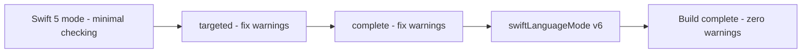
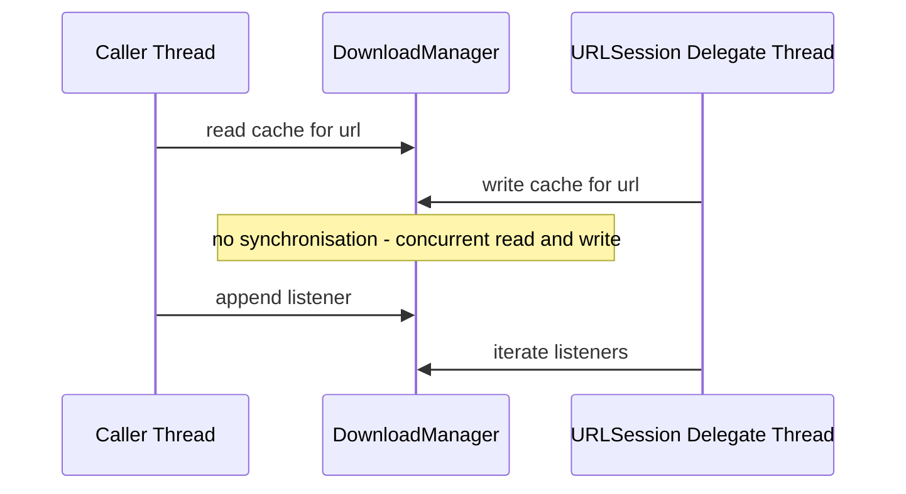

# Lecture 2 — Strict Concurrency and a Worked Migration

> **Duration:** ~1.5 hours of reading + hands-on.
> **Outcome:** You can enable Swift 6 language mode on a real SwiftPM target, read and classify every diagnostic the strict-concurrency checker raises, and migrate a non-trivial module that contains a genuine data race until it compiles clean — without a single `@unchecked Sendable`.

Lecture 1 taught you the model. This lecture is the part you will actually do at work in 2026: turning on the checker and walking the diagnostics down to zero. The skill is not "knowing actors exist." The skill is taking a five-thousand-line module that compiled fine in Swift 5, flipping it to Swift 6, getting two hundred errors, and *systematically* driving them to none — fixing real races, not papering over the checker.

If you remember one sentence from this lecture, remember this:

> **The Swift 6 checker does not invent problems. Every diagnostic marks a place where two pieces of code could touch shared mutable state without synchronisation. Your job is to fix the race, not silence the checker.**

---

## 1. What "strict concurrency" actually is

"Strict concurrency" (the docs say "complete concurrency checking" or "data-race safety") is the compiler statically proving, at every isolation-boundary crossing, that no data race is possible. It checks two things relentlessly:

1. **Sendability at boundaries.** Every value that crosses from one isolation domain to another is `Sendable`.
2. **Isolation correctness.** Isolated state is only touched from within its own domain; cross-domain access goes through `await`.

In Swift 5 these checks were warnings you could ignore (or off entirely). In **Swift 6 language mode**, they are *errors*. That is the entire difference between "Swift 6 the toolchain" and "Swift 6 the language mode," and conflating them is the most common confusion this week. Read carefully:

- The **toolchain** is the compiler version: `swift --version` says 6.x. A Swift 6 toolchain can compile code in *either* language mode.
- The **language mode** is per-target, set in `Package.swift`: `swiftLanguageModes: [.v6]` (errors) or `[.v5]` (the data-race checks become warnings or are governed by the `-strict-concurrency` level).

So you can run a Swift 6 toolchain all day and still be in v5 mode with data-race checking off. Turning on the checking is a deliberate, per-target decision. That decision is what makes migration *incremental* — you flip one target at a time, not the whole app at once.

---

## 2. The three checking levels (SE-0337)

Before you flip a target straight to errors, you usually dial the *strict-concurrency* level up in three stages while staying in Swift 5 mode. SE-0337 defines three levels:

| Level | What it checks | When to use |
|-------|----------------|-------------|
| `minimal` | Only the `Sendable` conformances you explicitly wrote. The Swift 5 default. | The "before" state. |
| `targeted` | The above, plus boundary checks on code that *already* adopted concurrency (functions marked `async`, types marked `Sendable`). | First migration step; surfaces the obvious races. |
| `complete` | Everything. Equivalent to what Swift 6 language mode enforces — but as warnings, not errors. | The dress rehearsal before flipping to `.v6`. |

The migration recipe the Swift team recommends, and the one we use:

1. Set `-strict-concurrency=targeted`, fix the warnings.
2. Set `-strict-concurrency=complete`, fix *those* warnings.
3. Flip the target to `swiftLanguageModes: [.v6]`. The warnings become errors; if you did steps 1–2 honestly there should be nothing left.


*The incremental path from minimal checking to Swift 6 language mode, one target at a time.*

In `Package.swift`, the level is a Swift setting:

```swift
// swift-tools-version: 6.0
import PackageDescription

let package = Package(
    name: "KVStore",
    targets: [
        .target(
            name: "KVStore",
            swiftSettings: [
                // Step 2: complete checking, still Swift 5 mode (warnings).
                .enableExperimentalFeature("StrictConcurrency")
                // equivalently for older toolchains:
                // .unsafeFlags(["-strict-concurrency=complete"])
            ]
        )
    ]
)
```

And the final state — Swift 6 mode on this target, errors not warnings:

```swift
// swift-tools-version: 6.0
import PackageDescription

let package = Package(
    name: "KVStore",
    targets: [
        .target(
            name: "KVStore",
            swiftSettings: [.swiftLanguageMode(.v6)]
            // or set package-wide:  swiftLanguageModes: [.v6]  on the Package(...)
        )
    ]
)
```

> **Why per-target matters.** A real app depends on packages that may not be migrated yet. You flip *your* targets to `.v6` and leave a laggard dependency in `.v5`. Boundaries between a v6 target and a v5 target are checked from the v6 side. This is how you migrate a hundred-target app without a six-month freeze.

---

## 3. The starting module — a real data race

Here is a module we will migrate. It is a download-and-cache manager of the kind every app has. It compiles cleanly in Swift 5 with checking off. It has a genuine data race that ships to production and crashes intermittently. We will turn on the checker, watch it find the race, and fix it properly.

`Sources/Downloads/DownloadManager.swift` — the "before":

```swift
import Foundation

final class DownloadManager {
    static let shared = DownloadManager()      // global mutable singleton

    private var cache: [URL: Data] = [:]        // shared mutable state
    private var listeners: [(URL, Data) -> Void] = []

    func onDownload(_ handler: @escaping (URL, Data) -> Void) {
        listeners.append(handler)               // mutated from any thread
    }

    func download(_ url: URL, completion: @escaping (Data?) -> Void) {
        if let cached = cache[url] {            // read on caller's thread
            completion(cached)
            return
        }
        URLSession.shared.dataTask(with: url) { data, _, _ in
            // This closure runs on a URLSession delegate queue — a DIFFERENT thread.
            guard let data else {
                completion(nil)
                return
            }
            self.cache[url] = data              // WRITE on the delegate thread
            for listener in self.listeners {    // READ listeners on delegate thread
                listener(url, data)
            }
            completion(data)
        }.resume()
    }
}
```

The race is concrete: `cache` and `listeners` are read on the *caller's* thread and written on the *URLSession delegate* thread, with no synchronisation. Two downloads completing concurrently both write `cache`; a caller registering a listener while a download completes reads and writes `listeners` simultaneously. In Swift 5 with checking off, the compiler says nothing. In production, you get occasional `EXC_BAD_ACCESS` in `Dictionary` mutation and `Array` reallocation. Classic.


*Two threads touch the same cache and listeners with nothing serialising them - the classic data race.*

---

## 4. Step 1 — turn on `targeted`, read the first diagnostics

Set `-strict-concurrency=targeted` and build. Because nothing here is `async` or `Sendable` yet, `targeted` is quiet — that is the trap. `targeted` only checks code that already adopted concurrency. The race is invisible to it because the code is all callback-and-thread style.

This teaches the first real lesson of migration: **the checker can only see races at isolation boundaries you have actually declared.** Callback-based code with implicit threading has no declared boundaries, so the checker has nothing to grab. To expose the race, you have to start *modelling* the concurrency — which is the migration. Crank straight to `complete`.

---

## 5. Step 2 — `complete` checking lights up the closures

Set `.enableExperimentalFeature("StrictConcurrency")` (complete). Now build. You get diagnostics like:

```
warning: capture of 'self' with non-sendable type 'DownloadManager'
         in a '@Sendable' closure
   self.cache[url] = data
        ^

warning: capture of 'completion' with non-sendable type
         '(Data?) -> Void' in a '@Sendable' closure
```

The `URLSession.dataTask` completion closure is `@Sendable` (URLSession calls it from its own queue). So everything it captures must be `Sendable`: `self` (a mutable class — not `Sendable`), the `completion` closure (not declared `@Sendable`), `url` (`Sendable`, fine). The checker has found the exact crossing where the race lives: the boundary between the caller's thread and the delegate queue.

This is the moment the migration stops being mechanical. You cannot make `DownloadManager` `Sendable` as a mutable class. You have two honest options:

- **Make it an actor** — move `cache` and `listeners` into an isolation domain.
- **Make it immutable + a separate actor for state** — overkill here.

We make it an actor. That is the move 90% of "shared mutable manager" types want.

---

## 6. Step 3 — convert to an actor, embrace `async`

The actor rewrite. Note we also drop the completion-handler API for `async`/`await` — callbacks and strict concurrency fight each other, and `await` is what the rest of the app wants anyway.

`Sources/Downloads/DownloadManager.swift` — the "after":

```swift
import Foundation

actor DownloadManager {
    private var cache: [URL: Data] = [:]
    private var inFlight: [URL: Task<Data, Error>] = [:]

    enum DownloadError: Error { case emptyResponse }

    // No completion handler. No listener array. Just async.
    func data(for url: URL) async throws -> Data {
        if let cached = cache[url] {
            return cached
        }
        if let running = inFlight[url] {
            return try await running.value          // coalesce reentrant calls
        }

        let task = Task { try await Self.fetch(url) }
        inFlight[url] = task                         // record BEFORE awaiting
        defer { inFlight[url] = nil }

        let data = try await task.value
        cache[url] = data                            // re-enter on actor: safe
        return data
    }

    // nonisolated + static: touches no actor state, runs anywhere.
    private static func fetch(_ url: URL) async throws -> Data {
        let (data, _) = try await URLSession.shared.data(from: url)
        guard !data.isEmpty else { throw DownloadError.emptyResponse }
        return data
    }
}
```

What changed and why:

- `cache` and `listeners` were shared mutable state on a class. Now `cache` is isolated to the actor — the executor serialises every access, so no race. We *replaced* `listeners` with an `AsyncStream` published separately (next section); a mutable array of escaping callbacks is exactly the thing strict concurrency hates, and broadcast is better modelled as an async sequence anyway.
- The completion-handler API became `async throws`. Callers `await downloadManager.data(for: url)`. The hop is explicit and the result (`Data`, which is `Sendable`) crosses the boundary cleanly.
- We added the reentrancy guard from Lecture 1: record the in-flight `Task` before the first `await` so a concurrent call for the same URL joins it instead of starting a duplicate download.
- `fetch` is `static` and isolated to nothing — it touches no actor state, just `URLSession`. The `URLSession.data(from:)` call is itself `async` and `Sendable`-clean.

The static singleton (`static let shared`) is fine: an `actor` is `Sendable`, so a shared instance is safe. If you keep it, `static let shared = DownloadManager()` compiles clean under v6, because the value is immutable (`let`) and `Sendable` (actor).

---

## 7. Replacing the listener broadcast with `AsyncStream`

The old `listeners: [(URL, Data) -> Void]` is a non-`Sendable`, mutable array of escaping closures mutated from multiple threads — a triple offence. Broadcasting downloads is better expressed as an `AsyncStream`, which is `Sendable` by construction and gives consumers back-pressure and cancellation for free.

```swift
import Foundation

actor DownloadManager {
    private var cache: [URL: Data] = [:]
    private var inFlight: [URL: Task<Data, Error>] = [:]

    // One continuation per subscriber, keyed so we can drop finished ones.
    private var continuations: [UUID: AsyncStream<(URL, Data)>.Continuation] = [:]

    /// A live stream of (url, data) for every completed download.
    nonisolated func downloads() -> AsyncStream<(URL, Data)> {
        AsyncStream { continuation in
            let id = UUID()
            // Hop onto the actor to register; safe because we await.
            Task { await self.register(id, continuation) }
            continuation.onTermination = { _ in
                Task { await self.unregister(id) }
            }
        }
    }

    private func register(_ id: UUID, _ c: AsyncStream<(URL, Data)>.Continuation) {
        continuations[id] = c
    }

    private func unregister(_ id: UUID) {
        continuations[id] = nil
    }

    private func broadcast(_ url: URL, _ data: Data) {
        for c in continuations.values {
            c.yield((url, data))
        }
    }

    func data(for url: URL) async throws -> Data {
        if let cached = cache[url] { return cached }
        if let running = inFlight[url] { return try await running.value }

        let task = Task { try await Self.fetch(url) }
        inFlight[url] = task
        defer { inFlight[url] = nil }

        let data = try await task.value
        cache[url] = data
        broadcast(url, data)            // isolated call: safe to iterate continuations
        return data
    }

    private static func fetch(_ url: URL) async throws -> Data {
        let (data, _) = try await URLSession.shared.data(from: url)
        return data
    }
}
```

Consumers now write:

```swift
let manager = DownloadManager()

Task {
    for await (url, data) in manager.downloads() {
        print("downloaded \(data.count) bytes from \(url)")
    }
}
```

`AsyncStream` is `Sendable`; the `(URL, Data)` tuple is `Sendable` (both components are). The whole broadcast path is now isolation-correct. We did not reach for `@unchecked Sendable` once — we changed the *shape* of the problem from "shared mutable array of callbacks" to "isolated continuations + a Sendable stream."

---

## 8. Step 4 — flip to Swift 6 language mode

With `complete` checking warning-free, flip the target:

```swift
.target(
    name: "Downloads",
    swiftSettings: [.swiftLanguageMode(.v6)]
)
```

Rebuild. If steps 5–7 were honest, you get:

```
Building for debugging...
Build complete! (Swift 6 language mode, 0 warnings)
```

That is the marker. The data race is gone — not hidden, *gone* — because `cache` now lives in an isolation domain the compiler can reason about, and every boundary crossing carries only `Sendable` values.

---

## 9. The diagnostic field guide

You will see a small set of diagnostics over and over. Memorise the fix for each; do not reach for the escape hatch.

**"Non-sendable type 'X' … crossing actor boundary."**
> You passed something non-`Sendable` across a hop. *Fix:* make `X` a value type, make its fields immutable, conform it to `Sendable` if it truly is, or pass a copy. Make the type honest.

**"Capture of 'x' with non-sendable type 'X' in a '@Sendable' closure."**
> A `Task { }` / `TaskGroup.addTask` / detached closure captured something unsafe. *Fix:* if `x` is a manager-like mutable class, make it an actor and `await` it; if it is data, make it a `Sendable` value type.

**"Main actor-isolated property 'p' can not be referenced from a nonisolated context."**
> Nonisolated code touched main-actor state. *Fix:* mark the calling function `@MainActor`, or `await MainActor.run { ... }` for a small island, or move the state off the main actor if it is not really UI state.

**"Sending 'x' risks causing data races."** (region-based isolation, SE-0414)
> The compiler could not prove `x` is exclusively held by the sender. *Fix:* stop using `x` after you send it (let the region transfer), or make `x` `Sendable`.

**"Static property 's' is not concurrency-safe because it is non-isolated global shared mutable state."**
> A `static var` is a global mutable singleton — the oldest race there is. *Fix:* make it `let` (immutable), isolate it to a global actor, or wrap it in an actor.

**"Conformance of 'X' to protocol 'P' crosses into actor-isolated code."**
> You tried to satisfy a synchronous protocol requirement from inside an actor. *Fix:* mark the satisfying member `nonisolated` (and ensure it touches no isolated state), or reconsider whether the protocol should be `async`.

---

## 10. When `@unchecked Sendable` is actually defensible

We spend the week avoiding it, so it is fair to ask when it is legitimate. Three honest cases:

1. **Bridging a C or Objective-C type you do not control** that is documented thread-safe (e.g. a class whose docs say "all methods are safe to call from any thread"). You annotate the Swift wrapper `@unchecked Sendable` because the safety lives in code the Swift compiler cannot see.
2. **A type you synchronise by hand** with `OSAllocatedUnfairLock` or `Mutex` (the new `Synchronization` module), where the lock guards every access. The compiler cannot prove the lock discipline; you assert it.
3. **A migration shim** during a large incremental migration, with a `// FIXME(SWIFT6): remove @unchecked when X is an actor` and a tracking ticket. Temporary, tracked, time-boxed.

What makes all three legitimate is the *same* thing: there is a real synchronisation mechanism, it just lives where the compiler cannot see it. `@unchecked Sendable` is a lie when there is *no* synchronisation — when you wrote it to make an error disappear. That is the use we are training out of you. The challenge this week takes a module with exactly one such illegitimate escape hatch and has you remove it by fixing the data model.

Here is the *legitimate* hand-synchronised case, for contrast, so you know what the real thing looks like:

```swift
import Synchronization   // Swift 6 standard library module

// Genuinely safe: every access goes through the Mutex. The @unchecked is honest.
final class MetricsCounter: @unchecked Sendable {
    private let state = Mutex<[String: Int]>([:])

    func increment(_ key: String) {
        state.withLock { $0[key, default: 0] += 1 }
    }

    func snapshot() -> [String: Int] {
        state.withLock { $0 }
    }
}
```

Even here, ask: would a plain `actor MetricsCounter` be simpler? Usually yes. The `@unchecked` + `Mutex` form is worth it only when you need *synchronous* access (no `await`) from a hot path or a `nonisolated` context — for example, a counter you bump from inside a signal handler or a tight render loop where a hop is genuinely too expensive. That is the bar. Below it, use an actor.

---

## 11. A migration checklist you can reuse at work

When you flip a real target to Swift 6, work in this order. It minimises churn and surfaces the real races first.

1. **Make data types `Sendable` first.** Turn DTOs and value objects into `struct`/`enum`. Most will become `Sendable` for free. This clears half your diagnostics.
2. **Convert shared mutable managers to actors.** Caches, stores, coordinators, registries — anything with mutable `var` state touched from more than one place.
3. **Mark UI types `@MainActor`.** View models, anything driving SwiftUI/UIKit. Then chase the `await`s that appear at the boundaries.
4. **Replace callbacks with `async`/`await` and `AsyncStream`.** Escaping completion handlers are where the checker gets loudest; `async` deletes the noise *and* the bug.
5. **Add `nonisolated` to members that touch no isolated state** so callers keep synchronous access where it is safe.
6. **Only then, audit any remaining `@unchecked Sendable`.** For each, write down the synchronisation mechanism. If you cannot, it is a bug — go back to step 2.
7. **Flip `swiftLanguageMode(.v6)` and confirm zero warnings.**

---

## 12. Recap

You should now be able to:

- Distinguish the Swift 6 *toolchain* from the Swift 6 *language mode*, and set the mode per-target in `Package.swift`.
- Use the three checking levels (`minimal` → `targeted` → `complete`) as an incremental migration path, then flip to `.v6`.
- Recognise that callback-and-thread code hides races from the checker, and that modelling the concurrency *is* the migration.
- Convert a racy shared-mutable manager into an actor, with a reentrancy guard, and replace a callback broadcast with an `AsyncStream`.
- Read each strict-concurrency diagnostic and apply the right structural fix rather than silencing it.
- State the three legitimate uses of `@unchecked Sendable` and reject the illegitimate "make the error go away" use.

This is the skill the syllabus promises for the week: *compile a non-trivial module under strict concurrency without `@unchecked Sendable` shortcuts.* The mini-project is exactly that, end to end. Go do it.

---

## References

- *Swift Migration Guide — Migrating to Swift 6*: <https://www.swift.org/migration/documentation/migrationguide/>
- *Swift Migration Guide — Common compiler errors*: <https://www.swift.org/migration/documentation/swift-6-concurrency-migration-guide/commonproblems>
- *Swift Migration Guide — Enabling complete checking*: <https://www.swift.org/migration/documentation/swift-6-concurrency-migration-guide/completechecking>
- *SE-0337 — Incremental migration to concurrency checking*: <https://github.com/swiftlang/swift-evolution/blob/main/proposals/0337-support-incremental-migration-to-concurrency-checking.md>
- *SE-0414 — Region-based isolation*: <https://github.com/swiftlang/swift-evolution/blob/main/proposals/0414-region-based-isolation.md>
- *WWDC24 — Migrate your app to Swift 6*: <https://developer.apple.com/videos/play/wwdc2024/10169/>
- *PackageDescription — swiftLanguageModes / SwiftSetting*: <https://developer.apple.com/documentation/packagedescription>
