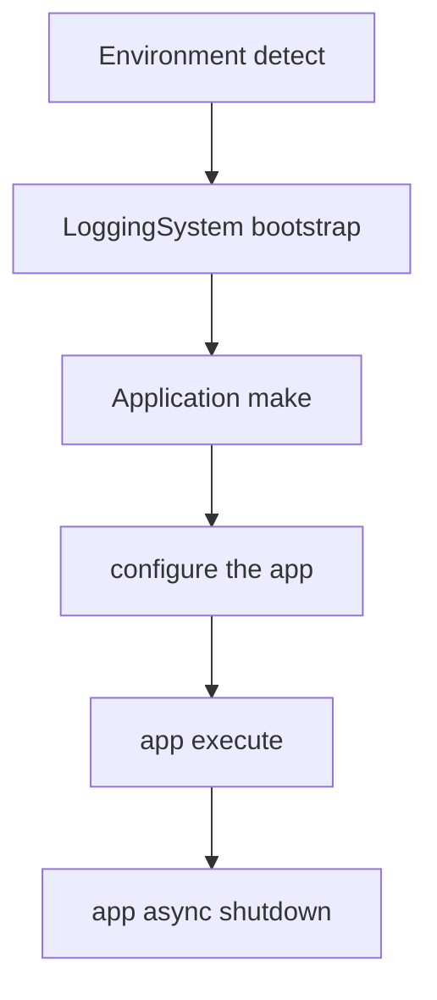
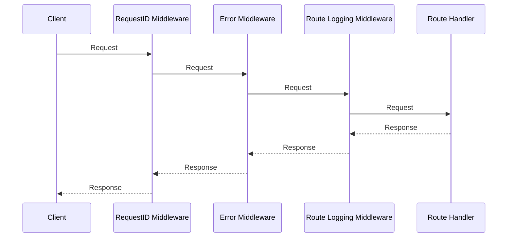

# Lecture 1 — Why Vapor: The Shape of a Production Swift HTTP Service

> **Reading time:** ~80 minutes. **Hands-on time:** ~60 minutes (you scaffold a service, add a model, run a migration, and `curl` a JSON endpoint).

This is the lecture that turns Swift into a backend language for you. By the end of it you will understand every layer of a Vapor service — the executable target that boots the `Application`, the `configure(_:)` function that wires databases and middleware, the router that maps HTTP verbs to `async` functions, the `Content` protocol that turns Swift values into JSON on a socket, the Fluent ORM that turns Swift types into Postgres rows, and the migration that creates the table those rows live in. We build the whole thing once, top to bottom, so that when the mini-project asks you to build `notes-api` you are assembling parts you have already seen work.

The framing for the entire week is in the title: **a production Swift HTTP service has a *shape*.** It is not a script that happens to listen on a port. It is a typed pipeline — request comes in untyped and untrusted, gets decoded into a Swift value the compiler vouches for, flows through middleware that can short-circuit it, hits a handler that talks to a connection-pooled database, and returns a Swift value that the framework serialises back to bytes. Every production framework has this shape. Vapor's distinction is that *the Swift compiler is in the loop for most of it.* That is the thing we are buying, and this lecture is about spending the purchase well.

## 1.1 — What Vapor actually is (and what it sits on)

Vapor is an HTTP web framework written in Swift. It is not a runtime, not a language feature, and not an Apple product — it is an open-source project (MIT-licensed, on GitHub at `vapor/vapor`) maintained by an independent community, with significant overlap with the Swift on Server working group that Apple sponsors. In 2026 the stable line is **Vapor 4** (we use 4.106 as the reference), and **Vapor 5** is in active development; we teach 4 because 4 is what ships to production today.

Underneath Vapor sits **SwiftNIO** — Apple's low-level, event-loop-based networking library, the same one that powers AsyncHTTPClient, gRPC-Swift, and a good slice of Apple's own server infrastructure. NIO gives Vapor non-blocking sockets, an `EventLoopGroup` (one event loop per CPU core by default), and the buffer machinery to read and write HTTP without a thread blocking per connection. You will rarely touch NIO directly this week, but you should know it is there: when Vapor talks about an `EventLoop`, that is NIO's, and when your `async` handler suspends on an `await`, it is yielding the event loop back to NIO so another request can make progress.

The stack, top to bottom:

```
Your route handlers          (async functions you write)
        │
Vapor                        (routing, Content, middleware, Fluent integration)
        │
Fluent                       (the ORM: Model, Migration, query builder)
        │
fluent-postgres-driver       (the Postgres-specific Fluent driver)
        │
PostgresNIO                  (the async Postgres client)
        │
SwiftNIO                     (event loops, non-blocking sockets, HTTP parsing)
        │
The operating system         (epoll on Linux, kqueue on macOS)
```

Every layer is open source and readable Swift. When something behaves surprisingly, you can read the source down to the socket. That is a luxury you do not get with most frameworks, and we use it: the resources page points you at the exact files.

## 1.2 — Scaffolding a service

You can scaffold a Vapor project two ways: the Vapor Toolbox (`vapor new`) or by hand with SwiftPM. We will do it by hand once so you understand what the toolbox generates, then use the toolbox for speed in the mini-project.

By hand, the minimal `Package.swift` for a Vapor + Fluent + Postgres service looks like this:

```swift
// swift-tools-version:6.0
import PackageDescription

let package = Package(
    name: "notes-api",
    platforms: [.macOS(.v13)],
    dependencies: [
        .package(url: "https://github.com/vapor/vapor.git", from: "4.106.0"),
        .package(url: "https://github.com/vapor/fluent.git", from: "4.12.0"),
        .package(url: "https://github.com/vapor/fluent-postgres-driver.git", from: "2.10.0"),
    ],
    targets: [
        .executableTarget(
            name: "App",
            dependencies: [
                .product(name: "Vapor", package: "vapor"),
                .product(name: "Fluent", package: "fluent"),
                .product(name: "FluentPostgresDriver", package: "fluent-postgres-driver"),
            ],
            swiftSettings: [
                .enableExperimentalFeature("StrictConcurrency"),
            ]
        ),
        .testTarget(
            name: "AppTests",
            dependencies: [
                .target(name: "App"),
                .product(name: "VaporTesting", package: "vapor"),
            ]
        ),
    ]
)
```

Three things to notice:

1. **The product is an `.executableTarget` named `App`, not the package name.** Vapor's convention is a module called `App` that contains all your code, built into an executable also addressed as `App`. So `swift run App migrate` runs the migrate subcommand of your service. This trips up everyone once; internalise it now.
2. **`StrictConcurrency` is enabled as a swift setting.** Vapor 4's recent releases compile clean under it, and we hold ourselves to the same bar we held in Week 4. Every value you put on a request, every closure you hand the router, is `Sendable`-checked.
3. **The test target depends on `VaporTesting`, not `XCTVapor`.** `VaporTesting` is the Swift Testing-based test helper Vapor ships in 4.106; it gives you `app.testing()` and `req.test(...)` with the `@Test`/`#expect` macros you learned in Week 1. `XCTVapor` (the XCTest-based predecessor) still works, but new code uses `VaporTesting`.

The directory layout that goes with it:

```
notes-api/
├── Package.swift
├── Sources/
│   └── App/
│       ├── entrypoint.swift          ← @main; boots the Application
│       ├── configure.swift           ← configure(_:): databases, migrations, middleware
│       ├── routes.swift              ← routes(_:): registers route collections
│       ├── Controllers/
│       │   └── NotesController.swift  ← RouteCollection with the CRUD handlers
│       ├── Models/
│       │   └── Note.swift            ← the Fluent Model
│       └── Migrations/
│           └── CreateNote.swift      ← the schema migration
└── Tests/
    └── AppTests/
        └── NotesTests.swift          ← VaporTesting tests
```

This layout is a convention, not a requirement — Vapor does not enforce it — but every Vapor service in the wild looks roughly like this, and reviewers expect it. Honour it.

## 1.3 — The entrypoint and the Application

The executable's job is to construct an `Application`, configure it, and run it. The modern Vapor entrypoint uses Swift's `@main` and an `async` `main`:

```swift
import Vapor
import Logging
import NIOCore
import NIOPosix

@main
enum Entrypoint {
    static func main() async throws {
        var env = try Environment.detect()
        try LoggingSystem.bootstrap(from: &env)

        let app = try await Application.make(env)

        do {
            try await configure(app)
        } catch {
            app.logger.report(error: error)
            try? await app.asyncShutdown()
            throw error
        }

        try await app.execute()
        try await app.asyncShutdown()
    }
}
```

Read this carefully — it is the load-bearing wiring and it has subtleties:

- **`Environment.detect()`** inspects `--env` / `-e` flags and the `process` arguments to decide whether you are in `.development`, `.testing`, or `.production`. It defaults to `.development`. We come back to this in §1.9.
- **`LoggingSystem.bootstrap(from:)`** installs the `swift-log` backend *before anything logs*. This must happen exactly once, at process start, before the `Application` is created. Bootstrap it twice and you get undefined behaviour; bootstrap it after the first log line and that line goes to the default handler. We dig into this in §1.8 and Exercise 3.
- **`Application.make(env)`** is the `async` factory (Vapor 4.99+) that replaces the old synchronous `Application(env)` initialiser. It builds the `EventLoopGroup`, the thread pool, the storage container, and the default middleware.
- **`app.execute()`** runs whatever command was asked for: `serve` (the default — boot the HTTP server and block), `migrate`, `routes`, or a custom command. `serve` is what runs in production; `migrate` is what you run in a deploy step.
- **`asyncShutdown()`** drains connection pools and event loops cleanly. Skipping it leaks file descriptors. The `do/catch` ensures we shut down even if `configure` throws.


*The Vapor entrypoint boots, wires, serves, then shuts down cleanly, in that order.*

## 1.4 — configure(_:): the wiring function

`configure(app:)` is where the service is assembled. It runs once, at startup, before any request is served. A representative one:

```swift
import Vapor
import Fluent
import FluentPostgresDriver

func configure(_ app: Application) async throws {
    // 1. Database.
    app.databases.use(
        .postgres(
            configuration: SQLPostgresConfiguration(
                hostname: Environment.get("DATABASE_HOST") ?? "localhost",
                port: Environment.get("DATABASE_PORT").flatMap(Int.init)
                    ?? SQLPostgresConfiguration.ianaPortNumber,
                username: Environment.get("DATABASE_USERNAME") ?? "notes",
                password: Environment.get("DATABASE_PASSWORD") ?? "notes",
                database: Environment.get("DATABASE_NAME") ?? "notes",
                tls: .prefer(try .init(configuration: .clientDefault))
            )
        ),
        as: .psql
    )

    // 2. Migrations.
    app.migrations.add(CreateNote())

    // 3. Middleware (order matters — see §1.6).
    app.middleware.use(ErrorMiddleware.default(environment: app.environment))

    // 4. Routes.
    try routes(app)
}
```

The order inside `configure` matters less than the order *within* the middleware stack (§1.6) and the order *of migrations* (§1.7), but the structure is conventional: database first, migrations second, middleware third, routes last. Note that **every credential comes from `Environment.get`**, with a development default after `??`. That is the configuration discipline from §1.9, and it is not optional in production — the defaults are for your laptop only.

## 1.5 — Routing: HTTP verbs to async functions

A route maps an HTTP method and a path to a handler. The handler is an `async throws` function that takes a `Request` and returns something the framework can serialise. The simplest possible route:

```swift
func routes(_ app: Application) throws {
    app.get("health") { req async -> [String: String] in
        ["status": "ok"]
    }
}
```

`GET /health` returns `{"status":"ok"}`. The closure returns a `[String: String]`, which Vapor knows how to encode to JSON because `Dictionary` conforms to `Content` when its keys and values do. That is the whole trick: **return a `Content` value, Vapor serialises it.**

Paths can carry typed parameters:

```swift
app.get("notes", ":noteID") { req async throws -> Note in
    let id = try req.parameters.require("noteID", as: UUID.self)
    guard let note = try await Note.find(id, on: req.db) else {
        throw Abort(.notFound, reason: "No note with id \(id)")
    }
    return note
}
```

`req.parameters.require("noteID", as: UUID.self)` extracts the `:noteID` path segment and parses it as a `UUID`, throwing a `400` if it is malformed. This is the typed-router payoff: a path parameter you forgot to validate becomes a clean `400` instead of a crash deep in your handler.

Routes compose into **groups** — a prefix and/or a set of middleware applied to several routes at once:

```swift
let notes = app.grouped("notes")
notes.get(use: index)                  // GET    /notes
notes.post(use: create)                // POST   /notes
notes.group(":noteID") { note in
    note.get(use: show)                // GET    /notes/:noteID
    note.patch(use: update)            // PATCH  /notes/:noteID
    note.delete(use: destroy)          // DELETE /notes/:noteID
}
```

In production you do not scatter handlers across `routes.swift`. You collect them in a `RouteCollection`:

```swift
struct NotesController: RouteCollection {
    func boot(routes: RoutesBuilder) throws {
        let notes = routes.grouped("notes")
        notes.get(use: index)
        notes.post(use: create)
        notes.group(":noteID") { note in
            note.get(use: show)
            note.patch(use: update)
            note.delete(use: destroy)
        }
    }

    func index(req: Request) async throws -> [Note] {
        try await Note.query(on: req.db).all()
    }

    // ... create, show, update, destroy below.
}
```

and register it with one line in `routes.swift`:

```swift
func routes(_ app: Application) throws {
    try app.register(collection: NotesController())
}
```

`RouteCollection` is how every non-trivial Vapor service organises its routes. One controller per resource, registered once. We use it for the rest of the week.

## 1.6 — Middleware: the request pipeline

Middleware is the layer between the router and your handler. Conceptually a request flows *down* through the middleware stack to the handler, and the response flows *back up*. Each middleware can read or rewrite the request on the way down, read or rewrite the response on the way up, or short-circuit by returning (or throwing) without calling the next link.

In Vapor a middleware conforms to `AsyncMiddleware`:

```swift
struct RequestIDMiddleware: AsyncMiddleware {
    func respond(to request: Request, chainingTo next: AsyncResponder) async throws -> Response {
        let requestID = request.headers.first(name: "X-Request-ID") ?? UUID().uuidString
        request.logger[metadataKey: "request_id"] = .string(requestID)
        let response = try await next.respond(to: request)
        response.headers.replaceOrAdd(name: "X-Request-ID", value: requestID)
        return response
    }
}
```

**Order is everything.** The middleware stack is ordered, and the order is the order you `use` them. The first middleware added is the *outermost* — it sees the request first and the response last. A correct production ordering is:

```swift
app.middleware.use(RequestIDMiddleware())                                   // outermost
app.middleware.use(ErrorMiddleware.default(environment: app.environment))   // catches throws below it
app.middleware.use(RouteLoggingMiddleware(logLevel: .info))
// ... auth middleware applied per-group, not globally (Lecture 2 + Exercise 2)
```

`ErrorMiddleware` must sit *above* (outer to) anything that can throw, because its whole job is to catch a thrown `Error`, decide whether it is an `AbortError` with a known status code or an unexpected error that should become a `500`, and turn it into a `Response`. If a middleware throws *above* `ErrorMiddleware`, nothing catches it and the connection drops. Get the ordering wrong and your clean `404` becomes a dropped socket. This is the single most common Vapor middleware bug; it is why we drill ordering in Lecture 2.


*Each middleware sees the request going down and the response coming back up, in reverse order.*

## 1.7 — The Content protocol: Swift values on the wire

`Content` is the protocol that makes a Swift value sendable and receivable over HTTP. Its definition is, essentially, `Codable` plus a default media type:

```swift
public protocol Content: Codable, RequestDecodable, ResponseEncodable {
    static var defaultContentType: HTTPMediaType { get }   // .json by default
}
```

Because `Content` refines `Codable`, anything you can `Encodable`/`Decodable` you can make `Content` by adding the conformance — usually a one-word `: Content`. Decoding a request body:

```swift
struct CreateNoteRequest: Content {
    let title: String
    let body: String
}

func create(req: Request) async throws -> Note {
    let input = try req.content.decode(CreateNoteRequest.self)
    let note = Note(title: input.title, body: input.body)
    try await note.create(on: req.db)
    return note
}
```

`req.content.decode(_:)` reads the request body, looks at the `Content-Type` header to pick a decoder (JSON by default), and produces a typed `CreateNoteRequest` — or throws a clean `400` if the body is missing a field or the wrong type. **This is the core safety property of the week:** a malformed request never reaches your business logic as a malformed value. It is rejected at the decode boundary with a status code, every time.

The reverse — encoding a response — is automatic. When your handler returns a `Content` value, Vapor encodes it to the negotiated media type. Returning `Note` returns its JSON.

You control the wire format globally with `ContentConfiguration`. The default JSON encoder uses `.deferredToDate` for dates and verbatim keys; production APIs almost always want ISO-8601 dates and a deliberate key strategy:

```swift
let encoder = JSONEncoder()
encoder.dateEncodingStrategy = .iso8601
encoder.keyEncodingStrategy = .convertToSnakeCase

let decoder = JSONDecoder()
decoder.dateDecodingStrategy = .iso8601
decoder.keyDecodingStrategy = .convertFromSnakeCase

ContentConfiguration.global.use(encoder: encoder, for: .json)
ContentConfiguration.global.use(decoder: decoder, for: .json)
```

Set this once in `configure` and every `Content` value on the service speaks ISO-8601 + `snake_case` — without touching a single model. That separation (model shape vs wire shape) is exactly what a well-engineered API wants, because the wire contract should not change every time you rename a Swift property.

## 1.8 — Fluent: Swift types as Postgres rows

Fluent is Vapor's ORM. A database table is modelled as a `class` conforming to `Model`, with property wrappers describing its columns:

```swift
import Fluent
import Vapor

final class Note: Model, Content, @unchecked Sendable {
    static let schema = "notes"

    @ID(key: .id)
    var id: UUID?

    @Field(key: "title")
    var title: String

    @Field(key: "body")
    var body: String

    @Timestamp(key: "created_at", on: .create)
    var createdAt: Date?

    @Timestamp(key: "updated_at", on: .update)
    var updatedAt: Date?

    init() {}

    init(id: UUID? = nil, title: String, body: String) {
        self.id = id
        self.title = title
        self.body = body
    }
}
```

Annotate the moving parts:

- **`static let schema`** is the table name. Fluent maps the model to this table.
- **`@ID(key: .id)`** is the primary key. `UUID?` is the conventional choice — generated client-side or by the database, and `nil` until the row is saved. The `?` is load-bearing: an unsaved model has no id yet.
- **`@Field`** maps a stored column. `@OptionalField` for nullable columns.
- **`@Timestamp(on: .create)` / `(on: .update)`** are managed by Fluent: `createdAt` is set on insert, `updatedAt` on every save. You never set them by hand.
- **`@unchecked Sendable`** is the pragmatic concession Fluent models make. A `Model` is a reference type with mutable stored properties, so it is not automatically `Sendable`. In practice you do not share a single model instance across concurrency domains — each request gets its own — so `@unchecked Sendable` documents "I am asserting this is safe because of how it is used." This is the one place this week where `@unchecked` is the idiomatic answer; everywhere else you earn `Sendable` honestly.

The query builder is `async`/`await` end to end:

```swift
// All notes.
let all = try await Note.query(on: req.db).all()

// One note by id (returns Note?).
let one = try await Note.find(noteID, on: req.db)

// Filtered.
let recent = try await Note.query(on: req.db)
    .filter(\.$createdAt >= cutoff)
    .sort(\.$createdAt, .descending)
    .limit(20)
    .all()

// Create.
try await note.create(on: req.db)

// Update.
note.title = "New title"
try await note.update(on: req.db)

// Delete.
try await note.delete(on: req.db)
```

`.filter(\.$createdAt >= cutoff)` is worth a pause: `\.$createdAt` is a key path to the *property wrapper's projected value*, which Fluent uses to build a typed `WHERE created_at >= $1` clause. The `$` prefix reaches the wrapper, not the wrapped `Date?`. Get a column name wrong and it is a compile error, not a runtime SQL error — that is the ORM earning its keep.

## 1.9 — Migrations: schema as versioned code

Fluent does not create your tables from the model automatically. You write a **migration** — an explicit, reversible description of a schema change:

```swift
import Fluent

struct CreateNote: AsyncMigration {
    func prepare(on database: Database) async throws {
        try await database.schema("notes")
            .id()
            .field("title", .string, .required)
            .field("body", .string, .required)
            .field("created_at", .datetime)
            .field("updated_at", .datetime)
            .create()
    }

    func revert(on database: Database) async throws {
        try await database.schema("notes").delete()
    }
}
```

`prepare` applies the change; `revert` undoes it. Fluent records which migrations have run in a `_fluent_migrations` table, so `migrate` only applies new ones and `migrate --revert` rolls back the last batch. You register migrations in `configure` (`app.migrations.add(CreateNote())`) and run them with:

```bash
swift run App migrate --yes
```

The output you are looking for:

```
[ INFO ] [migration] Prepared CreateNote
```

**Why explicit migrations instead of model-driven auto-schema?** Because in production the schema and the model diverge for periods of time — you ship a migration that adds a column, deploy it, *then* deploy the code that uses the column. Auto-schema (the "the model is the schema" approach some ORMs take) cannot express that two-step. Explicit, ordered, reversible migrations can. This is the discipline that lets you deploy without downtime, and it is non-negotiable for a real service.

## 1.10 — Environment configuration and secret hygiene

A production service reads its configuration from the environment, never from a checked-in file. Vapor's `Environment.get(_:)` reads a process environment variable and returns `String?`:

```swift
let host = Environment.get("DATABASE_HOST") ?? "localhost"
guard let token = Environment.get("API_TOKEN") else {
    fatalError("API_TOKEN is required. Set it before booting.")
}
```

Two patterns, two different intents:

- **`?? "default"`** for values that have a safe development default (host, port). The default is for your laptop; production overrides it.
- **`guard ... else { fatalError }`** for secrets that have *no* safe default. If `API_TOKEN` is unset, the service must refuse to boot rather than silently fall back to a guessable value. **Fail loud, fail at startup.** A service that boots with a missing secret and serves traffic anyway is a security incident waiting for a date.

In development, Vapor reads a `.env` file (and `.env.development`, `.env.testing` per detected environment) from the working directory automatically. **`.env` goes in `.gitignore`; it never gets committed.** Commit a `.env.example` with the *keys* and dummy values so a new engineer knows what to set. We drill this in Exercise 3.

## 1.11 — Structured logging with swift-log

`swift-log` (`apple/swift-log`) is the logging *API* the whole server ecosystem standardises on. It is deliberately just an API — `Logger`, log levels, metadata — with the actual output handled by a pluggable *backend* you bootstrap once at startup. This separation means a library can log without knowing or caring where the logs go; the application picks the backend.

Vapor gives every request a `Logger` at `req.logger`, pre-populated with a per-request UUID in its metadata. You log through it:

```swift
func create(req: Request) async throws -> Note {
    let input = try req.content.decode(CreateNoteRequest.self)
    let note = Note(title: input.title, body: input.body)
    try await note.create(on: req.db)
    req.logger.info("created note", metadata: [
        "note_id": .string(note.id?.uuidString ?? "nil"),
        "title_length": .stringConvertible(input.title.count),
    ])
    return note
}
```

That `metadata:` dictionary is the *structured* part of structured logging. Instead of mashing values into a string (`"created note \(note.id) with title length \(input.title.count)"`), you attach them as typed key-value pairs. A structured-log backend renders them as JSON fields you can filter and aggregate on — `note_id == X`, `title_length > 200` — in whatever log aggregator you ship to. Use the **levels** deliberately: `trace`/`debug` for development noise, `info` for business events, `warning` for recoverable anomalies, `error` for failures, `critical` for "page someone." In production you set the floor with `LOG_LEVEL=info` and the `trace`/`debug` lines vanish at no cost. We build all of this in Exercise 3.

## 1.12 — The end-to-end round trip

Put the pieces together and the request lifecycle reads like this, for `POST /notes`:

1. NIO accepts the TCP connection, parses HTTP, and hands Vapor a `Request`.
2. The request flows down the middleware stack: `RequestIDMiddleware` stamps an id, `ErrorMiddleware` wraps the rest in a try/catch, `RouteLoggingMiddleware` logs the line.
3. The router matches `POST /notes` to `NotesController.create`.
4. `create` calls `req.content.decode(CreateNoteRequest.self)` — a `400` here if the body is malformed.
5. `create` builds a `Note` and calls `note.create(on: req.db)`. Fluent checks out a Postgres connection from the pool, emits `INSERT INTO notes ...`, and Fluent populates the generated id and timestamps.
6. `create` logs the success with structured metadata and returns the `Note`.
7. The `Note` flows back up: Vapor encodes it to JSON via the configured encoder (ISO-8601 dates, `snake_case` keys), each middleware sees the response on the way up, `RequestIDMiddleware` stamps the response header.
8. NIO writes the bytes to the socket and frees the connection back to the pool.

Every arrow in that list is typed, `async`, and `Sendable`-checked. The untyped, untrusted thing (the request body) becomes a typed Swift value at exactly one boundary (`req.content.decode`), and an error at any step becomes a clean HTTP status code instead of a crash. **That is the shape of a production Swift HTTP service.** The rest of the week is detail on each layer; this lecture is the map.

---

## Lecture 1 — checklist before moving on

- [ ] I can scaffold a Vapor + Fluent + Postgres service by hand from `Package.swift`, and I know why the executable target is named `App`.
- [ ] I can explain the entrypoint flow: `Environment.detect` → `LoggingSystem.bootstrap` → `Application.make` → `configure` → `execute` → `asyncShutdown`.
- [ ] I can write a `RouteCollection` controller with the five CRUD handlers and register it in `routes`.
- [ ] I can explain middleware ordering and why `ErrorMiddleware` must sit above anything that throws.
- [ ] I can make a Swift type `Content` and decode a request body with `req.content.decode`, and I can override the JSON wire format with `ContentConfiguration`.
- [ ] I can write a Fluent `Model` with `@ID`, `@Field`, and `@Timestamp`, and an `AsyncMigration` with `prepare`/`revert`.
- [ ] I can read every credential from `Environment.get`, with `?? default` for safe defaults and `guard/fatalError` for required secrets.
- [ ] I can attach structured metadata to a `req.logger` call and explain why structured beats string-interpolated logs.

If any box is unchecked, return to that section. Lecture 2 assumes you have built this service once and can reason about its layers.

---

**References cited in this lecture**

- Vapor — documentation home: <https://docs.vapor.codes/>
- Vapor — "Routing": <https://docs.vapor.codes/basics/routing/>
- Vapor — "Content": <https://docs.vapor.codes/basics/content/>
- Vapor — "Middleware": <https://docs.vapor.codes/advanced/middleware/>
- Fluent — "Overview" and "Model": <https://docs.vapor.codes/fluent/overview/>
- Fluent — "Migrations": <https://docs.vapor.codes/fluent/migration/>
- `apple/swift-log` — the logging API package: <https://github.com/apple/swift-log>
- `apple/swift-nio` — the networking library under Vapor: <https://github.com/apple/swift-nio>
- `vapor/vapor` — the framework source: <https://github.com/vapor/vapor>
