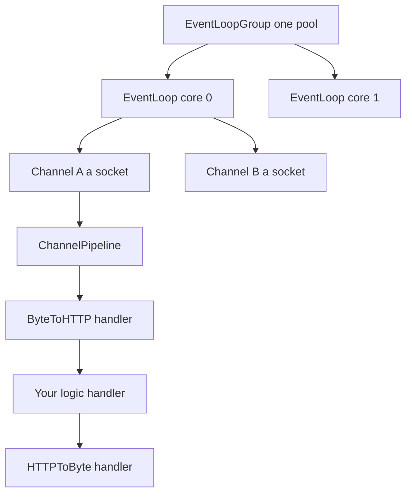
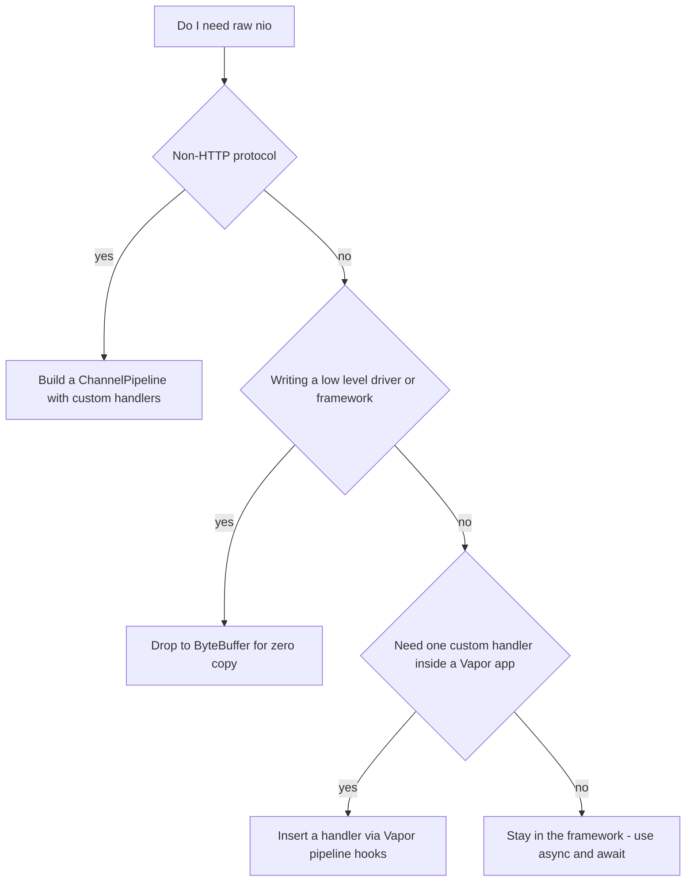

# Lecture 2 — swift-nio Event Loops and swift-collections at a Glance

> **Reading time:** ~80 minutes. **Hands-on time:** ~40 minutes (you trace a request through the event-loop model and pick a data structure for three access patterns).
> **Outcome:** You can describe the swift-nio event-loop model well enough to read a server stack trace and reason about back-pressure; you can name when Hummingbird beats Vapor; you can wire OpenTelemetry-Swift into a service and read the resulting trace; and you can pick `Array`, `OrderedDictionary`, `Deque`, or `Heap` for a given access pattern and defend it.

For five weeks "the server" has been a thing that runs when you type `swift run`. This lecture opens the box. You will not write raw nio this week — you almost never will in application code — but a senior engineer does not treat the runtime under their framework as magic. When a request hangs, when memory climbs under load, when a stack trace bottoms out in `NIOPosix`, you want a mental model, not a shrug.

We then pivot to the other half of the week's "tools you reach for on purpose" theme: swift-collections. `Array` and `Dictionary` are excellent defaults and wrong defaults often enough that knowing the alternatives is part of the job.

---

## 2.1 — What swift-nio is, in one paragraph

**swift-nio** (the package `apple/swift-nio`) is a low-level, non-blocking, event-driven networking library. It is the foundation Vapor, Hummingbird, gRPC-Swift, the AWS SDK for Swift, and most serious server-side Swift is built on. It exists because the naive model — one operating-system thread per connection — does not scale: 10,000 concurrent connections would mean 10,000 threads, gigabytes of stack, and a scheduler thrashing on context switches. nio instead runs a small, fixed pool of threads, each running an **event loop** that multiplexes thousands of connections using the OS's readiness notification facility (`epoll` on Linux, `kqueue` on macOS). This is the same architecture as Netty (Java), libuv (Node.js), and Tokio (Rust). If you have reasoned about Node's single-threaded event loop, you already have 80% of the model.

---

## 2.2 — The five nouns

There are five types you must be able to name and relate. Memorize these; everything else in nio is built from them.

| Type | What it is |
|------|-----------|
| **`EventLoopGroup`** | A pool of event loops. You create one per process, typically `MultiThreadedEventLoopGroup` with one loop per CPU core. |
| **`EventLoop`** | A single thread running a run loop. It processes I/O readiness, runs scheduled tasks, and fulfills futures. Everything assigned to a loop runs *on that one thread*. |
| **`Channel`** | A single network connection (a socket). Each `Channel` is bound to exactly one `EventLoop` for its whole life. |
| **`ChannelPipeline`** | An ordered list of handlers attached to a `Channel`. Inbound bytes flow up the pipeline; outbound bytes flow down. |
| **`ChannelHandler`** | One stage in the pipeline. An HTTP server pipeline has handlers that parse bytes into HTTP requests, your logic, then handlers that serialize responses back into bytes. |

The relationship in one sentence: an **`EventLoopGroup`** owns several **`EventLoop`**s; each **`Channel`** is pinned to one **`EventLoop`**; each `Channel` has a **`ChannelPipeline`** of **`ChannelHandler`**s that transform bytes in and out.


*Each EventLoop owns several Channels, and each Channel runs its bytes through an ordered pipeline of handlers.*

```
                  EventLoopGroup (one per process)
        ┌───────────────┬───────────────┬───────────────┐
   EventLoop #0     EventLoop #1     EventLoop #2     EventLoop #3
   (CPU core 0)     (CPU core 1)     (CPU core 2)     (CPU core 3)
        │                │
   ┌────┴────┐      ┌────┴────┐
 Channel A  Channel B   Channel C        (each socket pinned to one loop)
   │
   ChannelPipeline:  [ByteToHTTP] → [HTTPHandler] → [YourLogic] → [HTTPToByte]
                     inbound  ───────────────────────────────────►  outbound
```

The "pinned to one loop" rule is the single most important invariant: **all work for a given connection happens on the same thread**, so within a handler you need no locks for per-connection state. That is how nio gets concurrency *across* connections (different loops, different threads) without data races *within* a connection.

---

## 2.3 — The cardinal rule: never block the event loop

Each `EventLoop` is one thread serving thousands of connections. If a handler on that loop calls a *blocking* operation — a synchronous file read, a `sleep`, a blocking database driver, a tight CPU loop — every connection on that loop stalls until it returns. One slow handler starves thousands of clients.

This is why the entire server-side Swift ecosystem is non-blocking from the ground up: the Postgres driver returns a future, not a blocked thread; file I/O goes through a separate `NIOThreadPool`; CPU-heavy work is dispatched off the loop. When you call `try await note.save(on: req.db)` in your Vapor handler, that `await` does *not* block the event loop — it suspends your function and frees the loop to serve other connections until the database responds.

> **The classic blocking bug.** A junior engineer adds `Thread.sleep(forTimeInterval: 2)` to "simulate latency" inside a route handler, deploys, and watches throughput collapse — because that sleep blocks the whole event loop for two seconds, not just the one request. The fix is `try await Task.sleep(for: .seconds(2))`, which suspends without blocking. Knowing *why* the first one is catastrophic and the second is fine is the entire point of understanding the loop.

---

## 2.4 — `EventLoopFuture`, `EventLoopPromise`, and the async bridge

Before Swift had `async`/`await`, nio expressed "a value that isn't ready yet" with **`EventLoopFuture<T>`** — a read-only handle to a result that will arrive later — and **`EventLoopPromise<T>`** — the write side you fulfill when the result is ready. You chain work with `map`, `flatMap`, and `whenComplete`, all of which run *on the future's event loop*:

```swift
// The pre-async nio style. You still see this in library internals.
let future: EventLoopFuture<Note> = database.find(id)
    .flatMap { row in
        row.update(title: "new")        // returns another future
    }
    .map { updatedRow in
        updatedRow.toDTO()              // synchronous transform
    }
future.whenComplete { result in
    switch result {
    case .success(let note): print(note)
    case .failure(let error): print(error)
    }
}
```

Modern Swift bridges this to `async`/`await`. `EventLoopFuture` has a `get()` method that is `async`:

```swift
let note: Note = try await database.find(id).get()
```

Calling `.get()` suspends your `async` function until the future completes, then resumes it — without blocking the event loop. This is exactly why your Vapor route handlers can be plain `async` functions that `await` database calls: under the hood Vapor adapts the nio futures into Swift concurrency, and the event loop is freed across every `await`. You write straight-line `async` code; nio does the non-blocking multiplexing beneath it.

> **Why you still need to know futures exist.** When you read a stack trace from a crash deep in a driver, you will see `flatMap`, `whenComplete`, and `EventLoopFuture` frames. When you read the source of a nio-based library, it is futures all the way down. `async`/`await` is the surface; futures are the substrate. You do not write futures; you read them.

---

## 2.5 — Where Vapor sits

Vapor is a batteries-included web framework *on top of* nio. It owns the `EventLoopGroup`, builds the HTTP `ChannelPipeline` for you, parses requests into its `Request` type, routes them to your handlers, runs middleware, and serializes your `Content` responses back to bytes. Everything you did in Week 5 — routing, middleware, `req.content.decode(...)`, returning a `Codable` — is Vapor translating between the nio byte layer and your `async` handlers.

The relevant 2026 detail: Vapor 4 is migrating its public API toward Swift concurrency and away from raw `EventLoopFuture`. Your route handlers are `async`. The futures are receding into the framework's internals, which is the correct direction — application code should speak `async`/`await`, and only library and framework authors should touch the loop directly.

---

## 2.6 — Hummingbird: the async-first alternative

**Hummingbird** (the package `hummingbird-project/hummingbird`, now at version 2) is the other major server-side Swift framework. It is also built on swift-nio, but it was designed *after* Swift concurrency existed, so it is async-first from its core rather than retrofitted. The pitch is "a lightweight, flexible, modern web framework": fewer built-in dependencies, a smaller surface, and a design that assumes `async`/`await` everywhere.

A minimal Hummingbird 2 service looks like this:

```swift
import Hummingbird

let router = Router()
router.get("/health") { _, _ in
    "OK"
}
router.post("/notes") { request, context -> Note in
    let create = try await request.decode(as: CreateNoteRequest.self, context: context)
    // ... persist, then return a NotesCore.Note ...
    return Note(
        id: UUID(),
        title: create.title,
        body: create.body,
        tags: create.tags,
        createdAt: .now,
        updatedAt: .now
    )
}

let app = Application(
    router: router,
    configuration: .init(address: .hostname("0.0.0.0", port: 8080))
)
try await app.runService()
```

Note that the *shared `NotesCore.Note`* drops straight in — that is the payoff of the shared package. Whatever framework you pick, the wire types are the same.

**The decision axes — Vapor vs Hummingbird, honestly:**

| Axis | Vapor 4 | Hummingbird 2 |
|------|---------|---------------|
| Maturity / ecosystem | Larger; Fluent ORM, Leaf templating, JWT, Queues, more community packages | Smaller, newer, growing |
| Design era | Pre-concurrency core, migrating to `async` | Async-first from day one |
| Dependency weight | Heavier — pulls in more by default | Lighter — you opt into what you need |
| ORM | Fluent (first-party, batteries included) | Bring your own (works with any nio-based driver) |
| Learning resources | Abundant (this is what we taught in Week 5) | Fewer, but the docs are clean |
| When to choose | Default for a full-featured app; you want the ORM and the ecosystem | When you want a small, fast, modern service and will assemble your own pieces |

The honest take for 2026: **Vapor is the safe default and what most jobs use; Hummingbird is the choice when you value a lean, async-native core and are comfortable assembling the data layer yourself.** Both stand on the same nio runtime, so the event-loop model in this lecture applies identically to either. We taught the `notes-api` in Vapor because the ecosystem and the ORM smooth the learning curve. Porting one route to Hummingbird is this week's stretch goal precisely so you feel the difference rather than take my word for it.

---

## 2.7 — OpenTelemetry-Swift: making the server legible

`swift-log` (Week 5) gives you *logs* — discrete events. It does not tell you that a single `POST /notes` spent 4 ms in routing, 80 ms waiting on Postgres, and 1 ms serializing the response. For that you need **tracing**: a *span* per operation, nested into a *trace* per request.

The Swift ecosystem layers this in two parts:

1. **`swift-distributed-tracing`** (`apple/swift-distributed-tracing`) — the *API*. It defines `Tracer`, `Span`, and the instrumentation hooks. Libraries instrument against this API without committing to a backend, the same way they log against `swift-log`'s API without committing to a log destination.
2. **OpenTelemetry-Swift** (`open-telemetry/opentelemetry-swift`) — an *implementation* that exports spans over **OTLP** (the OpenTelemetry Protocol) to a collector, which forwards them to Jaeger, Tempo, Honeycomb, or any OTLP-compatible backend.

The shape of instrumenting a handler with the tracing API:

```swift
import Tracing

func create(req: Request) async throws -> Note {
    try await withSpan("create-note") { span in
        let dto = try req.content.decode(CreateNoteRequest.self)
        span.attributes["note.title.length"] = dto.title.count

        let note = try await withSpan("db.insert") { _ in
            let model = NoteModel(title: dto.title, body: dto.body, tags: dto.tags)
            try await model.save(on: req.db)
            return try model.toDTO()
        }
        return note
    }
}
```

`withSpan("create-note")` opens a span, runs the closure, and closes the span when it returns — recording start time, end time, and any attributes you set. The nested `withSpan("db.insert")` becomes a *child* span. When you view the trace, you see a flame-graph bar for the request with a nested bar for the database write, and you can read the 80 ms of Postgres latency directly. The context propagation is automatic across `async` boundaries because the tracer uses task-local values (the `@TaskLocal` mechanism you met in Week 3).

To make spans actually leave the process, you bootstrap an exporter once at startup:

```swift
import OpenTelemetrySdk
import OtlpTraceExporter

// At boot: configure the OTLP exporter and register the tracer globally.
let exporter = OtlpTraceExporter()
let processor = BatchSpanProcessor(spanExporter: exporter)
OpenTelemetry.registerTracerProvider(
    tracerProvider: TracerProviderBuilder()
        .add(spanProcessor: processor)
        .build()
)
```

Then run an **OpenTelemetry Collector** in Docker, point the exporter's OTLP endpoint at it (default `localhost:4317`), and your `POST /notes` shows up as a trace you can click through. The stretch goal walks you through standing up the collector. The thing to internalize now: **logs tell you what happened; traces tell you how long each step took and which step was slow.** A production Vapor service ships both.

---

## 2.8 — swift-collections: the right shape on purpose

`Array` and `Dictionary` are the right answer most of the time. `apple/swift-collections` exists for the times they are not. It is a first-party, well-tested package of data structures the standard library deliberately leaves out. Add it like any dependency:

```swift
.package(url: "https://github.com/apple/swift-collections.git", from: "1.1.0")
```

The three you must know this week are `OrderedDictionary`, `Deque`, and `Heap`.

### `OrderedDictionary` — a dictionary that remembers insertion order

`Dictionary` makes no promise about iteration order; it is effectively random and changes between runs. `OrderedDictionary<Key, Value>` keeps keys in insertion order while preserving O(1) lookup. Reach for it whenever "order matters *and* you key by id."

```swift
import OrderedCollections

var notesByID: OrderedDictionary<UUID, Note> = [:]
notesByID[note.id] = note          // O(1) insert, remembers order
for (id, note) in notesByID {      // iterates in insertion order, deterministically
    print(id, note.title)
}
let first = notesByID.elements.first  // the first-inserted entry
```

The classic use: an in-memory cache of fetched notes where you want both "look up by id" (the dictionary half) and "render in the order they arrived" (the ordered half). With a plain `Dictionary` you would keep a separate `[UUID]` of order and keep the two in sync by hand — a bug factory. `OrderedDictionary` is the single structure that does both.

### `Deque` — a double-ended queue

`Array` is O(1) to append at the end but **O(n) to insert or remove at the front** (everything shifts). `Deque<Element>` ("deck") is O(1) at *both* ends, implemented as a ring buffer. Reach for it for queues, sliding windows, and undo/redo stacks.

```swift
import DequeModule

var recent: Deque<Note> = []
recent.append(note)                // O(1) at the back
if recent.count > 50 {
    recent.removeFirst()           // O(1) at the front — Array would be O(n)
}
```

The canonical use: a bounded "most recent N" buffer. Push new items at the back, drop old ones from the front, and stay O(1) on both. Doing this with an `Array` and `removeFirst()` quietly turns into O(n) per drop — fine at N=10, a problem at N=100,000.

### `Heap` — a priority queue

`Heap<Element>` is a *min-max heap*: O(log n) insert, O(1) peek at the smallest *or* largest element, O(log n) to remove either. Reach for it for "always give me the highest/lowest priority item" without re-sorting the whole collection on every change.

```swift
import HeapModule

var queue: Heap<Int> = []
queue.insert(5)                    // O(log n)
queue.insert(1)
queue.insert(9)
let smallest = queue.min           // 1, O(1)
let largest = queue.max            // 9, O(1)
let popped = queue.popMin()        // removes and returns 1, O(log n)
```

The canonical use: a scheduler that always runs the earliest-due task. With a sorted `Array` you pay O(n log n) to re-sort on every insert, or O(n) to insert in place; a `Heap` is O(log n) per insert and O(1) to peek the next-due item. To order by a custom priority, store a `Comparable` wrapper or a struct that conforms to `Comparable`.

### The decision table

| Access pattern | Reach for |
|----------------|-----------|
| Index by position; append at the end; iterate | `Array` |
| Key/value lookup; order does not matter | `Dictionary` |
| Key/value lookup **and** stable insertion order | `OrderedDictionary` |
| Membership test; order does not matter | `Set` |
| Membership test **and** stable insertion order | `OrderedSet` |
| O(1) push/pop at **both** ends (queue, sliding window) | `Deque` |
| Always extract the min or max; O(log n) insert | `Heap` |

The senior-engineer move is not "always use the fancy one." It is to pick the structure whose *guarantees match your access pattern* and to be able to say, in a code review, "I used a `Deque` here because we drop from the front on every tick and `Array.removeFirst` is O(n)." Intent and complexity, stated out loud. That is what Exercise 3 makes you practice.

---

## 2.9 — A worked complexity comparison

Suppose you maintain a "recently viewed notes" list, capped at 100, newest first, and you also need O(1) lookup by id (to bump an already-viewed note to the front). Three approaches:

1. **`Array` of `Note`.** Append at front via `insert(at: 0)` is O(n). Lookup by id is O(n) linear scan. Total per view: O(n). At 100 items it is fine; the point is it is the *wrong shape* and will not survive being asked to hold 100,000.
2. **`Dictionary<UUID, Note>` + separate `[UUID]` order array.** Lookup O(1), but you maintain two structures and keep them consistent by hand — and the order array still pays O(n) to move an id to the front.
3. **`OrderedDictionary<UUID, Note>`.** Lookup O(1). Re-inserting an existing key updates its value; to move it to the front you remove and re-insert, which is O(n) in the current implementation — so even here you must know the cost. For a *strict* LRU you would combine a `Dictionary` with a doubly linked list (the textbook O(1) LRU). swift-collections does not ship an `LRUCache`; knowing that, and knowing *why* the textbook LRU uses a linked list, is the level of fluency we are after.

The lesson is not that one structure wins every time. It is that you should reach for a data structure *with its complexity in mind*, and you should know when even the fancy structure does not give you the asymptotics you assumed.

---

## 2.10 — When you actually write raw nio

The thesis of this lecture is "you almost never write raw nio." That word *almost* hides three real cases, and a senior engineer should be able to recognize them so they neither reach for nio prematurely nor freeze when one of the three lands on their desk.

**Case one — a non-HTTP protocol.** Vapor and Hummingbird are HTTP frameworks. The moment you need to speak something that is not HTTP — a custom binary line protocol over raw TCP, a Redis-style request/response wire, a game server's UDP packet format, a Modbus or MQTT bridge — there is no framework above nio to hide it. You build a `ChannelPipeline` with your own `ChannelHandler` types: a `ByteToMessageDecoder` that turns inbound bytes into your message type, your business handler, and a `MessageToByteEncoder` that serializes responses. This is the canonical "I need nio" job and it is genuinely the right tool.

```swift
import NIOCore
import NIOPosix

// A toy line-protocol decoder: split inbound bytes on "\n" into String frames.
final class LineDecoder: ByteToMessageDecoder {
    typealias InboundOut = String

    func decode(context: ChannelHandlerContext, buffer: inout ByteBuffer) throws -> DecodingState {
        guard let newlineIndex = buffer.readableBytesView.firstIndex(of: UInt8(ascii: "\n")) else {
            return .needMoreData                       // not a full line yet; wait
        }
        let length = newlineIndex - buffer.readerIndex
        let line = buffer.readString(length: length) ?? ""
        buffer.moveReaderIndex(forwardBy: 1)           // consume the "\n"
        context.fireChannelRead(self.wrapInboundOut(line))
        return .continue
    }
}
```

The shape is always the same: a decoder accumulates bytes until it has a whole frame, fires the frame up the pipeline, and asks for more data otherwise. You will not write this in C20 — but you should recognize it when you see it in a driver's source.

**Case two — extreme performance at the byte layer.** When you are writing the *framework* (a new Postgres driver, an HTTP/3 layer, a high-frequency-trading feed handler), the per-allocation cost of going through Vapor's `Content` machinery matters and you drop to nio's `ByteBuffer` to avoid copies. This is library-author territory, not application territory. If you find yourself reaching for `ByteBuffer` in an application route handler, step back — you almost certainly want the framework's abstraction.

**Case three — a custom `ChannelHandler` inside a framework app.** Occasionally you need to insert one handler into an otherwise-Vapor pipeline: a proxy that rewrites bytes, a protocol upgrade negotiation, a raw-socket health probe. Vapor exposes hooks to add handlers to its pipeline for exactly this. It is rare and it is advanced, but it is the bridge between "all framework" and "all nio."

The takeaway: raw nio is the tool for *protocols below HTTP* and *libraries below frameworks*. Your `notes-api` is neither, which is why you write Vapor and not nio. Knowing the boundary is the fluency.


*The three genuine reasons to drop below the framework into raw nio.*

---

## 2.11 — Reflexes to internalize

Build these reflexes this week:

- **You can name the five nio nouns** — `EventLoopGroup`, `EventLoop`, `Channel`, `ChannelPipeline`, `ChannelHandler` — and state the "one connection, one loop, one thread" invariant.
- **You never block an event loop.** `Task.sleep`, not `Thread.sleep`. Async drivers, not blocking ones. CPU-heavy work goes off the loop.
- **You read `EventLoopFuture` in a stack trace without panicking** — it is the substrate `async`/`await` sits on.
- **You can state the Vapor-vs-Hummingbird trade in one sentence** without sounding like a brochure.
- **You instrument with spans, not just logs**, when the question is "which step was slow."
- **You pick a collection by matching its guarantees to your access pattern** and can defend the choice on complexity in a review.

---

## Lecture 2 — checklist before moving on

- [ ] I can draw the `EventLoopGroup → EventLoop → Channel → Pipeline → Handler` relationship from memory.
- [ ] I can explain why `Thread.sleep` in a handler is catastrophic and `Task.sleep` is fine.
- [ ] I can describe how `async`/`await` bridges `EventLoopFuture` via `.get()`.
- [ ] I can name two concrete reasons to choose Hummingbird and two to choose Vapor.
- [ ] I can wrap a handler in `withSpan` and explain what a child span shows me.
- [ ] I can pick between `Array`, `OrderedDictionary`, `Deque`, and `Heap` for a stated access pattern and justify it on complexity.

If any box is unchecked, return to that section. The exercises assume you can pick a collection on purpose and reason about the event loop.

---

## References

- *swift-nio README and conceptual overview*: <https://github.com/apple/swift-nio>
- *`EventLoopFuture` documentation*: <https://swiftpackageindex.com/apple/swift-nio/documentation/niocore/eventloopfuture>
- *SwiftNIO — WWDC introduction* (mental model): <https://developer.apple.com/videos/play/wwdc2019/704/>
- *Hummingbird 2 documentation*: <https://docs.hummingbird.codes/2.0/documentation/hummingbird/>
- *swift-distributed-tracing*: <https://github.com/apple/swift-distributed-tracing>
- *OpenTelemetry Swift*: <https://github.com/open-telemetry/opentelemetry-swift>
- *OpenTelemetry — traces concepts*: <https://opentelemetry.io/docs/concepts/signals/traces/>
- *swift-collections*: <https://github.com/apple/swift-collections>
- *Swift Collections — announcement*: <https://www.swift.org/blog/swift-collections/>
