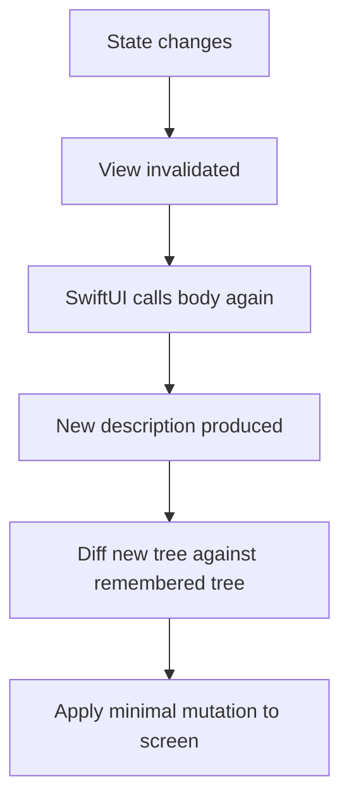
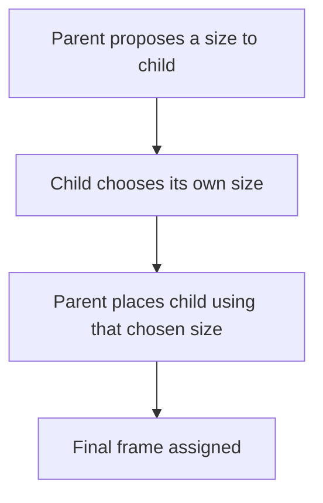

# Lecture 01 — SwiftUI Is a Function from State to View, with Diffing

> Phase II opens here. You have written six weeks of Swift on Linux. Now you open Xcode, and you meet the framework that will own the next five weeks. The single idea in this lecture is the one that makes SwiftUI tractable: **a view is a value that describes UI as a function of state, and the framework re-invokes that function and diffs the result whenever the state changes.** Everything else — modifiers, stacks, previews, the `Layout` protocol — hangs off that sentence.

---

## 1. Why this is a hinge week

For six weeks the lesson was the *language*. You learned optionals, value types, protocols, generics, `async`/`await`, actors, and you built a Vapor service with shared `Codable` types. The language is no longer the thing you are learning. You already write idiomatic Swift.

This week the lesson is a *framework with an opinion*. SwiftUI is not a thin wrapper over UIKit. It is a different model of what a UI *is*. In UIKit (and in the AppKit/Win32/Android-View lineage), a view is a long-lived mutable object that you imperatively mutate: you hold a reference to a `UILabel`, and when the data changes you reach over and set `label.text = "new"`. The view *is* the source of truth for what is on screen, and you are responsible for keeping it in sync with your model. The entire class of "I forgot to update the label when the model changed" bugs lives here.

SwiftUI deletes that class of bug by deleting the premise. In SwiftUI you never hold a reference to a label and mutate it. You write a function — `body` — that *returns a description* of what the UI should look like for the current state. When the state changes, SwiftUI calls your function again, gets a new description, compares it to the old description, and mutates the real on-screen views *for* you, touching only what actually changed. You describe the destination; the framework computes the route.

If you have written React, this is reconciliation and you already have the mental model — `body` is `render()`, the view tree is the virtual DOM, and the diff is the reconciler. We will make that analogy precise and then point out where it breaks down (SwiftUI's identity and dependency tracking are more structural than React's). If you have not written React, do not worry; we build the model from first principles.

---

## 2. The Xcode 16 tour — the parts that matter

Open Xcode 16. File ▸ New ▸ Project ▸ iOS ▸ App. Name it `HelloNotes`, set the interface to **SwiftUI**, the language to **Swift**, and leave "Storage" as **None** (no SwiftData, no Core Data — that is Week 10). You get a project with two source files that matter: `HelloNotesApp.swift` and `ContentView.swift`.

Before we read those, learn the window. A senior engineer navigates Xcode without looking; you will too by Friday.

- **Project navigator** (`⌘1`, leftmost icon). The file tree. The blue top node is the *project*; under it are *targets*. Click the blue node to open the project editor where schemes, targets, and build settings live.
- **The editor** (centre). Where you write code. The jump bar across the top lets you navigate to any symbol in the file.
- **The Canvas** (right of the editor, toggle with `⌥⌘↵`). A live preview driven by your `#Preview` blocks. It compiles your view and renders it without launching the simulator. It is a tool, not the source of truth — when the Canvas and the running app disagree, the running app wins.
- **The inspectors** (`⌘⌥0` to toggle the rightmost panel). File inspector, History inspector, and — in the Canvas — the Attributes inspector. You will rarely touch these in this course; we drive everything from code.
- **The scheme selector and run destination** (top-left of the toolbar). The scheme on the left, the destination (which simulator or device) on the right. `⌘R` builds and runs to the selected destination. `⌘B` builds without running. `⌘.` stops.
- **The Debug area** (`⌘⇧Y`). The console and the variables view. Your `print()` output lands here.

That is the whole instrument. Five panes and a run button. Resist the urge to explore every menu; you will discover the rest as you need it.

A few keystrokes are worth committing to muscle memory in your first hour, because they are the ones you will hit hundreds of times a day: `⌘R` (build and run), `⌘.` (stop), `⌘B` (build only), `⌘⇧K` (clean build folder — your first move when a build behaves impossibly), `⌥⌘↵` (toggle the Canvas), `⌘⇧O` (Open Quickly — jump to any file or symbol by typing part of its name), `⌃⌘E` (rename a symbol everywhere), and `⌃I` (re-indent the selection). The two debugging shortcuts you will lean on: `⌘⇧Y` toggles the Debug area, and `⌘⇧A` toggles the simulator's appearance between light and dark while the app runs — which is how you will check half of the Phase II acceptance matrix without rebuilding. Learn these eight and you stop reaching for the menu bar, which is the difference between fighting the IDE and forgetting it is there.

### Schemes vs targets vs build configurations

These three words get conflated constantly. Get them straight now because Week 15 (device deployment) and Week 22 (CI) depend on it.

- A **target** is a thing that gets *built*: an app, a unit-test bundle, a UI-test bundle, an app extension, a framework. A fresh SwiftUI app project has one app target (`HelloNotes`) and usually two test targets. Each target has its own **build settings** and its own list of source files (its "membership").
- A **build configuration** is a *named set of build settings*. Every new project ships two: **Debug** and **Release**. Debug builds are unoptimised, include debug symbols, and define the `DEBUG` compilation condition (`#if DEBUG`). Release builds turn on the optimiser (`-O`), strip the `DEBUG` flag, and are what you ship. You can add more (`Beta`, `Staging`) later.
- A **scheme** ties it together: it says "for the **Run** action, build *these* targets with the **Debug** configuration; for the **Archive** action, build with **Release**." The scheme selector in the toolbar picks which scheme is active. When you press `⌘R`, the scheme's Run action decides what gets built, how, and where it launches.

The mental model: **target = *what*, configuration = *how*, scheme = *which what + how, for which action*.** When someone says "the CI builds the Release config of the app target via the `HelloNotes` scheme's Archive action," you now parse that sentence without effort.

Why care this week, when there is one target and you never leave Debug? Because the vocabulary is load-bearing later and cheap to learn now. Week 15 deploys to a physical device and you will edit the Run scheme's destination and signing. Week 18 adds a Notification Service Extension — a *second* target with its own membership and settings. Week 22 stands up CI that invokes `xcodebuild -scheme HelloNotes -configuration Release archive` and the words in that command are exactly the three you just learned. The `#if DEBUG` compilation condition you will use for debug-only overlays is *defined by the Debug configuration and stripped by Release* — so a "DEBUG" watermark you add in week 7's homework simply vanishes in a Release build, with no code change, because the configuration controls the flag. Get the three words straight here and none of that is mysterious when it arrives.

To see the configurations, select the blue project node, pick the project (not a target) in the sidebar, and open the **Info** tab — `Configurations` lists `Debug` and `Release`. To see the scheme, Product ▸ Scheme ▸ Edit Scheme (`⌘<`); the Run / Test / Profile / Analyze / Archive actions are down the left side, each with its own configuration dropdown.

---

## 3. The app entry point: `App`, `Scene`, `WindowGroup`

Open `HelloNotesApp.swift`. Xcode generated this:

```swift
import SwiftUI

@main
struct HelloNotesApp: App {
    var body: some Scene {
        WindowGroup {
            ContentView()
        }
    }
}
```

Four pieces of vocabulary, all load-bearing.

- **`@main`** marks the program's entry point. Exactly one `@main` per executable. The `App` protocol supplies a synthesised `static func main()` that the runtime calls; you never write `main()` yourself. (Compare Week 1, where your CLI's top-level code *was* `main`. An app is different: the framework owns the run loop.)
- **`App`** is a protocol. Its sole requirement is `var body: some Scene { get }`. An `App` is itself a value (a `struct`), described by its `body`, exactly like a `View` — the pattern is fractal. The `App` value is created once at launch and is *not* where you put mutable app state casually; that is next week's lesson.
- **`Scene`** is a protocol describing a unit of UI that the system manages: its lifecycle, its place in the window/space model, its state restoration. On iPhone you usually have one scene. On iPad and Mac a user can open *several* windows of your app, each backed by a scene instance.
- **`WindowGroup`** is the concrete `Scene` you will use most. It declares "my app presents a group of interchangeable windows, each showing this content." On iPhone it is one full-screen window. On iPad/Mac it lets the user spawn multiple windows (`⌘N` on Mac) that each get their own copy of the content's state.

Read the nesting: an `App`'s `body` returns a `Scene`; a `WindowGroup`'s trailing closure returns a `View`. The closure `{ ContentView() }` is the *root view* of each window. Swap `ContentView()` for any view and that becomes your app's screen. That is the entire bridge from "app" to "view."

You will not touch this file much in Week 7. We name every piece so that when Week 9 adds `onOpenURL` for deep links and Week 12 restores state with `SceneStorage`, you already know where those hooks attach: to the `Scene`, here.

---

## 4. The `View` protocol — the contract

Open `ContentView.swift`. Strip Xcode's boilerplate down to the essence:

```swift
import SwiftUI

struct ContentView: View {
    var body: some View {
        Text("Hello, Notes")
    }
}

#Preview {
    ContentView()
}
```

`ContentView` is a `struct` conforming to `View`. Here is the protocol, paraphrased from the SwiftUI headers:

```swift
public protocol View {
    associatedtype Body: View
    @ViewBuilder var body: Self.Body { get }
}
```

Three things to extract, each worth a beat.

**`body` is a computed property, not a stored one.** Notice `var body: some View {` with braces, not `let body = ...`. It is recomputed on demand. SwiftUI calls `body` whenever it needs a fresh description of your view — which is potentially *very often*, on every state change that your view depends on. The corollary, which trips up everyone once: **never do expensive or side-effecting work in `body`.** No network calls, no disk reads, no allocating a date formatter, no logging-with-side-effects. `body` must be a *pure function of the view's stored properties and its dependencies*. Treat it like a `render` function: fast, deterministic, free of surprises.

**`body`'s type is `some View`, an opaque type (Week 2).** The `associatedtype Body` is the *concrete* type your `body` returns. For `Text("Hello, Notes")` that type is literally `Text`. For a `VStack` of three things it is a deeply nested generic like `VStack<TupleView<(Text, Image, Button<Text>)>>` — a type no human wants to spell. `some View` says "there is one specific concrete type here; I am not telling you its name, but it is fixed at compile time." This is *not* `any View` (an existential box). The distinction matters for performance: with `some View` the compiler knows the exact, static shape of your view tree, which is precisely the information SwiftUI's diffing engine uses to be fast. Reach for `AnyView` (the type-erased existential) only when you genuinely cannot express the type statically — and know that each `AnyView` is an opacity wall the diffing engine cannot see through.

**`body` is annotated `@ViewBuilder`.** That is why you can write several views in a row inside `body` without commas, `return`, or array syntax. We dissect `@ViewBuilder` in Lecture 02; for now, know that it is a *result builder* that collects the statements in your `body` into a single composed view value.

### Why a `struct`, not a `class`?

Views are `struct`s — value types (Week 1). This is deliberate and it is the keystone of the whole model. Because a view is a cheap, copyable *value* with no identity of its own, SwiftUI can:

1. Create thousands of them per frame without heap-allocation pressure.
2. Hold the *previous* value and the *new* value side by side and compare them — the diff.
3. Treat `body`'s output as data, not as a live object graph you mutate.

A view is a *recipe*, not a *cake*. `ContentView()` does not put pixels on screen; it produces a small value that *describes* pixels. SwiftUI decides when, whether, and how to turn that description into actual rendered content. Internalise this and the next idea is obvious.

---

## 5. The central claim: view is a function of state

Here is the sentence the whole framework is built on:

> **Your UI is the output of a pure function whose input is your state. When the state changes, the function runs again, and SwiftUI applies the difference between the old output and the new output to the screen.**

Concretely, suppose (jumping ahead one week, just to motivate) you had a counter:

```swift
struct CounterView: View {
    @State private var count = 0

    var body: some View {
        VStack(spacing: 16) {
            Text("Count: \(count)")
                .font(.largeTitle)
            Button("Increment") {
                count += 1
            }
        }
        .padding()
    }
}
```

The flow, step by step:

1. SwiftUI calls `body`. It gets back a description: a `VStack` containing a `Text` reading "Count: 0" and a `Button`.
2. SwiftUI renders that description to the screen and *remembers* it.
3. The user taps the button. The closure runs `count += 1`. Because `count` is `@State`, SwiftUI knows this view *depends on* `count`, so it marks the view **invalid**.
4. On the next run loop, SwiftUI calls `body` *again*. It gets a new description: same `VStack`, same `Button`, but the `Text` now reads "Count: 1".
5. SwiftUI **diffs** the new description against the remembered one. The `VStack` is structurally identical. The `Button` is identical. Only the `Text`'s string changed. So SwiftUI mutates *exactly one thing*: the label's text. It does not rebuild the stack, does not recreate the button, does not relayout anything that did not move.

That is the entire loop: **state changes → invalidate → recompute `body` → diff → minimal mutation.** You never wrote "when count changes, update the label." You wrote "the label *is* `Count: \(count)`," and the framework derived the update.


*The function-of-state loop: every state change runs this same five-step cycle.*

This week we are deliberately *not* learning `@State` (that is Week 8). Every "Hello, Notes" note is a hard-coded array literal. We are learning to *describe* a UI before we learn to *drive* it. But you must understand the loop now, because it explains why `body` must be pure, why views are values, and why modifier order matters.

### How does SwiftUI know what `body` depends on?

This is the part React does not do as cleanly. In React you call `useState` and manually list dependencies in `useEffect`. In SwiftUI, the *property wrappers* (`@State`, `@Observable` via `@Environment`/`@Bindable`, next week) install a dependency edge automatically: reading `count` inside `body` registers "this view reads `count`," and writing `count` invalidates exactly the views that read it. The dependency graph is built by *observation*, not by you declaring it. That is why state management is its own week — getting the ownership right is the whole game.

### What does "diff" actually compare?

It compares the *structure* of the view tree and the *values* of each node, guided by **identity**. Two nodes are "the same node, possibly changed" if they have the same structural position and the same identity; they are "a different node" if identity differs. For now your trees are static, so the structure is fixed across runs and the diff reduces to "which leaf values changed." When you reach `ForEach` (Week 8) you will give rows explicit identity (`id:`) so SwiftUI can tell an *inserted* row from a *changed* row — the same problem React's `key` solves.

---

## 6. The layout system, conceptually: propose, choose, place

A view tree describes *what* to show. The **layout system** decides *where* and *how big*. SwiftUI's layout is a three-step negotiation that runs top-down then bottom-up, and it is unlike the constraint-solving of Auto Layout (UIKit). Learn the three steps; they explain 90% of "why is my view the wrong size" questions.

1. **The parent proposes a size.** The root gets the safe area of the window. Each container proposes a size to each child. A proposal is a `ProposedViewSize` — a width and height, *either of which may be `nil`* ("I have no opinion on this dimension; you decide") or `.infinity` ("take all you want").
2. **The child chooses its own size.** Given the proposal, the child returns the size it *wants*. This is the crucial inversion: **the child is sovereign over its own size.** A `Text` proposed an infinite width chooses only as much width as its string needs (then wraps). A `Color` proposed any size greedily takes all of it. An `Image` chooses its intrinsic pixel size unless told otherwise. The parent *proposes*; the child *disposes*.
3. **The parent places the child.** Knowing the child's chosen size, the parent positions it within its own bounds (centred, leading, top, wherever its alignment says) and assigns it a final frame.

That is the whole protocol. In Lecture 02 we will see the literal `Layout` protocol — `sizeThatFits(proposal:subviews:cache:)` and `placeSubviews(in:proposal:subviews:cache:)` — which are steps 2 and 3 made into Swift methods you can implement yourself. For now, the words **propose, choose, place** are enough to reason about every built-in container.


*The three-step negotiation, run for every parent-child pair in the view tree.*

Worked example. Why does this `Text` not fill the screen?

```swift
Text("Short")
    .background(.yellow)
```

The window proposes the full safe area to `ContentView`'s body. `Text` *chooses* only the size its string needs. `.background(.yellow)` paints behind that chosen size — so you get a small yellow rectangle hugging the word, not a yellow screen. The `Text` was sovereign over its size; the background merely matched it. If you want the yellow to fill the screen, you must make a view that *chooses* to be big:

```swift
Text("Short")
    .frame(maxWidth: .infinity, maxHeight: .infinity)
    .background(.yellow)
```

`.frame(maxWidth: .infinity, maxHeight: .infinity)` inserts a view that, when proposed a big size, *chooses* the big size — and centres the `Text` inside it. Now the background fills. We did not "stretch the text"; we wrapped it in a view that wants to be large. Propose, choose, place.

---

## 7. The basic primitives you will use this week

These are the leaves and containers of "Hello, Notes." We introduce them here and drill them in the exercises.

- **`Text`** — a string with type. Renders, wraps, truncates, and scales. Takes a `LocalizedStringKey` by default, which is why `Text("Hello")` is automatically localisable. Style it with `.font`, `.foregroundStyle`, `.bold()`, `.lineLimit`, `.multilineTextAlignment`.
- **`Image`** — `Image(systemName: "note.text")` pulls from **SF Symbols**, Apple's 6,000-symbol icon font that scales with text and adapts to colour and weight. `Image("photo")` pulls a named asset from the catalog. Symbols are vector and Dynamic-Type-aware; prefer them.
- **`Label`** — `Label("Notes", systemImage: "note.text")` is a `Text` + `Image` paired with the system's conventions for spacing and accessibility. Use it instead of hand-stacking an icon and a title.
- **`Button`** — `Button("Save") { save() }` or `Button(action:label:)`. The closure is the action; the label is any view. This week our buttons do nothing meaningful (no state yet), but we wire the `print()` so you see the tap register.
- **`Spacer`** — a flexible, greedy view that expands to push siblings apart. In an `HStack`, `Spacer()` shoves things to opposite ends. It *chooses* to be as large as proposed.
- **`Divider`** — a hairline separator that adapts to light/dark automatically.
- **`VStack` / `HStack` / `ZStack`** — the stack containers. Vertical, horizontal, and depth (back-to-front). Each takes `alignment:` and `spacing:` and a `@ViewBuilder` closure of children. They are the skeleton of every layout you will build for months.

A first non-trivial composition — a note row — to ground all of the above:

```swift
struct NoteRow: View {
    let title: String
    let body: String

    var body: some View {
        HStack(alignment: .top, spacing: 12) {
            Image(systemName: "note.text")
                .font(.title2)
                .foregroundStyle(.tint)
            VStack(alignment: .leading, spacing: 4) {
                Text(title)
                    .font(.headline)
                Text(body)
                    .font(.subheadline)
                    .foregroundStyle(.secondary)
                    .lineLimit(2)
            }
            Spacer()
        }
        .padding(.vertical, 8)
    }
}
```

Read it as a tree: an `HStack` whose children are an icon, a `VStack` of two `Text`s, and a `Spacer` that pushes the content to the leading edge. Every container is a `@ViewBuilder` closure. Every leaf chooses its own size. The `Spacer` is what makes the row left-align and fill the width. This is exactly the shape "Hello, Notes" needs, and it is the shape the exercises build.

---

## 8. Semantic colour and the colour scheme

We close Lecture 01 with the one rendering rule that makes light/dark mode *automatic* rather than a feature you build twice: **use semantic colours, not literal ones.**

A literal colour is `Color(red: 0.1, green: 0.1, blue: 0.1)` or `.black`. It is the same in light and dark mode, which means in dark mode your "black" text on a now-dark background vanishes. A **semantic** colour describes a *role*, and the system supplies the right RGB for the current appearance:

- `Color.primary` — the default text colour. Near-black in light mode, near-white in dark mode. Always legible against the system background.
- `Color.secondary` — de-emphasised text. A grey that flips appropriately.
- `Color(.systemBackground)`, `Color(.secondarySystemBackground)` — the system's background fills.
- `.tint` / your app's **accent colour** — the interactive-element colour, set in the asset catalog.

If every colour in your view is semantic — or comes from an asset-catalog colour set with light and dark variants — then dark mode requires *zero* extra code. You change the device appearance and the system re-resolves every semantic colour. To verify, read the current appearance:

```swift
struct AppearanceBadge: View {
    @Environment(\.colorScheme) private var colorScheme

    var body: some View {
        Text(colorScheme == .dark ? "Dark" : "Light")
            .padding(8)
            .background(Color(.secondarySystemBackground), in: .capsule)
    }
}
```

`@Environment(\.colorScheme)` reads the *current* appearance from the environment (the environment is a Week 8 topic in full; here we just read one value). When the user toggles dark mode, the environment value changes, the view that read it is invalidated, `body` re-runs, and the badge updates — the function-of-state loop, applied to appearance. You will configure an asset-catalog colour set with light/dark variants in Exercise 02 and watch it adapt with no branching code at all.

A subtlety worth stating now, because it saves a category of mistake: reading the colour scheme is legitimate when you want to *display* or *report* the appearance, or to make a genuinely appearance-specific decision a semantic colour cannot express (choosing a different *image asset*, say, or a shadow that should only show in light mode). It is *not* legitimate as a way to hand-pick text or background colours that the system already adapts for you. If you find yourself writing `colorScheme == .dark ? Color(...) : Color(...)` to choose a fill, you have re-implemented, by hand and worse, the thing the asset catalog does for free. Exercise 02 drills exactly this anti-pattern so you recognise it in code review.

---

## 9. Dynamic Type — text the user, not you, sizes

The other half of "renders correctly in all the combinations" is **Dynamic Type**: the iOS-wide setting that lets a user scale text from extra-small up through five *accessibility* sizes. A meaningful fraction of real users run text well above the default — for low vision, for comfort, for a small phone held at arm's length. Your app *will* be opened at `.accessibility5`, the largest size, and at that size the system text styles roughly triple. A layout that looks perfect at the default and clips at `.accessibility5` is a defect, not a polish item.

The good news: if you size text with the **semantic text styles** rather than fixed point sizes, Dynamic Type works automatically. `Text("Title").font(.headline)` scales with the user's setting; `Text("Title").font(.system(size: 17))` does *not* — it is frozen at 17pt forever. So the first rule is: **use `.font(.headline)`, `.font(.body)`, `.font(.title2)` — the named styles — not raw point sizes**, unless you have a specific reason (an icon glyph, a fixed-aspect badge), and even then you scale it deliberately.

For your *own* metrics — an icon size, the gap between two elements, a thumbnail edge — that should grow with the text, use `@ScaledMetric`:

```swift
struct AvatarRow: View {
    @ScaledMetric(relativeTo: .headline) private var avatarSize: CGFloat = 40
    let name: String

    var body: some View {
        HStack(spacing: 12) {
            Circle()
                .fill(.tint)
                .frame(width: avatarSize, height: avatarSize)
            Text(name)
                .font(.headline)
        }
    }
}
```

`@ScaledMetric(relativeTo: .headline)` says "this 40pt value should scale by the same factor the `.headline` text style scales by." At the default size the circle is 40pt; at `.accessibility5` it grows proportionally, so a 40pt avatar next to a now-50pt headline still looks balanced instead of like a postage stamp beside a billboard. Without `@ScaledMetric`, the text grows and the avatar does not, and the row looks broken.

The third rule is **never set `.lineLimit(1)` on text that must survive the largest size** unless you are certain it is short and fixed (a single-digit count, an abbreviation). A title with `.lineLimit(1)` truncates to an ellipsis at `.accessibility5`; let it wrap instead. And when an `HStack` of [icon | title | badge] no longer fits at the huge size, the right move is to *reflow* — drop the badge below the text, or switch the row to a column — not to clip. You read `@Environment(\.dynamicTypeSize)` and branch on `.isAccessibilitySize`, or wrap the layout in `ViewThatFits`. That reflow is the heart of this week's challenge and the hardest acceptance criterion in the mini-project. We introduce the tools here so the words are familiar when you reach for them.

---

## 10. The `#Preview` macro — your fast oracle for the matrix

You have seen `#Preview { ContentView() }` in every snippet. It is worth understanding what it *is*, because it is the tool that turns "renders in all combinations" into a five-second check instead of a five-minute simulator boot per combination.

`#Preview` is a Swift **macro** (Xcode 15+) that registers a preview with the Canvas. The Canvas compiles your view in-process and renders it live, re-rendering as you type. You can declare *several* previews per file, each named, each with different environment modifiers — and the Canvas shows them stacked. That is how you check the device/appearance/text-size matrix without leaving the editor:

```swift
#Preview("iPhone SE · Light") {
    ContentView()
}

#Preview("iPad Pro 13-inch · Dark") {
    ContentView()
        .preferredColorScheme(.dark)
}

#Preview("Accessibility 5") {
    ContentView()
        .environment(\.dynamicTypeSize, .accessibility5)
}
```

Three previews, three of the combinations you must satisfy, all visible at once. `.preferredColorScheme(.dark)` forces a preview's appearance without touching the device setting; `.environment(\.dynamicTypeSize, .accessibility5)` injects the largest text size into just that preview; and the Canvas device picker (top of the Canvas) lets you point any preview at a specific simulator like "iPhone SE (3rd generation)" or "iPad Pro 13-inch (M4)" without changing the run destination.

Two cautions a senior engineer states out loud. First, **the Canvas is a tool, not the truth.** It runs a slightly different code path than the real app and occasionally renders something the simulator renders differently — most often around navigation, gestures, and async work. When the Canvas and the running app disagree, *the running app wins*, every time. Use the Canvas to iterate fast, then confirm on the simulator before you call a screen done. Second, **previews can crash or fail to compile while the app still builds**, usually because the preview supplies data the view does not get in production. A red Canvas is a signal to fix the preview, not to ignore it. Treat a broken preview as a broken test.

Internalise the workflow: pin three or four named previews covering the hard combinations, iterate in the Canvas until they are all green, then spot-check the two extreme devices in the running simulator. That loop is how you make the Phase II marker — *iPhone SE and iPad Pro 13-inch, light and dark, at `.accessibility5`, no clipping, no truncation* — an ordinary, fast part of building every screen.

---

## 11. What to carry into Lecture 02

- A view is a **value** that **describes** UI; it is not a live mutable object.
- `body` is a **pure, computed function** of the view's state and dependencies; SwiftUI calls it whenever those change.
- The loop is **state change → invalidate → recompute `body` → diff → minimal mutation.**
- Layout is **propose (parent) → choose (child) → place (parent).** The child is sovereign over its own size.
- `App` ▸ `Scene` (`WindowGroup`) ▸ root `View` is the launch path.
- Semantic colours make light/dark mode free.
- Semantic text styles plus `@ScaledMetric` make Dynamic Type work; `#Preview` makes checking the whole device/appearance/text-size matrix fast.

Lecture 02 opens the lid on *how* `body` is built and invoked: `@ViewBuilder` (the result builder that lets `body` read like a list), `EquatableView` (how you tell the diff engine to short-circuit an expensive subtree), the literal `Layout` protocol, and the **modifier-order rule** — why `.padding().background()` and `.background().padding()` render two different things. That rule is the most common source of "why does my layout look wrong" in your first month of SwiftUI, and once you see *why*, you will never get it wrong again.
