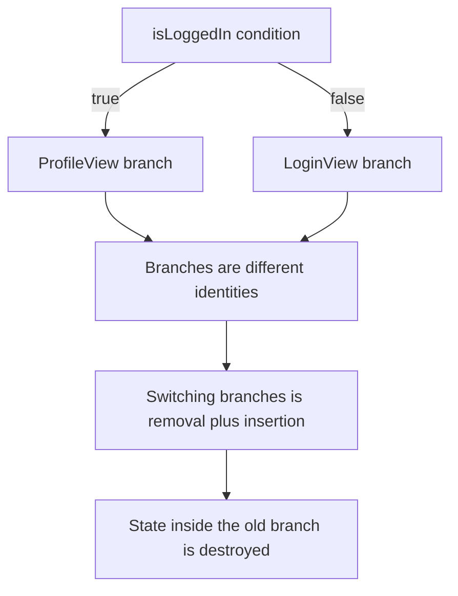
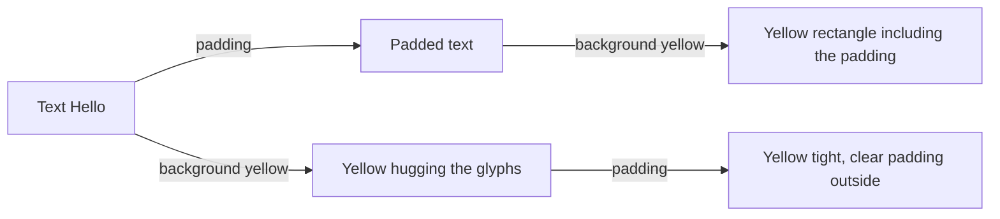

# Lecture 02 — How `body` Is Invoked: `@ViewBuilder`, `EquatableView`, `Layout`, and the Modifier-Order Rule

> Lecture 01 gave you the loop: state changes, SwiftUI re-invokes `body`, diffs the result, mutates the minimum. This lecture opens the machinery. *How* does `body` turn a list of statements into one composed view? That is `@ViewBuilder`, a result builder. How do you tell the diff engine "this subtree is unchanged, skip it"? That is `EquatableView`. How does the parent-proposes/child-chooses dance become real Swift? That is the `Layout` protocol. And why does `.padding().background()` differ from `.background().padding()`? That is the modifier-order rule — the single most common SwiftUI mistake in your first month, and the one this lecture exists to eliminate.

---

## 1. `@ViewBuilder` — the result builder behind `body`

You have already written code that should be illegal in ordinary Swift:

```swift
var body: some View {
    Text("Title")
    Text("Subtitle")
    Image(systemName: "star")
}
```

Three expressions in a row, no commas, no `return`, no array. In any normal function this is a syntax salad — a function returns *one* value. Yet `body` accepts it and returns a single `some View`. The trick is the `@ViewBuilder` attribute on `body` (it is part of the `View` protocol's requirement, so you inherit it for free).

`@ViewBuilder` is a **result builder** (the same Swift language feature — formerly "function builders" — that powers `RegexBuilder`, SwiftData's `#Predicate`, and Swift Charts). A result builder rewrites the statements in an annotated closure into calls on a builder type. The compiler transforms the three-statement block above into roughly:

```swift
var body: some View {
    ViewBuilder.buildBlock(
        Text("Title"),
        Text("Subtitle"),
        Image(systemName: "star")
    )
}
```

`buildBlock` for two-to-ten children returns a `TupleView` — a value that bundles a fixed-arity tuple of child views into one `View`. So the *actual* static type of that `body` is `TupleView<(Text, Text, Image)>`. You never write `TupleView` by hand; the builder synthesises it. This is also why `body`'s type is unspellable in practice and why `some View` exists: the generic types nest fast.

### What the builder does with control flow

The interesting methods are the ones that handle `if`, `if`/`else`, and `switch` — because those produce *different view types* on different branches, and a result type must be one type. The builder solves this with two synthesised methods.

`buildOptional` handles a bare `if` (no `else`):

```swift
var body: some View {
    VStack {
        Text("Always shown")
        if showDetail {
            Text("Sometimes shown")
        }
    }
}
```

The `if showDetail { ... }` block compiles to `ViewBuilder.buildOptional(showDetail ? Text("Sometimes shown") : nil)`, whose result type is `Optional<Text>`. When `showDetail` is `false`, the optional is `nil` and SwiftUI renders nothing for that slot — but, crucially, the *slot still exists in the tree*. The diff engine sees "this position currently holds nothing" and can later see "now it holds a `Text`," and it animates the insertion correctly.

`buildEither(first:)` / `buildEither(second:)` handle `if`/`else` and `switch`:

```swift
var body: some View {
    if isLoggedIn {
        ProfileView()
    } else {
        LoginView()
    }
}
```

This compiles to a `_ConditionalContent<ProfileView, LoginView>` — a type that can hold *either* branch and carries the static knowledge of both possible types. The diff engine treats the two branches as **different identities**: switching from the `if` branch to the `else` branch is a *removal and an insertion*, not a mutation. That has a real consequence you must internalise now: **any `@State` (next week) inside `ProfileView` is destroyed when you flip to `LoginView`, and a fresh one is created if you flip back.** Conditional content does not preserve the state of the branch you left. When that surprises you in Week 8, this paragraph is the reason.


*buildEither gives if and else branches distinct identity, so flipping between them resets branch-local state.*

### The arity limit and `Group`

`buildBlock` is overloaded for up to ten children. Write eleven views in a row in one block and you get a "could not type-check in reasonable time" error — the historical "too many statements" SwiftUI failure. The fix is to *group*: nest them in a `VStack`, an `HStack`, a `Group` (a layout-neutral container), or — better at scale — extract a subview `struct`. Extracting subviews is not just a workaround for the arity limit; it is the right move for diffing (smaller, independently-diffable units) and for readability. A `body` longer than your screen is a code smell.

```swift
var body: some View {
    Group {
        Text("1"); Text("2"); Text("3"); Text("4"); Text("5")
        Text("6"); Text("7"); Text("8"); Text("9"); Text("10")
        Text("11")   // without Group, this 11th sibling would fail to type-check
    }
}
```

---

## 2. `EquatableView` — telling the diff engine to short-circuit

SwiftUI's default diffing is fast, but it is not free: when a parent re-renders, it re-invokes `body` on its children and compares the *results*. For most views that is cheap. For a view whose `body` is genuinely expensive to compute — a complex chart, a large formatted document — you may want to tell SwiftUI: *"skip recomputing me entirely unless my inputs actually changed."* That is what `EquatableView` and the `.equatable()` modifier do.

The mechanism: if a view conforms to `Equatable`, SwiftUI can compare the *old view value* to the *new view value* with your `==` *before* it bothers to call `body`. If they are equal, it skips the body computation and the subtree diff outright.

```swift
struct ExpensiveChart: View, Equatable {
    let dataPoints: [Double]
    let title: String

    static func == (lhs: ExpensiveChart, rhs: ExpensiveChart) -> Bool {
        // Cheap, decisive equality: if the inputs match, the output matches,
        // so SwiftUI may skip recomputing `body`.
        lhs.title == rhs.title && lhs.dataPoints == rhs.dataPoints
    }

    var body: some View {
        // Imagine this is genuinely expensive to compute.
        Canvas { context, size in
            for (i, value) in dataPoints.enumerated() {
                let x = size.width * Double(i) / Double(max(dataPoints.count - 1, 1))
                let y = size.height * (1 - value)
                context.fill(
                    Path(ellipseIn: CGRect(x: x - 2, y: y - 2, width: 4, height: 4)),
                    with: .color(.blue)
                )
            }
        }
    }
}
```

Use it at the call site with `.equatable()`:

```swift
ExpensiveChart(dataPoints: points, title: "Throughput")
    .equatable()
```

Now, when the parent re-renders for some unrelated reason, SwiftUI calls `ExpensiveChart.==` on the old and new values; if `points` and `title` are unchanged, the chart's `body` is never recomputed.

Three caveats a senior engineer states out loud before reaching for this:

1. **It is an optimisation, not a default.** Do not slap `Equatable` on every view. Most views are cheap; the `==` call itself has a cost, and a sloppy `==` (e.g. comparing a giant array element-by-element on every frame) can be *slower* than just recomputing a cheap `body`. Measure with Instruments (Week 15) before you reach for it.
2. **Your `==` must be honest.** If `==` returns `true` while the inputs that affect `body` actually differ, SwiftUI shows stale UI — a genuine correctness bug, not just a perf miss. Only compare the fields `body` reads.
3. **Closures break it.** A view with a stored closure (e.g. a `Button` action) usually cannot be `Equatable` meaningfully, because two closures are never `==`. Structure expensive, equatable leaves to be data-only.

This is a Week 7 *concept*, not a Week 7 *requirement*: "Hello, Notes" is not expensive enough to need it. You learn it now so that when you debug a re-render storm in Week 8, `.equatable()` is a tool you already understand rather than a Stack Overflow incantation.

---

## 3. The `Layout` protocol — propose/choose/place, made literal

Lecture 01 gave you the three words: the parent **proposes** a size, the child **chooses** its size, the parent **places** the child. The `Layout` protocol is that dance expressed as two methods you can implement to build your *own* container. You will not ship a custom layout in "Hello, Notes," but writing one tiny `Layout` is the fastest way to truly understand `VStack` and `HStack`, so we walk through one.

The protocol's two core requirements:

```swift
public protocol Layout: Animatable {
    func sizeThatFits(
        proposal: ProposedViewSize,
        subviews: Subviews,
        cache: inout Cache
    ) -> CGSize

    func placeSubviews(
        in bounds: CGRect,
        proposal: ProposedViewSize,
        subviews: Subviews,
        cache: inout Cache
    )
}
```

- `sizeThatFits` is **step 2 + step 1 inverted**: given the proposal *my* parent handed me, and given my subviews (each of which I can ask for *its* size via `subviews[i].sizeThatFits(_:)`), what size do *I* want to be?
- `placeSubviews` is **step 3**: given the final bounds I was actually granted, where do I put each subview? I call `subviews[i].place(at:anchor:proposal:)` for each.

Here is a complete, correct, minimal `Layout`: an equal-width horizontal row that gives each subview an identical slice of the available width.

```swift
import SwiftUI

/// Lays subviews out left-to-right, each getting exactly 1/N of the width.
struct EqualWidthHStack: Layout {
    var spacing: CGFloat = 8

    func sizeThatFits(
        proposal: ProposedViewSize,
        subviews: Subviews,
        cache: inout Void
    ) -> CGSize {
        guard !subviews.isEmpty else { return .zero }
        let totalSpacing = spacing * CGFloat(subviews.count - 1)
        // Tallest subview at its ideal height decides our height.
        let maxHeight = subviews
            .map { $0.sizeThatFits(.unspecified).height }
            .max() ?? 0
        // We claim the full proposed width, or fall back to subviews' ideal widths.
        let width = proposal.width ?? subviews
            .map { $0.sizeThatFits(.unspecified).width }
            .reduce(0, +) + totalSpacing
        return CGSize(width: width, height: maxHeight)
    }

    func placeSubviews(
        in bounds: CGRect,
        proposal: ProposedViewSize,
        subviews: Subviews,
        cache: inout Void
    ) {
        guard !subviews.isEmpty else { return }
        let totalSpacing = spacing * CGFloat(subviews.count - 1)
        let cellWidth = (bounds.width - totalSpacing) / CGFloat(subviews.count)
        var x = bounds.minX
        for subview in subviews {
            subview.place(
                at: CGPoint(x: x, y: bounds.midY),
                anchor: .leading,
                proposal: ProposedViewSize(width: cellWidth, height: bounds.height)
            )
            x += cellWidth + spacing
        }
    }
}
```

Use it exactly like a built-in stack — it *is* one:

```swift
EqualWidthHStack(spacing: 12) {
    Button("Cancel") { print("cancel") }
        .frame(maxWidth: .infinity)
        .background(.quaternary, in: .rect(cornerRadius: 8))
    Button("Save") { print("save") }
        .frame(maxWidth: .infinity)
        .background(.tint, in: .rect(cornerRadius: 8))
        .foregroundStyle(.white)
}
.padding()
```

Read what happened. In `placeSubviews`, we computed `cellWidth` and *proposed* that exact width to each subview (`ProposedViewSize(width: cellWidth, ...)`). The buttons, being sovereign, chose to be that wide because we asked `.frame(maxWidth: .infinity)` on them — so they fill their cell. Without that frame modifier, each button would still *choose* its hug-the-text width and sit left-aligned in an over-wide cell, because **proposing a size does not force a child to take it.** That is the propose/choose distinction made painfully concrete, and it is the single most useful thing writing one `Layout` teaches you.

`Subviews` and `Subview` are SwiftUI's proxies — you do not get the child `View` values, you get handles you can size and place. The `cache` parameter (here `Void`) is an optional scratchpad to avoid recomputing measurements across the two methods on large layouts; for small ones, `Void` is correct and free.

The stretch goal this week — a wrapping "flow layout" for tags — is the next step up: same two methods, but `placeSubviews` wraps to a new row when the next subview would overflow `bounds.width`. Write it and you will understand `Layout` to the bone.

---

## 4. The modifier-order rule — the one you must never get wrong

Now the headline. A **modifier** is a method on `View` that returns a *new* view wrapping the old one. `.padding()`, `.background()`, `.frame()`, `.foregroundStyle()`, `.clipShape()` — all of them take a view and return *a different view*. They do not mutate; they wrap. That means:

> **Modifier order is composition order. `view.a().b()` produces `b(a(view))` — `b` wraps the result of `a`. Reordering modifiers changes which view is inside which, and therefore changes what is rendered.**

The canonical demonstration. These two are *not* the same:

```swift
// A: pad first, then paint the background behind the padded view.
Text("Hello")
    .padding()
    .background(.yellow)

// B: paint the background behind the text, then pad outside the yellow.
Text("Hello")
    .background(.yellow)
    .padding()
```

In **A**, `.padding()` wraps the `Text` in a view that adds inset space around it; then `.background(.yellow)` paints yellow behind *that padded view*. Result: a yellow rectangle that includes the padding — text with a comfortable yellow border around it.

In **B**, `.background(.yellow)` paints yellow behind the *bare text* (yellow hugs the glyphs); then `.padding()` adds *transparent* space *outside* the yellow. Result: a small yellow rectangle tight to the text, floating in clear padding.

Same two modifiers, opposite results, because each modifier wraps the view beneath it. Read modifier chains **bottom-up**: the modifier closest to the view is innermost; the one furthest away is outermost.


*Same two modifiers, applied in opposite order, wrap the view differently and render differently.*

### Why this is true, mechanically

`.padding()` is sugar for `ModifiedContent<Text, _PaddingLayout>`. `.background(.yellow)` is `ModifiedContent<That, _BackgroundModifier>`. The types literally nest, and the nesting *is* the layout tree. The background modifier reports the size of whatever it wraps and paints behind exactly that size; the padding modifier reports its child's size *plus* the inset. So whether padding is inside or outside the background determines whether the yellow covers the inset region. Nothing is magic — it falls straight out of "every modifier returns a wrapping view, and layout is propose/choose/place over that tree."

### A second example that bites people: `.frame` and `.background`

```swift
// A: a 200×60 yellow box with centred text.
Text("Tap me")
    .frame(width: 200, height: 60)
    .background(.yellow)

// B: a yellow box hugging the text, centred in a 200×60 transparent region.
Text("Tap me")
    .background(.yellow)
    .frame(width: 200, height: 60)
```

In A, `.frame` makes a 200×60 view containing the text, then `.background` paints behind the whole frame. In B, `.background` paints behind the text, then `.frame` reserves 200×60 of layout space and centres the small yellow box in it. If you are building a tappable button-like surface, you almost always want A — the tappable/coloured area should be the frame, not the glyph bounds.

### The rules of thumb

1. **Read chains bottom-up.** Closest-to-view = innermost = applied first.
2. **`.padding` then `.background`** to colour the padded region; **`.background` then `.padding`** to add transparent breathing room outside a coloured shape.
3. **`.frame` then `.background`** to colour the framed area; almost always what you want for cards and buttons.
4. **`.clipShape` / `.cornerRadius` go *after* `.background`,** so you clip the painted result, not the bare content.
5. When in doubt, **change one modifier's position and watch the Canvas.** The preview is the fastest oracle you have.

A correct card, assembled with the rules in mind:

```swift
VStack(alignment: .leading, spacing: 8) {
    Text("Standup notes")
        .font(.headline)
    Text("Shipped the layout exercise. Reviewing modifier order next.")
        .font(.subheadline)
        .foregroundStyle(.secondary)
}
.padding(16)                                   // 1. inset the content
.frame(maxWidth: .infinity, alignment: .leading) // 2. fill width, keep text leading
.background(Color(.secondarySystemBackground))  // 3. paint behind the padded, framed content
.clipShape(.rect(cornerRadius: 12))             // 4. round the painted result
```

If you moved `.clipShape` *before* `.background`, you would round the content's bounds and then paint an *un-rounded* rectangle behind it — square corners, every time. Order is everything.

---

## 5. Three modifier traps that look like SwiftUI bugs (they are not)

The modifier-order rule generates a small family of "is SwiftUI broken?" moments in your first month. Each one is order doing exactly what it promises. Recognise them and you debug them in seconds.

**Trap 1 — `.frame` then `.padding` versus `.padding` then `.frame`.** Suppose you want a tappable row that is exactly 44pt tall (the minimum comfortable tap target) with content inset 16pt.

```swift
// Wrong: the frame is 44pt, then padding adds 16pt ON TOP, so the row is 76pt tall.
Text("Settings")
    .frame(height: 44)
    .padding(.vertical, 16)

// Right: pad the content to 16pt, then make the whole thing at least 44pt.
Text("Settings")
    .padding(.vertical, 16)
    .frame(minHeight: 44)
```

`.frame` reserves space; `.padding` adds space outside its child. Stack them in the wrong order and the heights compound. Read bottom-up and the arithmetic is obvious.

**Trap 2 — `.foregroundStyle` applies to everything beneath it, including images.** `.foregroundStyle` flows *down* the tree to every descendant that does not override it. So:

```swift
HStack {
    Image(systemName: "star.fill")
    Text("Favourite")
}
.foregroundStyle(.yellow)   // BOTH the symbol AND the text turn yellow
```

If you wanted only the star yellow, attach the style to the star, not the stack:

```swift
HStack {
    Image(systemName: "star.fill").foregroundStyle(.yellow)
    Text("Favourite")        // inherits the default text colour
}
```

This "flows down unless overridden" behaviour is the environment in action (Week 8 covers it in full). It is not a bug; it is the same mechanism that makes `.font` on a stack apply to all its `Text` children — convenient when you want it, surprising when you forget the modifier is on the *container*.

**Trap 3 — `.onTapGesture` and the size of the tappable area.** A gesture attaches to the view *beneath* the modifier, and that view's *frame* is the hit area. So an `HStack` with a `Spacer` and an `.onTapGesture` is tappable across the whole width — but a bare `Text` with `.onTapGesture` is only tappable on the glyphs, with the spaces between words often dead. If you want the whole row tappable, give it a background (even `.contentShape(.rect)`, which defines the hit area without painting) *before* the gesture:

```swift
HStack {
    Text("Tap the whole row")
    Spacer()
}
.contentShape(.rect)        // the entire HStack frame is now the hit area
.onTapGesture { print("tapped") }
```

`.contentShape(.rect)` is the idiomatic fix and it, too, is order-sensitive: it must come before the gesture, wrapping the view whose frame you want to make tappable.

None of these three is a SwiftUI defect. Each is the modifier-order rule — *a modifier wraps the view beneath it and the wrapping is the layout/behaviour tree* — applied to frame, colour, and hit-testing respectively. When something looks wrong, your first question is always: *what does each modifier wrap, read bottom-up?*

---

## 6. Reading a real chain bottom-up

Put it all together on a chain longer than the toy examples. Here is a realistic primary-action button, and here is how a senior engineer reads it in one pass:

```swift
Button {
    print("save")
} label: {
    Label("Save note", systemImage: "checkmark")
        .font(.headline)
}
.padding(.vertical, 12)
.padding(.horizontal, 20)
.frame(maxWidth: .infinity)
.background(.tint, in: .rect(cornerRadius: 12))
.foregroundStyle(.white)
.contentShape(.rect)
```

Reading bottom-up (innermost first):

1. **`Button { } label: { Label(...) }`** — the leaf: a label of icon + text, styled `.headline`.
2. **`.padding(.vertical, 12)` then `.padding(.horizontal, 20)`** — inset the label so the coloured pill has breathing room. (Two padding calls compose; you could also write `.padding(EdgeInsets(...))`.)
3. **`.frame(maxWidth: .infinity)`** — a view that *chooses* the full proposed width and centres the padded label in it. This is what makes the button stretch edge-to-edge.
4. **`.background(.tint, in: .rect(cornerRadius: 12))`** — paint the accent colour behind the full-width, padded label, clipped to a 12pt rounded rectangle in one step. (`.background(_:in:)` paints *and* clips the fill to the shape, which is why we do not need a separate `.clipShape` here.)
5. **`.foregroundStyle(.white)`** — flows down to the label's text and symbol so they read against the tinted fill. Note it comes *after* the background; foreground style and background are independent, so order between them does not matter, but putting foreground last reads naturally as "and the text on top is white."
6. **`.contentShape(.rect)`** — make the entire framed rectangle the tap target, so taps near the rounded corners still register.

Six modifiers, one coherent button, and every one of them is justified by a rule from these two lectures. When you can narrate a chain like this out loud — naming what each modifier wraps and why it is in that position — you have the modifier-order rule cold. That narration is exactly what we will ask for in code review, every week, for the rest of the course.

---

## 7. Putting the machinery together

Step back and see how the pieces of these two lectures interlock:

- `@ViewBuilder` turns your `body`'s statements into a single, statically-typed view tree (`TupleView`, `_ConditionalContent`, `Optional`). The *types* in that tree are what the diff engine compares.
- The diff engine walks the new tree against the remembered tree, guided by **identity**, and mutates the minimum. `EquatableView`/`.equatable()` lets you prune an expensive subtree from that walk when its inputs are unchanged.
- For each surviving node, the **layout system** runs propose/choose/place — formalised by the `Layout` protocol's `sizeThatFits` and `placeSubviews`.
- **Modifiers** wrap views into `ModifiedContent`, and that wrapping *is* the layout tree, which is why their order changes the result.

That is SwiftUI's render pipeline, end to end, at the depth Week 7 needs. You now have the vocabulary to read any `body` and predict both *what* it renders and *why* it lays out the way it does.

---

## 8. Exercises and the modifier-order acceptance marker

The exercises put this lecture to work immediately:

- **Exercise 01** builds a layout from `Text`/`Image`/`Button`/stacks and then has you swap two modifiers (`.padding`/`.background`) and *document the visible difference* — the modifier-order rule with your own eyes.
- **Exercise 02** wires an asset-catalog colour set with light/dark variants and proves the view adapts with zero branching — section 8 of Lecture 01, made real.
- **Exercise 03** renders one view on iPhone SE and iPad Pro 13-inch with multiple `#Preview`s and makes you adapt the layout so it reads on both — propose/choose/place under two very different proposed sizes.

The recurring Phase II acceptance marker applies to every screen from here on:

```
Renders correctly on iPhone SE (3rd gen) and iPad Pro 13-inch,
in light and dark, at Dynamic Type .accessibility5 — no clipping, no truncation.
```

When you can build a card that survives all six combinations *and* explain, modifier by modifier, why it lays out the way it does — you have internalised Week 7, and you are ready for Week 8 to make it *move*.
