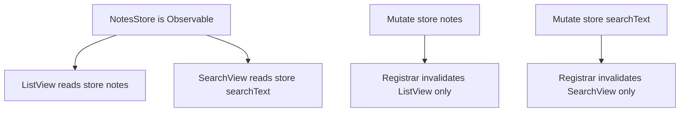
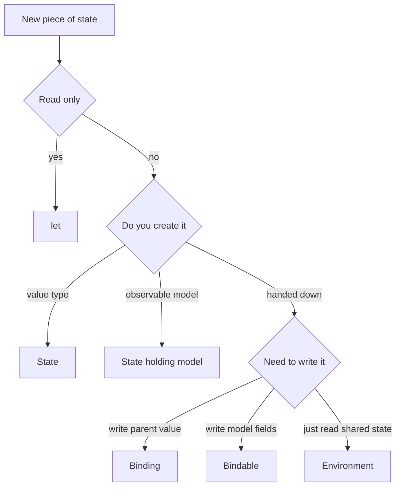

# Lecture 1 — State Ownership in SwiftUI: Who Owns What, and the Bug Class of Getting It Wrong

> **Reading time:** ~75 minutes. **Hands-on time:** ~60 minutes (you wire each of the five primitives in a throwaway SwiftUI target and watch the ownership boundary in the previewer).

This is the lecture that decides whether your SwiftUI code is maintainable. Last week you learned the one-sentence model: *a view is a function from state to a view tree, and SwiftUI re-invokes that function and diffs the result whenever the state changes.* That sentence has a hole in it the size of a production app: it never says **where the state lives**, **who is allowed to change it**, or **who finds out when it does**. Filling that hole is the whole job this week.

There are exactly five answers in modern SwiftUI, and a senior engineer can name the right one for any piece of state on sight: `@State`, `@Binding`, `@Environment`, `@Observable` (held via `@State`), and `@Bindable`. Plus one non-wrapper answer that is correct more often than beginners think: a plain `let`. Get the answer right and your views are small, your previews work, your data flows in one direction, and a user action re-renders the minimum set of views the minimum number of times. Get it wrong and you ship the bug class this lecture is named after: state that two views each think they own, edits that vanish, timers that restart on every parent re-render, and a `body` that recomputes forty times per keystroke.

We teach the **Observation framework** (`@Observable`, `@Bindable`, iOS 17 / 2023) as the default and the legacy `ObservableObject` trio (`@StateObject`, `@ObservedObject`, `@EnvironmentObject`) as read-only knowledge for the millions of lines of pre-2023 SwiftUI you will inherit. Both appear in this lecture; only the modern one appears in code you write from scratch.

## 1.1 — The one rule: every piece of mutable state has exactly one owner

Write this on a sticky note and put it on your monitor:

> **Every piece of mutable state has exactly one owner. Every other view either receives a read-only copy, a write-through binding to the owner, or observes a shared model the owner created.**

That is the entire mental model. The five primitives are just the syntax for the four relationships in that sentence:

| Relationship | Primitive | Meaning |
|---|---|---|
| I own this value, it is mine, it is private | `@State` | source of truth for a value type; the view created it and keeps it alive |
| I own this reference-type model, I created it | `@State var model = MyModel()` | the model is `@Observable`; this view is its lifetime owner |
| I do not own it; I read it; I never write it | plain `let` | a value passed down by a parent, read-only |
| I do not own it; I read **and write** it through the owner | `@Binding` | a write-through reference to someone else's `@State` |
| I do not own it; it was injected from above; I read it | `@Environment` | dependency injection — read a value placed up the tree |
| I do not own it; I need two-way bindings into its fields | `@Bindable` | derive `$model.field` bindings into an `@Observable` model |

Notice what is *not* in the table: there is no primitive for "two views both own this." That configuration does not exist in a correct SwiftUI app. When you find yourself reaching for one, you have an ownership bug, and the fix is always to move the state up to a single owner and hand the other view a `@Binding` or an `@Environment` read.

## 1.2 — `@State`: the view owns the value

`@State` declares that *this view is the source of truth* for a value. The canonical example is a toggle a view owns entirely:

```swift
import SwiftUI

struct CounterView: View {
    @State private var count = 0

    var body: some View {
        VStack(spacing: 16) {
            Text("Count: \(count)")
                .font(.largeTitle.monospacedDigit())
            Button("Increment") { count += 1 }
            Button("Reset") { count = 0 }
        }
        .padding()
    }
}
```

Three things about `@State` that are not negotiable:

1. **It is `private`.** Always. A `@State` is a view's internal scratchpad. If another view needs to read or write it, that is a signal the state belongs *higher up*, not that you should make the `@State` non-private. Apple's own API guidance and every serious style guide require `private` on `@State`. The compiler will not force you; your reviewer will.

2. **It survives `body` re-evaluation.** This is the subtle part. Every time `count` changes, SwiftUI re-invokes `body` and rebuilds the view *value* (the struct). But the `@State`'s *storage* does not live in the struct — it lives in storage SwiftUI manages, keyed by the view's identity (more on identity in §1.7). The struct is cheap and disposable; the storage behind `@State` persists. That is why `count` is not reset to `0` every time `body` runs.

3. **You initialise it once, at the declaration, with a default.** `@State private var count = 0`. The `= 0` runs the *first* time the view appears at a given identity, and never again at that identity. If you write `init()` and try to set `@State` from a parameter, you must use the underscore form `_count = State(initialValue: ...)` — and you should pause and ask whether you actually want `@State` at all, because passing in an initial value usually means the *parent* owns it.

`@State` is for value types — `Int`, `String`, `Bool`, a `struct`, an enum. As of the Observation framework, `@State` is also how you hold the *creation point* of a reference-type `@Observable` model (§1.5). That is the one case where `@State` wraps a `class`.

## 1.3 — `@Binding`: a write-through reference to state owned elsewhere

A `@Binding<Value>` is a two-way connection to a value owned by someone else. It is not a copy. It is a pair of closures — a getter and a setter — that read and write *through* to the owner's storage. The textbook case is a `TextField` editing a parent's `@State`:

```swift
struct ParentView: View {
    @State private var name = ""

    var body: some View {
        VStack {
            // $name projects a Binding<String> from the @State.
            NameField(name: $name)
            Text("Hello, \(name.isEmpty ? "stranger" : name)!")
        }
        .padding()
    }
}

struct NameField: View {
    @Binding var name: String   // not private — it is part of the public surface

    var body: some View {
        TextField("Your name", text: $name)
            .textFieldStyle(.roundedBorder)
    }
}
```

`ParentView` owns `name`. `NameField` receives a `@Binding<String>` and writes through it. When the user types, `NameField` mutates the binding, which mutates `ParentView`'s `@State`, which invalidates `ParentView`'s `body`, which re-renders the `Text`. One owner, one source of truth, a write-through reference handed down. This is the shape.

There are exactly **three** ways to make a `Binding`, and you should recognise each:

1. **The `$` projection.** `$name` reads the projected value of the `@State` property wrapper, which *is* a `Binding<String>`. This is the form you use 95% of the time.

2. **`Binding(get:set:)`.** A hand-built binding from two closures. Use it to derive a binding that does not correspond 1:1 to a stored property — for example, a `Binding<Bool>` derived from "is the selected item non-nil":

   ```swift
   let isPresented = Binding<Bool>(
       get: { selectedItem != nil },
       set: { newValue in if !newValue { selectedItem = nil } }
   )
   ```

3. **A derived/projected binding into a sub-property.** Bindings compose: `$user.address.city` walks into nested properties, and `$items[index]` (with the `Array` binding subscript) gives you a binding to one element. SwiftUI's `ForEach($items)` form hands each row a `Binding` to its element.

For previews and read-only cases, `.constant(_:)` makes a binding that ignores writes: `NameField(name: .constant("Ada"))`. Use it in `#Preview` so you do not need a `@State` host just to satisfy the binding parameter.

**The boundary bug:** confusing "pass the value" with "pass a binding." If `NameField` only *displayed* the name, it would take `let name: String`, not `@Binding var name: String`. Taking a binding you never write is a code smell — it tells the reader "this view mutates the parent's state" when it does not. Take the least powerful thing that works: a `let` to read, a `@Binding` to write.

## 1.4 — The Observation framework: `@Observable` and per-property tracking

Value types and bindings handle local UI state beautifully. They do not handle *shared application state* — the user's list of notes, the logged-in account, the cart — which is reference-type by nature (one instance, many views observe it) and needs to *announce* its changes to whoever is watching.

Before iOS 17, the answer was `ObservableObject` + `@Published` (a Combine-based system; see §1.8). It had a fatal performance characteristic: **any `@Published` change invalidated every view holding the object, whether or not that view read the property that changed.** Change the cart's `couponCode` and every view observing the cart re-rendered, including the ones that only read `itemCount`.

The Observation framework fixes this at the language level. You annotate a `class` with the `@Observable` macro:

```swift
import Observation

@Observable
final class NotesStore {
    var notes: [Note] = []
    var searchText: String = ""
    var sortNewestFirst: Bool = true

    func add(_ note: Note) { notes.insert(note, at: 0) }
    func delete(_ note: Note) { notes.removeAll { $0.id == note.id } }
}

struct Note: Identifiable, Hashable {
    let id: UUID
    var title: String
    var body: String
    var updatedAt: Date
}
```

The `@Observable` macro rewrites the class at compile time. It synthesises an `ObservationRegistrar`, wraps every stored property's `get` in `access(keyPath:)` and every `set` in `withMutation(keyPath:)`, and conforms the type to the `Observable` protocol. The headline consequence:

> **A view re-renders only when a property it actually read during `body` changes.**

When SwiftUI invokes a view's `body`, it installs an observation transaction. Every `@Observable` property the `body` *reads* (e.g. `store.notes`) registers that view as a dependent of that specific key path. When something mutates `store.notes`, the registrar invalidates exactly the views that read `notes`. A view that read only `store.searchText` is *not* invalidated. This is per-property, automatic, and the reason the modern model scales where the old one stormed.


*Only the view that read a given property during body gets invalidated when that property changes.*

You hold the *owning* instance of an `@Observable` model with `@State`:

```swift
struct NotesApp: View {
    @State private var store = NotesStore()   // this view OWNS the store's lifetime

    var body: some View {
        NotesListView()
            .environment(store)                // inject for descendants (§1.6)
    }
}
```

`@State private var store = NotesStore()` looks like it is holding a class in `@State`, and it is — that is the sanctioned modern pattern. `@State` here means "I create this model once and keep it alive across my `body` re-evaluations." It replaces the legacy `@StateObject`.

**The boundary bug:** holding an `@Observable` model with the wrong lifetime primitive. If you write `let store = NotesStore()` as a stored property of a view (not `@State`), SwiftUI rebuilds the view struct on every parent re-render and *constructs a brand-new store every time*, throwing away all your data. Use `@State` for the creation point. Use `@Environment` or a plain `let` (or `@Bindable`) for the views that merely observe it.

## 1.5 — `@Bindable`: two-way bindings into an `@Observable` model

`@Observable` models give you read access that auto-tracks. But controls like `TextField`, `Toggle`, and `Stepper` need a `Binding` — a write-through reference into a specific property. `@Bindable` is the bridge:

```swift
struct EditNoteView: View {
    @Bindable var note: Note   // wait — Note is a struct here; see the note below

    var body: some View {
        Form {
            TextField("Title", text: $note.title)
            TextField("Body", text: $note.body, axis: .vertical)
        }
    }
}
```

`@Bindable` works on `@Observable` *reference types*. To make the example above compile you would make `Note` a `@Observable final class`, or — more commonly — pass a binding to a struct via the parent's `@State`. The clean reference-type version:

```swift
@Observable
final class NoteDraft {
    var title: String = ""
    var body: String = ""
}

struct EditDraftView: View {
    @Bindable var draft: NoteDraft   // @Bindable, not @State: this view does not own it

    var body: some View {
        Form {
            TextField("Title", text: $draft.title)
            TextField("Body", text: $draft.body, axis: .vertical)
        }
    }
}
```

`$draft.title` is a `Binding<String>` that writes through to the `@Observable` model's `title`. When the user types, `@Bindable` mutates `title`, the registrar fires for the `title` key path, and exactly the views that read `title` re-render. No prop-drilling of bindings, no `@Published`, no Combine.

When do you reach for `@Bindable`?

- **You need it** when a control must two-way edit a property of an `@Observable` model you do *not* own — a child editing a model handed down or read from the environment.
- **You do not need it** for read-only display. If you only show `draft.title` in a `Text`, take `let draft: NoteDraft` (or read it from `@Environment`) — `@Bindable` is the wrong tool because you are not making bindings.
- **Local form pattern:** you can also write `@Bindable var draft = NoteDraft()` to create-and-bind in one view, but that conflates ownership with binding. Prefer `@State` for creation, `@Bindable` for binding into something you were handed. You can also derive a local `@Bindable` from an `@Environment` value inside `body`:

  ```swift
  struct SomeChild: View {
      @Environment(NotesStore.self) private var store

      var body: some View {
          @Bindable var store = store          // re-bind locally to get $ projections
          Toggle("Newest first", isOn: $store.sortNewestFirst)
      }
  }
  ```

  That `@Bindable var store = store` line inside `body` is the idiomatic way to get a `$`-projectable handle to an environment-injected model. Memorise it; you will use it constantly.

## 1.6 — `@Environment`: dependency injection the SwiftUI way

Prop-drilling is the anti-pattern where a value is threaded through five intermediate views that do not use it, just to reach the one descendant that does. `@Environment` is SwiftUI's cure: place a value at the top of a subtree, and any descendant reads it directly, with nobody in between touching it.

There are two flavours:

**System environment values** read by key path. SwiftUI ships dozens: `\.colorScheme`, `\.dismiss`, `\.locale`, `\.dynamicTypeSize`, `\.modelContext` (SwiftData, Week 10), and more.

```swift
struct SaveBar: View {
    @Environment(\.dismiss) private var dismiss

    var body: some View {
        Button("Done") { dismiss() }
    }
}
```

**Your own `@Observable` objects**, injected by type. This is the modern replacement for `@EnvironmentObject`:

```swift
// Inject once, high in the tree:
ContentView()
    .environment(store)        // store is a NotesStore (@Observable)

// Read in any descendant, however deep, by type:
struct DeepChild: View {
    @Environment(NotesStore.self) private var store

    var body: some View {
        Text("\(store.notes.count) notes")
    }
}
```

The type *is* the key. `.environment(store)` registers a `NotesStore` instance for the subtree; `@Environment(NotesStore.self)` retrieves it. Because the model is `@Observable`, `DeepChild` re-renders only when it reads a property that changed — reading `store.notes.count` subscribes to `notes`, not to `searchText`.

Two boundary bugs live here:

1. **Forgetting to inject.** With the legacy `@EnvironmentObject`, forgetting `.environmentObject(...)` crashed at *runtime* with "No ObservableObject of type ... found." The modern `@Environment(Type.self)` is safer — for a non-optional read it still traps if missing, but you can declare `@Environment(NotesStore.self) private var store: NotesStore?` to read it as an optional and handle absence gracefully. Either way, the failure is now *predictable* and *typed*, not a mystery crash deep in a child.

2. **Over-broad environment reads causing re-render.** If a view reads `store` from the environment but renders nothing that depends on it, it still establishes a dependency and may re-render. Read the *narrowest* thing you need. Prefer passing a `let value` down one level over re-reading the whole store, when the value is small and stable.

`@Environment` is for *shared* state and *cross-cutting* concerns. It is the wrong tool for a value that belongs to one screen — that should be `@State` owned by that screen. Do not turn `@Environment` into a global mutable bag; that is just a singleton with extra steps.

## 1.7 — View identity: structural vs explicit, and what destroys `@State`

SwiftUI tracks every view by **identity**. Identity answers the question: "is this the *same* view as last time (so I update it in place and keep its `@State`), or a *different* view (so I destroy the old one and create a new one, losing its `@State`)?"

There are two kinds of identity:

1. **Structural identity** — a view's position in the view tree. A `Text` inside the first branch of an `if` has a different structural identity from a `Text` in the `else` branch. `ForEach` derives structural identity from the element `id` (which is why `ForEach` needs `Identifiable` or an explicit `id:`).

2. **Explicit identity** — set with the `.id(_:)` modifier. `.id(someValue)` tells SwiftUI "this view's identity is `someValue`." When `someValue` changes, SwiftUI treats the view as a *different* view: it tears down the old instance (destroying its `@State`, cancelling its `.task`) and builds a fresh one.

This matters enormously for state:

```swift
struct ProfileView: View {
    let userID: UUID

    var body: some View {
        // EditableProfile holds @State internally (draft fields, scroll position).
        EditableProfile()
            .id(userID)   // when userID changes, reset ALL of EditableProfile's @State
    }
}
```

Here `.id(userID)` is *intentional*: switching users should reset the draft. That is the legitimate use of `.id`. The foot-gun is the *unstable* `.id`:

```swift
// BUG: UUID() makes a new identity on every render → @State resets every render.
SomeView().id(UUID())
```

`.id(UUID())` generates a new identity each time `body` runs, so SwiftUID destroys and rebuilds `SomeView` on every render. Its `@State` resets, its `.task` restarts, its animation jumps. Unstable `.id` is one of the four re-render-storm causes you will diagnose in Lecture 2.

The rule: **`.id` decides whether SwiftUI updates a view or replaces it.** Use a *stable, meaningful* value (an entity's `id`) when you want a replacement; never use a value that changes every render.

## 1.8 — The legacy trio: `@StateObject` vs `@ObservedObject` vs `@EnvironmentObject`

You will read pre-2023 SwiftUI for the rest of your career. Here is the legacy model, exactly enough to read it and migrate it.

The old observation system used `ObservableObject` + `@Published`:

```swift
import Combine

final class LegacyStore: ObservableObject {
    @Published var notes: [Note] = []
    @Published var searchText: String = ""
}
```

Views connected to it three ways:

- **`@StateObject`** — *creates and owns* the object. Initialised exactly once, the first time the view appears at its identity, and *survives* parent re-renders. This is the legacy equivalent of today's `@State var store = Store()`.

  ```swift
  struct Root: View {
      @StateObject private var store = LegacyStore()   // created once, owned here
      var body: some View { ChildView(store: store) }
  }
  ```

- **`@ObservedObject`** — *observes a reference passed in*. Does **not** own it, does **not** keep it alive. If the parent re-creates the object, `@ObservedObject` picks up the new one.

  ```swift
  struct ChildView: View {
      @ObservedObject var store: LegacyStore   // observes; does not own
      var body: some View { Text("\(store.notes.count)") }
  }
  ```

- **`@EnvironmentObject`** — observes an object injected via `.environmentObject(_:)`. Crashes at runtime if you forget to inject it.

**The classic bug — and the reason this distinction is interview gold:** using `@ObservedObject` where `@StateObject` was required. Picture a view that creates its own store with `@ObservedObject private var store = LegacyStore()`. Because `@ObservedObject` does not own the object's lifetime, SwiftUI re-runs the property initialiser every time the view struct is rebuilt — which is every time the parent re-renders. A fresh `LegacyStore()` is constructed on each parent render. Any in-flight network request restarts; any timer restarts; any accumulated state is wiped. The symptom is "my data keeps resetting" or "my timer fires twice as fast over time." The fix is `@StateObject` for the *creating* view; `@ObservedObject` only for a *receiving* view that is handed an object created elsewhere.

The modern model collapses this footgun: `@State var store = Store()` is the creating/owning form, and you pass the store down as a plain `let`, via `@Environment`, or via `@Bindable`. There is no separate "observes-but-doesn't-own" wrapper to get wrong, because `@Observable` tracking works on any reference you hold however you hold it.

Migration cheat-sheet:

| Legacy | Modern |
|---|---|
| `class Store: ObservableObject` + `@Published var x` | `@Observable final class Store` + `var x` |
| `@StateObject private var store = Store()` | `@State private var store = Store()` |
| `@ObservedObject var store: Store` | `let store: Store` (read) or `@Bindable var store: Store` (write) |
| `@EnvironmentObject var store: Store` | `@Environment(Store.self) private var store` |
| `.environmentObject(store)` | `.environment(store)` |

## 1.9 — `onChange(of:)` and `task { }`: side effects, not state

Two modifiers complete the data-flow story. Both are for *side effects in response to state*, not for deriving state.

**`onChange(of:)`** runs a closure when a value changes. The modern (iOS 17+) signature gives you both the old and new value, and an `initial:` flag:

```swift
struct SearchView: View {
    @State private var query = ""

    var body: some View {
        TextField("Search", text: $query)
            .onChange(of: query, initial: false) { oldValue, newValue in
                print("query changed from '\(oldValue)' to '\(newValue)'")
                // side effect: kick off a search, log analytics, etc.
            }
    }
}
```

- `initial: true` runs the closure once when the view appears, with `oldValue == newValue`. Default is `false`.
- The two-parameter closure `(oldValue, newValue)` is the modern form. The zero- and one-parameter forms exist; prefer the two-parameter form for clarity.
- **`onChange` is for side effects, never for state derivation.** If you find yourself writing `onChange(of: a) { b = transform($1) }`, you have a derived value `b` that should be a *computed property* (`var b: B { transform(a) }`), not a stored `@State` you keep in sync by hand. Keeping two pieces of state manually synchronised with `onChange` is a classic source of the "stale state" bug.

**`task { }`** (the `.task` modifier) attaches an async job to a view's lifetime. It starts when the view appears and is **automatically cancelled when the view disappears** — which makes it the correct place for "load this when the screen shows up" work:

```swift
struct NoteDetail: View {
    let noteID: UUID
    @State private var note: Note?

    var body: some View {
        Group {
            if let note { Text(note.title) } else { ProgressView() }
        }
        .task(id: noteID) {
            // Runs on appear; re-runs whenever noteID changes; auto-cancels on disappear.
            note = await loadNote(id: noteID)
        }
    }
}
```

- `.task { }` runs once when the view appears and cancels on disappear.
- **`.task(id:)`** is the important variant: when the `id` value changes, SwiftUI cancels the running task and starts a fresh one. This is how you re-load when the thing being shown changes — without it, a detail view reused for a different note (same structural identity, different `noteID`) would keep showing the first note's data.
- The task inherits the view's `@MainActor` isolation; `await` hops off as needed and resumes back on the main actor.

Both modifiers belong to the *effect* layer of your view, downstream of state. State flows: user → mutates owned state → `body` recomputes → `onChange`/`task` fire side effects. Keep that arrow pointing one direction.

## 1.10 — The ownership decision table (memorise this)

When you look at any piece of state, walk this table top to bottom and take the first row that matches:

| Question | If yes, use |
|---|---|
| Is it a constant this view only reads and never changes? | a plain `let` |
| Does this view *create* and *own* a value-type source of truth? | `@State private var x = ...` |
| Does this view *create* and *own* an `@Observable` reference model? | `@State private var model = Model()` |
| Does this view need to *write* a value owned by its parent? | `@Binding var x: ...` (parent passes `$x`) |
| Does this view need two-way bindings into an `@Observable` model it was handed? | `@Bindable var model: Model` |
| Is this shared/cross-cutting state injected from high in the tree? | `@Environment(Model.self)` (or a system `\.keyPath`) |
| Is it a side effect triggered by a state change? | `onChange(of:)` |
| Is it async work tied to the view's lifetime / a changing identity? | `.task { }` / `.task(id:)` |

If two rows seem to match, you almost certainly have the ownership boundary in the wrong place. Move the source of truth so exactly one view owns it, and the table resolves cleanly.


*Walking the ownership decision table of section 1.10 top to bottom to pick the right primitive.*

## 1.11 — Worked example: the same screen, owned three ways

Consider a sheet that edits a note's title. We will write it correctly, then show two ways to get it wrong.

**Correct — parent owns, child writes through a binding:**

```swift
struct ListView: View {
    @State private var notes: [Note] = [.sample]
    @State private var editingIndex: Int?

    var body: some View {
        List(notes.indices, id: \.self) { i in
            Button(notes[i].title) { editingIndex = i }
        }
        .sheet(item: Binding(
            get: { editingIndex.map { IdentifiedIndex(value: $0) } },
            set: { editingIndex = $0?.value }
        )) { wrapped in
            // The sheet edits a COPY (draft), and commits on save.
            EditTitleSheet(initialTitle: notes[wrapped.value].title) { newTitle in
                notes[wrapped.value].title = newTitle   // commit through the owner
            }
        }
    }
}

struct IdentifiedIndex: Identifiable { let value: Int; var id: Int { value } }
```

The list owns `notes`. The sheet receives an initial title and a commit closure; it never reaches into the list's storage. On save it calls back; on cancel it does nothing. One owner, an explicit commit boundary — exactly the pattern the challenge and mini-project formalise.

**Wrong #1 — the sheet thinks it owns the note:**

```swift
// BUG: the sheet copies the note into its own @State and edits the copy,
// but never commits back. Edits are lost on dismiss.
struct EditTitleSheet: View {
    @State private var note: Note   // owns a COPY; parent never finds out
    // ... edits note.title, dismisses, parent's list is unchanged.
}
```

The symptom is "I edited the note and tapped save but the list didn't change." Two views (list and sheet) each have their own `note`; the sheet's edits die with the sheet. The fix is the commit closure above, or a `@Bindable` model both share.

**Wrong #2 — shared mutable model with no draft, cancel can't discard:**

```swift
// BUG: the sheet binds DIRECTLY to the live model via @Bindable.
// Every keystroke mutates the real note. "Cancel" cannot discard —
// the changes already happened.
struct EditTitleSheet: View {
    @Bindable var note: LiveNoteModel   // writes straight through to the list's data
}
```

Now the list updates on *every keystroke*, and "Cancel" is a lie — there is nothing to discard because the model was mutated live. This is the "renders on every keystroke" half of the re-render storm and the reason the challenge insists on a draft-and-commit boundary.

The correct shape — edit a *draft*, commit on save, discard on cancel — is the senior pattern. You will build it in the challenge and prove with `onChange(of:)` that the list updates exactly once on save and never on cancel.

## 1.12 — The reflexes to internalise this week

- **Name the owner before you write the wrapper.** For every piece of state, say out loud "this view owns it / this view borrows it / this view injects it." The wrapper follows from the sentence.
- **`@State` is always `private`.** No exceptions. Non-private `@State` means the state belongs higher up.
- **Hold `@Observable` models with `@State` at the creation point.** Never as a plain stored `let` on a view — that re-creates the model every render.
- **Take the least powerful tool.** `let` to read, `@Binding`/`@Bindable` to write, `@Environment` for shared. Taking a binding you never write is a smell.
- **`@Environment(Type.self)` over `@EnvironmentObject`.** Typed, predictable, and pairs with the `@Observable` model you already have.
- **`.id` replaces a view; use a stable value or do not use it.** `.id(UUID())` is a bug.
- **`onChange` is for effects, computed properties are for derived state.** Never keep two `@State`s manually in sync.
- **`.task(id:)` re-runs async work when identity changes.** A reused detail view needs it.

These reflexes are the entire methodology of correct SwiftUI state. Lecture 2 takes the *failure* mode — the re-render storm — and shows you how to see it, name its cause, and fix it.

---

## Lecture 1 — checklist before moving on

- [ ] I can state the one rule: every piece of mutable state has exactly one owner.
- [ ] I can pick the right primitive from the decision table for any scenario.
- [ ] I can explain why `@State` is `private` and how it survives `body` re-evaluation.
- [ ] I can create a `Binding` three ways (`$`, `Binding(get:set:)`, derived) and use `.constant` in a preview.
- [ ] I can annotate a model `@Observable`, hold it with `@State`, and explain per-property tracking.
- [ ] I can inject with `.environment(_:)` and read with `@Environment(Type.self)`, and re-bind locally with `@Bindable var x = x`.
- [ ] I can explain `@StateObject` vs `@ObservedObject` and the "restarts every render" bug.
- [ ] I can explain when `.id(_:)` resets state and why `.id(UUID())` is a bug.
- [ ] I can use `onChange(of:initial:)` for effects and `.task(id:)` for identity-scoped async work.

If any box is unchecked, return to that section before Lecture 2.

---

**References cited in this lecture**

- Apple — "Managing user interface state" (the `@State`/`@Binding` guide): <https://developer.apple.com/documentation/swiftui/managing-user-interface-state>
- Apple — "Managing model data in your app" (`@Observable`, `@Bindable`, `@Environment`): <https://developer.apple.com/documentation/swiftui/managing-model-data-in-your-app>
- Apple — "Migrating from the Observable Object protocol to the Observable macro": <https://developer.apple.com/documentation/swiftui/migrating-from-the-observable-object-protocol-to-the-observable-macro>
- Apple — `Observation` framework reference: <https://developer.apple.com/documentation/observation>
- Apple — "State" property wrapper: <https://developer.apple.com/documentation/swiftui/state>
- Apple — "Bindable" property wrapper: <https://developer.apple.com/documentation/swiftui/bindable>
- WWDC23 — "Discover Observation in SwiftUI": <https://developer.apple.com/videos/play/wwdc2023/10149/>
- WWDC21 — "Demystify SwiftUI" (identity, lifetime, dependencies): <https://developer.apple.com/videos/play/wwdc2021/10022/>
