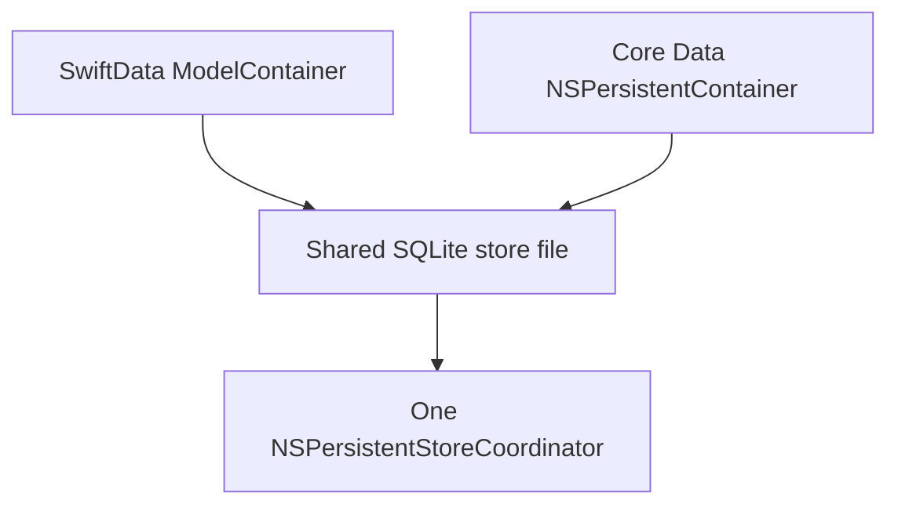
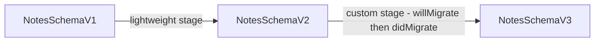

# Lecture 2 — Co-existence, migrations, and the footguns that ship to users

Lecture 1 gave you the stack and the happy path. This lecture is about the three things that actually take SwiftData apps down in production: a **schema change** that loses user data, a **performance footgun** that janks the UI or runs out of memory, and a **legacy Core Data app** you have been told to "just add SwiftData to" without a six-month rewrite. These are not edge cases. The first version of your app ships, users put real data in it, and then you need to ship version two. Everything in this lecture is in service of "ship v2 without a one-star review that says *the update deleted all my notes.*"

We will take them in the order you hit them on a real project: co-existence first (because most "new SwiftData" work is actually grafting onto something old), then migrations (because the second release is when the danger starts), then footguns (because you only notice them once there is enough data to hurt).

---

## 1. The SwiftData / Core Data co-existence pattern

The marketing says "adopt SwiftData." The reality at most shops is "we have 80,000 lines of Core Data and a `.xcdatamodeld` with thirty entities, and management wants the new feature in SwiftData." You cannot rewrite the data layer in a sprint, and you should not. The supported play is **co-existence**: SwiftData and Core Data pointed at the **same store file**, the same SQLite database, the same `NSPersistentStoreCoordinator`.

This works because — as lecture 1 hammered — SwiftData *is* Core Data underneath. A SwiftData `@Model` compiles to an `NSEntityDescription`; a SwiftData store is a Core Data store. So you can:

1. Keep your existing `NSManagedObjectModel` / `.xcdatamodeld`.
2. Define SwiftData `@Model` types whose **entity names and attribute names match** the Core Data entities exactly.
3. Build **one** `NSPersistentContainer` (or a SwiftData `ModelContainer`) over the shared store URL, so both stacks see the same coordinator and the same data.

The mechanical version, where Core Data owns the container and SwiftData reads through it:

```swift
import CoreData
import SwiftData

// 1. The existing Core Data stack (unchanged).
final class LegacyStack {
    let container: NSPersistentContainer

    init() {
        container = NSPersistentContainer(name: "Notes")  // existing .xcdatamodeld
        container.loadPersistentStores { _, error in
            if let error { fatalError("Core Data load failed: \(error)") }
        }
    }

    var storeURL: URL {
        container.persistentStoreDescriptions.first!.url!
    }
}

// 2. A SwiftData @Model whose name/attributes mirror the Core Data "Note" entity.
@Model
final class Note {
    var title: String
    var body: String
    var createdAt: Date

    init(title: String, body: String, createdAt: Date = .now) {
        self.title = title
        self.body = body
        self.createdAt = createdAt
    }
}

// 3. A SwiftData ModelContainer pointed at the SAME file the Core Data stack uses.
@MainActor
func makeCoexistingContainer(sharingStoreAt url: URL) throws -> ModelContainer {
    let schema = Schema([Note.self])
    let config = ModelConfiguration(schema: schema, url: url)   // <- same URL
    return try ModelContainer(for: schema, configurations: [config])
}
```

The contract you must hold for this to work:

- **Names must match byte-for-byte.** The `@Model` class name maps to the Core Data entity name; each property maps to an attribute of the same name. If your Core Data entity is `CDNote` you set the SwiftData class name to match (or use the Core Data entity rename tooling). A mismatch means SwiftData and Core Data are looking at *different tables in the same file* — silent data divergence.
- **Types must be compatible.** Core Data `String` ↔ SwiftData `String`, `Date` ↔ `Date`, etc. Optionality must agree.
- **One writer of the schema at a time.** Both stacks reading is fine. Migrating the schema from *both* sides at once is how you corrupt the store. Pick one owner of schema evolution — usually Core Data during the transition — and let the other follow.


*Both stacks point at the same file, so screens can migrate one at a time.*

**The migration strategy this enables** is the only sane one for a big app: feature-by-feature. New features use the SwiftData `@Model` and `@Query`. Old features keep their `NSFetchRequest` and `NSManagedObject`. Both touch the same rows. Over several releases you convert screens one at a time, and you are never in a "big bang rewrite" you can't ship halfway through. When the last Core Data screen is gone, you delete the `.xcdatamodeld` and the legacy stack, and you are pure SwiftData — having shipped continuously the whole way.

### When you must drop back to raw Core Data anyway

Even in a pure-SwiftData app, a few operations have no SwiftData API and you reach down to the shared Core Data coordinator:

- **Batch delete / update.** `NSBatchDeleteRequest` deletes a million rows in SQL without loading a single object. SwiftData has no equivalent; `context.delete` on each object would fault and load all million. For "delete all notes older than a year," drop to a batch request over the same store.
- **`NSFetchedResultsController`** for sectioned, diffable, table-driven UIs with fine-grained change callbacks. `@Query` is simpler but coarser.
- **Derived attributes** and other model-file features SwiftData macros don't expose yet.

You can do all of these because the store is one store. That is the deepest payoff of the lineage: SwiftData never traps you, because Core Data is always reachable underneath it.

---

## 2. Migrations and schema versioning — the part that loses data if you get it wrong

Your app shipped. Users have data. You add a field. What happens on their next launch?

If the change is **additive and lightweight**, SwiftData migrates automatically — it sees the store is an older shape, infers the additive change, and rewrites the schema in place. If the change is **not** trivially inferable, the store fails to open and the app crashes on launch, or (worse) opens and silently drops the column. The job of this section is to make you do migrations *on purpose* with an explicit, versioned plan, so "what happens on launch" is never a surprise.

### What counts as lightweight (automatic)

These changes SwiftData can usually migrate without a plan:

- **Adding** a new property *with a default value* (or optional).
- **Adding** a new `@Model` type.
- **Adding** a new relationship.
- **Removing** a property (its column is dropped).

These changes **cannot** be inferred and need a plan:

- **Renaming** a property or entity (without `originalName:`, a rename looks like "drop old column, add new empty column" — data loss).
- **Changing a property's type** (e.g. `Int` → `String`).
- **Splitting or merging** entities.
- **Making a previously-optional property required** without a default, or adding a `.unique` constraint to existing data that has duplicates.
- Any data **transformation** (recomputing a value from old fields).

### Versioned schemas — naming each shape of the world

The discipline is: every released schema gets a `VersionedSchema`, and a `SchemaMigrationPlan` describes how to get from one to the next. You never edit a released schema in place; you add a new version and a migration stage.

```swift
import SwiftData

// ---- Version 1: what shipped first ----
enum NotesSchemaV1: VersionedSchema {
    static var versionIdentifier = Schema.Version(1, 0, 0)
    static var models: [any PersistentModel.Type] { [Note.self] }

    @Model
    final class Note {
        var title: String
        var body: String
        var createdAt: Date

        init(title: String, body: String, createdAt: Date = .now) {
            self.title = title
            self.body = body
            self.createdAt = createdAt
        }
    }
}

// ---- Version 2: we add `isPinned` (additive, lightweight) and rename `body` -> `content` (needs originalName) ----
enum NotesSchemaV2: VersionedSchema {
    static var versionIdentifier = Schema.Version(2, 0, 0)
    static var models: [any PersistentModel.Type] { [Note.self] }

    @Model
    final class Note {
        var title: String
        @Attribute(originalName: "body") var content: String   // <- rename, no data loss
        var createdAt: Date
        var isPinned: Bool = false                              // <- additive, has a default

        init(title: String, content: String, createdAt: Date = .now, isPinned: Bool = false) {
            self.title = title
            self.content = content
            self.createdAt = createdAt
            self.isPinned = isPinned
        }
    }
}
```

`@Attribute(originalName: "body")` is the rename escape hatch: it tells SwiftData "the column that used to be called `body` is now `content` — keep the data, just rename." Without it, the rename is a destructive drop-and-add.


*Each released schema gets its own version, linked by an explicit migration stage.*

### The migration plan — stages between versions

```swift
enum NotesMigrationPlan: SchemaMigrationPlan {
    static var schemas: [any VersionedSchema.Type] {
        [NotesSchemaV1.self, NotesSchemaV2.self]
    }

    static var stages: [MigrationStage] {
        [migrateV1toV2]
    }

    // The rename + the new field are both handled by the schema definitions
    // (originalName + default), so this stage is `lightweight`. SwiftData does
    // the column rename and adds the defaulted column with no custom code.
    static let migrateV1toV2 = MigrationStage.lightweight(
        fromVersion: NotesSchemaV1.self,
        toVersion: NotesSchemaV2.self
    )
}
```

A `.lightweight` stage is "SwiftData, you have everything you need — do it." When you need to *transform* data (not just rename a column), you use a `.custom` stage with `willMigrate` / `didMigrate` closures that run real Swift against the context:

```swift
static let migrateV2toV3 = MigrationStage.custom(
    fromVersion: NotesSchemaV2.self,
    toVersion: NotesSchemaV3.self,
    willMigrate: { context in
        // Runs BEFORE the schema changes. Read old shape, stash what you need.
        let notes = try context.fetch(FetchDescriptor<NotesSchemaV2.Note>())
        for note in notes where note.title.isEmpty {
            note.title = "Untitled"   // backfill before a new NOT NULL constraint lands
        }
        try context.save()
    },
    didMigrate: { context in
        // Runs AFTER the new schema is in place. Populate new computed/derived fields.
        let notes = try context.fetch(FetchDescriptor<NotesSchemaV3.Note>())
        for note in notes {
            note.wordCount = note.content.split(separator: " ").count
        }
        try context.save()
    }
)
```

Finally, you wire the **current** schema and the plan into the container:

```swift
@main
struct HelloNotesApp: App {
    let container: ModelContainer = {
        do {
            return try ModelContainer(
                for: NotesSchemaV2.Note.self,         // the CURRENT version's models
                migrationPlan: NotesMigrationPlan.self  // how to get here from older stores
            )
        } catch {
            fatalError("Could not create ModelContainer: \(error)")
        }
    }()

    var body: some Scene {
        WindowGroup { ContentView() }
            .modelContainer(container)
    }
}
```

On a fresh install, SwiftData creates the store at V2 directly. On an upgrade from V1, it runs `migrateV1toV2` to bring the existing store forward — data intact. That is the whole contract, and it is the difference between a smooth update and a data-loss incident.

### The discipline that prevents the incident

1. **Never edit a released `VersionedSchema`.** Add a new version. The old one is a historical fact about what users have on disk.
2. **Test the upgrade path, not just fresh install.** A common mistake: you test by deleting the app and reinstalling, which always creates a fresh store at the latest version and *never exercises the migration.* You must seed an old store and open it with the new build. Exercise 03 walks this exact test.
3. **`originalName:` for every rename.** A rename without it is data loss.
4. **Custom stage for every transformation.** If the new value is computed from old values, lightweight won't do it; you need `willMigrate`/`didMigrate`.
5. **Keep a way to inspect the on-disk version.** When debugging, `xcrun simctl get_app_container booted <bundle-id> data` finds the store; `sqlite3` on it shows `Z_METADATA` and the version stamp.

---

## 3. The footguns — measured, not asserted

A footgun is code that works fine in a demo with ten rows and falls over with ten thousand. SwiftData has a handful that are worth committing to memory because they look innocent. We'll state each one, show the bite, show the fix, and — this is the week's ethos — *measure* it. "It feels fast" is not an engineering statement.

### The timing harness we use all week

```swift
import OSLog

let perfLog = Logger(subsystem: "com.crunch.notes", category: "perf")
let signposter = OSSignposter(logger: perfLog)

/// Time a block and log it. Wrap any fetch in this to get a number, not a vibe.
func measured<T>(_ label: StaticString, _ work: () throws -> T) rethrows -> T {
    let state = signposter.beginInterval(label)
    let clock = ContinuousClock()
    let start = clock.now
    defer {
        let elapsed = clock.now - start
        signposter.endInterval(label, state)
        perfLog.log("\(label) took \(elapsed)")
    }
    return try work()
}
```

`ContinuousClock` gives you a monotonic measurement that ignores wall-clock adjustments; `OSSignposter` makes the interval show up as a region in Instruments so you can correlate it with the SwiftData/Core Data SQL trace. Use both: the number for the quick read, the signpost for the deep dive.

### Footgun 1 — fetch everything, then filter in memory

```swift
// THE BITE: drag every Note across the faulting layer into RAM, keep 1%.
let slow = measured("filter-in-memory") {
    (try? context.fetch(FetchDescriptor<Note>()))?
        .filter { $0.title.localizedStandardContains("swift") } ?? []
}

// THE FIX: let SQLite filter; only matching rows are ever materialised.
let fast = measured("filter-in-sqlite") {
    (try? context.fetch(FetchDescriptor<Note>(
        predicate: #Predicate { $0.title.localizedStandardContains("swift") }
    ))) ?? []
}
```

On a 50,000-row store the in-memory version is routinely **50–200×** slower and allocates the entire table; the predicate version touches an index and returns the few matches. Same answer, completely different cost. This is the footgun you plant on purpose in the challenge.

### Footgun 2 — the N+1 relationship fault

```swift
// THE BITE: notes load in one query; .tags faults per-note as the list scrolls.
let notes = try context.fetch(FetchDescriptor<Note>())
for note in notes { _ = note.tags.count }   // up to one SQLite query PER note

// THE FIX: prefetch the relationship in a single batched query.
var d = FetchDescriptor<Note>()
d.relationshipKeyPathsForPrefetching = [\Note.tags]
let prefetched = try context.fetch(d)
for note in prefetched { _ = note.tags.count }   // already loaded; zero extra queries
```

Watch this one in the SwiftData Instruments template: the un-prefetched version shows a fan of identical `SELECT ... FROM ZTAG WHERE ...` queries, one per row. The prefetched version shows one.

### Footgun 3 — `fetch().count` instead of `fetchCount`

```swift
let badCount = try context.fetch(FetchDescriptor<Note>()).count  // builds N objects to count them
let goodCount = try context.fetchCount(FetchDescriptor<Note>())  // SELECT COUNT(*); builds zero objects
```

If all you need is a number, never materialise the objects.

### Footgun 4 — unbounded `@Query` driving a `List`

`@Query var notes: [Note]` with no limit fetches *every* row, every time the view appears, into a `List`. With 100,000 notes that is a memory spike and a slow first frame. SwiftUI's `List` is lazy about *views*, but `@Query` is not lazy about *fetching*. For large data sets, page with `fetchLimit` on a `FetchDescriptor` and load more on scroll, or filter the query so it returns a bounded set. The default `@Query` is fine for the hundreds-of-rows notes app; it is a footgun the day someone's store has a hundred thousand rows.

### Footgun 5 — the main-thread write that janks a scroll

A big `context.save()` or a bulk insert on the `mainContext` blocks the main thread, dropping frames mid-scroll. The fix is a background context via `@ModelActor`, with the main `@Query` picking up the merged changes automatically:

```swift
@ModelActor
actor NoteImporter {
    func importMany(_ payloads: [NotePayload]) throws -> Int {
        for p in payloads {
            modelContext.insert(Note(title: p.title, body: p.body))
        }
        try modelContext.save()          // saves on the actor's own context, off the main thread
        return payloads.count            // return a Sendable value, never a model object
    }
}

// Caller — note we pass the CONTAINER (Sendable) into the actor, and get back a count (Sendable).
func runImport(_ payloads: [NotePayload], container: ModelContainer) async throws {
    let importer = NoteImporter(modelContainer: container)
    let n = try await importer.importMany(payloads)
    perfLog.log("imported \(n) notes off-main")
}
```

`@ModelActor` synthesises an `init(modelContainer:)` and a private `modelContext` isolated to the actor. The `ModelContainer` *is* `Sendable`, so you can hand it to the actor across the concurrency boundary; the `ModelContext` and the model objects are *not* `Sendable`, so they never cross. You pass `PersistentIdentifier`s in and `Sendable` results out. This is the Swift-6-correct way to do background persistence, and it is the bridge between this week and Week 4's concurrency rules.

---

## 4. Putting it together — a production checklist

Before you call a SwiftData data layer "done," walk this list. It is the code-review checklist a senior reviewer applies:

- **Schema is versioned.** There is a `VersionedSchema` for the current shape and a `SchemaMigrationPlan` registered on the container, even if the only stage so far is the implicit fresh install. The day you ship v2 you are ready.
- **Every rename uses `originalName:`.** No silent drops.
- **The upgrade path is tested**, not just fresh install. A test seeds an old store and opens it with the new schema (exercise 03).
- **Delete rules are deliberate.** Each `@Relationship` has a `deleteRule:` you chose, and you can say in one sentence why deleting the parent should or should not delete the children.
- **Filters are predicates, not in-memory `.filter`.** Grep the codebase for `.fetch(` immediately followed by `.filter` — that's the footgun.
- **Counts use `fetchCount`.** Grep for `.fetch(...).count`.
- **Hot relationships are prefetched.** Any list that reads a relationship per row sets `relationshipKeyPathsForPrefetching`.
- **Background writes are on a `@ModelActor`**, not `Task.detached` capturing the main context.
- **Tests and previews use `isStoredInMemoryOnly: true`.** No test touches the real on-disk store.
- **The relaunch test passes.** Create data, `xcrun simctl terminate`, relaunch cold, data is intact. (The week's promise.)

---

## 5. Recap

SwiftData's happy path is genuinely lovely, and lecture 1 sold you on it for good reason. This lecture was the other half — the half that decides whether your *second* release goes well. Three habits carry it:

1. **Co-exist, don't rewrite.** SwiftData and Core Data over one store let you migrate a big app feature-by-feature and ship continuously. And because the store is one store, Core Data is always reachable for batch operations SwiftData doesn't expose.
2. **Version every schema and test the upgrade.** Additive changes are free; renames need `originalName:`; transformations need a custom stage. Never edit a released schema; never test only the fresh install.
3. **Measure the footguns.** Filter in SQLite not in memory, count with `fetchCount`, prefetch hot relationships, and push bulk writes onto a `@ModelActor`. Prove each with `ContinuousClock` and Instruments — a number, not a vibe.

You now have both halves of SwiftData: the front end you write every day, and the engine you debug when it leaks. The exercises put numbers on the footguns and walk a real migration; the mini-project migrates Hello, Notes off its in-memory store and proves it survives a cold launch. Go make the data stop disappearing.
