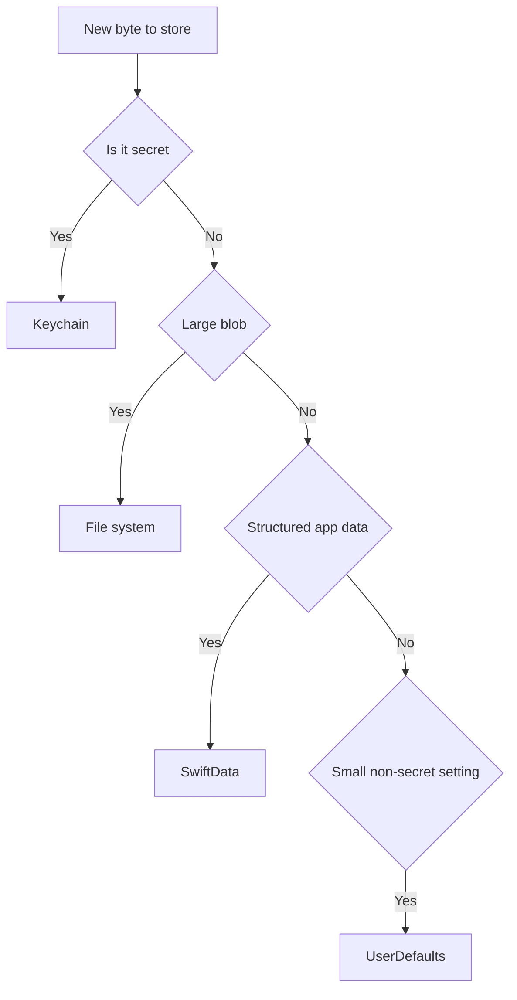
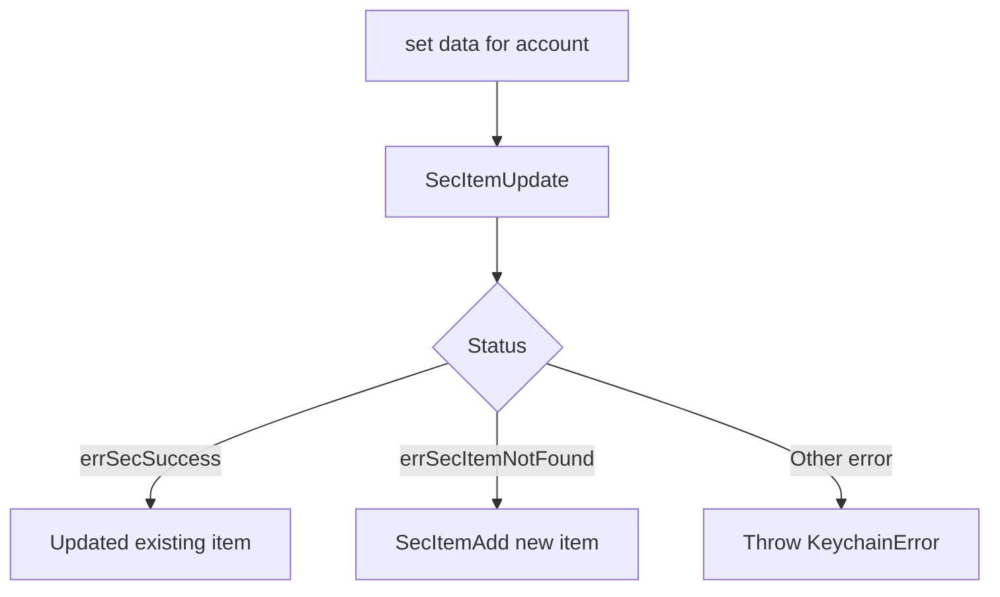

# Lecture 1 — Where to put each byte: the file system and the Keychain

> "Every byte your app stores answers three questions whether you ask them or not: is it secret, must it survive correctly, and must it be on every device. The bug is never the byte. The bug is putting it in the store that answers those questions wrong."

Week 10 gave you SwiftData and you might have concluded the persistence story was over: structured data goes in a `@Model`, done. It is not over. SwiftData is the right home for *structured app data* — notes, tags, the object graph. It is the wrong home for a 40 MB video (which belongs on the file system), for an auth token (which belongs in the Keychain), and for "the same data on three devices" (which is CloudKit). This lecture is the map of the other stores and, more importantly, the **decision tree** that routes a byte to the correct one. We do files and the Keychain here; lecture 2 does CloudKit and the conflict it forces.

The framing for the whole week is one decision tree. Hold it, and "where does this go?" stops being a vibe and becomes a lookup.

---

## 1. The decision tree — four stores, three questions

Here is the tree. Memorise its shape; you will apply it for the rest of your career.

```text
For each piece of data, ask, in order:

1. Is it SECRET? (a token, a password, a private key, anything an attacker wants)
   YES -> KEYCHAIN. Full stop. Not UserDefaults, not a file, not SwiftData.
   NO  -> continue.

2. Is it a LARGE BLOB? (an image, a video, a PDF, an exported archive — KBs to MBs)
   YES -> FILE SYSTEM. A file on disk, referenced by URL.
          (SwiftData can hold a blob via @Attribute(.externalStorage), which IS
           a file under the hood — but for genuinely large or app-managed files,
           own the file yourself.)
   NO  -> continue.

3. Is it STRUCTURED APP DATA the app queries? (records, relationships, lists)
   YES -> SWIFTDATA. The Week 10 answer. Add CloudKit if it must be on every device.
   NO  -> continue.

4. Is it a SMALL, NON-SECRET, NON-CRITICAL SETTING? (a toggle, a sort order,
   "has the user seen onboarding")
   YES -> UserDefaults. The ONLY correct use of UserDefaults.
```


*The four-store decision tree from section 1, drawn as a flow.*

The crosscutting question — **must it be on every device?** — applies to the SwiftData branch: if yes, you turn on CloudKit (lecture 2). It does *not* re-route a secret out of the Keychain (the Keychain has its own iCloud sync, `kSecAttrSynchronizable`) or a blob out of the file system (large files sync via iCloud Drive or CloudKit assets, not by being shoved into `UserDefaults`).

Two rules fall straight out of the tree, and they are the two that catch juniors:

- **`UserDefaults` is for settings, not secrets and not data.** `UserDefaults` is an unencrypted plist in the app's `Library/Preferences`. It is backed up to iCloud and iTunes in **plaintext**. A token in `UserDefaults` is a token in a backup file anyone with the backup can read. Storing a secret there is a security bug, full stop — and it is the single most common one in shipped iOS apps. (You will plant and fix exactly this in the challenge.)
- **Don't put large files where they bloat backups.** `Documents` and `Application Support` are backed up to iCloud. A 200 MB video cache in `Documents` is 200 MB of the user's iCloud Backup quota, every backup, forever. Caches go in `Library/Caches` (not backed up, purgeable) or get `isExcludedFromBackup` set. Getting this wrong is how your app becomes "the one eating my iCloud storage" in a one-star review.

---

## 2. The iOS sandbox — the container layout

Every iOS app runs in a **sandbox**: a private directory tree no other app can read. Inside it are a handful of directories, and *which one you write to is a backup-and-purge decision*, not an arbitrary choice. Here is the layout, with the property that matters for each:

```text
<App Sandbox>/
├── Documents/                  user-visible/-generated data. BACKED UP. Visible in
│                               the Files app IF you set UIFileSharingEnabled / the
│                               document-browser entitlement. The user "owns" this.
├── Library/
│   ├── Application Support/     app's own data files (your SwiftData .store lives
│   │                           here). BACKED UP. Hidden from the user. Your data,
│   │                           not theirs.
│   ├── Caches/                  regenerable data. NOT backed up. The OS MAY DELETE
│   │                           this under storage pressure, even while running.
│   │                           Never store anything here you can't rebuild.
│   └── Preferences/             UserDefaults plist. BACKED UP. Plaintext.
└── tmp/                         scratch. NOT backed up. Cleared aggressively by the
                                OS. For "I need this for the next 30 seconds" only.
```

You reach these with the modern `URL` static accessors (iOS 16+) rather than the old `FileManager.urls(for:in:)` dance:

```swift
import Foundation

let docs    = URL.documentsDirectory            // …/Documents
let support = URL.applicationSupportDirectory   // …/Library/Application Support
let caches  = URL.cachesDirectory               // …/Library/Caches
let temp    = URL.temporaryDirectory            // …/tmp
```

The decision, every time you write a file:

- **Will the user lose something irreplaceable if this vanishes?** → `Documents` (if user-facing) or `Application Support` (if app-internal). Backed up.
- **Can I regenerate it (a thumbnail, a downloaded image, a parsed cache)?** → `Caches`. Not backed up, purgeable. Saves the user's backup quota and survives storage pressure gracefully (the OS deletes it; you rebuild it).
- **Do I need it for seconds, not sessions?** → `tmp`.

`Application Support` is the right home for files your app manages and the user never sees by name — and it is where SwiftData puts its `.store` by default. Note that `Application Support` may not exist on first launch; create it:

```swift
func appSupportFile(named name: String) throws -> URL {
    let dir = URL.applicationSupportDirectory
    try FileManager.default.createDirectory(at: dir, withIntermediateDirectories: true)
    return dir.appending(path: name)
}
```

---

## 3. `FileManager` — the file CRUD API

`FileManager.default` is the workhorse. The operations you reach for constantly:

```swift
let fm = FileManager.default

// Existence
fm.fileExists(atPath: url.path())

// Create a directory (and any missing parents)
try fm.createDirectory(at: dir, withIntermediateDirectories: true)

// Copy / move / remove
try fm.copyItem(at: source, to: destination)
try fm.moveItem(at: source, to: destination)
try fm.removeItem(at: url)

// List a directory
let contents = try fm.contentsOfDirectory(
    at: dir,
    includingPropertiesForKeys: [.fileSizeKey, .contentModificationDateKey],
    options: [.skipsHiddenFiles]
)

// Read attributes (size, dates)
let values = try url.resourceValues(forKeys: [.fileSizeKey, .creationDateKey])
let bytes = values.fileSize ?? 0
```

Two things people get wrong:

- **Use `URL`-based APIs, not `String` paths.** `url.path()` exists for the rare API that still needs a string, but the whole modern surface is `URL`. Paths break on percent-encoding and on volumes; `URL` doesn't.
- **`createDirectory(withIntermediateDirectories: true)` is idempotent and safe.** It does not error if the directory already exists (with that flag), so you can call it before every write to a managed directory without a `fileExists` guard.

### Excluding a cache from backup

If you *must* keep a regenerable file somewhere that is backed up (sometimes `Caches` isn't right because you want it to survive a reboot but not a backup), flag it explicitly:

```swift
func excludeFromBackup(_ url: URL) throws {
    var url = url
    var values = URLResourceValues()
    values.isExcludedFromBackup = true
    try url.setResourceValues(values)
}
```

This sets the `com.apple.MobileBackup` extended attribute. The file stays on disk, survives reboots, but is skipped by iCloud and iTunes backup. This is the right tool when a large downloaded asset lives in `Application Support` for durability but shouldn't cost the user backup quota. The reviewer's grep: any large file in a backed-up directory without this flag is a backup-bloat bug.

---

## 4. Atomic writes — so a crash never leaves a half-written file

Here is a bug that ships constantly: you write a file by streaming bytes into it, the app crashes (or the user force-quits, or the battery dies) halfway through, and now the file on disk is *half the old data and half the new data* — corrupt, and it crashes your parser on next launch. The fix is an **atomic write**, and `Foundation` gives it to you for free:

```swift
let data: Data = encodeMyDocument()
try data.write(to: fileURL, options: .atomic)
```

`.atomic` does not write into `fileURL` directly. It writes to a **temporary file** in the same directory, and when the write is fully complete and flushed, it does a single **rename** of the temp file over `fileURL`. Rename is atomic at the file-system level: at every instant, `fileURL` is either entirely the old contents or entirely the new contents — never half. A crash mid-write leaves the (complete) old file intact and a stray temp file the OS cleans up. You never see a half-written `fileURL`.

```swift
// NON-ATOMIC: a crash between these lines leaves a half-written file.
let handle = try FileHandle(forWritingTo: fileURL)
handle.write(firstHalf)      // crash here -> fileURL is now half new, half old = corrupt
handle.write(secondHalf)

// ATOMIC: temp-write-then-rename. fileURL is always all-or-nothing.
try (firstHalf + secondHalf).write(to: fileURL, options: .atomic)
```

Be precise about what "atomic" means here. `.atomic` makes the **write of one file** all-or-nothing. It is **not** a transaction across multiple files — if you write two files and want them to land together-or-not-at-all, you need a different strategy (write both to temp, rename both, and accept the tiny window between the two renames; or use a single archive file; or use a database, which gives you real transactions — this is one reason SwiftData/SQLite exists). Know the boundary: atomic write protects one file against partial writes; it does not give you multi-file ACID.

`Codable` + atomic is the common pairing for a small document:

```swift
struct Draft: Codable { var title: String; var body: String }

func save(_ draft: Draft, to url: URL) throws {
    let data = try JSONEncoder().encode(draft)
    try data.write(to: url, options: .atomic)
}

func load(_ url: URL) throws -> Draft {
    let data = try Data(contentsOf: url)
    return try JSONDecoder().decode(Draft.self, from: data)
}
```

---

## 5. File coordination — when another process touches the same file

Atomic writes protect against a *crash* during *your* write. They do **not** protect against *another process writing the same file at the same time.* If the only thing that ever touches a file is your app's main process, you do not need coordination — the sandbox is private and serial. You need coordination the moment a **second writer** appears:

- A **share extension** or **widget** in your App Group writing the shared container.
- The **Files app** (or another app) editing a document you exposed.
- **iCloud Drive** syncing a document from another device.
- A second **instance** of your app (rare on iOS, common on Mac).

The tool is `NSFileCoordinator`, paired with `NSFilePresenter`. A coordinated read or write asks the system to serialise access — it pauses your read until in-flight writes from other coordinated parties finish, and notifies presenters before it writes so they can flush:

```swift
func coordinatedWrite(_ data: Data, to url: URL) throws {
    let coordinator = NSFileCoordinator()
    var coordinatorError: NSError?
    var writeError: Error?

    coordinator.coordinate(writingItemAt: url, options: .forReplacing,
                           error: &coordinatorError) { writeURL in
        do {
            try data.write(to: writeURL, options: .atomic)
        } catch {
            writeError = error
        }
    }
    if let coordinatorError { throw coordinatorError }
    if let writeError { throw writeError }
}

func coordinatedRead(at url: URL) throws -> Data {
    let coordinator = NSFileCoordinator()
    var coordinatorError: NSError?
    var result: Data?
    var readError: Error?

    coordinator.coordinate(readingItemAt: url, options: [],
                           error: &coordinatorError) { readURL in
        do {
            result = try Data(contentsOf: readURL)
        } catch {
            readError = error
        }
    }
    if let coordinatorError { throw coordinatorError }
    if let readError { throw readError }
    return result ?? Data()
}
```

Inside the coordination block you still write `.atomic` — coordination serialises *between processes*; atomic protects against a crash *within* the write. They compose; you want both for a shared file.

The mental rule: **private sandbox file, single writer → atomic write is enough. Shared container or externally-editable file, multiple writers → coordinate every access.** Skipping coordination on a shared container is how a widget's read and your app's write race into a corrupt file.

---

## 6. App Group containers — sharing a file with an extension

A widget, a Notification Service Extension, and a share extension run in **separate processes** from your app. They cannot read your app's private sandbox. To share data — a cached payload, a small database, a settings file — you use an **App Group**: a shared container both the app and its extensions can reach.

Setup is two parts. First, the entitlement: in Xcode, add the **App Groups** capability to both the app target and the extension target, with a matching group id like `group.com.crunch.notes`. Second, the code — you ask `FileManager` for the group container URL:

```swift
let groupID = "group.com.crunch.notes"

guard let container = FileManager.default
    .containerURL(forSecurityApplicationGroupIdentifier: groupID) else {
    fatalError("App Group not configured — check the entitlement on both targets")
}

let sharedFile = container.appending(path: "shared-state.json")
```

Both processes now resolve `sharedFile` to the same on-disk file. And because two processes touch it, **this is exactly the case that needs coordination** — use the `coordinatedWrite`/`coordinatedRead` from §5 for every access to a group-container file, never a bare `Data.write`.

App Groups also give you a shared `UserDefaults` suite (`UserDefaults(suiteName: groupID)`) for small non-secret settings the extension needs, and — relevant later — a shared **Keychain access group** for a token both the app and an NSE need (§9). For now, know the shape: an App Group is the bridge between an app and its extensions, and a shared container is a multi-writer file that needs coordination.

---

## 7. The Keychain — the only correct home for a secret

Now the secret-data branch of the tree. The **Keychain** is iOS's secure storage: a system-managed, encrypted database, with per-item access-control policies, backed by the device's hardware encryption. It is the *only* correct place for a token, a password, or a private key. Not `UserDefaults` (plaintext, backed up). Not a file (you'd have to encrypt it yourself, and where would you put the key? — the Keychain, so you're back here). Not SwiftData (a SQLite file, not designed as a secret store). The Keychain.

The API is old, C-shaped, and dictionary-driven — `SecItemAdd`, `SecItemCopyMatching`, `SecItemUpdate`, `SecItemDelete`, each taking a `CFDictionary` of attribute keys. It is unpleasant raw, which is why every shop wraps it once in a typed Swift type and never touches the C API again. We will build that wrapper. First, the four operations against the raw API for one item — a generic password (the right `kSecClass` for a token):

```swift
import Security
import Foundation

// ADD a token under a key (service).
func add(token: Data, account: String, service: String) throws {
    let query: [String: Any] = [
        kSecClass as String:            kSecClassGenericPassword,
        kSecAttrService as String:      service,
        kSecAttrAccount as String:      account,
        kSecValueData as String:        token,
        // The accessibility policy — §8 is entirely about choosing this correctly.
        kSecAttrAccessible as String:   kSecAttrAccessibleAfterFirstUnlockThisDeviceOnly,
    ]
    let status = SecItemAdd(query as CFDictionary, nil)
    guard status == errSecSuccess else { throw KeychainError.status(status) }
}

// READ it back.
func read(account: String, service: String) throws -> Data {
    let query: [String: Any] = [
        kSecClass as String:            kSecClassGenericPassword,
        kSecAttrService as String:      service,
        kSecAttrAccount as String:      account,
        kSecReturnData as String:       true,
        kSecMatchLimit as String:       kSecMatchLimitOne,
    ]
    var item: CFTypeRef?
    let status = SecItemCopyMatching(query as CFDictionary, &item)
    guard status == errSecSuccess else { throw KeychainError.status(status) }
    guard let data = item as? Data else { throw KeychainError.unexpectedData }
    return data
}
```

Two sharp edges in the raw API that the wrapper exists to hide:

- **`SecItemAdd` errors with `errSecDuplicateItem` if the item already exists.** You cannot "add" over an existing key; you must `SecItemUpdate` it, or delete-then-add. A correct wrapper does an upsert: try update, and if the item doesn't exist, add.
- **The dictionary keys are `CFString` constants you bridge with `as String`.** Miss one cast and you get a runtime type error, not a compile error. This stringly-typed surface is exactly why you wrap it once.

---

## 8. Keychain accessibility classes — the threat model in one attribute

`kSecAttrAccessible` is the single most important Keychain attribute, because it decides **when** the item is readable and **whether** it leaves the device. Picking the wrong one is the difference between a token a thief can't reach and a token sitting in an unencrypted backup. The classes, from most to least available, with the threat each makes or breaks:

| Class | Readable when | Leaves device? | Use for |
|-------|---------------|----------------|---------|
| `kSecAttrAccessibleAfterFirstUnlock` | After the first unlock since boot, even when later locked | Yes — restored to a new device from an encrypted backup | Data a background task needs after first unlock, *and* that should migrate to a new device |
| `kSecAttrAccessibleAfterFirstUnlockThisDeviceOnly` | After first unlock, even when locked | **No** — never restored to another device | **An auth token.** Background refresh can read it; it never leaves this device or lands in a restorable backup. **The right default for credentials.** |
| `kSecAttrAccessibleWhenUnlocked` | Only while the device is unlocked | Yes (restorable) | Data only needed while the user is actively using the app |
| `kSecAttrAccessibleWhenUnlockedThisDeviceOnly` | Only while unlocked | **No** | The most restrictive sane option — secret, device-bound, foreground-only |
| `kSecAttrAccessibleWhenPasscodeSetThisDeviceOnly` | Only while unlocked, **and only if a passcode is set** | No; deleted if the passcode is removed | The highest bar — ties the secret's existence to the device having a passcode |
| `kSecAttrAccessibleAlways` / `…AlwaysThisDeviceOnly` | Always, even before first unlock | (deprecated) | **Deprecated. Do not use.** Readable before unlock means a thief with physical access can read it. |

The reasoning for "an auth token gets `…AfterFirstUnlockThisDeviceOnly`":

- **`AfterFirstUnlock`** (not `WhenUnlocked`): a background refresh task or a push handler may run while the screen is locked. If you use `WhenUnlocked`, your background token read fails when the phone is in a pocket, and your refresh silently breaks. `AfterFirstUnlock` is readable after the user has unlocked once since boot, which covers background work.
- **`ThisDeviceOnly`**: the token should never be restored onto a *different* device from a backup. If a user restores their backup to a new phone, you want them to *log in again*, not have their old session silently transplanted — and you certainly don't want the token recoverable from a stolen backup. `ThisDeviceOnly` keeps it out of restorable backups entirely.

That single attribute *is* the threat model for the token. The reviewer's question is never "did you use the Keychain" — it is "which accessibility class, and why," and "an auth token, `…AfterFirstUnlockThisDeviceOnly`, because background refresh needs it after first unlock and it must never restore to another device" is the answer that passes.

### Access groups and sync

Two more attributes round out the picture:

- **`kSecAttrAccessGroup`** shares a Keychain item between your app and its extensions (the Keychain analogue of an App Group). Set it to a shared access group id and an NSE can read the same token your app stored. Without it, each target's Keychain is private.
- **`kSecAttrSynchronizable`** opts the item into **iCloud Keychain**, so it syncs (end-to-end encrypted) to the user's other devices. This is incompatible with the `…ThisDeviceOnly` classes by design — "sync to other devices" and "never leave this device" contradict. For an auth token you almost always want `ThisDeviceOnly` and *not* synchronizable; for a *user password* the user wants on all their devices, synchronizable is right.

---

## 9. A typed `KeychainStore` — wrap the C API once

You will write the raw `SecItem*` calls exactly once, in a wrapper, and then use a clean Swift type everywhere. Here is the shape we build in exercise 2 — an upserting store with typed errors and the correct default accessibility:

```swift
import Foundation
import Security

enum KeychainError: Error, Equatable {
    case status(OSStatus)
    case unexpectedData
    case itemNotFound
}

struct KeychainStore {
    let service: String
    var accessGroup: String? = nil
    var accessibility: CFString = kSecAttrAccessibleAfterFirstUnlockThisDeviceOnly

    private func baseQuery(account: String) -> [String: Any] {
        var q: [String: Any] = [
            kSecClass as String:       kSecClassGenericPassword,
            kSecAttrService as String: service,
            kSecAttrAccount as String: account,
        ]
        if let accessGroup { q[kSecAttrAccessGroup as String] = accessGroup }
        return q
    }

    /// Upsert: update if present, add if not. The API forces you to handle both.
    func set(_ data: Data, account: String) throws {
        var query = baseQuery(account: account)
        let attributes: [String: Any] = [
            kSecValueData as String:      data,
            kSecAttrAccessible as String: accessibility,
        ]
        let updateStatus = SecItemUpdate(query as CFDictionary, attributes as CFDictionary)
        switch updateStatus {
        case errSecSuccess:
            return                              // updated an existing item
        case errSecItemNotFound:
            query.merge(attributes) { $1 }      // add a new item
            let addStatus = SecItemAdd(query as CFDictionary, nil)
            guard addStatus == errSecSuccess else { throw KeychainError.status(addStatus) }
        default:
            throw KeychainError.status(updateStatus)
        }
    }

    func get(account: String) throws -> Data {
        var query = baseQuery(account: account)
        query[kSecReturnData as String] = true
        query[kSecMatchLimit as String] = kSecMatchLimitOne
        var item: CFTypeRef?
        let status = SecItemCopyMatching(query as CFDictionary, &item)
        switch status {
        case errSecSuccess:
            guard let data = item as? Data else { throw KeychainError.unexpectedData }
            return data
        case errSecItemNotFound:
            throw KeychainError.itemNotFound
        default:
            throw KeychainError.status(status)
        }
    }

    func delete(account: String) throws {
        let status = SecItemDelete(baseQuery(account: account) as CFDictionary)
        guard status == errSecSuccess || status == errSecItemNotFound else {
            throw KeychainError.status(status)
        }
    }
}

// Convenience for string secrets like tokens.
extension KeychainStore {
    func setString(_ value: String, account: String) throws {
        try set(Data(value.utf8), account: account)
    }
    func getString(account: String) throws -> String {
        guard let s = String(data: try get(account: account), encoding: .utf8) else {
            throw KeychainError.unexpectedData
        }
        return s
    }
}
```


*The upsert logic inside KeychainStore.set: try update first, add only if missing.*

Usage from the app — the `NotesClient` from Week 13 stores its token here:

```swift
let keychain = KeychainStore(service: "com.crunch.notes.auth")

// On login:
try keychain.setString(response.accessToken, account: "primary")

// On every request:
let token = try? keychain.getString(account: "primary")

// On logout — wipe it. The token is ThisDeviceOnly, so logout = gone for good.
try? keychain.delete(account: "primary")
```

This is the whole pattern: one wrapper, typed errors, an upserting `set`, the correct accessibility baked into the default, and a `delete` that doesn't error on "already gone." Every shop has a `KeychainStore` like this checked in. Now you have written one and can defend every attribute on it.

---

## 10. Recap — the routing reflex

The discipline this lecture builds is a **routing reflex**: before you store any byte, run the three questions.

- **Secret?** → Keychain, with `…AfterFirstUnlockThisDeviceOnly` for a token, wrapped in a typed `KeychainStore`. Never `UserDefaults`, never a plaintext file.
- **Large blob?** → File system. The right directory is a backup-and-purge decision: `Caches` for regenerable, `Application Support`/`Documents` for durable, `isExcludedFromBackup` for "durable but not in the backup."
- **Structured app data?** → SwiftData (Week 10). Add CloudKit (lecture 2) if it must be on every device.
- **Small non-secret setting?** → `UserDefaults`, the *only* thing it's for.

And two cross-cutting rules: **write files `.atomic`** so a crash never corrupts one, and **coordinate every access** to a file two processes touch (a shared App Group container, a Files-app document) so concurrent writers don't race into corruption.

In lecture 2 we take the SwiftData store from Week 10, flip one `ModelConfiguration` line to sync it over CloudKit, and discover that the line is easy and the *schema constraints* and the *two-device conflict* are the engineering. The Keychain token you stored here is the credential that authenticates the same user across those devices — files, secrets, and sync are three faces of one question: where does each byte belong, and what is it allowed to do once it's there.
