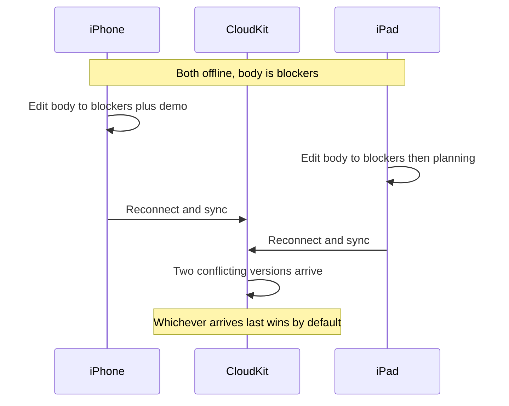

# Lecture 2 — SwiftData + CloudKit, the schema constraints, and the conflict you must resolve

Lecture 1 routed each byte to the right store and did the Keychain properly. This lecture is the **on-every-device** branch of the decision tree: a SwiftData store that mirrors itself into the user's private CloudKit database so their notes appear on every device they own, with no server you operate. The one-line config change that turns it on is genuinely one line. Everything that makes this lecture necessary is downstream of that line: the **schema constraints** CloudKit forces on you, the **silent failure modes** when you violate them, and the **two-device edit conflict** that you must resolve deterministically or lose a user's data.

We take them in the order you hit them on a real project: turn on sync (easy), comply with the constraints (mechanical but mandatory), then resolve the conflict (the actual engineering, and the week's "skill earned").

---

## 1. Turning on CloudKit sync — the one line, and what's behind it

You have a working SwiftData store from Week 10. To sync it to the user's private CloudKit database, you change the `ModelConfiguration`:

```swift
import SwiftData

@MainActor
func makeSyncingContainer() throws -> ModelContainer {
    let schema = Schema([Note.self, Tag.self])
    let config = ModelConfiguration(
        schema: schema,
        // The whole change: name your CloudKit container, mark it private.
        cloudKitDatabase: .private("iCloud.com.crunch.notes")
    )
    return try ModelContainer(for: schema, configurations: [config])
}
```

That is the line. Behind it, three things must be set up *outside* the code, in Xcode and the Apple Developer portal — and this is why CloudKit needs the paid membership:

1. **The iCloud capability** on the app target, with **CloudKit** checked and a CloudKit **container** named (`iCloud.com.crunch.notes`). Xcode creates the container in your developer account.
2. **The Background Modes capability** with **Remote notifications** checked — CloudKit pushes a silent notification when another device changes data, which is how sync stays current without polling.
3. A **paid Apple Developer account.** The iCloud entitlement is not available on a free account. You can write and compile every line of this lecture without it; you cannot actually *sync* without it.

What happens at runtime: SwiftData stands up an `NSPersistentCloudKitContainer` under the hood (the same Core Data lineage from Week 10 — CloudKit sync is a Core Data feature SwiftData exposes). It mirrors each `@Model` into a CloudKit **record type**, uploads local changes to the user's **private database** (their personal iCloud, which you the developer cannot read — it counts against *their* iCloud quota, not yours), and downloads changes other devices made, merging them into the local store. `@Query` picks up the merged changes automatically, exactly as it picks up a `@ModelActor`'s background save from Week 10. The user signs into iCloud; the data appears on their other devices; you ran no server.


*How one device's edit reaches the user's other devices through CloudKit sync.*

The three databases CloudKit offers, so you pick the right one:

- **Private** — per-user, only that user's devices, only that user (and you can't read it). This is what a personal notes app wants. `.private(...)`.
- **Shared** — a private record a user explicitly shares with another user (a shared note). A bigger feature; not this week.
- **Public** — readable by all users (a global catalog). Counts against *your* quota. Not for personal data.

For Notes v1 it is `.private`. The user's notes, on the user's devices, on the user's dime.

---

## 2. The schema constraints — what CloudKit forbids, and why

Here is where the one line stops being free. CloudKit's record model is more restrictive than SQLite's, so SwiftData refuses to mirror a schema that uses features CloudKit can't represent. If you turn on sync over a Week 10 schema unchanged, you will hit these. They are not optional; they are the cost of sync.

**Constraint 1 — every relationship must be optional.** CloudKit syncs records independently and out of order. Device A might receive the `Tag` before the `Note` that points at it, or vice versa. So a relationship cannot be non-optional (the target may not have arrived yet). Every `@Relationship` becomes optional:

```swift
// Week 10 (local-only): non-optional relationship is fine.
@Relationship(deleteRule: .nullify, inverse: \Tag.notes)
var tags: [Tag]

// CloudKit-safe: to-many relationships are already "optional" (an empty array),
// but a to-ONE relationship must become optional:
@Relationship(deleteRule: .nullify, inverse: \Tag.cover)
var cover: Asset?        // was `Asset` — must be `Asset?` for CloudKit
```

To-many relationships (arrays) are already fine — an empty array is the "not yet arrived" state. The bite is to-one relationships and any required reference.

**Constraint 2 — no `@Attribute(.unique)`.** CloudKit has no uniqueness constraint. Two devices could both create a `Tag(name: "swift")` offline; when they sync, CloudKit cannot enforce "only one." So SwiftData forbids `.unique` on a synced model entirely. The Week 10 `Tag.name` was `@Attribute(.unique)` — that has to go:

```swift
// Week 10:
@Attribute(.unique) var name: String

// CloudKit-safe: drop .unique. You now dedupe in app logic, not the store.
var name: String
```

This is the most consequential change, because the `.unique` upsert was *doing work* — it guaranteed one tag per name. Without it, you can get two "swift" tags after a sync. You now have to **dedupe in application code**: on the conflict-resolution path (§4), or by querying for an existing tag by name before inserting, accepting that a brief window of duplicates is possible across devices and resolving it deterministically. Losing the store-enforced uniqueness is the real tax of CloudKit.

**Constraint 3 — every non-optional property needs a default value.** Same out-of-order reasoning: when a new property arrives on a record that predates it, CloudKit needs a value to fill in. So every stored property must be optional *or* have a default:

```swift
// CloudKit-safe: defaults everywhere.
@Model
final class Note {
    var title: String = ""           // default, not bare `var title: String`
    var body: String = ""
    var createdAt: Date = Date.now
    var updatedAt: Date = Date.now
    var tags: [Tag]? = []            // optional to-many
    // ...
}
```

**Constraint 4 — no `deny`/`noAction` delete rules that CloudKit can't model**, and a couple of smaller ones (no `originalName`-based renames mid-sync without care). The big three above are the ones you will hit on day one.

The refactoring discipline: keep a **CloudKit-safe schema** as the synced shape, and accept that you trade store-enforced invariants (uniqueness) for app-enforced ones. The schema gets a little looser; your application logic gets a little smarter. That is the deal.

---

## 3. What a conflict is — and why the default can silently lose data

Now the engineering. A **conflict** is: two devices edit the *same record* while both are offline (or before sync catches up), and then both sync. CloudKit has two versions of the record and must produce one. Picture it concretely:

```text
t0  Note "Standup" exists on both iPhone and iPad, body = "blockers?"
t1  Both devices go offline (airplane mode).
t2  On iPhone, user edits body -> "blockers + demo"
t3  On iPad,   user edits body -> "blockers, then planning"
t4  Both devices come back online and sync.
    -> CloudKit has two conflicting versions of the same Note. Now what?
```


*Two offline edits to the same note collide the moment both devices reconnect.*

CloudKit's built-in behavior for SwiftData is **last-writer-wins at the record level**: whichever change CloudKit *receives last* overwrites the whole record. This is the trap. "Last received" is not "last edited" — it depends on network timing, which device reconnected first, retry order. It is **non-deterministic from the user's point of view**, and it overwrites the *entire record*, so if iPhone changed the `body` and iPad changed the `title`, the loser's change to a *different field* is also gone. The user sees one of their edits silently vanish, with no error, no merge, no warning. That is the data-loss incident this lecture exists to prevent.

The fix is to make conflict resolution **a policy you chose**, applied **deterministically**, ideally **at the field level** so non-overlapping edits both survive.

---

## 4. Resolving the conflict deterministically

There are three standard policies, in increasing order of effort and quality:

### Policy A — Timestamp last-write-wins (deterministic LWW)

Add an `updatedAt` to every record, bump it on every edit, and on conflict keep the version with the **later `updatedAt`**. This is still "last write wins," but now "last" means "last *edited*," which is deterministic and matches the user's mental model — the most recent edit wins, regardless of network timing.

```swift
@Model
final class Note {
    var title: String = ""
    var body: String = ""
    var createdAt: Date = Date.now
    var updatedAt: Date = Date.now   // bumped on EVERY edit — the conflict tiebreaker

    func edit(title: String? = nil, body: String? = nil) {
        if let title { self.title = title }
        if let body  { self.body = body }
        self.updatedAt = .now        // every mutation goes through here
    }
}

/// Deterministic merge: the later-edited version wins as a whole.
func resolveLWW(local: Note, remote: NoteSnapshot) {
    guard remote.updatedAt > local.updatedAt else { return }  // local is newer; keep it
    local.title = remote.title
    local.body  = remote.body
    local.updatedAt = remote.updatedAt
}
```

The discipline that makes this work: **every mutation bumps `updatedAt`.** Route edits through one method (`edit(...)`) so you can never forget. If one code path mutates `body` without bumping `updatedAt`, the tiebreak is wrong and you lose the edit you meant to keep. Deterministic LWW is *correct* only if the timestamp is *always* maintained.

### Policy B — Field-level merge

LWW at the record level still discards the loser's edit to a *different* field (iPhone's title change loses if iPad's body change is newer). A field-level merge keeps both non-overlapping edits by tracking a timestamp *per field* (or by detecting which fields actually changed) and merging field by field:

```swift
struct NoteSnapshot {
    var title: String;     var titleUpdatedAt: Date
    var body: String;      var bodyUpdatedAt: Date
}

func merge(local: inout NoteSnapshot, remote: NoteSnapshot) {
    if remote.titleUpdatedAt > local.titleUpdatedAt {
        local.title = remote.title
        local.titleUpdatedAt = remote.titleUpdatedAt
    }
    if remote.bodyUpdatedAt > local.bodyUpdatedAt {
        local.body = remote.body
        local.bodyUpdatedAt = remote.bodyUpdatedAt
    }
}
```

Now iPhone's title edit and iPad's body edit *both survive* — only a true same-field conflict falls back to LWW on that field. This costs you a timestamp per field (or a changed-field set), which is more schema and more bookkeeping, but it is what users expect: "I changed the title on my phone and the body on my iPad, and both stuck."

### Policy C — CRDTs / operational merge

For genuinely concurrent collaborative text (two people typing in the same paragraph), even field-level LWW loses keystrokes, and you reach for a **CRDT** (conflict-free replicated data type) that merges character-level operations. This is the right answer for a Google-Docs-style editor and the wrong amount of machinery for a personal notes app. We name it so you know the ceiling exists; Notes v1 uses Policy A (record LWW by `updatedAt`) with an optional stretch to Policy B.

### The non-negotiable: determinism

Whatever policy you pick, the requirement is the same: **given the same two versions, every device must compute the same winner, every time, independent of which arrived first.** LWW-by-network-timing fails this (the winner depends on reconnection order). LWW-by-`updatedAt` passes it (the later timestamp wins on every device). A non-deterministic policy means two devices can end up with *different* "resolved" states and never converge — the worst sync bug there is, because it looks fine on each device in isolation.

---

## 5. Reproducing the conflict deterministically (the drill)

You cannot fix a conflict you can't reproduce, and conflicts are timing-dependent, so you have to *force* one. The drill, which the mini-project walks step by step:

1. **Two clients, one account.** Run the app in two Simulators (or a Simulator and a device) both signed into the **same iCloud account** in Settings. They now share one private CloudKit database.
2. **Go offline on both.** Enable airplane mode (or `Settings ▸ Developer ▸ Network Link Conditioner ▸ 100% loss`, or just `Features ▸ Toggle Network` in the Simulator) on both so neither syncs.
3. **Edit the same record differently** on each — change the body of the same note to two different strings.
4. **Reconnect both.** Turn networking back on. Sync runs. The conflict fires.
5. **Observe** which version won, and whether it matched your policy. With the default record-LWW-by-network-timing, the winner is whichever synced last — non-deterministic. With your `updatedAt` policy installed, the later-edited version wins, deterministically, every run.

The "no paid account" fallback (for compiling and unit-testing the *logic* without two synced devices): write the resolution policy as a **pure function over two snapshots** (as in §4) and unit-test it with hand-constructed conflicting versions. You assert that `resolve(a, b) == resolve(b, a)` (order-independence = determinism) and that the later-`updatedAt` version wins. That test runs with `isStoredInMemoryOnly` and no CloudKit at all, which is exactly why §4 factored the policy into a pure function — *testable conflict resolution is conflict resolution you wrote as a function, not as a side effect buried in a sync callback.* Exercise 3 builds exactly this test.

### CloudKit sync vs the Week 13 offline-replay — two different jobs

A point of confusion worth heading off: you built **offline write-replay** against the Vapor backend in Week 13, and now you're turning on **CloudKit sync**. Are these the same thing? No — and a senior reviewer will ask you to articulate the difference.

- **CloudKit sync** keeps the user's data the same across *their own devices*, peer-to-peer through Apple's infrastructure, with no server you operate. It is "my notes on my iPhone and my iPad." It does not touch your Vapor backend at all.
- **Vapor offline-replay** (Week 13) keeps the user's data in sync with *your server* — the source of truth for anything the server owns (shared notes, server-side validation, the StoreKit receipt in Week 18). It is "my notes reach the backend even if I was offline when I wrote them."

The capstone in Phase IV combines them: CloudKit as the primary multi-device sync, and the Vapor backend as a *fallback* and a server-of-record for the parts CloudKit can't own. This week you only wire CloudKit; the two layers coexist because they answer different questions ("same on my devices" vs "reached my server"). The mental model: CloudKit syncs *between the user's devices*; your backend syncs *between the user and the world*. Don't make CloudKit do the second job — it's the user's private database, which you, the developer, cannot even read.

---

## 6. Observing sync — events, errors, and the silent-failure trap

CloudKit sync is asynchronous and mostly invisible, which is comfortable until something goes wrong silently. SwiftData surfaces sync activity through the underlying `NSPersistentCloudKitContainer.eventChangedNotification`. You subscribe to log setup/import/export events and, crucially, their **errors** — because a schema-constraint violation or a quota problem shows up here, not as a thrown error at your call site:

```swift
import CoreData
import OSLog

let syncLog = Logger(subsystem: "com.crunch.notes", category: "cloudkit")

func observeSync() {
    NotificationCenter.default.addObserver(
        forName: NSPersistentCloudKitContainer.eventChangedNotification,
        object: nil, queue: .main
    ) { notification in
        guard let event = notification.userInfo?[
            NSPersistentCloudKitContainer.eventNotificationUserInfoKey
        ] as? NSPersistentCloudKitContainer.Event else { return }

        if let error = event.error {
            syncLog.error("CloudKit \(String(describing: event.type)) failed: \(error.localizedDescription)")
        } else if event.endDate != nil {
            syncLog.log("CloudKit \(String(describing: event.type)) finished")
        }
    }
}
```

The trap this defends against: you turn on sync, it *appears* to work, but a constraint you missed (a non-optional relationship, a stray `.unique`) makes the *export* silently fail, and your data never leaves the device. With no observer you see nothing — the app works locally, sync just doesn't happen. With the observer, the failed `export` event with its error is in your log on the first run. **Always install the sync observer during development.** It is the difference between "sync is broken and I have no idea" and "sync export is failing because `Note.cover` is non-optional — fix the schema."

The other silent failure to know: if the user is **not signed into iCloud**, sync simply doesn't happen — local SwiftData keeps working, nothing errors, data is just device-local. Handle it gracefully (the app must be fully usable offline and signed-out; sync is an enhancement, never a requirement). Check `CKContainer.default().accountStatus` if you need to *tell* the user, but never *block* on iCloud.

### Inspecting the mirrored schema in the CloudKit Console

Beyond the event observer, the **CloudKit Console** (<https://icloud.developer.apple.com/dashboard/>) is your other window into what sync actually did. Select your container, choose the **Development** environment, and look at **Schema ▸ Record Types**: you will see `CD_Note` and `CD_Tag` (the `CD_` prefix is the Core Data mirror) with `CD_`-prefixed fields for each of your properties. This is how you confirm a property actually mirrored — if a field is missing here, SwiftData didn't sync it, usually because it violated a constraint.

Two operational facts about the Console you will need:

- **The development schema is cached, and a bad change poisons it.** If you ship a schema, sync it, then change it incompatibly during development, CloudKit may refuse the new shape because the record type is already defined the old way. **Reset Development Environment** in the Console clears the cached schema so your new schema can re-create the record types. (Production schema is immutable once deployed — you only *add*, never change, which is the CloudKit version of the "never edit a released schema" rule from Week 10.)
- **Records are inspectable, but private-database records are the *user's*.** In development you see *your own* test account's records. In production you cannot see any user's private data — that's the privacy guarantee of the private database, and it's why a personal notes app uses it.

The Console plus the event observer together give you the full picture: the observer tells you *whether* an import/export ran and *if it errored*; the Console tells you *what* mirrored and lets you reset a poisoned schema. Use both during development; you can't debug sync blind.

---

## 6.5 The lineage again — what SwiftData + CloudKit is, one layer down

Week 10 hammered that SwiftData is a front end over Core Data. CloudKit sync is the clearest place that lineage pays off, because everything surprising about sync is explained by the Core Data + CloudKit machinery underneath the one config line.

When you set `cloudKitDatabase: .private(...)`, SwiftData builds an **`NSPersistentCloudKitContainer`** instead of a plain `NSPersistentContainer`. That class has done Core Data ↔ CloudKit mirroring since iOS 13; SwiftData just configures it for you. Knowing this gives you the vocabulary to debug sync, because the docs and five years of Stack Overflow are written about `NSPersistentCloudKitContainer`, not about the SwiftData veneer.

A few facts from that layer that change how you reason about your schema:

- **Each `@Model` becomes a CloudKit *record type*.** Your `Note` class maps to a `CD_Note` record type in the user's private database (the `CD_` prefix is Core Data's, the cousin of the `Z` prefix you saw in the SQLite store in Week 10). Open the **CloudKit Console** and you will see `CD_Note` and `CD_Tag` with `CD_`-prefixed fields. SwiftData wrote those through Core Data through CloudKit.
- **Relationships become *references*, and CloudKit references can dangle.** A reference whose target hasn't synced yet is simply nil until it arrives — which is the deep reason every relationship must be optional (§2). It is not a SwiftData rule; it is how CloudKit references work, surfaced as a SwiftData constraint.
- **Sync happens in a *record zone* with a *change token*.** CloudKit tracks "what changed since you last asked" with a server change token per zone. SwiftData persists that token and uses a silent push (the Background Modes ▸ Remote notifications capability) to know when to fetch. This is why you needed that capability: without it, the device only syncs when the app foregrounds and asks, not promptly when another device changes data.
- **The merge happens on a background context, then merges to the main context.** A CloudKit import doesn't touch your `mainContext` directly; it lands changes on an internal background context and merges them up, which is why your `@Query` updates "magically" — it's the same merge-notification mechanism a `@ModelActor` background save uses (Week 10). And it is why a heavy sync can briefly contend with the main thread, which is the hang you'll profile in Week 15.

The practical upshot: when sync misbehaves, drop one layer. "My relationship is nil after sync" → the target record hasn't arrived yet (references dangle). "Sync is slow on a big change" → the background merge is contending; profile it. "I changed my schema and now sync is broken" → the CloudKit development schema is cached; reset it in the Console. None of these are mysterious once you remember there is an `NSPersistentCloudKitContainer` and a CloudKit record zone under the one line you typed.

## 6.6 Getting synced data to an extension — App Groups meet CloudKit

A common real requirement: a widget or a Notification Service Extension needs to read the same synced notes the app shows. The extension runs in a separate process, so it cannot reach the app's private store — and here the file-system half of this week (lecture 1, §6) meets the sync half.

The supported pattern is to put the SwiftData store in an **App Group container** so both the app and the extension open the *same* store URL, and let CloudKit sync into that shared store:

```swift
@MainActor
func makeSharedSyncingContainer() throws -> ModelContainer {
    let groupID = "group.com.crunch.notes"
    guard let groupURL = FileManager.default
        .containerURL(forSecurityApplicationGroupIdentifier: groupID) else {
        fatalError("App Group not configured on both targets")
    }
    let storeURL = groupURL.appending(path: "Notes.store")

    let schema = Schema([Note.self, Tag.self])
    let config = ModelConfiguration(
        schema: schema,
        url: storeURL,                                   // the shared container
        cloudKitDatabase: .private("iCloud.com.crunch.notes")
    )
    return try ModelContainer(for: schema, configurations: [config])
}
```

Two consequences you must hold:

- **The store is now multi-process**, so any *file-level* access outside SwiftData's own coordination (a raw read of an exported snapshot, say) must use `NSFileCoordinator` (lecture 1, §5). SwiftData coordinates its own store access; you only coordinate files *you* touch alongside it.
- **The extension is usually a *reader*.** Let the app own writes (and therefore conflict resolution), and have the widget read with a bounded `FetchDescriptor`. Two processes both *writing* the same synced store is a sharp edge you avoid unless you have a strong reason.

This is the bridge between this week's three stores and Phase IV's widgets: the synced SwiftData store lives in an App Group, the token lives in a shared Keychain access group, and the extension reads both. You won't build the widget this week, but you should be able to draw where its data comes from — a shared store, synced by CloudKit, authenticated by a Keychain token, all three of which you wired this week.

---

## 7. Putting it together — a sync data-layer checklist

Before you call a SwiftData + CloudKit layer "done," walk this list — the code-review checklist a senior reviewer applies:

- **The schema is CloudKit-safe.** Every relationship optional, no `@Attribute(.unique)`, every non-optional property defaulted. You can point to each change and say "CloudKit needs this because records sync out of order."
- **Uniqueness is enforced in app logic**, not the store, since `.unique` is gone — you dedupe tags by name on insert and on the conflict path.
- **Every mutation bumps `updatedAt`** through a single edit method, so the LWW tiebreak is always valid.
- **Conflict resolution is a deterministic pure function** of two snapshots, unit-tested for order-independence (`resolve(a,b) == resolve(b,a)`), so it runs without a paid account or two devices.
- **The sync observer is installed** in development, logging `import`/`export`/`setup` events *and their errors*, so a silent export failure surfaces immediately.
- **The app is fully usable offline and signed out of iCloud.** Sync is an enhancement; local SwiftData is the source of truth on-device.
- **The token authenticating the user lives in the Keychain** (lecture 1) with `…AfterFirstUnlockThisDeviceOnly`, not in `UserDefaults` and not synced.
- **The two-device conflict drill passes**: edit the same note differently on two offline clients, reconnect, and the later-edited version wins deterministically — the same on both devices.

If you can tick every box, you have a sync layer that converges, never loses a credential, and surfaces its own failures. That is a higher bar than "I turned on the config flag and it seemed to work," and it is the bar that survives a real cohort of users on real networks editing on real second devices.

---

## 8. Recap

CloudKit sync over SwiftData is one config line and three taxes. The line — `cloudKitDatabase: .private("iCloud.…")` — gives you per-user, multi-device sync with no server you operate. The taxes are the lecture:

1. **Schema constraints.** Every relationship optional, no `.unique`, every property defaulted — because records sync independently and out of order. You trade store-enforced uniqueness for app-enforced dedup.
2. **The conflict.** Two offline edits to one record produce two versions, and CloudKit's default record-LWW-by-network-timing silently overwrites the loser — including their edits to *other* fields. You replace it with a **deterministic** policy: LWW by `updatedAt` (every mutation bumps it), or a field-level merge that keeps non-overlapping edits.
3. **Silent failure.** Sync is invisible, so a missed constraint fails the export silently. Install the event observer and watch the errors; never block the app on iCloud.

The deepest idea is the one that makes the conflict testable: **write resolution as a pure function over two snapshots, not as a side effect in a sync callback.** A pure function is deterministic by construction, unit-testable without CloudKit, and provably order-independent. That is how you ship multi-device sync that *converges* — every device, given the same two versions, computes the same answer.

The exercises put the Keychain wrapper and the conflict function under test; the mini-project turns on sync for Notes v1, stores the token in the Keychain, and makes you run the two-device drill until the right edit wins every time. Go make the data the same on every device — without losing any of it.
