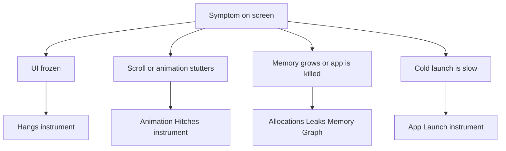
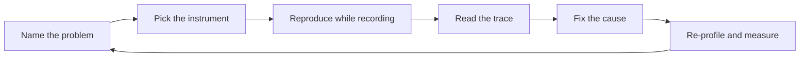

# Lecture 2 — Instruments: the right tool for the hang, the hitch, and the leak

Lecture 1 got the app onto a real device in a Release build — the only configuration that tells the performance truth. This lecture is what you do with that truth: profile with **Instruments**, pick the *right* instrument for the problem in front of you, read the flame graph, and ship a fix you can prove with a number. The central skill is not "run Instruments." It's *diagnosis* — naming the problem (hang? hitch? leak? launch?), reaching for the instrument that reads *that* problem, and resisting the overwhelming urge to optimize the thing you'd *guess* is slow, which is almost never the thing that is.

The framing for the whole lecture is one loop: **measure, fix, measure.** A fix without a before-and-after measurement is a guess wearing a confidence costume.

---

## 1. The performance mental model — frames, the main thread, and three problems

The iOS UI runs on a **render loop** tied to the display refresh. At 60 Hz you have **16.67 ms** per frame to do all your work; at 120 Hz (ProMotion) you have **8.33 ms**. Each frame, the system does a *commit* (your app produces the frame: layout, view updates), then *renders* and *displays* it. If your app's work for a frame doesn't finish before the deadline, that frame is late — the user sees a stutter.

The **main thread** is the UI thread. Layout, SwiftUI `body` evaluation, touch handling, and the render commit all happen there. Anything slow on the main thread *directly* costs frames, because the main thread can't draw the next frame while it's busy doing your slow thing. This single fact explains most app performance bugs: **slow work on the main thread is the disease; the symptom depends on how slow.**

Three distinct problems, three distinct symptoms, three distinct instruments — and conflating them is the most common diagnostic mistake:

- **A hang** is the main thread blocked for a *long* time (past the hang threshold, on the order of ~250 ms for a micro-hang up to seconds for a severe one). The UI is *frozen* — nothing responds. Caused by a synchronous slow operation on the main thread (a network call, a file read, a big Core Data fetch, a heavy computation). **Instrument: Hangs (or Time Profiler on the main thread).**
- **A hitch** is *one or a few frames* missing the deadline during animation or scrolling. The UI mostly works but *stutters* — a scroll jerks, an animation skips. Caused by too much work on the *render path* (an image decode mid-scroll, a layout storm, a fault per row). **Instrument: Animation Hitches.**
- **A leak / memory growth** is memory the app allocates and never frees. The symptom is the app being *jetsam-killed* (terminated by the OS for using too much memory) after a while, or growing unboundedly. Caused by a retain cycle, an abandoned cache, or holding objects you don't need. **Instrument: Allocations, Leaks, Memory Graph.**

Reaching for Allocations to diagnose a frozen UI, or the Hangs instrument to find a memory leak, is using the wrong tool. **Name the problem first.**



*Name the symptom first, then it tells you which instrument to open.*

---

## 2. Time Profiler — where the CPU actually goes

The Time Profiler is the workhorse. It **samples the call stack** of every thread on a timer (typically every 1 ms) and aggregates the samples into a call tree. A function that appears in many samples was running often; that's where the CPU time went. You launch it from Xcode (**Product ▸ Profile**, ⌘I, then choose **Time Profiler**), record while you reproduce the slow behavior, and read the result.

Two numbers you must distinguish:

- **Self time** — time spent *in this function's own code*, not its callees. A function with high self time is doing the expensive work itself.
- **Total time** — time in this function *and everything it called*. A function with high total but low self time is just a path to the expensive thing below it.

You read a Time Profiler trace by following total time *down* the call tree until self time *spikes* — that spike is the function actually burning the CPU. The **"Heaviest Stack Trace"** in the inspector does this for you: it shows the single hottest path. And crucially, **look at which thread**: cost on the **main thread** track is the cost that hurts the UI; the same work on a background thread may be fine.

```text
Reading a flame graph / call tree (conceptual):

  ContentView.body                         total 412ms  self   2ms   <- just a path
   └─ List rows                            total 408ms  self   5ms   <- still a path
       └─ NoteRow.body                     total 390ms  self   8ms
           └─ note.tags.count              total 380ms  self  12ms
               └─ SwiftData fault          total 360ms  self 360ms  <- HERE. the spike.
```

That bottom frame — 360 ms of self time in a SwiftData relationship fault, *on the main thread* — is the bug. It's the N+1 fault from Week 10, now visible as a flame graph instead of a footgun warning. The fix (prefetch the relationship, or move the fetch off-main) is the same; the profiler is how you *find* it without guessing.

The senior habit: **don't read the source looking for the slow thing. Profile, find the spike, then read that one function.** The slow thing is reliably somewhere you wouldn't have looked.

---

## 3. Hangs — the frozen UI

A hang is the main thread stuck. The **Hangs** instrument (and the on-device "Hang Detection" in the Debug gauges) flags intervals where the main thread didn't return to the run loop within the threshold. When you find one, the instrument shows you the **stack that was running** when the main thread was stuck — which is the synchronous operation to move off-main.

The classic shapes of a hang, all the same disease:

```swift
// HANG 1 — synchronous network on the main thread.
@MainActor
func loadNotes() {
    let data = try! Data(contentsOf: serverURL)   // BLOCKS the UI until the network returns
    notes = decode(data)
}

// HANG 2 — synchronous file/Core Data on the main thread.
@MainActor
func exportAll() {
    let everything = try! context.fetch(FetchDescriptor<Note>())  // big fetch on main = freeze
    try! archive(everything).write(to: exportURL)
}

// HANG 3 — heavy computation on the main thread.
@MainActor
func recompute() {
    summary = notes.map(expensiveSummarize).joined()  // O(n·cost) synchronous = freeze
}
```

The fix in every case is the structured concurrency from Week 4: get the slow work **off the main actor**, `await` the result, and update the UI back on `@MainActor`.

```swift
// FIXED — slow work off-main, UI update back on the main actor.
@MainActor
func loadNotes() async {
    let fetched = await Task.detached {                 // off the main actor
        let data = try? Data(contentsOf: serverURL)
        return data.flatMap { try? decode($0) } ?? []
    }.value
    notes = fetched                                     // back on @MainActor, automatically
}
```

For SwiftData specifically, the off-main pattern is the `@ModelActor` from Week 10 — a background context that does the fetch/import and hands back a `Sendable` result, with `@Query` picking up the merge on the main thread. **A hang is, almost always, work that belongs off `@MainActor` but isn't.** The Hangs instrument finds it; the concurrency you already know fixes it.

A note on the CloudKit connection from Week 14: a heavy sync import merges on a background context, but the *merge to the main context* and any main-thread `@Query` re-fetch it triggers can briefly contend — a classic source of a micro-hang right after sync. This is one of the first things you'll find profiling Notes v1 on-device.

---

## 4. Hitches — the stutter in a scroll

A hitch is subtler than a hang: the UI isn't frozen, it *stutters*. One frame, or a few, missed the deadline during an animation or scroll, so the motion isn't smooth. The **Animation Hitches** instrument measures this with a **hitch time ratio** — milliseconds of hitch per second of animation. Below a small threshold the user perceives smoothness; above it, visible jank.

The cause is work on the **render-commit path** — work that has to finish before a frame can be produced, happening *during* the scroll:

```swift
// HITCH — decoding a full-resolution image synchronously as each cell appears.
struct NoteRow: View {
    let note: Note
    var body: some View {
        HStack {
            // UIImage(data:) decodes the FULL image on the main thread, on the
            // scroll path, every time the cell is created. That's the hitch.
            Image(uiImage: UIImage(data: note.coverData)!)
            Text(note.title)
        }
    }
}
```

The image decode is fine in isolation; the bug is that it happens *synchronously during scroll*, blowing the 16.67 ms budget for the frames where new cells appear. The fixes, in order of preference:

```swift
// FIX A — let the framework decode off the main thread and downsample.
//         AsyncImage / a thumbnail pipeline decodes off-main and caches.
struct NoteRow: View {
    let note: Note
    var body: some View {
        HStack {
            Thumbnail(data: note.coverData)   // decodes off-main, caches, downsamples to display size
            Text(note.title)
        }
    }
}

// FIX B — downsample to the displayed size. Decoding a 4000px image into a
//         60px cell wastes CPU and memory; downsample with ImageIO's
//         kCGImageSourceThumbnailMaxPixelSize at the displayed dimension.
```

The general principle: **keep the scroll path cheap.** No synchronous decode, no synchronous fetch, no per-row relationship fault, no heavy layout during scroll. Defer or precompute anything expensive so each frame's commit fits the budget. The Animation Hitches instrument shows you exactly which frames blew the budget and what was on the commit path when they did.

The frame budget, memorized: **16.67 ms at 60 Hz, 8.33 ms at 120 Hz.** On a ProMotion device you have *half* the budget, so a hitch that's invisible on a 60 Hz device shows up on a 120 Hz one — another reason to profile on a real (often ProMotion) device, not the Simulator.

---

## 5. Memory — Allocations, Leaks, and the Memory Graph

Memory problems kill apps quietly: the OS *jetsams* (force-terminates) an app that uses too much, and the user just sees it "crash." Three tools, three jobs:

- **Allocations** tracks every allocation and shows **persistent** (still alive) vs **transient** (freed) memory over time. A persistent-memory line that climbs and never comes down is a leak or an unbounded cache. You find the growth, mark a generation, do the suspect action, and see what got allocated and stayed.
- **Leaks** finds memory that's unreachable but not freed — the classic **retain cycle**, usually a closure capturing `self` strongly:

```swift
// LEAK — the closure captures self strongly; the cycle never frees.
class NotesViewModel {
    var onUpdate: (() -> Void)?
    func observe() {
        onUpdate = {
            self.refresh()   // strong capture of self -> retain cycle -> leak
        }
    }
}

// FIXED — capture weakly so the cycle breaks.
func observe() {
    onUpdate = { [weak self] in
        self?.refresh()
    }
}
```

- **The Memory Graph debugger** (the three-circle icon in Xcode's debug bar, or in Instruments) answers "what is keeping *this* object alive?" — it shows the retain graph, so you can trace the chain of references back to the root that should have let go. When Leaks says "this leaked" but you don't know *why*, the Memory Graph shows the cycle.

For a SwiftUI app, the most common memory bug is a `[weak self]` you forgot in a Combine subscription or a closure stored on a long-lived object. Profile, mark a generation, navigate in and out of the screen a few times, and if persistent memory grows each cycle, you have a leak — the Memory Graph names the cycle.

---

## 6. App Launch and `os_signpost` — measuring your own intervals

### App Launch

The **App Launch** instrument breaks launch into **pre-main** (dyld loading your binary and frameworks, static initializers) and **post-main** (your `App.init`, the first view's setup, first frame). A slow cold launch is usually post-main work you could defer: building a big object graph in `init`, a synchronous read in `onAppear`, eager work that could wait until after the first frame. The fix is to defer non-critical setup off the launch path.

### `os_signpost` / `OSSignposter` — your code in the trace

Instruments shows you *system* tracks. To see *your* operations as named regions correlated with those tracks, emit **signposts**:

```swift
import OSLog

let perfLog = Logger(subsystem: "com.crunch.notes", category: "perf")
let signposter = OSSignposter(logger: perfLog)

func loadAndRender() {
    let state = signposter.beginInterval("loadAndRender")
    defer { signposter.endInterval("loadAndRender", state) }

    // ...the work you want to see as a named region in the trace...
}

// Or wrap any block:
func measured<T>(_ name: StaticString, _ work: () throws -> T) rethrows -> T {
    let state = signposter.beginInterval(name)
    defer { signposter.endInterval(name, state) }
    return try work()
}
```

Now `loadAndRender` appears as a labeled interval in the Instruments **os_signpost** track, lined up against the Time Profiler, Hangs, and Hitches tracks — so you can see "*my* load interval overlaps the hang the Hangs instrument flagged," which is the correlation that turns "something is slow" into "*this* operation is the slow thing." Signposts are the bridge between the profiler's view and your mental model of your own code. Sprinkle them at the boundaries of operations you care about (a fetch, a render, a sync merge) and the trace becomes legible.

---

## 6.5 The SwiftUI instrument — why is `body` running so much?

SwiftUI has its own Instruments template (**SwiftUI** / "View Body" and "Update Groups") that answers a question Time Profiler can't cleanly: *which views are recomputing their `body`, how often, and how long does each take?* This is the diagnostic for the most SwiftUI-specific performance bug — a `body` that re-evaluates far more than it should because of a state-ownership mistake.

Recall Week 8: `body` re-runs when the view's observed state changes. A common bug is observing too coarsely — a whole `@Observable` model injected into a screen, so a change to *any* property re-runs *every* view that touches the model, even views that only read an unrelated field. The SwiftUI instrument shows this as a `body` evaluation count that's wildly higher than the number of actual visible changes.

```swift
// OVER-RECOMPUTING — the row observes the whole store, so any store change
// re-runs every row's body, even rows whose data didn't change.
struct NoteRow: View {
    @Environment(NotesStore.self) var store      // observes ALL of store
    let id: Note.ID
    var body: some View {
        // reads only this note, but re-runs when ANY note in the store changes
        Text(store.notes.first { $0.id == id }?.title ?? "")
    }
}

// FIXED — pass the specific note; the row re-runs only when THAT note changes.
struct NoteRow: View {
    let note: Note                                // observes only this note
    var body: some View { Text(note.title) }
}
```

The SwiftUI instrument is how you *catch* this without guessing: profile, scroll/interact, and look for views with a `body` count out of proportion to what changed on screen. Then narrow the observed state (pass the leaf value, not the whole store) and re-profile to confirm the count dropped. A hitch is sometimes not "expensive work in one `body`" but "a cheap `body` running a thousand times" — the SwiftUI instrument distinguishes the two, where Time Profiler just shows a lot of SwiftUI internals.

## 6.6 A word on energy and thermals

Two effects only a real device shows, both relevant to honest measurement:

- **Thermal throttling.** Sustained CPU load heats the device; iOS *throttles* the CPU to cool it, so the *same* workload gets slower the longer you run it. A benchmark that looks fine in the first ten seconds can degrade after a minute under thermal pressure. The Simulator never throttles (it's on a Mac with a fan), which is one more reason its numbers lie. When profiling, let the device reach a steady state and watch for the trace's frequency dropping mid-capture — that's throttling, and it means your workload is too hot to sustain.
- **Energy cost.** The **Energy Log** and the Xcode Energy gauge show what your app costs in battery terms — CPU, GPU, networking, location. A feature that hammers the network or wakes the CPU constantly drains battery and, in extreme cases, gets your app flagged by the OS (and by users). MetricKit (§7) reports energy in the field. We don't dive deep here, but know that "fast" and "efficient" are different axes: a busy-wait that finishes quickly is fast and *terrible* for battery. On-device profiling is the only place you see the energy truth.

These are the device-only realities that make "profile on the device, in Release" non-negotiable: the Simulator can't throttle, can't show real energy, and runs on the wrong silicon. The device is the honest broker.

## 7. MetricKit — field telemetry from real users

Your one device tells you about *your* device. **MetricKit** tells you about *all* your users' devices, in aggregate, from the field — without you running a profiler on anyone. The OS collects metrics and diagnostics daily and delivers them to your app on next launch.

```swift
import MetricKit
import OSLog

let metricLog = Logger(subsystem: "com.crunch.notes", category: "metrickit")

final class MetricsCollector: NSObject, MXMetricManagerSubscriber {
    static let shared = MetricsCollector()

    func start() {
        MXMetricManager.shared.add(self)
    }

    // Daily aggregated METRICS: launch time, hang rate, memory, disk, scroll hitches.
    func didReceive(_ payloads: [MXMetricPayload]) {
        for payload in payloads {
            if let launch = payload.applicationLaunchMetrics {
                metricLog.log("launch time histogram: \(launch.histogrammedTimeToFirstDraw.debugDescription)")
            }
            if let responsiveness = payload.applicationResponsivenessMetrics {
                metricLog.log("hang time histogram: \(responsiveness.histogrammedApplicationHangTime.debugDescription)")
            }
            // In production you'd forward payload.jsonRepresentation() to your backend.
            metricLog.log("metric payload received: \(payload.jsonRepresentation().count) bytes")
        }
    }

    // DIAGNOSTICS: crashes, hangs, CPU exceptions, disk-write exceptions, with call stacks.
    func didReceive(_ payloads: [MXDiagnosticPayload]) {
        for payload in payloads {
            for crash in payload.crashDiagnostics ?? [] {
                metricLog.error("crash: \(crash.callStackTree.jsonRepresentation().count) bytes of stack")
            }
            for hang in payload.hangDiagnostics ?? [] {
                metricLog.error("hang diagnostic: duration \(hang.hangDuration)")
            }
        }
    }
}
```

Register the subscriber early (in `App.init` or `applicationDidFinishLaunching`). The payloads arrive **once per day**, batched, on a subsequent launch — you won't see one immediately; the delivery model is "the OS collected yesterday's data, here it is." In production you forward `jsonRepresentation()` to your backend (the Vapor service, eventually) and aggregate it into a dashboard, so you know your *real* users' hang rate and launch time, not just what you measured on your desk. This is the closing of the loop: Instruments for the hang you can reproduce, MetricKit for the hangs you can't because they only happen on a device you don't own.

---

## 8. The measure-fix-measure loop — and a checklist

The whole week is one discipline applied repeatedly:

1. **Name the problem.** Frozen UI → hang. Stutter in a scroll → hitch. Growing memory / jetsam → leak. Slow launch → App Launch. Don't skip this; it picks the instrument.
2. **Pick the instrument** that reads *that* problem (§1's table).
3. **Reproduce while recording** on a Release build on the device.
4. **Read the trace** — flame graph spike (self time, main thread), the flagged hang stack, the over-budget frames, the persistent-memory climb.
5. **Fix the cause**, not a guess — move work off-main, prefetch the fault, defer the launch work, break the cycle.
6. **Re-profile** and state the result as a **number**: hang count 2 → 0, hitch ratio 41 ms/s → 3 ms/s, launch 1.4 s → 0.9 s.



*The measure-fix-measure loop runs continuously, not once.*

The code-review checklist a senior reviewer applies to a "performance fix" PR:

- **There is a before trace and an after trace**, and the description quotes numbers from both.
- **The fix targets the profiled cause**, not a guessed one — the PR can point at the flame-graph spike it removed.
- **The measurement was on-device, Release** — not the Simulator, not Debug.
- **No work was added to the main thread / render path**; slow work is off-main via structured concurrency or a `@ModelActor`.
- **Signposts mark the relevant operations** so the next person can re-measure.
- **MetricKit is collecting** so the fix can be confirmed in the field, not just on the author's desk.

---

## 9. Recap

The Simulator lies; the device tells the truth; Instruments reads it. The skill this week earns is *diagnosis* — naming the problem and reaching for the right instrument:

- **Time Profiler** for "where's the CPU" — read the flame graph down total time to the self-time spike, on the main-thread track.
- **Hangs** for the frozen UI — find the synchronous main-thread work and move it off `@MainActor`.
- **Animation Hitches** for the scroll stutter — keep the render path cheap; no synchronous decode or fault per frame; respect the 16.67/8.33 ms budget.
- **Allocations / Leaks / Memory Graph** for memory — find the persistent-memory climb and the retain cycle; `[weak self]` the closure.
- **App Launch** for cold-start cost — defer non-critical setup off the launch path.
- **`os_signpost`** to put your own intervals in the trace, correlated with the system tracks.
- **MetricKit** to learn your real users' performance, not just your one device's.

And one loop binding all of it: **measure, fix, measure.** A performance claim without a before/after trace is a guess. The exercises plant a hang and a hitch for you to find and fix; the mini-project does it on Notes v1, on your device, with traces — and ships a MetricKit collector so the app keeps reporting once it's in the world. Go make it fast, and *prove* it.
