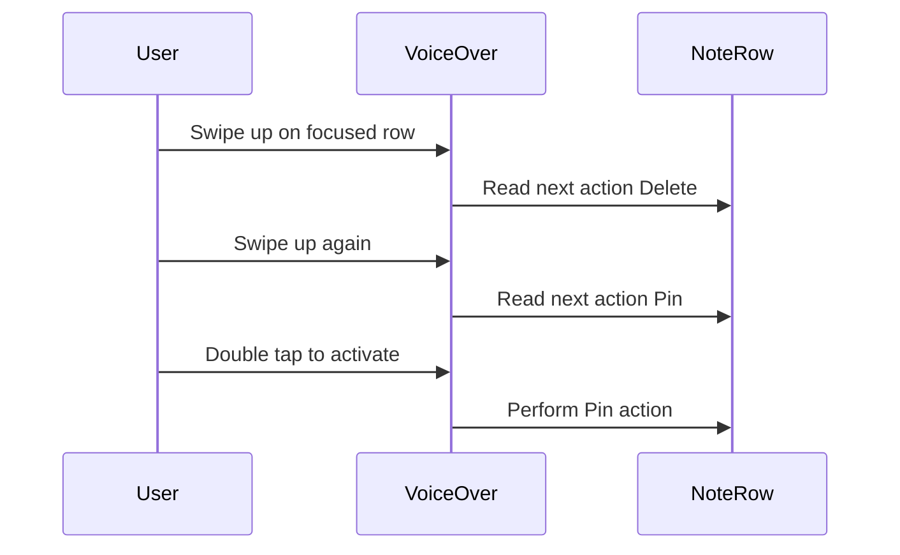
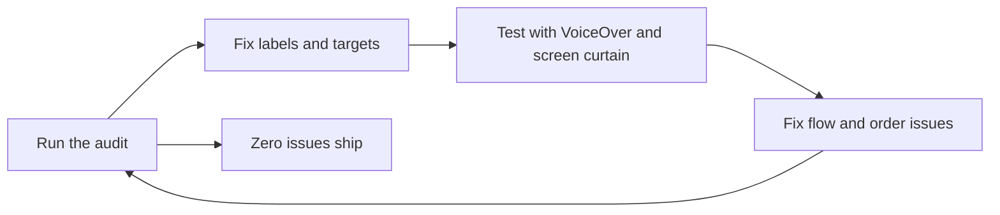

# Lecture 1 — VoiceOver and the accessibility tree: accessibility is engineering, not charity

> "Your app has two user interfaces. One is the pixels on the screen. The other is the accessibility tree — the structured description VoiceOver reads aloud and navigates with gestures. Most engineers only build the first one and assume the second comes free. It mostly does, until it doesn't, and the place it doesn't is exactly where your custom views are."

This is the lecture that reframes accessibility from a chore into engineering. The reframe is load-bearing, so let's do it first and then build the model. **An inaccessible app is broken** — not "less polished," *broken* — for the users who rely on assistive technology, in the same concrete way a crashing app is broken. A blind user navigating with VoiceOver hits your unlabeled icon button and the app announces "button" with no idea what it does; that's a dead end, a feature they cannot use. You wouldn't ship a crash; don't ship a dead end. And the good news that makes this tractable: SwiftUI gives you a strong accessible default, you audit the gaps with a tool, and you fix them with a handful of modifiers. Audit, find, fix, verify — the same loop you ran with Instruments last week, pointed at a different axis of quality.

The framing for the whole lecture is the **accessibility tree**: your app's second user interface, the one assistive technology actually consumes. Build a correct tree and VoiceOver, Switch Control, Voice Control, and the rest all work. Neglect it and they all fail together.

---

## 1. The accessibility tree — your app's second UI

When iOS renders your app, it builds two things: the **visual hierarchy** (the pixels) and the **accessibility tree** (a parallel structure of *accessibility elements*, each with a label, an optional value, a set of traits, a frame, and actions). VoiceOver doesn't look at your pixels — it walks the accessibility tree, and for each element it announces, roughly: **label**, then **value**, then **traits** ("button", "heading", "selected"), then optionally a **hint** ("double-tap to open").

```text
Visual hierarchy (what you see)        Accessibility tree (what VoiceOver reads)
──────────────────────────────         ─────────────────────────────────────────
VStack                                  (container — usually transparent)
 ├─ Text("Groceries")          ──────►  element: label "Groceries", trait .header
 ├─ HStack                              (container)
 │   ├─ Image(systemName:"tag")  ─────►  element: label "tag" (BAD — decorative noise)
 │   └─ Text("3 tags")          ──────►  element: label "3 tags"
 └─ Button { } label: Image("trash") ─► element: label "trash" (BAD — should be "Delete")
                                                trait .isButton
```

That diagram shows both the win and the work. The `Text` views became sensible elements for free — SwiftUI inferred their labels from their strings. The `Button` correctly got the `.isButton` trait. But two elements are *wrong*: the decorative tag icon is announced as meaningless noise ("tag"), and the delete button reads "trash" (the SF Symbol's name) instead of "Delete." Those two lines are the work this lecture teaches: shape the tree so it reads the way a sighted user *understands* the UI, not the way the pixels happen to be structured.

The key mental model: **the visual hierarchy and the accessibility tree are related but not identical.** SwiftUI generates the tree from your views with good defaults, and you *adjust* it — relabel, retrait, hide decorative elements, merge fragments into one element — so the announced experience matches the intended one. You are not building a separate UI; you are correcting the auto-generated description of the one you built.

---

## 2. VoiceOver — how a blind user operates your app

To shape the tree well you have to know how it's consumed. **VoiceOver** is iOS's screen reader. With it on:

- **Focus** sits on one element at a time; VoiceOver speaks that element.
- **Swipe right / left** moves focus to the next / previous element in reading order.
- **Double-tap anywhere** activates the focused element (the equivalent of a tap).
- **The rotor** (two-finger twist) switches navigation modes — by heading, by link, by word, by container — so a user can jump between headings instead of swiping through every element.
- **The screen curtain** (three-finger triple-tap) turns the display *black* while keeping VoiceOver on — so a blind user (or you, testing) operates with zero visual information. This is the honest test: if you can complete a task with the curtain on, the app is operable; if you can't, it's broken.

What VoiceOver announces for a focused element, in order: **label** (what it is), **value** (its current state, if any), **trait** (button/heading/selected/…), and **hint** (how to use it, if provided). So "Delete, button, double-tap to delete the note" is label + trait + hint. Your job is to make each of those correct and concise.

Two ways to test, and you need both:

- **The Accessibility Inspector** (Xcode ▸ Open Developer Tool ▸ Accessibility Inspector) — runs against the Simulator or device, lets you inspect each element's label/value/traits, run an automated **audit**, and *simulate* VoiceOver navigation. This is your fast audit loop (§7).
- **Real VoiceOver on a device** — Settings ▸ Accessibility ▸ VoiceOver (or set the Accessibility Shortcut to triple-click the side button to toggle it). Nothing substitutes for actually swiping through your app with the screen curtain on. The Inspector finds *missing labels*; only real VoiceOver reveals *bad reading order* and *confusing flow*.

---

## 3. Labels — the single most important thing you'll add

`accessibilityLabel` is the concise name VoiceOver reads. SwiftUI infers it for you in the easy cases — `Text` uses its string, standard controls describe themselves — and you must supply it everywhere SwiftUI can't infer it, which is **every icon-only button and every meaningful image.**

```swift
// BAD — VoiceOver reads "trash" (the SF Symbol name). Meaningless to the user.
Button {
    delete(note)
} label: {
    Image(systemName: "trash")
}

// GOOD — a label describing the PURPOSE, not the icon.
Button {
    delete(note)
} label: {
    Image(systemName: "trash")
}
.accessibilityLabel("Delete note")
```

The rule for a good label: **describe the purpose, in a few words, without the control type.** "Delete note" — *not* "Delete note button" (VoiceOver adds "button" from the trait; saying it yourself is redundant), *not* "trash" (the icon, not the action), *not* "Tap here to delete this note from your list of notes" (a sentence where a phrase will do). Concise, purposeful, no redundant type.

Images split into two cases:

```swift
// MEANINGFUL image — give it a label describing what it conveys.
Image("user-avatar")
    .accessibilityLabel("Profile photo of \(user.name)")

// DECORATIVE image — hide it from the tree so it's not announced as noise.
Image(systemName: "sparkles")
    .accessibilityHidden(true)
```

A decorative flourish that adds nothing to comprehension should be `accessibilityHidden(true)` so VoiceOver skips it — an icon announced as "sparkles" between every list row is noise that makes the app *harder* to use, not easier. Deciding "meaningful vs decorative" for each image is a real part of the work, and the answer is "does a sighted user get information from it?" If yes, label it; if no, hide it.

---

## 4. Value, hint, and identifier

Beyond the label, three more pieces shape an element:

**`accessibilityValue`** — the element's current *state*, separate from its name. A label says *what it is*; a value says *what it currently is*.

```swift
// A custom rating control: label is the name, value is the current rating.
HStack { /* star views */ }
    .accessibilityElement(children: .ignore)
    .accessibilityLabel("Rating")
    .accessibilityValue("\(stars) out of 5 stars")
    .accessibilityAdjustableAction { direction in
        switch direction {
        case .increment: stars = min(stars + 1, 5)
        case .decrement: stars = max(stars - 1, 0)
        default: break
        }
    }
```

VoiceOver announces "Rating, 3 out of 5 stars, adjustable" and the user swipes up/down to change it — because you gave it a value and an adjustable action. State (selected, on/off, a percentage, a count) belongs in the value, not crammed into the label, so VoiceOver re-announces just the value when it changes.

**`accessibilityHint`** — a *last-resort* description of the non-obvious action. "Double-tap to open the note." Use it sparingly: a hint is a sign the label or the design isn't self-explanatory, and a well-designed control rarely needs one. Hints are also the most verbose thing VoiceOver says, so overusing them makes the app tiring. Reach for a clearer label before a hint.

**`accessibilityIdentifier`** — a *non-localized, stable* string for UI tests, **not** read by VoiceOver. This is the bridge to the snapshot/UI tests from earlier weeks: your test finds the element by `accessibilityIdentifier("deleteButton")` while VoiceOver reads the `accessibilityLabel("Delete note")`. Keep them distinct — the identifier is for your tests (stable, code-y), the label is for the user (localized, human).

---

## 5. Traits — telling VoiceOver how to treat an element

**Traits** describe an element's *role and state* so VoiceOver treats it correctly. SwiftUI applies many automatically (a `Button` gets `.isButton`), but custom views and special semantics need explicit traits:

```swift
// A custom tappable card that VoiceOver should treat as a button.
myCardView
    .accessibilityAddTraits(.isButton)

// A section title that should be reachable via the rotor's "headings" mode.
Text("Pinned")
    .accessibilityAddTraits(.isHeader)

// A selected row in a custom list.
rowView
    .accessibilityAddTraits(isSelected ? .isSelected : [])
```

The traits you'll use most:

- **`.isButton`** — "this is tappable"; double-tap activates it. Essential for any custom tappable view VoiceOver would otherwise read as static content.
- **`.isHeader`** — "this is a section heading"; makes it a rotor navigation target so users can jump between sections instead of swiping through everything.
- **`.isSelected`** — "this is the selected one" (a selected tab, a chosen option).
- **`.updatesFrequently`** — "this value changes a lot" (a timer, a progress count); tells VoiceOver to handle frequent updates gracefully.
- **`.isModal`** — "focus is trapped here" (a presented sheet); keeps VoiceOver inside the modal instead of wandering to the content behind it.

The `.isHeader` trait is quietly one of the highest-value additions: a screen with proper headers lets a VoiceOver user navigate it like a sighted user scans it — jump to the section they want — instead of swiping linearly through every element. Mark your section titles as headers and the whole screen becomes navigable.

---

## 6. Shaping the tree — combine, ignore, hide

A custom composite view — say a list cell with a title, a date, and a tag count — generates *several* accessibility elements by default, so VoiceOver makes the user swipe through "Groceries", then "yesterday", then "3 tags" as three separate stops. That's tedious. You usually want the whole cell to be *one* element that reads as a sentence. `accessibilityElement(children:)` controls this:

```swift
// BEFORE — three separate VoiceOver stops per cell. Tedious to navigate.
struct NoteRow: View {
    let note: Note
    var body: some View {
        VStack(alignment: .leading) {
            Text(note.title).font(.headline)
            Text(note.updatedAt, style: .relative).font(.caption)
            Text("\(note.tags.count) tags").font(.caption)
        }
    }
}

// AFTER — one element that reads as a sentence, with a clean label.
struct NoteRow: View {
    let note: Note
    var body: some View {
        VStack(alignment: .leading) {
            Text(note.title).font(.headline)
            Text(note.updatedAt, style: .relative).font(.caption)
            Text("\(note.tags.count) tags").font(.caption)
        }
        .accessibilityElement(children: .combine)   // merge children into ONE element
        // (.combine concatenates the children's labels; or use .ignore + a custom label)
    }
}
```

The three `children:` strategies:

- **`.combine`** — merge the children's accessibility into one element, concatenating their labels. "Groceries, 2 hours ago, 3 tags" as one stop. Good default for a cell.
- **`.ignore`** — drop the children's accessibility entirely and supply your own label/value on the container. Use when the auto-concatenation is awkward and you want full control of the announced string.
- **`.contain`** — keep the children as separate elements but mark this as a container (for the rotor's container navigation). Use for a genuine group the user should be able to navigate into.

And `accessibilityHidden(true)` removes an element from the tree — for decorative images, redundant visual flourishes, and anything that's pure visual styling with no informational value. Hiding noise is as important as labeling signal; a tree cluttered with decorative elements is exhausting to navigate.

---

## 6.5 Custom actions — collapsing a swipe menu into the rotor

A list row often has secondary actions a sighted user reaches by swiping the row (delete, pin, share). For a VoiceOver user, those swipe gestures are unreachable — swiping moves *focus*, it doesn't reveal a swipe menu. The fix is `accessibilityActions`, which exposes those secondary actions through VoiceOver's **actions rotor** (the user swipes up/down on the focused row to cycle the available actions, then double-taps to perform one):

```swift
struct NoteRow: View {
    let note: Note
    let onDelete: () -> Void
    let onPin: () -> Void

    var body: some View {
        NoteRowContent(note: note)
            .accessibilityElement(children: .combine)
            // These appear in VoiceOver's actions rotor for this row.
            .accessibilityAction(named: "Delete") { onDelete() }
            .accessibilityAction(named: "Pin") { onPin() }
    }
}
```

Now a VoiceOver user focuses the row, swipes up to hear "Delete," "Pin," double-taps to perform — the same secondary actions a sighted user gets from a swipe, exposed through the rotor. Without this, the swipe-only actions are simply invisible to VoiceOver, and the user can read a note but can't delete it without leaving the list. Custom actions are how you make gesture-driven affordances reachable non-visually, and they're frequently the difference between "the app is readable with VoiceOver" and "the app is *operable* with VoiceOver."


*Custom actions expose swipe-menu behavior through VoiceOver's actions rotor.*

## 7. The Accessibility Inspector — your audit loop

You found performance bugs with Instruments; you find accessibility bugs with the **Accessibility Inspector**. It has three jobs:

1. **Inspection.** Point it at any element (in the Simulator or on a connected device) and it shows the element's label, value, traits, and frame — so you can verify "does VoiceOver see what I intended?" without turning on VoiceOver.
2. **Audit.** Run the automated audit on a screen and it reports issues: **elements with no label**, **labels that are likely the wrong content**, **hit targets below 44×44 points**, **contrast failures**, **clipped text at large Dynamic Type**, and more. This is the fast first pass — it catches the mechanical failures (the unlabeled button) in seconds.
3. **VoiceOver simulation.** Step through the elements in VoiceOver's reading order and hear/read what it would announce, so you can check *flow* and *order* on the Mac before testing on the device.

The audit is your "Instruments capture" for accessibility: run it, get a list of issues, fix each, re-run until it's clean. But — exactly like the performance audit — **the automated audit is necessary, not sufficient.** It finds missing labels and small targets; it cannot tell you that your reading order is confusing, that your "3 tags" cell should read as one element, or that a sighted user understands a color cue a blind user can't. The audit catches the mechanical bugs; real VoiceOver on a device with the screen curtain catches the experiential ones. You run both, the same way you read both the flame graph *and* the user-perceived smoothness last week.

A good workflow: run the **audit** to fix the mechanical issues to zero, then **VoiceOver on the device with the screen curtain** to fix the flow issues, then run the audit once more to confirm you didn't regress. Audit → curtain → audit. That's the loop.


*The audit-curtain-audit loop closes when the automated audit is clean and the app is fully operable with the screen black.*

---

## 7.5 Focus management and announcements — telling VoiceOver what changed

Two situations need you to *actively drive* VoiceOver rather than just describe static elements: moving focus when the UI changes, and announcing something that has no on-screen element.

**Moving focus.** When you present a new screen or reveal new content, VoiceOver's focus stays where it was unless you move it — and a user who can't see the new content won't know to swipe to it. `@AccessibilityFocusState` lets you place focus programmatically:

```swift
struct EditNoteView: View {
    @AccessibilityFocusState private var titleFocused: Bool
    @State private var title = ""

    var body: some View {
        Form {
            TextField("Title", text: $title)
                .accessibilityFocused($titleFocused)
        }
        .onAppear {
            // Move VoiceOver focus to the title field when the editor appears,
            // so the user lands where they can start typing.
            titleFocused = true
        }
    }
}
```

This is the accessibility equivalent of the keyboard-focus you'd set for a sighted user — when a sheet appears to edit a note, focus belongs on the first field, for everyone. Forgetting it leaves a VoiceOver user stranded at the top of a screen wondering what just happened.

**Announcements.** When something changes that has *no* element to focus — a background save completed, an error occurred, a count updated — post an announcement so VoiceOver speaks it:

```swift
import UIKit

func announce(_ message: String) {
    // VoiceOver speaks this without moving focus. For status updates the user
    // should hear but that don't correspond to a focusable element.
    UIAccessibility.post(notification: .announcement, argument: message)
}

// e.g. after a successful sync:
announce("Notes synced")
```

Use announcements sparingly — too many turn into chatter — but for genuine status changes a sighted user would *see* (a toast, a checkmark), a VoiceOver user needs an announcement to *hear*. The `.screenChanged` and `.layoutChanged` notifications are the related tools for telling VoiceOver "the screen substantially changed, re-orient." Together, focus management and announcements are how you keep a VoiceOver user *oriented* as the UI changes — the difference between a tree that's correctly labeled but confusing to navigate and one that actively guides.

## 7.6 Testing accessibility in code — UI tests over the tree

Accessibility isn't only a manual audit; it's testable in CI, and the bridge is `accessibilityIdentifier` from §4. Your XCUITest finds elements by identifier and can assert their accessibility *labels* and *traits* — so a regression that strips a label fails a test, not just a manual audit weeks later:

```swift
import XCTest

final class AccessibilityUITests: XCTestCase {
    func testDeleteButtonHasLabel() {
        let app = XCUIApplication()
        app.launch()

        // Find by the stable identifier (for tests), assert the user-facing label.
        let deleteButton = app.buttons["deleteButton"]   // accessibilityIdentifier
        XCTAssertTrue(deleteButton.exists)
        XCTAssertEqual(deleteButton.label, "Delete note")  // accessibilityLabel
    }
}
```

This closes the loop with the snapshot/UI-testing discipline from earlier weeks: the *identifier* is how the test finds the element (stable, non-localized), the *label* is what the test asserts the user hears (the accessibility contract). A PR that removes a label or breaks a trait now fails CI. Accessibility, like performance, becomes a *checked* property rather than a thing you hope someone remembered. The richest accessibility audits even run Apple's `XCUIApplication.performAccessibilityAudit()` (Xcode 15+) in a test, failing the build if the automated audit finds issues — the Inspector's audit, in CI.

## 8. Recap — build the second UI on purpose

Your app has two user interfaces, and most engineers only build one. The accessibility tree is the second — the structured description assistive technology consumes — and this lecture's discipline is to build it *on purpose* instead of shipping whatever SwiftUI auto-generated:

- **The tree** is a parallel structure of elements (label, value, traits, frame), related to but not identical to the visual hierarchy. VoiceOver walks it; you shape it.
- **Labels** are the highest-value fix — every icon-only button and meaningful image needs a concise, purposeful `accessibilityLabel`; every decorative image needs `accessibilityHidden(true)`.
- **Value and hint** carry state and last-resort guidance; **identifier** is for your tests, distinct from the user-facing label.
- **Traits** (`.isButton`, `.isHeader`, `.isSelected`, …) tell VoiceOver an element's role — `.isHeader` especially makes a screen navigable.
- **Shaping** with `accessibilityElement(children:)` merges a multi-part cell into one sensible element and `accessibilityHidden` removes noise.
- **The Accessibility Inspector** is your audit loop — automated audit for mechanical bugs, VoiceOver simulation and on-device curtain testing for experiential ones. Audit → curtain → audit.

A one-screen reference of the modifiers, to keep next to you:

- `accessibilityLabel("…")` — the concise name (every icon button, every meaningful image).
- `accessibilityValue("…")` — the current state (a rating, a percentage, on/off).
- `accessibilityAdjustableAction { … }` — make a custom control swipe-adjustable in VoiceOver.
- `accessibilityHint("…")` — last-resort how-to-use (sparingly).
- `accessibilityIdentifier("…")` — stable id for tests, *not* read aloud.
- `accessibilityRemoveTraits(…)` — strip an inferred trait that's wrong for a custom view.
- `accessibilityAddTraits(.isButton / .isHeader / .isSelected)` — the element's role.
- `accessibilityHidden(true)` — remove decorative noise from the tree.
- `accessibilityElement(children: .combine / .ignore / .contain)` — merge a composite cell.
- `accessibilityAction(named:)` — expose secondary actions through the rotor.
- `@AccessibilityFocusState` + `.accessibilityFocused($x)` — move focus when the UI changes.
- `accessibilitySortPriority(_:)` — override reading order when the default order is wrong.
- `UIAccessibility.post(notification: .announcement, …)` — speak a status with no element.
- `XCUIApplication.performAccessibilityAudit()` — run the audit in a UI test, in CI.

The reframe holds throughout: this is *engineering*. There's a tool (the Inspector), an API (the modifiers above), and a measurable bar (zero audit issues, fully operable with the screen curtain). You don't assert accessibility; you audit it and fix it to that bar.

One habit to carry forward, because it changes how you write views from now on: **add the accessibility as you build the view, not as a cleanup pass.** When you write an icon-only button, write its `accessibilityLabel` in the same keystroke — the label is part of the button, not an afterthought. When you build a composite cell, decide its `accessibilityElement(children:)` strategy then, while the structure is fresh in your head. Accessibility added at build time costs almost nothing; accessibility bolted on weeks later, against a screen you've forgotten the structure of, is a slog — which is exactly why so many apps skip it. The engineers who ship accessible apps aren't more virtuous; they made it a reflex, like writing the test or handling the error. Make it yours: every icon button gets a label, every cell gets a tree decision, every status gets more than color. Do it inline and it's free; defer it and it's a project.

Before lecture 2, one last reframing worth internalizing: **the accessibility tree is also your app's API to the rest of Apple's intelligence.** Siri, Shortcuts, Voice Control, and the system's content understanding all read the same tree VoiceOver does. The labels and traits you add this week aren't only for blind users — they're what lets Voice Control's "tap Delete note" work, what feeds Shortcuts the names of your actions (Phase IV's App Intents lean on exactly this), and what makes your app legible to every assistive and automation technology Apple ships now and later. A well-described app is a well-integrated app. So even on the narrowest cost-benefit reading, the tree is infrastructure you'd want regardless — accessibility just happens to be the first and most important thing it powers.

In lecture 2 we cover the rest of inclusive engineering: **Dynamic Type** (so the app is readable at any text size, including the largest, with `@ScaledMetric` for the dimensions that must scale), **reduce-motion and contrast** (reading the environment and adapting), and **haptics** (a non-visual feedback channel). The tree makes the app *operable* without sight; Dynamic Type makes it *readable* at any size; motion/contrast/haptics make it *comfortable* across the range of human perception. Together they're what "inclusive" means in engineering terms.

Build the second UI on purpose. Audit it. Operate it with the screen black. That's the week, and it's a skill that travels to every Apple-platform app you'll ever write.
