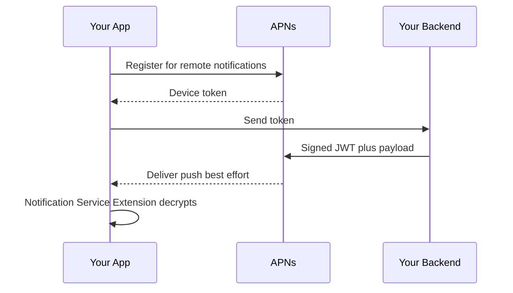
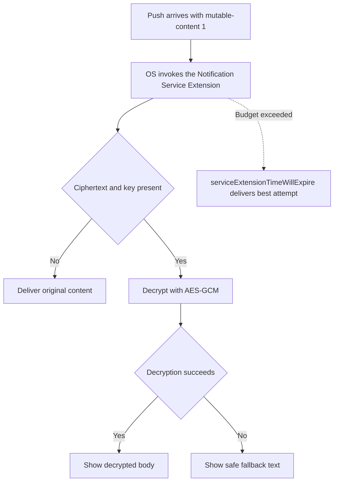

# Lecture 1 — The push pipeline end to end: APNs, payloads, and the Notification Service Extension

> "A push notification is not a message you send. It's a request you make to Apple's servers, which they deliver if and when they choose, to a token that might already be stale. Treat it as best-effort and design for the drop."

This is the lecture that turns "send a notification" into "operate a push pipeline." The temptation is to think of push like a function call: I send, the user receives. The reality is a five-party system — your app, APNs, your backend, the device token, and (for encrypted payloads) a Notification Service Extension — where each party can fail independently and APNs gives you almost no feedback when it does. By the end of this lecture you should be able to draw the pipeline, name where each piece can break, and build a Notification Service Extension that decrypts a payload with the CryptoKit you learned last week.

We build it in the order the bytes flow: registration (getting a token), the auth key (how your server proves it's you to APNs), the payload (what you send), delivery (what arrives), and the service extension (how you modify what arrives before the user sees it).

---

## 1. The pipeline, drawn once

```text
┌──────────────┐   1. register      ┌──────────────┐
│   Your app   │ ─────────────────► │     APNs     │  Apple's push servers
│  (on device) │ ◄───────────────── │              │
└──────┬───────┘   2. device token  └──────▲───────┘
       │                                    │
       │ 3. send token                      │ 4. send push (signed JWT + payload)
       ▼                                    │
┌──────────────┐ ──────────────────────────┘
│ Your backend │   (Vapor: stores token, signs a JWT with the .p8 auth key,
│   (Vapor)    │    POSTs the payload to APNs addressed to the token)
└──────────────┘

       5. APNs delivers to the device ──► the OS ──► (optional) your
          Notification Service Extension decrypts/modifies ──► the user sees it
```

Five parties. Read the failure modes off the diagram: the **token** can go stale (user reinstalls, restores to a new device, revokes permission) and your backend keeps sending to a dead address. **APNs** can drop a low-priority or `content-available` push under load and never tell you. Your **backend's JWT** can expire or be signed with a rotated-out key. The **payload** can be malformed and silently rejected. The **service extension** can time out before it finishes decrypting. Each is a real incident; the pipeline mindset is asking "how would I know?" for each one.


*The five-party push pipeline, where each hop can fail independently and silently.*

---

## 2. Registration — getting the device token

The device token is APNs's address for *this install of your app on this device*. You request notification authorization, then register for remote notifications, and the OS hands you the token asynchronously via an `AppDelegate` callback (this is one of the few places SwiftUI apps still need an app delegate, via `@UIApplicationDelegateAdaptor`).

```swift
import SwiftUI
import UserNotifications

@main
struct NotesProApp: App {
    @UIApplicationDelegateAdaptor(AppDelegate.self) var appDelegate

    var body: some Scene {
        WindowGroup { ContentView() }
    }
}

final class AppDelegate: NSObject, UIApplicationDelegate, UNUserNotificationCenterDelegate {

    func application(
        _ application: UIApplication,
        didFinishLaunchingWithOptions launchOptions: [UIApplication.LaunchOptionsKey: Any]? = nil
    ) -> Bool {
        UNUserNotificationCenter.current().delegate = self
        Task { await requestPushAuthorization() }
        return true
    }

    func requestPushAuthorization() async {
        let center = UNUserNotificationCenter.current()
        do {
            // Ask for alert/badge/sound. `.provisional` would let you deliver
            // quietly with no prompt; here we ask explicitly.
            let granted = try await center.requestAuthorization(options: [.alert, .badge, .sound])
            guard granted else { return }
            // Registering for remote notifications must happen on the main actor.
            await MainActor.run { UIApplication.shared.registerForRemoteNotifications() }
        } catch {
            // Authorization can fail; don't crash, just don't get a token.
        }
    }

    // APNs hands back the token here. Send it to your backend over the PINNED,
    // signed NotesClient from Week 17 — the token identifies the device.
    func application(
        _ application: UIApplication,
        didRegisterForRemoteNotificationsWithDeviceToken deviceToken: Data
    ) {
        let tokenHex = deviceToken.map { String(format: "%02x", $0) }.joined()
        Task { try? await NotesClient.shared.registerPushToken(tokenHex) }
    }

    func application(
        _ application: UIApplication,
        didFailToRegisterForRemoteNotificationsWithError error: Error
    ) {
        // No token. Common in the Simulator (older versions), or with no network.
    }
}
```

Two things to internalise:

- **The token is `Data`, and you hex-encode it for transport.** The 32-byte token becomes the 64-hex-char string your backend addresses pushes to. (Don't `description`-stringify the `Data` — that gives you `<a1b2...>` with angle brackets, a classic bug.)
- **The token can change.** A restore to a new device, an OS update, or a long absence can invalidate it. You re-register on every launch (it's cheap) and your backend treats the latest token as canonical, expiring old ones — because sending to a stale token is the silent failure in the pipeline.

### Foreground presentation and taps

By default, a push doesn't show a banner if your app is in the foreground. You opt in via the delegate, and you handle taps the same way:

```swift
extension AppDelegate {
    // Show the notification even when the app is foregrounded.
    func userNotificationCenter(
        _ center: UNUserNotificationCenter,
        willPresent notification: UNNotification
    ) async -> UNNotificationPresentationOptions {
        [.banner, .sound, .badge]
    }

    // The user tapped the notification. Route to the relevant note (deep link).
    func userNotificationCenter(
        _ center: UNUserNotificationCenter,
        didReceive response: UNNotificationResponse
    ) async {
        let userInfo = response.notification.request.content.userInfo
        if let noteID = userInfo["noteID"] as? String {
            await DeepLinkRouter.shared.openNote(id: noteID)
        }
    }
}
```

The tap handler is where push connects to the navigation work from Week 9 — a notification's custom `noteID` key drives the same value-typed navigation a `notes://open/:id` deep link does.

---

## 3. The auth key — how your backend proves it's you

APNs needs to know that the push really comes from your app's developer. There are two mechanisms, and in 2026 only one is the right choice:

- **Certificates (`.p12`)** — the legacy approach. One certificate *per app*, they *expire annually*, and you manage a pile of them. They still work; don't choose them.
- **Auth keys (`.p8`, token-based)** — the modern approach. **One key for all your apps**, **no expiry**, and you use it to sign a short-lived **JWT** that you attach to each APNs request. This is what you use.

You generate the `.p8` once in App Store Connect (Keys ▸ Apple Push Notifications service), note the **Key ID** and your **Team ID**, and store the key file securely on your backend. To send a push, your backend signs a JWT with the ES256 algorithm — the *same* P-256 / ECDSA signing you did by hand in Week 17:

```swift
// Conceptual — in production use APNSwift / Vapor's APNS, which does this for you.
// The JWT header: { "alg": "ES256", "kid": "<Key ID>" }
// The JWT claims: { "iss": "<Team ID>", "iat": <now> }
// Signed with the .p8 private key. APNs accepts it for up to ~1 hour, so you
// cache and reuse the token rather than re-signing per push.
```

The pipeline failure here: if you rotate the auth key (revoke the old `.p8` in App Store Connect and issue a new one) without deploying the new key to your backend *first*, every push silently fails authentication. This is precisely the **APNs auth-key rotation chaos drill** in the Phase IV capstone — new key first, deploy, *then* retire the old key, with a window where both are valid. The rotation order is the whole skill.

---

## 4. The payload — the `aps` dictionary and its keys

The push payload is JSON with a reserved top-level `aps` key (Apple's keys) alongside any custom keys of yours. The `aps` keys you'll actually use:

```json
{
  "aps": {
    "alert": {
      "title": "Note shared with you",
      "subtitle": "From Alex",
      "body": "Grocery list"
    },
    "badge": 1,
    "sound": "default",
    "thread-id": "shared-notes",
    "interruption-level": "active",
    "relevance-score": 0.8,
    "mutable-content": 1
  },
  "noteID": "note-42",
  "encryptedBody": "base64-AES-GCM-sealed-box-here"
}
```

- **`alert`** — title/subtitle/body shown to the user. Can be a string (just the body) or a dictionary.
- **`badge`** — the number on the app icon. `0` clears it.
- **`sound`** — `"default"`, a custom sound file name, or a dictionary for critical alerts.
- **`thread-id`** — groups related notifications in Notification Center.
- **`interruption-level`** — `passive` (no sound/banner, just Notification Center), `active` (default), `time-sensitive` (breaks through Focus, needs the entitlement), `critical` (bypasses mute, needs special approval). Use the *lowest* level that fits; over-claiming `time-sensitive` is a review and trust problem.
- **`relevance-score`** — 0.0–1.0, helps the OS rank notifications in summaries.
- **`content-available: 1`** — a **silent** push: wakes your app in the background to fetch data, *no* user-visible alert. Heavily throttled by the OS; never rely on it for time-critical delivery.
- **`mutable-content: 1`** — tells the OS to hand the notification to your **Notification Service Extension** before showing it, so you can modify it (decrypt, add an image). This is the key for §5.

The request to APNs also carries headers your backend sets: `apns-topic` (your bundle id), `apns-push-type` (`alert` / `background` / `voip` — must match the payload, e.g. `background` for `content-available`), `apns-priority` (10 immediate, 5 power-considerate), and `apns-expiration` (how long APNs should retry).

---

## 5. The Notification Service Extension — decrypting before the user sees it

Here is where this week meets last week. Suppose a note shared with you contains private content. You don't want it sitting in cleartext in the push payload, which transits APNs (Apple's servers see it). So you **encrypt the body** in your backend with a key the recipient device holds, send only the ciphertext in the payload, and **decrypt it on the device** in a Notification Service Extension *before* the notification is displayed. The cleartext never leaves the device.

A Notification Service Extension is a separate target (File ▸ New ▸ Target ▸ Notification Service Extension) that the OS invokes for any push with `mutable-content: 1`. It gets the notification, a content handler to call with the modified content, and a **tight time budget (~30 seconds)** before the OS gives up and shows the original.

```swift
import UserNotifications
import CryptoKit

class NotificationService: UNNotificationServiceExtension {

    private var contentHandler: ((UNNotificationContent) -> Void)?
    private var bestAttempt: UNMutableNotificationContent?

    override func didReceive(
        _ request: UNNotificationRequest,
        withContentHandler contentHandler: @escaping (UNNotificationContent) -> Void
    ) {
        self.contentHandler = contentHandler
        let mutable = request.content.mutableCopy() as! UNMutableNotificationContent
        self.bestAttempt = mutable

        // 1. Pull the ciphertext from the custom payload key.
        guard let encryptedBase64 = request.content.userInfo["encryptedBody"] as? String,
              let combined = Data(base64Encoded: encryptedBase64),
              let key = sharedDecryptionKey() else {
            // No ciphertext or no key: deliver what we got rather than nothing.
            contentHandler(mutable)
            return
        }

        // 2. Decrypt with AES-GCM — the SAME primitive from Week 17. A tampered
        //    or wrong-key payload throws, and we fall back to the original.
        do {
            let box = try AES.GCM.SealedBox(combined: combined)
            let plaintext = try AES.GCM.open(box, using: key)
            mutable.body = String(decoding: plaintext, as: UTF8.self)
        } catch {
            mutable.body = "New shared note"   // safe fallback; never leak the error
        }

        // 3. Hand back the modified notification.
        contentHandler(mutable)
    }

    // The OS is about to kill us (budget exceeded). Deliver our best effort.
    override func serviceExtensionTimeWillExpire() {
        if let handler = contentHandler, let best = bestAttempt {
            handler(best)
        }
    }

    /// The decryption key lives in the Keychain, shared with the main app via an
    /// App Group access group so the extension can read it.
    private func sharedDecryptionKey() -> SymmetricKey? {
        let query: [String: Any] = [
            kSecClass as String: kSecClassGenericPassword,
            kSecAttrAccount as String: "com.crunch.notes.push-key",
            kSecAttrAccessGroup as String: "group.com.crunch.notes",   // App Group
            kSecReturnData as String: true,
            kSecMatchLimit as String: kSecMatchLimitOne,
        ]
        var item: CFTypeRef?
        guard SecItemCopyMatching(query as CFDictionary, &item) == errSecSuccess,
              let data = item as? Data else { return nil }
        return SymmetricKey(data: data)
    }
}
```

The non-obvious pieces a reviewer checks:

1. **`serviceExtensionTimeWillExpire` must deliver something.** If you exceed the budget and don't call the handler, the OS shows the *original, unmodified* notification — which, for an encrypted payload, means the user sees ciphertext or your placeholder. Always wire the expiry path to deliver `bestAttempt`.
2. **The key is shared via an App Group.** The extension is a separate process; it can't read the main app's default Keychain. You put the decryption key in a Keychain item with `kSecAttrAccessGroup` set to a shared App Group, and both the app and the extension are entitled to that group. This is the same access-group mechanism from Week 17's Keychain work, now doing cross-process duty.
3. **Decryption failure must fail safe, not leak.** A wrong key or tampered ciphertext throws (GCM is authenticated — Week 17). You fall back to a generic body; you do *not* put the error or the ciphertext in the visible notification. The threat-model habit from last week applies: a notification is a leak surface (it shows on the lock screen).
4. **`mutable-content: 1` is required in the payload**, or the OS never calls your extension. The backend must set it; if pushes arrive unmodified, that's the first thing to check.


*The extension's decision path from a mutable push to what the user finally sees.*

---

## 6. Testing the pipeline without a backend

Before the Vapor sender exists, you can exercise most of the pipeline:

- **Xcode Push Notifications Console** (Window ▸ Developer Tools ▸ Push Notifications Console) sends a test push to a real device token — no server needed. Great for iterating on payloads and the NSE.
- **A `.apns` file dragged onto the Simulator** delivers a local test push (the Simulator supports push delivery for testing, though not real APNs registration on older versions). Create a JSON file with a `Simulator Target Bundle` key and drag it onto the booted Simulator.
- **`curl` to APNs** (exercise 1) sends a real push end to end with a JWT you sign from your `.p8` — the closest thing to what your backend does, from the command line.

Use the Console for fast payload iteration, the `.apns` drag for NSE logic in the Simulator, and the real `curl`/Vapor send to prove the *whole* pipeline on device. "It worked in the Console" tests the payload and the NSE; it does *not* test your backend's token storage and JWT signing, which is why the mini-project's bar is a push from *your* Vapor.

---

## 7. Categories, actions, and the silent-push reality

Two more pieces of the push surface a production app uses, and one hard truth about the part people over-rely on.

**Notification categories and actions** let the user respond *from the notification itself* — "Reply," "Mark Read," "Snooze" — without opening the app. You register a `UNNotificationCategory` with `UNNotificationAction`s, tag the payload with that category's identifier, and handle the chosen action in the delegate:

```swift
func registerCategories() {
    let reply = UNTextInputNotificationAction(
        identifier: "REPLY", title: "Reply",
        options: [], textInputButtonTitle: "Send", textInputPlaceholder: "Reply…")
    let markRead = UNNotificationAction(
        identifier: "MARK_READ", title: "Mark Read", options: [])
    let shared = UNNotificationCategory(
        identifier: "SHARED_NOTE", actions: [reply, markRead],
        intentIdentifiers: [], options: [])
    UNUserNotificationCenter.current().setNotificationCategories([shared])
}

// The payload sets "category": "SHARED_NOTE" inside aps. Then, in the delegate:
func userNotificationCenter(_ center: UNUserNotificationCenter,
                            didReceive response: UNNotificationResponse) async {
    switch response.actionIdentifier {
    case "REPLY":
        if let text = (response as? UNTextInputNotificationResponse)?.userText {
            await NotesClient.shared.reply(to: response.notification, text: text)
        }
    case "MARK_READ":
        await NotesClient.shared.markRead(response.notification)
    default:   // UNNotificationDefaultActionIdentifier = the user tapped the body
        break
    }
}
```

Actions are a real UX win — the user replies to a shared note from the lock screen — and they cost almost nothing once you've registered the category. The `intentIdentifiers` field is where a communication notification (with the sender's avatar via `INSendMessageIntent`) would slot in, the mini-project's stretch goal.

**Rich media** is the other NSE use case alongside decryption: a `mutable-content` payload can carry an image URL that the extension downloads and attaches, so the notification shows a thumbnail. You download within the time budget and call `request.content.attachments`. Same extension, same budget discipline — just media instead of (or alongside) decryption.

**The silent-push truth.** `content-available: 1` silent pushes — the "wake my app in the background to fetch" mechanism — are the most over-relied-on part of the push surface, and the truth is: **they are heavily throttled and not guaranteed.** iOS decides whether and when to deliver them based on battery, usage patterns, and a per-app budget. A silent push you send may arrive in seconds, in an hour, or not until the user next opens the app. So you *never* design a feature whose correctness depends on a silent push arriving promptly — a "your data is now stale, refresh" silent push is a *hint*, not a contract. If the user must see fresh data, use a visible push (which is delivered reliably) or fetch on foreground. The pipeline-failure-mode habit from §1 applies hardest here: the silent push is the party most likely to silently drop, and the design must survive it dropping. People learn this the hard way when their "background sync" feature works in testing (where the app is active and the OS is generous) and fails in the field (where the budget is tight). Treat silent push as best-effort-squared.

---

## 8. The decision table — push design choices

| Need | Reach for |
|------|-----------|
| Authenticate your backend to APNs | **`.p8` auth key + signed JWT** — not `.p12` certificates |
| A visible alert | `aps.alert` with `apns-push-type: alert`, `apns-priority: 10` |
| Wake the app silently to fetch | `content-available: 1`, `apns-push-type: background`, priority 5 — and accept heavy throttling |
| Modify/decrypt before display | `mutable-content: 1` + a Notification Service Extension |
| Break through Focus for something urgent | `interruption-level: time-sensitive` (needs entitlement) — use sparingly |
| Share a key with the extension | A **Keychain item in a shared App Group access group** |
| Test fast, no server | **Push Notifications Console** or a `.apns` drag onto the Simulator |
| Prove the whole pipeline | A real push from **your Vapor backend** to a **physical device** |

---

## 8. Recap — the push half of the week

You now own the push pipeline:

1. **It's a five-party best-effort system, not a function call.** App, APNs, backend, token, extension — each fails independently, and APNs tells you little. Design for the drop and ask "how would I know?" for every party.
2. **Token-based auth (`.p8`) is the modern choice** — one key, no expiry, a signed JWT per request (the same ES256 signing from Week 17). Rotating the key without deploying it first silently breaks every push; the rotation *order* is the skill, and it's a Phase IV chaos drill.
3. **The payload's `aps` keys are a small, learnable vocabulary** — `alert`, `badge`, `mutable-content`, `content-available`, `interruption-level`. Match `apns-push-type` to the payload. Claim the lowest interruption level that fits.
4. **The Notification Service Extension decrypts before the user sees the content** — `mutable-content: 1`, a tight time budget you must respect via `serviceExtensionTimeWillExpire`, a key shared through an App Group, AES-GCM from last week, and a fail-safe fallback that never leaks.

In lecture 2 we build the *purchase* and *telemetry* pipelines — StoreKit 2 from catalog to verified entitlement, server-side receipt validation, the subscription edge cases that page you (refund, downgrade, billing retry), and MetricKit reporting from the field. Push reaches the user; purchase charges the user; telemetry reports back. Three pipelines, one Phase III gate. Bring this one; we're about to add two more.
