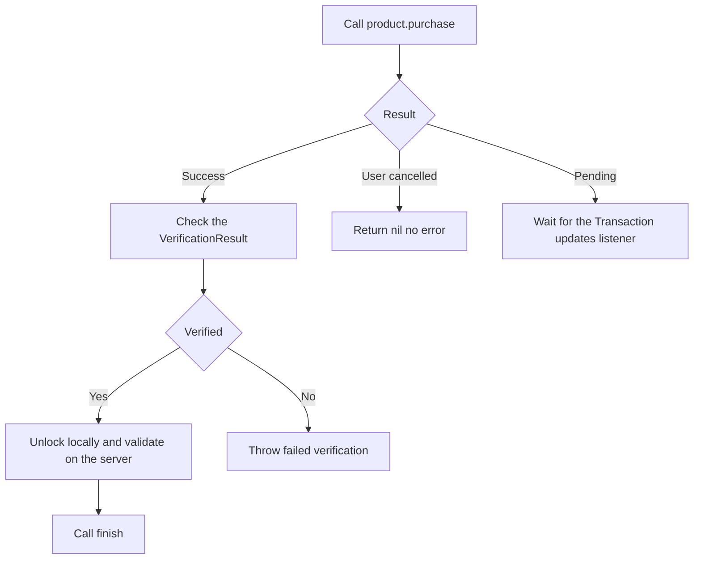
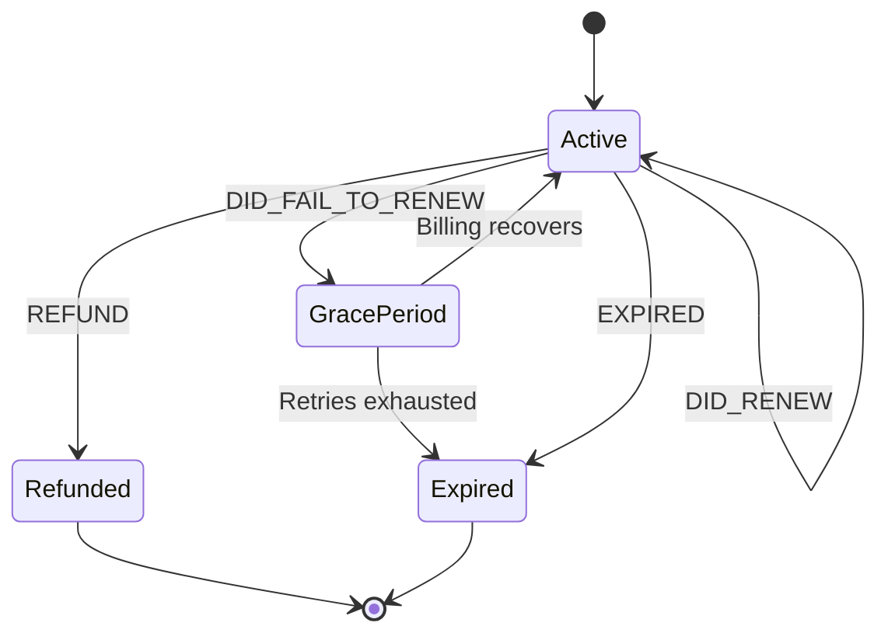

# Lecture 2 — StoreKit 2, server-side validation, the subscription edge cases, and MetricKit

Lecture 1 built the pipeline that reaches the user. This lecture builds the two that complete Phase III: the *purchase* pipeline that charges the user, and the *telemetry* pipeline that reports back to you. StoreKit 2 is, for a change, a genuinely pleasant Apple framework — async end to end, typed, with cryptographic verification built in — so we move fast through the happy path and spend the real time where the money is: server-side validation (because a client can lie) and the subscription edge cases (refund, downgrade, billing retry) that turn a working purchase into a working *business*. Then MetricKit, which is small, and the easiest of the three pipelines to wire and the easiest to forget until a crash you can't reproduce makes you wish you had.

The framing to hold for StoreKit: **Apple is the merchant of record, and the `Transaction` is a cryptographically-signed receipt — but you still verify it server-side, because the device that hands you the transaction is a device you don't trust.** StoreKit 2 verifies the signature *on the device* for you (that's the `VerificationResult`), which is good enough to *unlock a feature optimistically*. It is *not* good enough to *grant a server-side entitlement* — a jailbroken device can hand your backend a forged or replayed transaction, and only your backend re-verifying Apple's signature stops that. The whole edge-case story flows from "the server is the source of truth, the client is a hint."

---

## 1. The product catalog — fetching what the App Store offers

You define your products (the `notes_pro_monthly` subscription) in App Store Connect (or a local `.storekit` file for testing). At runtime you fetch them by id, and the App Store returns each with its **localized price** — you never hardcode "$4.99," because the user in Brazil sees BRL and the user in Japan sees JPY, and the App Store handles the formatting.

```swift
import StoreKit

@MainActor
@Observable
final class Store {
    var subscriptions: [Product] = []
    var purchasedProductIDs: Set<String> = []

    private let productIDs = ["notes_pro_monthly", "notes_pro_yearly"]

    func loadProducts() async {
        do {
            // The App Store returns each Product with a LOCALIZED displayPrice.
            subscriptions = try await Product.products(for: productIDs)
                .sorted { $0.price < $1.price }
        } catch {
            // Network or config failure; show a retry, don't crash.
            subscriptions = []
        }
    }
}
```

`Product` carries everything the paywall needs: `displayName`, `description`, `displayPrice` (localized string), `price` (a `Decimal` for sorting), and for subscriptions, `subscriptionInfo` with the `subscriptionPeriod`, `subscriptionGroupID`, and any `introductoryOffer` / `promotionalOffers`. You render the paywall from these values; you do not duplicate the prices in your code.

---

## 2. The purchase flow — async, verified, finished

A purchase is one `await`, but the *result handling* is where the rigor lives. `product.purchase()` returns a `Product.PurchaseResult` with three cases, and the success case wraps the transaction in a `VerificationResult` you must check.

```swift
extension Store {
    enum StoreError: Error { case failedVerification }

    func purchase(_ product: Product) async throws -> Transaction? {
        let result = try await product.purchase()

        switch result {
        case .success(let verification):
            // The transaction is wrapped in a VerificationResult. StoreKit
            // checked Apple's signature ON DEVICE; we confirm it's verified.
            let transaction = try checkVerified(verification)

            // Optimistically unlock locally...
            await updatePurchasedProducts()

            // ...AND tell the backend to grant the server-side entitlement,
            // sending the SIGNED representation for the server to re-verify.
            try await NotesClient.shared.validateTransaction(transaction.jsonRepresentation)

            // CRUCIAL: finish() tells StoreKit you've delivered the product.
            // An unfinished transaction is re-delivered on every launch.
            await transaction.finish()
            return transaction

        case .userCancelled:
            return nil   // the user backed out; not an error

        case .pending:
            // e.g. Ask to Buy (parental approval). The transaction will arrive
            // later via Transaction.updates — don't unlock now.
            return nil

        @unknown default:
            return nil
        }
    }

    /// Unwrap a VerificationResult, throwing if StoreKit couldn't verify the
    /// signature. NEVER trust an `.unverified` transaction.
    func checkVerified<T>(_ result: VerificationResult<T>) throws -> T {
        switch result {
        case .verified(let safe):
            return safe
        case .unverified:
            // The signature didn't check out — a forged or tampered transaction.
            throw StoreError.failedVerification
        }
    }
}
```

The four non-negotiables a reviewer checks in this flow:

1. **Check the `VerificationResult`.** `.unverified` means StoreKit could not validate Apple's signature on the transaction. You *never* grant entitlement on an unverified transaction. `checkVerified` is not optional ceremony; it's the whole point of StoreKit 2's design.
2. **Call `finish()`.** Until you `finish()` a transaction, StoreKit considers the product undelivered and re-presents the transaction via `Transaction.updates` on every launch. Forgetting `finish()` is the classic StoreKit 2 bug: purchases that "keep coming back."
3. **Handle `.pending`.** Ask to Buy and other deferred flows return `.pending`; the real transaction arrives *later* through the updates listener (§3). Unlocking on `.pending` grants a product that may never be paid for.
4. **The server still validates.** The on-device verification unlocks the feature *optimistically* for snappy UX. The *authoritative* grant comes from your backend re-verifying — §4.


*The four branches a purchase result must handle, from tap to a finished transaction.*

---

## 3. Entitlements and the updates listener — the source of truth on device

"What does this user currently own?" is answered by `Transaction.currentEntitlements` — an async sequence of the user's active, non-revoked transactions. And because transactions can arrive *outside* a purchase flow (a renewal, a Family Sharing grant, an Ask-to-Buy approval, a purchase made on another device), you start a **long-running listener** at launch over `Transaction.updates`:

```swift
extension Store {
    /// Start at app launch and keep running. Catches renewals, revocations,
    /// Family Sharing grants, and cross-device purchases.
    func startTransactionListener() -> Task<Void, Never> {
        Task(priority: .background) {
            for await update in Transaction.updates {
                guard let transaction = try? self.checkVerified(update) else { continue }
                await self.updatePurchasedProducts()
                // A renewal or revocation should re-sync the server entitlement too.
                try? await NotesClient.shared.validateTransaction(transaction.jsonRepresentation)
                await transaction.finish()
            }
        }
    }

    /// Recompute the set of owned product IDs from current entitlements.
    func updatePurchasedProducts() async {
        var owned: Set<String> = []
        for await result in Transaction.currentEntitlements {
            guard let transaction = try? checkVerified(result) else { continue }
            // A revoked (refunded) transaction has a revocationDate — exclude it.
            if transaction.revocationDate == nil {
                owned.insert(transaction.productID)
            }
        }
        purchasedProductIDs = owned
    }

    /// The gate the UI reads. One place, derived from entitlements.
    var hasProAccess: Bool {
        !purchasedProductIDs.isDisjoint(with: ["notes_pro_monthly", "notes_pro_yearly"])
    }
}
```

The discipline: **the gate (`hasProAccess`) is derived from `currentEntitlements`, recomputed whenever a transaction lands.** You do *not* set a `Bool hasPro = true` on purchase and persist it — that flag drifts the moment a subscription expires, is refunded, or is restored on another device. Derive the gate from the entitlements every time; the entitlements are the truth. Restore is then trivial: `AppStore.sync()` (or just relaunch) re-reads `currentEntitlements`, and the gate is correct.

---

## 4. Server-side validation — because the client can lie

On-device verification unlocks the feature optimistically. The *authoritative* entitlement — the one your backend uses to, say, serve premium content or sync across devices — must be re-verified server-side, because a jailbroken device can hand your backend a forged or replayed transaction. You send the **signed representation** (the `jsonRepresentation`, which is a signed JWS, or the raw JWS) to your backend, and the backend verifies Apple's signature using Apple's public keys.

```swift
// CLIENT: send the signed transaction representation to the backend.
func validateTransaction(_ jsonRepresentation: Data) async throws {
    var request = URLRequest(url: baseURL.appending(path: "transactions/validate"))
    request.httpMethod = "POST"
    request.httpBody = jsonRepresentation     // a SIGNED JWS, not plain JSON
    // ...signed with the Week 17 request signing, over the pinned channel...
    let (_, response) = try await session.data(for: request)
    guard (response as? HTTPURLResponse)?.statusCode == 200 else { throw NotesClientError.validationFailed }
}
```

```swift
// SERVER (Vapor): verify Apple's signature with the official library.
// `apple/app-store-server-library-swift` does the JWS verification against
// Apple's root certificates and decodes the transaction payload.
import AppStoreServerLibrary
import Vapor

func validate(_ req: Request) async throws -> HTTPStatus {
    let signedTransaction = req.body.string ?? ""
    let verifier = SignedDataVerifier(/* Apple root certs, bundleID, environment */)
    let result = try verifier.verifyAndDecodeTransaction(signedTransactionInfo: signedTransaction)
    // `result` is the decoded, signature-verified transaction. Grant the
    // entitlement keyed by the transaction's originalTransactionId, and record
    // its expiry so a later renewal/expiry notification can update it.
    try await EntitlementStore.grant(
        productID: result.productId,
        originalTransactionID: result.originalTransactionId,
        expiresAt: result.expiresDate,
        on: req.db
    )
    return .ok
}
```

Two things the backend must do that the client can't:

- **Verify the signature against Apple's roots**, not just trust the bytes. The official `app-store-server-library-swift` checks the JWS chain to Apple's certificates — the same "verify a signature against a known key" pattern from Week 17, now with Apple as the signer.
- **Key the entitlement on `originalTransactionId`**, the stable identity of the subscription across renewals. A renewal is a *new* `transactionId` but the *same* `originalTransactionId`; that's how you know "this is the same subscription renewing," not a new purchase.

---

## 5. The subscription edge cases — what turns a purchase into a business

A subscription is not a one-time event; it's a state machine that changes *after* the purchase, often when your app isn't running. Your backend learns about these transitions through **App Store Server Notifications V2** — a webhook Apple calls when something happens to a subscription. The transitions that matter, and what your server does with each:

| Notification type | What happened | Your server's job |
|-------------------|---------------|-------------------|
| `DID_RENEW` | The subscription auto-renewed | Extend the entitlement's `expiresDate` |
| `DID_FAIL_TO_RENEW` (`GRACE_PERIOD`) | Billing failed; retrying | Keep access during grace, watch for recovery or expiry |
| `EXPIRED` | The subscription lapsed | Revoke the entitlement |
| `REFUND` | The user got a refund | **Revoke immediately** — they no longer paid |
| `DID_CHANGE_RENEWAL_PREF` | Upgrade/downgrade/crossgrade scheduled | Record the pending plan change |
| `REVOKE` | Family Sharing access removed | Revoke for the family member |

```swift
// SERVER (Vapor): the App Store Server Notifications V2 webhook.
func appStoreNotification(_ req: Request) async throws -> HTTPStatus {
    let signedPayload = try req.content.decode(SignedPayload.self).signedPayload
    let verifier = SignedDataVerifier(/* ... */)
    let notification = try verifier.verifyAndDecodeNotification(signedPayloadNotification: signedPayload)

    switch notification.notificationType {
    case .refund, .expired, .revoke:
        try await EntitlementStore.revoke(originalTransactionID: notification.originalTransactionID, on: req.db)
    case .didRenew, .subscribed:
        try await EntitlementStore.extend(/* new expiry from the renewal */ on: req.db)
    case .didFailToRenew:   // grace period: keep access, mark "retrying"
        try await EntitlementStore.markBillingRetry(originalTransactionID: notification.originalTransactionID, on: req.db)
    default:
        break
    }
    return .ok   // ACK so Apple stops retrying the webhook
}
```

The three edge cases the challenge has you reproduce, and why each is a trap:

- **Refund.** The user buys, uses the feature, then refunds a week later. The *client's* `currentEntitlements` will eventually reflect the revocation (it carries a `revocationDate`), but your *server* learns immediately via the `REFUND` webhook — and if your server doesn't revoke, you're serving premium content to someone who got their money back. This is the most common "we lost revenue" bug.
- **Downgrade.** The user switches from yearly to monthly. Within the same subscription group this is a `DID_CHANGE_RENEWAL_PREF`; the change takes effect at the *next* renewal, not immediately. If your server flips the plan now, you've shortchanged a user who's paid through the period.
- **Billing retry / grace period.** A renewal payment fails (expired card). Apple retries for days and the user is in a *grace period* where they should *keep* access. If your server revokes on the first failure, you've locked out a paying customer over a transient card issue. Keep access during grace; revoke only on final `EXPIRED`.

Each of these happens after the sale, asynchronously, and only your *server* sees the full picture in time. That's why "the server is the source of truth" is the lecture's spine: the client's optimistic gate is a snapshot; the server's entitlement, fed by the webhook, is the ledger.


*The subscription state machine your server tracks via App Store Server Notifications.*

---

## 6. MetricKit — the telemetry pipeline home

The third pipeline is the quiet one. MetricKit is the OS aggregating power, performance, and crash data across all your users and handing it to your app in a **daily payload** (~once per 24h, delivered when the app next launches). You register a subscriber, receive `MXMetricPayload` (metrics) and `MXDiagnosticPayload` (crashes, hangs, disk-write exceptions), and ship them to your backend so you can see what's happening on devices you'll never hold.

```swift
import MetricKit

final class MetricsCollector: NSObject, MXMetricManagerSubscriber {

    static let shared = MetricsCollector()

    func start() {
        MXMetricManager.shared.add(self)   // register; the OS calls us ~daily
    }

    // Performance metrics: CPU, memory, disk, app launch, hang, hitch, etc.
    func didReceive(_ payloads: [MXMetricPayload]) {
        for payload in payloads {
            let json = payload.jsonRepresentation()   // ready to POST
            Task { try? await NotesClient.shared.uploadMetric(json) }
        }
    }

    // Diagnostics: crashes, hangs, disk-write exceptions — the high-value ones.
    func didReceive(_ payloads: [MXDiagnosticPayload]) {
        for payload in payloads {
            let json = payload.jsonRepresentation()
            // Crash diagnostics carry call stacks you symbolicate on the backend.
            Task { try? await NotesClient.shared.uploadDiagnostic(json) }
        }
    }
}
```

What's actually in there, and why you care:

- **`MXMetricPayload`** aggregates `cpuMetrics`, `memoryMetrics`, `diskIOMetrics`, `applicationLaunchMetrics` (launch time — the metric Apple ranks you on), `applicationResponsivenessMetrics` (hang time), `animationMetrics` (hitch ratio — the 16.67 ms budget from Week 15), and battery. These are *aggregated histograms* across the day, not per-event — MetricKit is for trends, not single events.
- **`MXDiagnosticPayload`** carries `crashDiagnostics`, `hangDiagnostics`, and `diskWriteExceptionDiagnostics` — each with a **call stack tree** you symbolicate (with your dSYM) to get function names. This is your window into crashes on devices you can't reproduce on, complementing the Week 15 Instruments work: Instruments is your machine; MetricKit is the field.

The pipeline discipline here is the lightest of the three but the easiest to neglect: register the subscriber at launch, ship the payloads, and *actually look at them* — a telemetry pipeline you don't read is the same as no pipeline. The mini-project ships the collector and proves a payload arrives; the Phase IV production runbook is where "what do I check when the launch-time metric regresses" becomes a real procedure.

---

## 7. Robustness — errors, restore, and the cases App Review checks

Before the decision table, the unglamorous part that separates a store that passes App Review from one that gets rejected: error handling, restore, and the offline path. App Review *specifically* tests these, and a store that nails the happy path but crashes on a network failure or has no restore button gets bounced.

**Errors are expected, not exceptional.** Every StoreKit call can fail — the network drops mid-purchase, the App Store is unreachable, the product fetch returns empty (a misconfigured product id). You handle each as a normal branch, never a crash:

```swift
extension Store {
    func loadProductsRobustly() async {
        do {
            let products = try await Product.products(for: proIDs)
            if products.isEmpty {
                // Not an error per se, but a real state: misconfigured IDs, or the
                // App Store hasn't propagated the product yet. Show a retry, not a blank.
                loadState = .empty
            } else {
                subscriptions = products
                loadState = .loaded
            }
        } catch {
            // Network/StoreKit failure: a retryable error state, never a crash.
            loadState = .failed
        }
    }
}
```

The purchase itself throws on failure too, and the `.pending` case (§2) is a *third* outcome that isn't success or cancellation — Ask to Buy, or a payment requiring further action. A store that treats `purchase()` as "either it worked or the user cancelled" mishandles `.pending` and either grants a product that isn't paid for or leaves the user confused. Handle all three result cases plus the thrown-error path; that's four branches, and App Review will exercise at least the cancel and the failure.

**Restore is mandatory and trivial.** App Review *requires* a visible "Restore Purchases" affordance for any non-consumable or subscription. The good news: with StoreKit 2's entitlement model, restore is nearly free — you call `AppStore.sync()` to force a refresh from the App Store, then re-derive the gate from `currentEntitlements`:

```swift
func restore() async {
    try? await AppStore.sync()       // pull the latest from the App Store
    await refreshEntitlements()       // re-derive the gate; it's correct again
}
```

Because the gate is *derived* (§3), restore is just "re-read the entitlements." There's no receipt to manually parse, no transaction to manually replay — `currentEntitlements` already knows what the user owns once `sync()` refreshes it. The single most common restore bug in StoreKit *1* — "I restored but my Pro features didn't come back" — largely disappears in StoreKit 2 *if* you derived the gate instead of caching a flag. The cached-flag store has to remember to flip the flag on restore; the derived-gate store can't get it wrong.

**The offline path.** What does your store do with no network? `Product.products(for:)` fails (you show the retry state), but `Transaction.currentEntitlements` reads from the *on-device* signed transactions, which work offline — so the *gate* stays correct offline even though the *catalog* can't load. This is a feature of the design: a paying user who goes offline keeps their Pro access (the entitlement is local and signed), and only the *purchase* flow (which needs the network) is unavailable. A store that ungated the user the moment the network dropped would be locking out paying customers — the offline cousin of the grace-period lockout from §5. Derive the gate from the local, signed entitlements, and offline mostly takes care of itself.

The App Review checklist for a store, then: a visible Restore button, graceful handling of cancel/pending/failure, a sensible empty/retry state for products, and a gate that survives offline. Nail those four and the subscription clears review; miss any and it bounces. (App Review proper is Week 24; this is the StoreKit-specific subset.)

---

## 8. The decision table — purchase and telemetry choices

| Need | Reach for |
|------|-----------|
| Fetch products with localized prices | `Product.products(for:)`; render `displayPrice` |
| Make a purchase | `product.purchase()`, handle `.success`/`.userCancelled`/`.pending` |
| Trust a transaction | `checkVerified(_:)` — never grant on `.unverified` |
| Stop re-delivery of a transaction | `transaction.finish()` |
| Know what the user owns | `Transaction.currentEntitlements` (derive the gate; don't cache a Bool) |
| Catch renewals/revocations/cross-device | A `Transaction.updates` listener started at launch |
| Authoritative entitlement | **Server-side** re-verification of the signed JWS |
| React to refund/downgrade/billing retry | **App Store Server Notifications V2** webhook |
| See crashes/hangs from the field | **MetricKit** `MXDiagnosticPayload`, shipped to your backend |
| Test purchases fast | A `.storekit` config file in the Simulator; sandbox on device for the gate |

---

## 8. Recap

This lecture built the purchase and telemetry pipelines that complete Phase III:

1. **StoreKit 2 is async and verified, but the server is the source of truth.** Fetch with `Product.products(for:)`, purchase with `product.purchase()`, *check the `VerificationResult`*, `finish()` the transaction, and derive the gate from `currentEntitlements` — never a cached `Bool`. The on-device verification unlocks optimistically; the backend re-verifies authoritatively, because the client can lie.
2. **A subscription is a state machine that changes after the sale.** Refund, downgrade, and billing-retry/grace-period are the edge cases that turn a working purchase into a working business, and your server learns them through App Store Server Notifications V2. Revoke on refund immediately; keep access during grace; apply downgrades at the next renewal. The server, fed by the webhook, is the ledger.
3. **MetricKit is the field telemetry you'll wish you had.** Register an `MXMetricManagerSubscriber`, receive daily metric and diagnostic payloads (crashes, hangs, hitches, launch time), and ship them to your backend. It complements Instruments: Instruments is your device, MetricKit is everyone's.

The exercises drill each pipeline — send yourself a real push, run the verified purchase flow, ship a MetricKit payload. The challenge reproduces the three subscription edge cases and proves your gate and server reflect each. The mini-project ships Notes Pro v1 — push on share, an NSE that decrypts, a paywall, server-validated subscription, and MetricKit — and clears the Phase III gate on a physical device. Push out, purchase in, telemetry home. That's the week, and that's Phase III.
