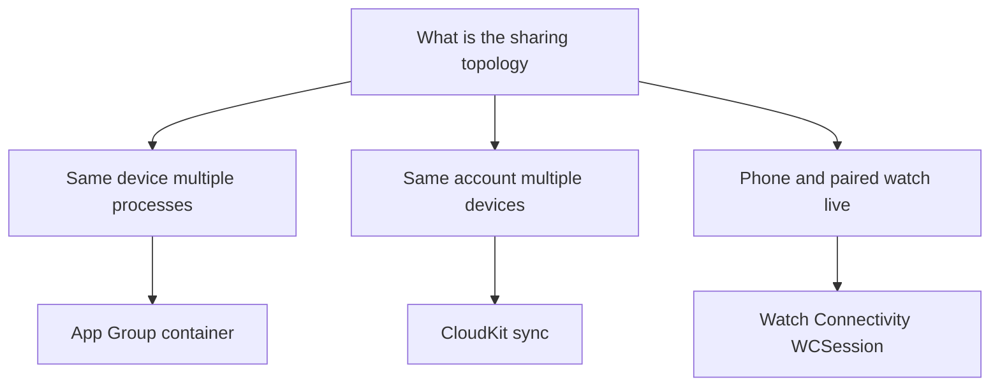
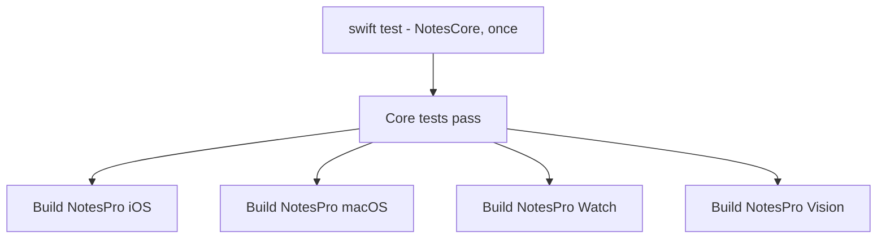

# Lecture 2 — watchOS, visionOS, and the shared core that holds it together

Lecture 1 gave you the iPhone/iPad/Mac trio, which came nearly for free because SwiftUI's adaptive containers do most of the work. This lecture is about the two platforms that *don't* come for free — watchOS and visionOS — because each wants its own shell onto the same core, and then about the thing that makes all five hold together: the shared `NotesCore` package, and the parity verification that proves the core behaves identically everywhere. The discipline from lecture 1 carries through: the watch and the vision app are *new shells*, not new apps — they import the same models, the same `NotesClient`, the same domain logic, and add only the presentation each platform wants.

We take watchOS first (a glanceable companion with a complication), then visionOS (a window in space, and a principled refusal to over-build immersion), then the shared core extraction, then parity verification. The recurring question is lecture 1's: for each new surface, *what does this platform want, given the core I already have?*

---

## 1. watchOS — a glanceable companion, not a tiny iPhone

The cardinal error with watchOS is treating it as a small iPhone. It isn't. A watch interaction lasts a few seconds, the screen fits a few lines, and the user is often moving. So the watch app is a *glance* onto the core: the three most recent notes, the count, the one action you'd actually do from your wrist. The data is shared (same `NotesCore`); the shell is radically simpler.

A watchOS app in 2026 uses the same SwiftUI `App` protocol as every other platform — there's no `WKHostingController` ceremony for a SwiftUI watch app. It's its own target (its own `@main`) because the watch has its own lifecycle and entry point, but the code inside is SwiftUI you already know:

```swift
import SwiftUI
import SwiftData
import NotesCore   // the SHARED package — same Note model as every other platform

@main
struct NotesWatchApp: App {
    var body: some Scene {
        WindowGroup {
            RecentNotesView()
        }
        .modelContainer(NotesCore.sharedContainer)   // same SwiftData schema, shared via App Group
    }
}

struct RecentNotesView: View {
    // The SAME @Query against the SAME schema. The watch just asks for fewer rows.
    @Query(sort: \Note.updatedAt, order: .reverse) private var notes: [Note]

    var body: some View {
        NavigationStack {                          // a STACK — no split view on a watch
            List(notes.prefix(3)) { note in        // glanceable: just the three most recent
                NavigationLink(value: note) {
                    VStack(alignment: .leading) {
                        Text(note.title).font(.headline).lineLimit(1)
                        Text(note.updatedAt, style: .relative)
                            .font(.caption2).foregroundStyle(.secondary)
                    }
                }
            }
            .navigationTitle("Recent")
            .navigationDestination(for: Note.self) { note in
                Text(note.body).padding()          // a minimal detail; the wrist isn't for editing
            }
        }
    }
}
```

What changed from the iPhone, and what didn't:

- **Didn't change:** the `Note` model, the `@Query`, the SwiftData schema, the value-typed navigation. That's all shared core and shared SwiftUI patterns.
- **Did change (adapt):** a `NavigationStack` not a `NavigationSplitView` (no room for columns), `.prefix(3)` (glanceable density), a read-mostly detail (you don't write essays on a watch). The shell is *simpler*, deliberately.

The watch's distinctive input is the **Digital Crown**, which you can bind to scrolling or a value — but for a notes glance you mostly don't need it. The principle holds: add the platform-exclusive affordance *only where it earns its keep*. A notes glance doesn't need the Crown; a workout timer would.

**Sharing the store with the phone.** The watch app and the phone app are separate processes (and often separate devices), so to show the *same* notes you either sync via CloudKit (the SwiftData `cloudKitDatabase` config — Phase IV proper) or share a store via an App Group / Watch Connectivity. For this week's scope, the watch reads from a shared container (App Group) or its own synced copy; the point is that the *schema and query code* are identical, because they're in `NotesCore`.

---

## 2. Watch complications — a glanceable widget on the face

A complication is the note count (or most recent note) on the watch face itself — the most glanceable surface there is. In modern watchOS, **a complication is a WidgetKit widget**: the same `Widget`, `TimelineProvider`, and view code as a Home Screen widget, rendered in the watch face's accessory families. (This is your first WidgetKit timeline; Week 20 generalizes it to the Home Screen and Lock Screen.)

```swift
import WidgetKit
import SwiftUI
import NotesCore

struct NoteCountEntry: TimelineEntry {
    let date: Date
    let count: Int
}

struct NoteCountProvider: TimelineProvider {
    func placeholder(in context: Context) -> NoteCountEntry {
        NoteCountEntry(date: .now, count: 0)
    }

    func getSnapshot(in context: Context, completion: @escaping (NoteCountEntry) -> Void) {
        completion(NoteCountEntry(date: .now, count: NotesCore.noteCount()))
    }

    func getTimeline(in context: Context, completion: @escaping (Timeline<NoteCountEntry>) -> Void) {
        // One entry now; reload when the app signals a change (WidgetCenter.reloadTimelines).
        let entry = NoteCountEntry(date: .now, count: NotesCore.noteCount())
        completion(Timeline(entries: [entry], policy: .atEnd))
    }
}

struct NoteCountComplication: Widget {
    var body: some WidgetConfiguration {
        StaticConfiguration(kind: "NoteCount", provider: NoteCountProvider()) { entry in
            // Accessory families render on the watch face.
            ViewThatFits {
                Label("\(entry.count)", systemImage: "note.text")   // rectangular/inline
                Text("\(entry.count)")                              // circular: just the number
            }
            .containerBackground(.fill.tertiary, for: .widget)
        }
        .configurationDisplayName("Note Count")
        .description("Your total notes.")
        .supportedFamilies([.accessoryCircular, .accessoryRectangular, .accessoryInline])
    }
}
```

The pieces:

- **It's a WidgetKit extension target** that imports `NotesCore` to read the count — the count logic is shared, the rendering is the complication's.
- **The accessory families** (`.accessoryCircular`, `.accessoryRectangular`, `.accessoryInline`) are the watch-face slots. You render the same data in each, sized to fit — `ViewThatFits` picks the form per family.
- **The timeline** is trivial here (one entry, reload on change). When a note is added, the app calls `WidgetCenter.shared.reloadTimelines(ofKind: "NoteCount")` to refresh the face. The full timeline model — predicting future entries, refresh budgets — is Week 20.

The complication is the smallest possible WidgetKit surface, and it's the right scope this week: it proves the shared core feeds a glanceable face, and it's your on-ramp to next week's deeper WidgetKit work.

---

## 3. visionOS — a window in space, and the discipline not to over-build

visionOS is the platform that most tempts over-engineering. The hardware can do immersive 3D scenes, hand tracking, spatial audio — and none of that is what a notes app needs. The senior move on visionOS is the same as everywhere: *what does this platform want, given the core?* For a notes app, the answer is **a window** — your SwiftUI, floating in the user's space, mostly unchanged. A notes app that forces you into an immersive room is a *worse* notes app.

visionOS apps live in three kinds of scene, and you choose the smallest that fits:

- **A window** (`WindowGroup`) — a flat (or slightly 3D) panel in the Shared Space, alongside the user's other apps. **This is the right scope for notes.**
- **A volume** (`.windowStyle(.volumetric)`) — a bounded 3D box for 3D content (a model viewer, a board game). Not for notes.
- **An immersive space** (`ImmersiveSpace`) — takes over the user's surroundings. For experiences (a meditation app, a 3D walkthrough), not a productivity tool.

The notes app is a window, and the beautiful part is how little changes:

```swift
import SwiftUI
import NotesCore

@main
struct NotesVisionApp: App {
    var body: some Scene {
        WindowGroup {
            NotesRootView()        // the SAME adaptive root from lecture 1
        }
        .windowStyle(.plain)        // a flat window in the Shared Space
        .modelContainer(NotesCore.sharedContainer)
    }
}
```

`NotesRootView` — the `NavigationSplitView` from lecture 1 — renders in space largely as-is. visionOS gives SwiftUI views a glass material background, depth on hover, and eye-tracking focus *for free*; you don't write any of it. The same sidebar-detail layout that's a Mac window and an iPhone stack is now a floating panel you look at and pinch to select. **The share/adapt line held even here:** the core is identical, the navigation is the same adaptive container, and the only "adaptation" is choosing `.windowStyle(.plain)` and letting the platform render your existing views spatially.

Where *would* immersion fit? If the capstone notes app grew a "focus mode" that dimmed your surroundings, or a 3D mind-map of linked notes, *that* would justify an `ImmersiveSpace`. We flag it and don't build it, because building immersion for a notes window is the over-engineering this course warns against repeatedly. A window is the right answer; knowing *why* it's the right answer (and what would change the answer) is the skill.

---

## 4. Extracting the shared core — the package that enforces the line

Now we make the share/adapt line physical. Everything shared moves into a SwiftPM package, `NotesCore`, that every target depends on. The extraction is mechanical but the *constraint* is the point: because the package must compile for iOS, macOS, watchOS, *and* visionOS, the compiler refuses any platform-specific UI code in it. The package can't `import UIKit` (no watchOS) or `import AppKit` (no iOS) — it can only hold platform-agnostic Swift: models, networking, persistence, and pure domain logic.

```swift
// Package.swift — the core, available to every platform target.
// swift-tools-version: 6.0
import PackageDescription

let package = Package(
    name: "NotesCore",
    platforms: [.iOS(.v18), .macOS(.v15), .watchOS(.v11), .visionOS(.v2)],
    products: [
        .library(name: "NotesCore", targets: ["NotesCore"]),
    ],
    targets: [
        .target(name: "NotesCore"),                 // models, network, persistence, domain
        .testTarget(name: "NotesCoreTests", dependencies: ["NotesCore"]),
    ]
)
```

```swift
// Inside NotesCore — note: NO platform UI imports. Just Foundation, SwiftData, Crypto.
import Foundation
import SwiftData

@Model
public final class Note {
    public var title: String
    public var body: String
    public var updatedAt: Date
    public init(title: String, body: String = "", updatedAt: Date = .now) {
        self.title = title; self.body = body; self.updatedAt = updatedAt
    }
}

public enum NotesDomain {
    /// Pure domain logic — SAME answer on every platform, so it lives here.
    public static func recent(_ notes: [Note], limit: Int) -> [Note] {
        notes.sorted { $0.updatedAt > $1.updatedAt }.prefix(limit).map { $0 }
    }
}
```

Two things to notice:

- **`public` everywhere it's used across the boundary.** A package boundary means access control matters — the model, its initializer, and the domain functions must be `public` to be visible to the app targets. The compiler will tell you exactly what you forgot.
- **The constraint is the feature.** If you try to put `Color` styling or a `View` in `NotesCore`, you'll either break the build (a platform-only import) or be tempted to `#if os` it — which is the signal that it belongs in a *shell*, not the core. The package physically prevents the share/adapt line from blurring. That's why we extract it: it turns a convention into a compiler-enforced boundary.

Every shell — iOS, Mac, Watch, Vision — does `import NotesCore` and builds its presentation on top. The `Note`, the query patterns, the `NotesClient`, the subscription gate: one copy, four (or five) shells.

---

## 5. Verifying parity — the same core, behaving identically

The deliverable claim of the week is "one codebase, five platforms." You *prove* it by parity verification: run the same feature on multiple platforms and confirm the shared core behaves identically while each shell fits its surface. Two complementary methods:

**Method 1 — test the shared core once, trust it everywhere.** Because the domain logic is in `NotesCore`, you unit-test it *once* and that coverage applies to every platform (the same compiled code runs everywhere). A Swift Testing suite in `NotesCoreTests` proves `NotesDomain.recent` returns the right three notes; you don't re-test that logic per platform, because it *is* the same logic.

```swift
import Testing
@testable import NotesCore

@Test("recent() returns the N most recently updated, newest first")
func recentIsShared() {
    let notes = (0..<10).map { Note(title: "n\($0)", updatedAt: Date(timeIntervalSince1970: TimeInterval($0))) }
    let recent = NotesDomain.recent(notes, limit: 3)
    #expect(recent.count == 3)
    #expect(recent.map(\.title) == ["n9", "n8", "n7"])   // same result on every platform
}
```

**Method 2 — run the shells side by side.** Boot the iPhone, Mac, Watch, and Vision simulators at once (Apple Silicon makes this feasible) and exercise the same feature on each. The parity matrix is the artifact: a table with a row per feature and a column per platform, marking where the feature is present, how the *shell* differs, and confirming the *behavior* matches.

| Feature | iPhone | iPad | Mac | Watch | Vision |
|---------|--------|------|-----|-------|--------|
| List recent notes | stack | split | split | glance (3) | window |
| Open a note | push | detail col | detail col | push (read) | detail col |
| Note count | toolbar | toolbar | toolbar | complication | toolbar |
| Add a note | ✓ | ✓ | ✓ + ⌘N | — (read-only) | ✓ |

The matrix makes the share/adapt line auditable: the *behavior* (what notes, in what order) is identical because it's shared; the *shell* (stack vs split vs glance) differs because it adapts; and a feature that's genuinely platform-inappropriate (composing a long note on a watch) is honestly marked absent rather than crammed in. That honesty — "the watch is read-only by design" — *is* the senior judgment, not a gap.

---

## 6. Sharing data across processes — App Groups, CloudKit, and Watch Connectivity

There's a wrinkle the happy-path code above glosses, and a senior reviewer will catch it: the watch app, the complication, the Notification Service Extension, and the main app are **separate processes** (and the watch is often a separate *device*). They can't share an in-memory `ModelContext` or a `@State`. So "the same shared core" needs a *data-sharing mechanism* underneath, and which one you pick is itself a share/adapt decision.

The three mechanisms, by scope:

- **App Group container** — the same device, multiple processes. The main app, its widgets/complications, and its extensions can share a SwiftData store (or files, or a Keychain item) placed in an App Group container. You enable the App Group capability on every target and point the `ModelConfiguration` at the group's URL:

```swift
public extension NotesCore {
    /// A SwiftData container in the shared App Group, readable by the app,
    /// its widgets, the complication, and the notification extension — all
    /// separate processes on the same device.
    static var sharedContainer: ModelContainer {
        let groupURL = FileManager.default
            .containerURL(forSecurityApplicationGroupIdentifier: "group.com.crunch.notes")!
            .appending(path: "Notes.store")
        let config = ModelConfiguration(url: groupURL)
        return try! ModelContainer(for: Note.self, Tag.self, configurations: config)
    }
}
```

  This is how the complication reads the *same* notes the app wrote: both open the App Group store. It's the on-device, cross-process case, and it's the one the mini-project leans on.

- **CloudKit** — the same iCloud account, multiple *devices*. To get the user's phone notes onto their *watch* (a different device), you sync through CloudKit — the SwiftData `cloudKitDatabase:` configuration, which mirrors the store to the user's private CloudKit database and back down to every device they own. This is the cross-device case, and it's the capstone's sync story (Phase IV proper); this week you can rely on CloudKit sync if your watch is paired to the same account, or fall back to the next option.

- **Watch Connectivity (`WCSession`)** — the phone and its paired watch, directly. For a small, live handoff (the three most recent notes, a quick action), `WCSession` sends messages or application context between a phone and its paired watch without a round trip through iCloud. It's the right tool when you want *immediate* phone→watch updates and don't need full sync.

The decision, stated as the share/adapt habit: the *data* and the *schema* are shared (it's all `NotesCore`), but the *transport* adapts to the topology. Same-device-multiple-process → App Group. Same-account-multiple-device → CloudKit. Phone↔paired-watch live → Watch Connectivity.



*The schema stays in NotesCore everywhere; only the transport mechanism adapts to the sharing topology.*

A reviewer's question — "how does the complication see the note the app just wrote?" — has a real answer (the App Group store), and "how does the watch see the phone's notes?" has a different real answer (CloudKit or `WCSession`). Knowing *which transport for which topology* is the part the happy-path `@Query` hides, and it's the part that separates a demo from a shipped multi-platform app.

---

## 7. Building and testing five targets — the CI reality

A multi-platform app has a CI problem the single-platform app didn't: you now have to *build and test* five targets, and a green build on iOS tells you nothing about whether the watchOS or visionOS target compiles. The share/adapt structure mostly saves you here, but there's discipline to it, and it previews Week 22's CI week.

**The shared core is tested once; the shells are built per platform.** Because `NotesCore` is the same compiled code everywhere, its test suite runs once (on the host, your Mac) and that coverage is real for every platform — you don't run the domain tests five times. But each *shell* must at least *compile* for its platform, because a shell can use a platform API that doesn't exist elsewhere, and only building for that platform catches it. So the CI matrix is asymmetric: **test the core once, build every shell:**

```bash
# Test the platform-agnostic core ONCE (runs on the Mac host).
swift test --package-path NotesCore

# BUILD each shell for its platform — a compile is the minimum gate. A watchOS
# API misuse only surfaces when you build for watchOS.
xcodebuild build -scheme NotesPro-iOS    -destination 'platform=iOS Simulator,name=iPhone 16'
xcodebuild build -scheme NotesPro-macOS  -destination 'platform=macOS'
xcodebuild build -scheme NotesPro-Watch  -destination 'platform=watchOS Simulator,name=Apple Watch Series 10 (46mm)'
xcodebuild build -scheme NotesPro-Vision -destination 'platform=visionOS Simulator,name=Apple Vision Pro'
```

The asymmetry is the insight: the *logic* coverage is platform-independent (one test pass), but *compilation* is platform-specific (every shell must build, because each can touch platform-exclusive APIs). A CI pipeline that runs the iOS tests and calls it done will happily ship a watchOS target that doesn't compile, because nothing built it. `xcodebuild -showdestinations -scheme <scheme>` lists what a target *can* build for; your CI builds all of them.



*Domain logic is tested once against the shared core, then every platform shell is built separately as a compile-only gate.*

**UI tests are per-platform, and you write few.** XCUITest runs against a specific destination, so a UI test for the iPhone's stack navigation is a different test from the Mac's split-view navigation — they exercise different shells. The good news is you need *few* UI tests, because the *logic* is already covered by the core's unit tests; the UI tests just confirm the shell wires the shared logic to the right adaptive presentation. A handful of smoke tests per platform ("the list loads, a tap navigates, the gate locks") plus the once-tested core is the right coverage shape, not a full UI suite per platform.

**Snapshot tests catch shell regressions cheaply.** A snapshot test renders a view and compares it to a reference image. For multi-platform, snapshots at a few size classes (compact, regular) catch "the Mac layout broke" without a full UI test. They're the cheapest way to keep five shells from drifting visually, and they're the per-platform complement to the once-tested core. (Snapshot testing proper is Week 22; flag it here.)

The CI shape, summarized: **one core test pass, every shell built, a few smoke/snapshot tests per platform.** This is far less than "test the whole app five times" — the shared core is the reason. The structure that made the app maintainable (shared core, thin shells) is the same structure that makes it *testable*: test the thing that's shared once, and only build-and-smoke the thin parts that adapt. Week 22 turns this into a full GitHub Actions pipeline; this week, knowing the shape is enough.

---

## 8. The decision table — the two hard platforms

| Decision | Answer | Why |
|----------|--------|-----|
| watchOS app structure | SwiftUI `App` + `WindowGroup`, its own target | Own lifecycle/entry point; SwiftUI inside |
| watch navigation | `NavigationStack`, glanceable density | No room for a split view; seconds-long use |
| watch complication | A WidgetKit widget, accessory families | Complications *are* widgets in modern watchOS |
| visionOS scope | A `WindowGroup` window | A notes app is a window, not an immersion |
| When to use `ImmersiveSpace` | An *experience*, not a productivity tool | Immersion for notes is over-engineering |
| Shared code home | A SwiftPM package (`NotesCore`) | Compiler-enforced platform-agnostic boundary |
| Where domain tests live | `NotesCoreTests`, once | Same code runs everywhere; test it once |
| Proving parity | A feature × platform matrix | Audits the share/adapt line, honestly |

---

## 9. Recap

This lecture added the two platforms with their own shells and the core that unifies all five:

1. **watchOS is a glance, not a tiny iPhone.** Same SwiftUI `App` protocol, its own target, a `NavigationStack` showing the three most recent notes against the *shared* `@Query`. Add the Digital Crown only where it earns its keep. The complication is a WidgetKit widget in the accessory families — your first timeline, generalized next week.
2. **visionOS is a window, and the discipline is not to over-build.** Your existing adaptive `NavigationSplitView` renders in space with glass, depth, and eye focus for free; you choose `.windowStyle(.plain)` and let the platform do the rest. Immersion is for *experiences*, not a notes window — knowing why is the skill.
3. **The shared `NotesCore` package makes the line physical.** Because it must compile for every platform, it physically can't hold platform-specific UI — the share/adapt line becomes a compiler-enforced boundary. `public` what crosses it; test the domain once; let every shell build on top.
4. **Parity is proven, not asserted.** Test the shared core once (it's the same code everywhere); run the shells side by side; produce a feature × platform matrix that audits the line and honestly marks what each platform should and shouldn't do.
5. **Data sharing adapts to the topology, not the platform.** Same-device-multiple-process is an App Group store; same-account-multiple-device is CloudKit; phone↔paired-watch live is `WCSession`. The schema and query code stay shared (`NotesCore`); only the transport adapts. And the CI shape follows the same logic: test the core once, build every shell, smoke-test the thin parts — far less work than testing the app five times, because the structure that made it maintainable made it testable.

The recurring lesson across both lectures is the one from the very first section: ask, for every piece, whether the answer depends on what the user is holding. The watch's glance, the vision window, the App Group store, the CI matrix — each is a place where the *core* stayed identical and only the *shell or transport* adapted to the surface. That reflex, applied five times, is a multi-platform app that scales instead of rotting.

The exercises drill the adaptive navigation, the `#if os` scalpel, and the shared-package extraction. The challenge adds a live watch complication and a full parity matrix. The mini-project ships Notes Pro v1 on macOS-native, watchOS (with a complication), and visionOS — all sharing one core, all running side by side. One codebase, five platforms, the line drawn deliberately. That's the week, and it's the foundation the capstone's multi-platform-parity rubric stands on.
