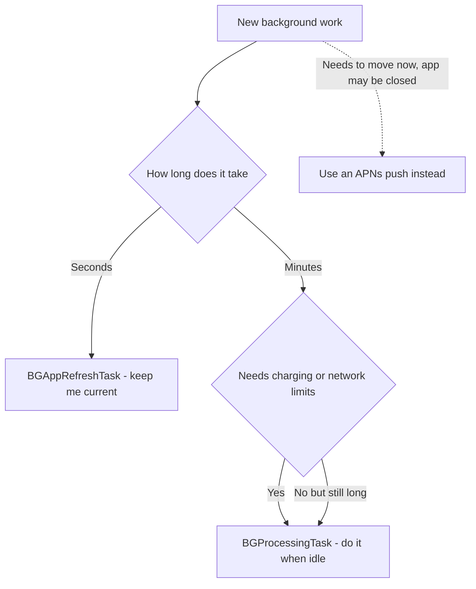
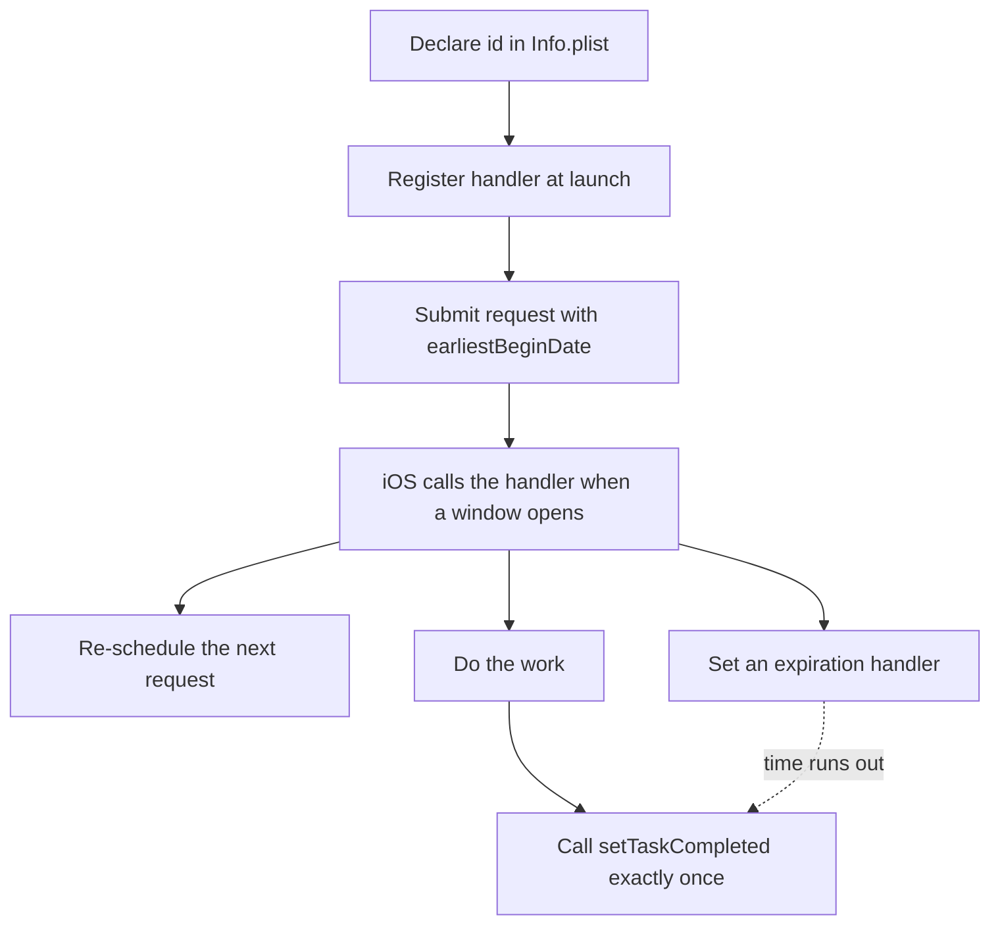

# Lecture 2 — BackgroundTasks, Low Power Mode, and the budget that governs everything

Lecture 1 gave you the real-time surface and the push that drives it. This lecture is about the constraint underneath all of it: **the system decides when your code runs in the background, and it is deliberately stingy.** A Live Activity push that's throttled, a background refresh that fires at 4 AM instead of when you scheduled it, a processing task that never runs because the phone was never idle-and-charging — these are not bugs. They are the OS protecting battery and the user's attention, and a senior engineer designs *for* that scarcity rather than fighting it.

We take the topics in the order they bite: the BackgroundTasks framework first (the two lanes, the register/schedule/handle/complete contract), then the expiration handler (the thing people forget and get killed for), then Low Power Mode and the budget (what gets throttled and how to detect it), then the graceful-degradation playbook that ties background work back to the Live Activity from lecture 1.

---

## 1. The two background lanes

`BGTaskScheduler` gives you two kinds of scheduled background work, and choosing the right one is the first decision:

| | **`BGAppRefreshTask`** | **`BGProcessingTask`** |
|---|---|---|
| **For** | Short, frequent *freshness* — "pull the latest, update the UI/widget" | Long, deferrable *maintenance* — "re-index, clean up, migrate, batch-process" |
| **Duration** | Seconds (~30s) | Minutes (the system can grant several) |
| **When it runs** | Periodically, learned from the user's launch habits | When the device is idle (often overnight, charging) |
| **Requires charging?** | No | Can require it (`requiresExternalPower`) |
| **Requires network?** | Implicitly often available | Can require it (`requiresNetworkConnectivity`) |
| **Typical use** | Refresh notes + reload the widget | Re-index Spotlight, compact the store, large sync |

The mental model: **`BGAppRefreshTask` is "keep me current,"** scheduled to run around when the user tends to open your app, in short bursts. **`BGProcessingTask` is "do the heavy thing when it won't bother anyone,"** which the system slots into idle, charging windows. For the notes app, refreshing the latest notes and reloading the widget is app-refresh; re-indexing the entire Spotlight catalogue or compacting the database is processing.

### Choosing the lane — a worked decision

Walk the decision the way you would in a design review. Ask three questions of the work:

1. **How long does it take?** Seconds → app-refresh. Minutes → processing. A 30-second sync that *sometimes* takes two minutes is a smell: split it, or move it to processing, because an app-refresh task that overruns gets killed.
2. **How time-sensitive is it?** "The user should see fresh data when they next open the app" → app-refresh (it runs near launch time). "Eventually, when convenient" → processing.
3. **Does it need power or network constraints?** "Only when charging" or "only on Wi-Fi" → processing, which exposes `requiresExternalPower` / `requiresNetworkConnectivity`. App-refresh has no such knobs.

So for Hello, Notes: pulling the latest five notes to keep the widget current is *short, time-sensitive, no special constraints* → **app-refresh.** Re-indexing all 5,000 notes into Spotlight is *long, not urgent, fine to require charging* → **processing.** And note what is *not* a background task at all: updating a running Live Activity from a backend event is a **push**, not a scheduled task — don't reach for `BGTaskScheduler` to do a job APNs does better. Picking the wrong tool here is the most common architectural mistake of the week: people try to poll for real-time updates with a refresh task (the budget makes that hopeless) instead of pushing.


*Choosing app refresh, processing, or a push based on duration, constraints, and urgency.*

### What the system actually grants you

It helps to know the rough envelope so your expectations are calibrated:

- **App-refresh** is granted *opportunistically*, often a handful of times a day for an app the user opens regularly, in bursts of ~30 seconds, clustered around the user's habitual launch times (the system learns them). An app the user rarely opens may get app-refresh almost never.
- **Processing** runs when the device is idle and (if you required it) charging — in practice, often overnight on the nightstand. The system can grant several minutes, but it can also defer for days if the conditions never arise.

Neither is a clock you can set. They are *windows the system opens for you* based on the user's behaviour and the device's state. Design for "this will run sometimes, soon-ish," never "this runs every 15 minutes."

---

## 2. The register / schedule / handle / complete contract

Background tasks have a strict four-step contract, and skipping any step means the task silently never runs.

### Step 1 — Declare the identifiers in `Info.plist`

Every task identifier you intend to use **must** be listed under `BGTaskSchedulerPermittedIdentifiers`, or registration fails at runtime:

```xml
<key>BGTaskSchedulerPermittedIdentifiers</key>
<array>
    <string>com.crunch.hellonotes.refresh</string>
    <string>com.crunch.hellonotes.reindex</string>
</array>
```

You also enable **Background Modes ▸ Background processing** and **Background fetch** in Signing & Capabilities.

### Step 2 — Register a handler at launch (before the app finishes launching)

Registration must happen *early* — in `application(_:didFinishLaunchingWithOptions:)` or, in a pure-SwiftUI app, in an `init` / app delegate adaptor — and **before** the launch sequence completes, or iOS will not deliver the task:

```swift
import BackgroundTasks

enum BackgroundJobs {
    static let refreshID = "com.crunch.hellonotes.refresh"
    static let reindexID = "com.crunch.hellonotes.reindex"

    static func registerHandlers() {
        BGTaskScheduler.shared.register(forTaskWithIdentifier: refreshID, using: nil) { task in
            // Force-cast is correct: we registered this id as an app-refresh task.
            handleRefresh(task as! BGAppRefreshTask)
        }
        BGTaskScheduler.shared.register(forTaskWithIdentifier: reindexID, using: nil) { task in
            handleReindex(task as! BGProcessingTask)
        }
    }
}
```

### Step 3 — Schedule a request (and re-schedule after each run)

Scheduling is a *request*, not a guarantee — `earliestBeginDate` is the earliest the system will *consider* running it, not a promised time:

```swift
static func scheduleRefresh() {
    let request = BGAppRefreshTaskRequest(identifier: refreshID)
    request.earliestBeginDate = Date(timeIntervalSinceNow: 15 * 60)   // no sooner than 15 min
    do {
        try BGTaskScheduler.shared.submit(request)
    } catch {
        // Common: too many pending requests, or Background App Refresh disabled in Settings.
        Logger().error("Could not schedule refresh: \(error)")
    }
}

static func scheduleReindex() {
    let request = BGProcessingTaskRequest(identifier: reindexID)
    request.requiresNetworkConnectivity = false
    request.requiresExternalPower = true        // only when charging
    try? BGTaskScheduler.shared.submit(request)
}
```

A background task **does not auto-repeat.** You must re-schedule the next one from *inside* the handler, or it runs once and never again — the single most common "my background task stopped working" bug.

### Step 4 — Handle the task, set an expiration handler, and complete it

The handler is where the work happens, and it has two obligations that are easy to forget and fatal to skip:

```swift
static func handleRefresh(_ task: BGAppRefreshTask) {
    // (a) RE-SCHEDULE the next run immediately, before doing work.
    scheduleRefresh()

    // (b) Wrap the work in a Task so we can cancel it if time runs out.
    let work = Task {
        do {
            try await NotesSync.shared.pullLatest()              // the actual freshness work
            WidgetCenter.shared.reloadTimelines(ofKind: "RecentNoteWidget")
            task.setTaskCompleted(success: true)                 // (d) ALWAYS complete
        } catch {
            task.setTaskCompleted(success: false)
        }
    }

    // (c) The EXPIRATION HANDLER: iOS calls this when your time is up. Cancel and bail.
    task.expirationHandler = {
        work.cancel()
        // setTaskCompleted will be called by the Task's catch via cancellation.
    }
}
```

The two obligations:

- **The expiration handler.** iOS gives you a budget of seconds. When it's about to run out, it calls `task.expirationHandler` — your cue to *immediately stop*, cancel in-flight work, and clean up. If you ignore it and keep running, iOS **kills your app**, which counts against you and trains the scheduler to run you less. The handler must be fast and must cancel cooperatively (this is exactly Week 3's structured-cancellation, applied to a background deadline).
- **`setTaskCompleted(success:)`.** You *must* call it exactly once, on every path. Not calling it means the system thinks you're still running, which wastes budget and gets you throttled. The `success` flag feeds the scheduler's model of whether running you was worthwhile — return `false` honestly when the work didn't finish, so the scheduler can learn from it rather than being told everything is fine.

The whole contract in one breath: **list the id, register the handler early, submit a request, and in the handler re-schedule, set an expiration handler that cancels, do the work, and complete exactly once.** Miss any link and the task silently dies.


*The four-step contract: declare, register, schedule, then re-schedule, expire, work, and complete inside the handler.*

It is worth seeing the contract as a checklist you can run down for any handler you write:

```swift
static func handleAnyTask(_ task: BGTask) {
    scheduleNext()                              // (1) re-arm: tasks don't auto-repeat
    let work = Task {
        do {
            try await doTheWork()               // (2) cooperative — checkCancellation at await points
            task.setTaskCompleted(success: true)// (3) complete on success
        } catch {
            task.setTaskCompleted(success: false)// (3) complete on failure too
        }
    }
    task.expirationHandler = { work.cancel() }  // (4) cancel cleanly when time's up
}
```

Four lines of structure, and every one is load-bearing: skip (1) and it runs once; skip (2)'s cooperation and the cancel does nothing; skip (3) on any branch and the system thinks you're still running; skip (4) and you overrun and get killed. The handler is small precisely so you can verify all four every time.

A note on (2)'s cooperation: cancellation in Swift is *cooperative*, not preemptive — calling `work.cancel()` doesn't forcibly stop anything; it sets a flag that your code must check. So your work must reach an `await` point (or call `try Task.checkCancellation()`) for the cancel to take effect. A tight synchronous loop that never `await`s ignores the cancel entirely and overruns regardless. This is the same Week 3 structured-cancellation contract, and the background deadline is where ignoring it gets your app killed rather than merely producing a wasted result.

> **Development tip.** You will not wait hours for the system to run your task while testing. Pause in the debugger after registration and run, in the LLDB console:
> `e -l objc -- (void)[[BGTaskScheduler sharedScheduler] _simulateLaunchForTaskWithIdentifier:@"com.crunch.hellonotes.refresh"]`
> This fires your handler immediately so you can verify the whole path. There is a matching `_simulateExpirationForTaskWithIdentifier:` to test your expiration handler.

---

## 3. The SwiftUI `backgroundTask` scene modifier — the modern shorthand

For app-refresh specifically, SwiftUI offers a higher-level path that handles some of the ceremony:

```swift
@main
struct HelloNotesApp: App {
    var body: some Scene {
        WindowGroup { RootView() }
            .backgroundTask(.appRefresh(BackgroundJobs.refreshID)) {
                // This async closure runs when the app-refresh task fires.
                await NotesSync.shared.pullLatest()
                await WidgetCenter.shared.reloadAllTimelines()
                await BackgroundJobs.scheduleRefresh()   // re-schedule the next one
            }
    }
}
```

`.backgroundTask(.appRefresh(_:))` gives you an `async` closure tied to a registered identifier, with cancellation wired to the system deadline (the closure's `Task` is cancelled on expiration, so cooperative `await` points bail automatically). You still declare the identifier in `Info.plist` and still submit the request to schedule it. Use this for app-refresh; reach for the full `BGTaskScheduler.register` API when you need the `BGProcessingTask` options (`requiresExternalPower`, etc.) the scene modifier doesn't expose.

The scene modifier also covers a third kind: `.backgroundTask(.urlSession(_:))`, which resumes when a **background `URLSession`** download finishes. That is the right tool for "download a large file that should complete even if the user leaves the app" — a different mechanism from `BGAppRefreshTask` (which is for *short* freshness), and worth knowing exists even though this week focuses on the refresh/processing pair. The decision: short freshness → app-refresh; long deferrable work → processing; a download that must finish → background URLSession.

---

## 4. Pairing background work with the Live Activity

The two halves of this week are not independent — they meet at one point. The Live Activity (lecture 1) is driven primarily by **backend pushes**, but the backend can't always reach the device promptly (the user is offline, the push was throttled, the activity is approaching its `staleDate`). A `BGAppRefreshTask` is the *belt-and-suspenders* path: when it fires, it can pull the latest state and **locally** update any running activities, so a missed push doesn't leave the Lock Screen frozen:

```swift
static func refreshActivities() async {
    // Recover running activities and patch any that look stale.
    for activity in Activity<NoteEditActivityAttributes>.activities {
        guard let fresh = try? await NotesSync.latestEditState(forNoteID: activity.attributes.noteID)
        else { continue }
        var state = activity.content.state
        state.keystrokes = fresh.keystrokes
        state.isActive = fresh.isActive
        await activity.update(
            ActivityContent(state: state, staleDate: .now.addingTimeInterval(1800))
        )
        // If the edit session ended while we couldn't be reached, end the activity.
        if !fresh.isActive {
            await activity.end(ActivityContent(state: state, staleDate: nil),
                               dismissalPolicy: .after(.now.addingTimeInterval(5)))
        }
    }
}
```

This pattern — **push for immediacy, background refresh as the safety net** — is how production real-time features survive the messy network. The push moves the pixels in the common case; the background task catches the activity up (and ends ghost activities that never got their `end` push) in the uncommon case. It is also why `Activity.activities` matters: after a relaunch or a background wake, it's how you re-discover what's running so you can patch it. Designing the two mechanisms to cover for each other is the difference between a demo that works on Wi-Fi and a feature that works on a train.

---

## 5. Low Power Mode — the thing that changes everything

Here is the production reality the demo never shows you: **most of the time your background work needs to run, the device is at 14% battery in Low Power Mode.** And Low Power Mode (LPM) reshapes everything this week touches:

- **Background App Refresh is curtailed** — `BGAppRefreshTask` runs far less often, or not at all, until the user charges.
- **`BGProcessingTask` is heavily deferred** — it already waits for idle/charging; LPM pushes it further out.
- **Live Activity push delivery is deprioritised** — your `update` pushes may be coalesced or delayed, so the Lock Screen number lags.
- **Network and CPU are throttled** — even foreground work slows.

You detect LPM and react:

```swift
import Foundation

var isLowPower: Bool { ProcessInfo.processInfo.isLowPowerModeEnabled }

// React to changes (e.g. relax your push cadence, lengthen stale dates).
NotificationCenter.default.addObserver(
    forName: .NSProcessInfoPowerStateDidChange, object: nil, queue: .main
) { _ in
    let lpm = ProcessInfo.processInfo.isLowPowerModeEnabled
    Logger().log("Power state changed; low-power = \(lpm)")
    // e.g. tell the backend to slow Live Activity updates while LPM is on.
}
```

The senior move is not "disable everything in LPM." It is **degrade gracefully**: fewer, larger updates instead of many small ones; longer `staleDate`s so a delayed push doesn't grey out the activity; deferrable work marked deferrable so the system can honour the user's battery choice. Design the experience that's still *acceptable* at 14% battery, because that is when the user most needs your delivery tracker to keep working.

A concrete degradation policy, expressed as one function the rest of the app reads:

```swift
/// A single source of truth for "how aggressive should background work be right now."
struct PowerProfile {
    let refreshRowLimit: Int          // how much the refresh task pulls
    let staleInterval: TimeInterval   // how long an activity stays "fresh" without an update
    let allowsProcessing: Bool        // run the heavy idle-time task?

    static var current: PowerProfile {
        if ProcessInfo.processInfo.isLowPowerModeEnabled {
            // Battery-anxious: do the minimum, tolerate later updates, skip heavy work.
            return PowerProfile(refreshRowLimit: 5, staleInterval: 60 * 60, allowsProcessing: false)
        } else {
            return PowerProfile(refreshRowLimit: 50, staleInterval: 60 * 30, allowsProcessing: true)
        }
    }
}

// In the refresh handler:
try await NotesSync.pullLatest(limit: PowerProfile.current.refreshRowLimit)

// When starting/updating an activity:
let stale = Date.now.addingTimeInterval(PowerProfile.current.staleInterval)
await activity.update(ActivityContent(state: newState, staleDate: stale))

// Before submitting a BGProcessingTask:
if PowerProfile.current.allowsProcessing { BackgroundJobs.scheduleReindex() }
```

Funnelling the policy through one `PowerProfile` means LPM behaviour is *one thing to reason about and test*, not a scattering of `if isLowPowerModeEnabled` checks across the codebase. Toggle Low Power Mode in the Simulator and you can verify every degraded path from a single switch. That's the difference between "we handle Low Power Mode" as a vague claim and as a property you can point at.

---

## 6. The budget — why "schedule" never means "guarantee"

Behind all of this is the **background execution budget.** iOS models, per app, how much background time you've earned based on how often the user actually opens you, your past behaviour (did you complete tasks? did you overrun and get killed?), the device's battery and thermal state, and system-wide pressure. The consequences:

- **`earliestBeginDate` is a floor, not a target.** The task runs *no sooner* than that, and possibly much later — or never, this cycle.
- **An app the user rarely opens gets almost no background time.** The scheduler invests budget where engagement is.
- **Overrunning the expiration deadline trains the system to trust you less.** Complete on time, every time.
- **Live Activity update pushes share in this scarcity** — high-priority delivery is best-effort, throttled under LPM and thermal pressure.

This is why lecture 1 stressed a generous `staleDate` and `Text(date, style: .timer)` for live time: you cannot rely on a push landing exactly when you sent it, so you design the activity to *look right even if the next update is late* — the timer keeps ticking locally, the stale date is forgiving, and a delayed update corrects the counter when it arrives. Real-time on iOS means "as real-time as the budget allows, and graceful when it isn't."

---

## 7. The failure catalogue (background edition)

| Symptom | Cause | Fix |
|---------|-------|-----|
| Task **never fires** | Identifier not in `BGTaskSchedulerPermittedIdentifiers`, or handler registered too late | Add the id to `Info.plist`; register in `didFinishLaunching` before launch completes |
| Task fires **once**, never again | You didn't re-schedule inside the handler | Call `scheduleRefresh()` at the *top* of the handler |
| App **killed** during background work | You ignored `expirationHandler` and overran | Set an expiration handler that cancels cooperatively; complete on time |
| `submit` **throws** | Background App Refresh disabled in Settings, or too many pending requests | Handle the throw; surface "enable Background App Refresh" if appropriate |
| Task **runs in dev but not in the field** | Device rarely opened → tiny budget; or always in Low Power Mode | Accept the budget; degrade gracefully; don't depend on background for correctness |
| `setTaskCompleted` **never called** on some path | An early return or unhandled throw | Ensure every code path completes the task exactly once |

The pattern: background failures are almost always *a contract step skipped* (id not listed, not re-scheduled, not completed) or *the budget doing its job* (LPM, low engagement). Distinguish the two — one is a bug you fix, the other is reality you design around.

---

## 8. Recap

Lecture 1 gave you the real-time surface; this lecture gave you the scarcity that governs it. Three habits carry it:

1. **Pick the right lane and honour the contract.** `BGAppRefreshTask` for short freshness, `BGProcessingTask` for long idle-time work. List the id in `Info.plist`, register the handler early, submit a request, and *in the handler* re-schedule, set a cancelling expiration handler, do the work, and call `setTaskCompleted` exactly once. Miss a link and the task silently dies.
2. **Design for Low Power Mode.** Most background work that matters happens on a battery-anxious device. Detect LPM (`isLowPowerModeEnabled`, the power-state notification), and degrade gracefully — fewer, larger updates; forgiving stale dates; deferrable work marked deferrable. The acceptable experience at 14% battery is the one you actually ship.
3. **"Schedule" never means "guarantee."** The background budget runs your tasks on the system's terms — `earliestBeginDate` is a floor, engagement buys budget, overruns cost trust, and Live Activity pushes share the scarcity. Never make correctness depend on a background task or a timely push; make the *freshness* depend on it and the *correctness* survive without it.

And one architectural habit ties the week together: **push for immediacy, background refresh as the net, and one `PowerProfile` governing both.** The push moves the Live Activity in the common case; the `BGAppRefreshTask` catches it up (and ends ghost activities) when a push is missed; and the `PowerProfile` shrinks both under Low Power Mode from a single switch you can test. That triad — immediate, resilient, power-aware — is what makes a real-time feature survive the messy reality of a battery-anxious device on a flaky network, rather than only working in the demo on Wi-Fi at 100%.

A final mental check before you call any real-time feature done: ask "what does the user see at 14% battery, in Low Power Mode, on a train with intermittent signal?" If the answer is "a frozen, greyed-out activity that never recovers," you have a demo, not a feature. If the answer is "a slightly-delayed but correct activity that the background net catches up and that ends cleanly," you have shipped the real-time surface properly. That question — the adversarial, worst-realistic-case question — is the senior reflex this week is really teaching.

You now have both halves of the real-time iOS surface: the Live Activity that shows your app's *now* and the push that drives it, and the background tasks plus power awareness that keep the rest of the app current within the system's budget. The exercises build a real activity, drive it with a push, and schedule a refresh task; the mini-project ships a backend-pushed "shared-note edit" Live Activity that updates while the app is asleep and degrades sanely under Low Power Mode. Go make your app's *now* visible — on the system's terms.
