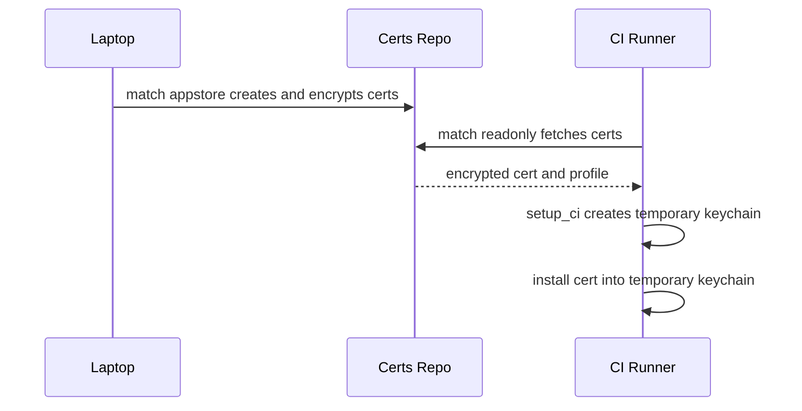
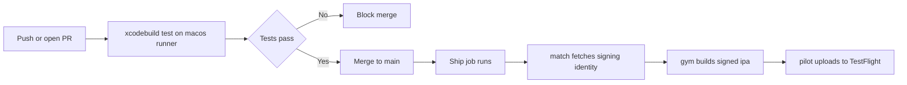

# Lecture 2 — The pipeline: GitHub Actions, fastlane, and TestFlight

Lecture 1 gave you tests worth running. This lecture puts them on a machine that isn't yours and turns a `git push` into a TestFlight build. The framing for the week's second half: **the pipeline is the conveyor; signing is the one genuinely hard part.** Everything else — running `xcodebuild`, gating a PR, uploading an `.ipa` — is plumbing you can copy. Code signing on an ephemeral cloud Mac, which Apple never designed for, is where engineers lose days. So we teach the plumbing fast and the signing slowly.

We go in pipeline order: `xcodebuild` from the command line (so CI can run what Xcode runs), `xcbeautify` (so the log is readable), GitHub Actions on `macos` runners (the orchestrator and the PR gate), then the hard part — `match` for signing — and finally `gym`/`pilot` and the App Store Connect API key that ship to TestFlight.

---

## 1. `xcodebuild` — running the tests Xcode runs, from a script

CI has no Xcode UI; it runs `xcodebuild`, the same engine the IDE drives. The two commands you need are `test` and `archive`. Test:

```bash
xcodebuild test \
  -scheme HelloNotes \
  -destination 'platform=iOS Simulator,name=iPhone 16,OS=18.2' \
  -resultBundlePath TestResults.xcresult \
  -skipPackagePluginValidation \
  | xcbeautify
```

The flags that matter:

- **`-scheme`** — the scheme that includes your test targets. Schemes must be **shared** (checked into Git: Xcode ▸ Manage Schemes ▸ Shared) or CI can't see them. A missing shared scheme is the first CI error everyone hits.
- **`-destination`** — *which* simulator. On a runner you name a simulator that exists on the image; `platform=iOS Simulator,name=iPhone 16,OS=18.2`. Pin the OS so snapshot tests and layout are stable; a floating destination makes pixel snapshots flake.
- **`-resultBundlePath`** — writes an `.xcresult` bundle with every test's pass/fail, logs, and attachments. CI uploads this as an artifact so you can open failures locally.

For speed on CI you can split build from test (`build-for-testing` once, then `test-without-building`), but start simple. Archive (for shipping) we hand to fastlane's `gym` in §5 rather than driving `xcodebuild archive` by hand — `gym` wraps it with sane export options.

### Why CI runs `xcodebuild` and not "the Xcode UI"

It's worth being explicit about what's happening: Xcode the IDE is a *front end* over `xcodebuild`, the same command-line engine. When you press Cmd-U, Xcode shells out to `xcodebuild test` with flags derived from your scheme. CI has no UI, no human to click, so it invokes `xcodebuild` directly with those flags spelled out. This is why a build that "works in Xcode" can fail on CI: Xcode supplied a default (a destination, a signing identity, a derived-data path) that you didn't replicate on the command line. The fix is always to make the *implicit explicit* — name the scheme, the destination, the configuration — so the CI invocation is a faithful, reproducible version of what your laptop does. The `.xcresult` bundle (`-resultBundlePath`) is the same artifact Xcode's test report reads from; download it from a CI run and open it in Xcode to investigate a remote failure exactly as if it ran locally. There is no magic on CI — only `xcodebuild`, run somewhere else, with everything stated.

---

## 2. `xcbeautify` — making the firehose readable

`xcodebuild` emits thousands of lines of build noise. A failing test is in there somewhere. **`xcbeautify`** (a fast, Swift, `xcpretty`-successor) parses that stream into clean, coloured, summarised output — green checks for passing tests, a clear block for failures, a final tally:

```bash
xcodebuild test ... | xcbeautify --renderer github-actions
```

The `--renderer github-actions` mode emits GitHub's annotation format, so a failing test shows up *inline on the PR's Files tab* and in the run summary, not buried in a 10,000-line log. Without a beautifier, CI logs are unreadable and people stop reading them — which means they stop noticing failures. A beautifier is not cosmetic; it is what keeps the team looking at the build.

Pipe-and-exit-code caveat: a pipe normally masks `xcodebuild`'s exit code (you'd get `xcbeautify`'s). Use `set -o pipefail` (or fastlane, which handles it) so a test failure actually fails the job.

---

## 3. GitHub Actions on `macos` runners — the orchestrator and the gate

iOS CI needs a Mac, and GitHub provides **`macos` runners** with Xcode pre-installed. A workflow is YAML in `.github/workflows/`. The PR-gating test workflow:

```yaml
name: CI
on:
  pull_request:           # run on every PR...
  push:
    branches: [main]      # ...and on pushes to main (the ship trigger lives in another job/workflow)

jobs:
  test:
    runs-on: macos-15     # a macOS runner with a recent Xcode
    steps:
      - uses: actions/checkout@v4

      - name: Select Xcode
        uses: maxim-lobanov/setup-xcode@v1
        with:
          xcode-version: '16.2'        # pin it — don't drift with the image

      - name: Cache SwiftPM
        uses: actions/cache@v4
        with:
          path: .build
          key: spm-${{ hashFiles('**/Package.resolved') }}

      - name: Run tests
        run: |
          set -o pipefail
          xcodebuild test \
            -scheme HelloNotes \
            -destination 'platform=iOS Simulator,name=iPhone 16,OS=18.2' \
            -resultBundlePath TestResults.xcresult \
            | xcbeautify --renderer github-actions

      - name: Upload results
        if: always()                    # upload even when tests fail
        uses: actions/upload-artifact@v4
        with:
          name: test-results
          path: TestResults.xcresult
```

The pieces that make it trustworthy:

- **`on: pull_request`** runs this on every PR. Combined with a **branch protection rule** ("require the `test` check to pass before merging"), a red test *blocks the merge button.* This is the gate — the whole reason CI exists. Without the protection rule, CI is advisory and people merge through red.
- **Pin Xcode.** `setup-xcode` selects a specific version. The runner image ships several Xcodes and changes them over time; an unpinned build "works until the image updates and then breaks." Pin it; bump it deliberately.
- **Cache** SwiftPM (and optionally DerivedData) so you don't re-resolve and re-build the world every run — the difference between a 4-minute and a 14-minute CI.
- **`if: always()` upload** the result bundle so you can debug a failure from the artifact instead of the log.

This workflow is the *gate*. The *ship* (build + TestFlight) is a separate job or workflow that runs only on `push` to `main`, and it needs signing — the hard part.

### Pinning fastlane with Bundler — same tool everywhere

Before signing, one setup detail that prevents a class of "works on my machine" pain: pin fastlane's version with Bundler so your laptop and CI run *the exact same* fastlane. A `Gemfile` does it:

```ruby
# Gemfile
source "https://rubygems.org"
gem "fastlane"
```

```bash
bundle install                       # resolves and locks fastlane in Gemfile.lock (commit it)
bundle exec fastlane <lane>          # runs the pinned version, not whatever's globally installed
```

Commit both `Gemfile` and `Gemfile.lock`. On CI, `bundle install` reads the lock and installs the identical version. Without this, your laptop might have fastlane 2.221 and the runner 2.225, and a behaviour change between them produces a failure that reproduces nowhere. The same discipline that pins the Xcode version pins the automation tool — *everything that affects the build is pinned and committed*, so a build is a pure function of the commit, not of the machine. The `Appfile` (`app_identifier`, `apple_id`/`itc_team_id`) and the `Fastfile` (the lanes) live alongside in `fastlane/`, also committed; only the *secrets* stay out of Git.

---

## 4. `match` — solving code signing on a machine that isn't yours

Here is the problem in one sentence: **a fresh CI runner has no signing identity, and Apple's model assumes a developer's personal Mac with their certs in the login keychain.** You cannot hand-install a `.p12` and a profile on an ephemeral machine that's destroyed after each run. fastlane's **`match`** solves it with a deceptively simple idea: **store the certificates and profiles, encrypted, in a Git repo (or S3/GCS), and have every machine — your laptop and CI — fetch and decrypt them on demand.** Everyone signs with the *same* identity; nobody hand-manages keychains.

Setup, once, from your laptop:

```ruby
# Matchfile
git_url("git@github.com:yourorg/certificates.git")   # a PRIVATE repo, separate from the app
storage_mode("git")
type("appstore")                                     # the profile type for TestFlight/App Store
app_identifier("com.crunch.hellonotes")
```

```bash
# Create and store the appstore cert + profile (encrypted) in the certs repo.
bundle exec fastlane match appstore
# match prompts for a passphrase (MATCH_PASSWORD) used to encrypt the repo contents.
```

`match appstore` creates (or reuses) a distribution certificate and an App Store provisioning profile, encrypts them with your `MATCH_PASSWORD`, and commits them to the certificates repo. Now any machine with read access to that repo and the passphrase can install the exact same signing identity.

On CI, you consume them read-only:

```ruby
# In the Fastfile's ship lane, before building:
setup_ci                                # creates a temporary keychain on the runner
match(
  type: "appstore",
  readonly: true,                       # CI must NOT create/modify certs — only fetch
  keychain_name: "fastlane_tmp_keychain",
  api_key: app_store_connect_api_key(...)  # auth without an Apple ID (see §5)
)
```

The CI-signing contract:

- **`setup_ci`** creates a fresh, temporary keychain on the runner and configures `match` to install into it — so you're not fighting the runner's default keychain, and it's gone when the run ends.
- **`readonly: true` on CI.** CI fetches and installs the existing certs; it must *never* create or rotate them (that would race multiple runs and churn your certs). Creation happens once, on a human's laptop; CI only consumes.
- **`MATCH_PASSWORD`** is a **GitHub Actions secret**, never committed. It decrypts the certs repo.
- **A deploy key / token** gives the runner read access to the private certificates repo.


*How one signing identity, created once on a laptop, reaches every CI run through match.*

Get this right once and every CI run signs identically and silently. Get it wrong and you get "No profiles for 'com.crunch.hellonotes' were found" or "Provisioning profile doesn't match" — the errors that eat a day. `match`'s whole value is making those errors go away by making *one* signing identity that *every* machine fetches.

---

## 5. `gym`, `pilot`, and the App Store Connect API key — shipping to TestFlight

With signing solved, shipping is two fastlane actions plus non-interactive auth.

### The App Store Connect API key — auth without an Apple ID

You cannot log a script into App Store Connect with an Apple ID and 2FA — there's no human to approve the prompt. Instead you mint an **App Store Connect API key**: in App Store Connect ▸ Users and Access ▸ Integrations ▸ App Store Connect API, create a key, download the `.p8`, and note the **Key ID** and **Issuer ID**. (Same shape as the APNs key from Week 18.) On CI:

```ruby
def asc_api_key
  app_store_connect_api_key(
    key_id: ENV["ASC_KEY_ID"],
    issuer_id: ENV["ASC_ISSUER_ID"],
    key_content: ENV["ASC_KEY_P8"],   # the .p8 contents, stored as a secret
    is_key_content_base64: true
  )
end
```

`ASC_KEY_ID`, `ASC_ISSUER_ID`, and the base64-encoded `.p8` are **GitHub Actions secrets**. This key authenticates `match`, `pilot`, and any App Store Connect API call non-interactively. **Never commit the `.p8`**; it's a credential to your developer account.

### `gym` — build the signed `.ipa`

`gym` wraps `xcodebuild archive` + export into a single signed `.ipa`:

```ruby
gym(
  scheme: "HelloNotes",
  export_method: "app-store",
  export_options: { provisioningProfiles: { "com.crunch.hellonotes" => "match AppStore com.crunch.hellonotes" } },
  output_directory: "build",
  clean: true
)
```

The `provisioningProfiles` mapping points at the profile `match` just installed (its name is `match AppStore <bundle-id>`). `gym` produces `build/HelloNotes.ipa`, signed for distribution.

### `pilot` — upload to TestFlight

`pilot` (aka `upload_to_testflight`) uploads the `.ipa` and manages testers:

```ruby
pilot(
  api_key: asc_api_key,
  skip_waiting_for_build_processing: true,   # don't block CI on Apple's processing
  distribute_external: false                  # internal testers only; no review needed
)
```

`skip_waiting_for_build_processing: true` returns as soon as the upload completes rather than blocking the runner (and your billed minutes) while Apple processes the build. Internal TestFlight distribution needs **no App Review** — the build is available to your internal testers in minutes. (External beta testing *does* need a review; that's Week 24.)

### The whole ship lane

```ruby
# Fastfile
default_platform(:ios)
platform :ios do
  lane :ship_beta do
    setup_ci
    match(type: "appstore", readonly: true, api_key: asc_api_key)
    increment_build_number(build_number: ENV["GITHUB_RUN_NUMBER"])   # unique build per run
    gym(scheme: "HelloNotes", export_method: "app-store",
        output_directory: "build", clean: true)
    pilot(api_key: asc_api_key, skip_waiting_for_build_processing: true)
  end
end
```

And the GitHub Actions job that calls it, on `main` only:

```yaml
  ship:
    needs: test                 # only ship if tests passed
    if: github.ref == 'refs/heads/main'
    runs-on: macos-15
    steps:
      - uses: actions/checkout@v4
      - uses: maxim-lobanov/setup-xcode@v1
        with: { xcode-version: '16.2' }
      - name: Install fastlane
        run: bundle install
      - name: Ship to TestFlight
        env:
          MATCH_PASSWORD:  ${{ secrets.MATCH_PASSWORD }}
          MATCH_GIT_TOKEN: ${{ secrets.MATCH_GIT_TOKEN }}
          ASC_KEY_ID:      ${{ secrets.ASC_KEY_ID }}
          ASC_ISSUER_ID:   ${{ secrets.ASC_ISSUER_ID }}
          ASC_KEY_P8:      ${{ secrets.ASC_KEY_P8 }}
        run: bundle exec fastlane ship_beta
```

`needs: test` makes the ship depend on the gate — you only ship green. `if: github.ref == 'refs/heads/main'` makes it run only on `main`, not on every PR. That is the whole pipeline: **PR → tests gate the merge; merge to `main` → signed build to TestFlight, no human in the loop.**


*From a push, through the test gate, to a signed build on TestFlight.*

---

## 6. Secrets, forks, and the security boundary

The pipeline runs on machines you don't own, using credentials to your developer account. That makes secret handling a security problem, not just a config detail. The rules:

- **Secrets live in GitHub Actions secrets, never in the repo.** The `.p8`, the `MATCH_PASSWORD`, the certs-repo token — all `${{ secrets.NAME }}`, set via `gh secret set` or the repo settings UI. A credential committed to Git is compromised the moment the repo is cloned, and rotating it is a fire drill. Treat a leaked `.p8` like a leaked password: revoke it in App Store Connect and mint a new one.
- **GitHub masks registered secrets in logs.** Echo a secret and you see `***`. This is a safety net, not a license — don't print secrets even knowing they're masked, because a base64-decode or a transform can leak the underlying value past the mask.
- **Fork PRs do not receive secrets.** When a contributor opens a PR from their fork, GitHub deliberately withholds your secrets from that run — otherwise any stranger's PR could exfiltrate your signing key. This is *why the ship job must be gated to `main`*, not run on PRs: a PR (especially from a fork) can't sign or upload because it has no secrets, and that's correct. The *test* job runs on PRs (no secrets needed); the *ship* job runs on `main` (where secrets are available and the code is already reviewed).

This boundary is the reason the pipeline is split the way it is. Tests gate every PR, including untrusted forks, with no secrets at risk. Shipping happens only after review-and-merge to `main`, where the trusted-code-plus-secrets combination is safe. Designing the workflow around that boundary is not bureaucracy; it's what keeps your developer-account credentials out of a stranger's reach.

## 7. Keeping the pipeline fast, green, and trusted

A pipeline people route around is worse than none — it gives false confidence while training the team to ignore it. Three disciplines keep it trusted:

- **Fast.** Cache SwiftPM and DerivedData; run only the fast test plan on PRs (lecture 1) and the full suite nightly; split `build-for-testing` from `test-without-building` if the build dominates. A PR gate over ~8 minutes starts getting bypassed.
- **Green.** A consistently-red `main` is a broken window — once people accept red, they stop reading failures. Keep `main` green by gating, and when something does break it, fixing or reverting *immediately* is a team norm, not a nice-to-have.
- **Flaky-test quarantine.** A test that fails 1-in-5 for no code reason erodes trust in *every* failure ("oh, that's just the flaky one"). The discipline: tag it, *remove it from the PR gate* (so it stops blocking merges falsely), run it on a nightly job with retries, and *fix it* — don't delete it (you lose the coverage) and don't leave it gating (you lose trust). A flaky test in the gate is a slow poison; quarantine is the antidote.

A concrete split that keeps the gate fast while preserving full coverage: run the fast plan on PRs and the whole suite on a schedule.

```yaml
on:
  pull_request:                    # fast gate on every PR
  schedule:
    - cron: '0 6 * * *'            # full suite nightly at 06:00 UTC

jobs:
  test:
    runs-on: macos-15
    steps:
      # ... checkout, setup-xcode, cache ...
      - name: Tests
        run: |
          set -o pipefail
          PLAN=${{ github.event_name == 'schedule' && 'Full' || 'PR' }}
          xcodebuild test -scheme HelloNotes -testPlan "$PLAN" \
            -destination 'platform=iOS Simulator,name=iPhone 16,OS=18.2' | xcbeautify
```

The PR plan runs the fast, reliable core (logic + snapshots, skip `.slow` and UI); the nightly `Full` plan runs everything including the slow XCUITest journeys. The gate stays under a few minutes so nobody routes around it, and the expensive coverage still runs every day.

The senior framing: CI is a *social* system as much as a technical one. The YAML and the fastlane lanes are easy; the hard part is a pipeline the team actually trusts enough to let it block their merges and ship their builds. Fast, green, and non-flaky is what earns that trust.

---

## 8. The failure catalogue

| Symptom | Cause | Fix |
|---------|-------|-----|
| "Scheme not found" on CI | Scheme isn't shared | Xcode ▸ Manage Schemes ▸ check **Shared**; commit the `.xcscheme` |
| Tests pass locally, fail on CI | Different simulator/OS, or unpinned Xcode | Pin `-destination` OS and the Xcode version; match them locally |
| "No profiles were found" | `match` didn't run, wrong type, or `readonly` blocked a needed create | Run `match appstore` once on a laptop; CI uses `readonly: true` |
| Pipe hides a test failure (job "passes" but red) | No `pipefail` | `set -o pipefail` before the `xcodebuild | xcbeautify` pipe |
| `pilot` auth fails / asks for a password | Using Apple ID instead of API key | Use `app_store_connect_api_key` with the `.p8`/key id/issuer id secrets |
| Snapshot tests flake on CI | Floating simulator/scale/OS | Pin the destination; run snapshots on one fixed simulator |
| Build number collision on upload | Reused build number | `increment_build_number` from `GITHUB_RUN_NUMBER` |
| Secret "not set" / empty | Secret missing or referenced in a PR from a fork | Set repo secrets; note forks don't get secrets — gate ship to `main` |

The pattern: most CI failures are *signing* (solved by `match` + read-only + the API key) or *environment drift* (solved by pinning the Xcode and the simulator). Pin everything and let `match` own signing, and the pipeline is boringly reliable — which is exactly what you want from a pipeline.

---

## 9. Recap

Lecture 1 gave you the cargo; this lecture gave you the conveyor. Three habits carry it:

1. **CI runs `xcodebuild`, made readable by `xcbeautify`, on a pinned `macos` runner.** Share your schemes, pin the destination OS and the Xcode version, `set -o pipefail`, upload the result bundle. The `pull_request` workflow plus a branch-protection rule is the *gate* that blocks merging red.
2. **`match` solves CI code signing.** It stores one signing identity (cert + profile), encrypted, in a repo every machine fetches. CI consumes it `readonly` into a temporary keychain via `setup_ci`, decrypted with the `MATCH_PASSWORD` secret. This is the one genuinely hard part of iOS CI, and it's the part worth doing carefully.
3. **`gym` builds, `pilot` ships, an API key authenticates.** A `.p8` App Store Connect key (stored as secrets) authenticates non-interactively; `gym` produces the signed `.ipa`; `pilot` uploads to TestFlight. A `ship_beta` lane that runs only on `main`, only after the test gate passes, turns a merge into a build — no human touching a Mac.

Two cross-cutting disciplines hold the whole thing together. **Everything that affects the build is pinned and committed** — the Xcode version, the simulator destination, the fastlane version (via `Gemfile.lock`), the shared scheme — so a build is a pure function of the commit, reproducible on any runner. And **secrets live only in CI, fed only to the `main`-gated ship job**, because fork PRs don't receive secrets and shouldn't: the test gate runs on untrusted PRs with nothing at risk, while signing and upload happen only on reviewed, merged code. The split of the workflow into a PR-test job and a `main`-ship job is not arbitrary structure — it's the security boundary made into YAML.

Finally, the pipeline is a *social* artifact: it only helps if the team trusts it enough to let it block their merges and ship their builds. Keep it fast (cache, fast test plan on PRs), keep it green (gate, fix-or-revert norms), and quarantine flaky tests instead of tolerating them. A trusted pipeline is the difference between CI that catches regressions and CI that burns minutes while everyone merges through the red.

You now have the full pipeline: tests at three layers, a `macos` runner gating every PR, `match` solving signing, and a fastlane lane shipping to TestFlight. The exercises write the tests and the PR workflow; the challenge sets up `match` and ships the first build; the mini-project welds it into the complete commit-to-TestFlight pipeline. Build the net well — Week 23's capstone sprint runs at speed *because* this net is under it.
