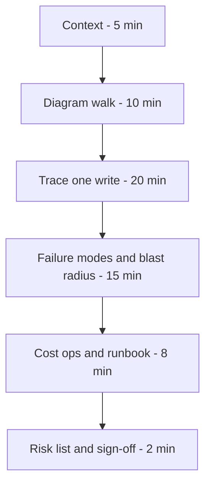
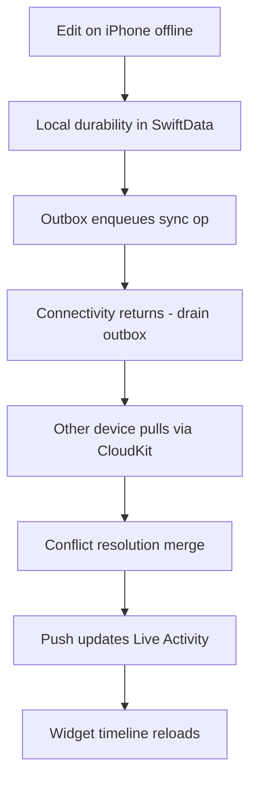

# Lecture 1 — Integrating the Capstone and Running the Architecture Review

> "You have built every part. This week you build the *system*. A system is not a pile of parts; it is the parts plus the contracts between them, and the review is where you prove the contracts hold."

This is the lecture that turns twenty-two weeks of mini-projects into one defensible system. You already know SwiftData, CloudKit, URLSession, StoreKit 2, APNs, WidgetKit, App Intents, ActivityKit, and the multi-platform target topology. None of that is new this week. What is new is **integration** — wiring those parts into a single workspace where one write flows cleanly from a finger on a screen through SwiftData, across CloudKit and your Vapor backend, into a conflict resolver, out to a push, and onto a Live Activity — and **defending** that integration in a review where a senior iOS engineer tries to find the failure mode before your users do.

We build the lecture in two halves. First, the **integration map**: how the Phase I–IV artifacts compose into one Xcode workspace, what the module boundaries are, and where the contracts live. Second, the **architecture review**: the agenda, the artifact set, the trace-one-write walk, and the question bank a staff iOS engineer will run at your Friday sign-off. By the end you should be able to draw the whole system on one page and walk a single write through every box without notes.

A word on why this is a *lecture* and not just a checklist. Integration is the phase where engineering teams most often discover that they built the right parts and the wrong system. Each mini-project was correct in isolation — the SwiftData layer survived a cold launch, the networking actor replayed writes offline, the StoreKit subscription validated server-side — and yet "all the parts pass their tests" does not imply "the system works." The system has properties no single part has: a write must be durable *and* eventually consistent *and* conflict-free *and* observable, all at once, across five platforms. Those whole-system properties live in the *contracts between* the parts, which is precisely the surface no individual mini-project tested. So this week is not "assemble the Lego"; it is "discover and harden the contracts," and the review is the forcing function that makes you state them out loud.

---

## 1. The integration map — what composes into what

Here is the capstone, drawn once so we never argue about its shape again. Top is the user's finger; bottom is the Linux box your Vapor service runs on.

```text
┌──────────────────────────────────────────────────────────────────────┐
│  CLIENTS (one SwiftUI codebase, five targets)                         │
│    iPhone · iPad · Mac (native) · watchOS companion · visionOS window │
│    + App Extensions: WidgetKit, Notification Service Extension (NSE)   │
│    + App Intents (Shortcuts / Siri), ActivityKit (Live Activity)      │
├──────────────────────────────────────────────────────────────────────┤
│  APP LAYER (per target, thin)                                         │
│    Views (SwiftUI) · @Observable stores · @Query · navigation         │
├──────────────────────────────────────────────────────────────────────┤
│  DATA LAYER (shared discipline)                                       │
│    SwiftData (@Model, ModelContainer) ─ the local source of truth     │
│    SyncEngine ─ reconciles SwiftData ⇄ CloudKit ⇄ Vapor               │
│    ConflictResolver ─ deterministic merge policy                      │
│    NotesClient (actor) ─ URLSession, retries+jitter, cert pinning,    │
│                          offline write-replay outbox                  │
│    KeychainStore ─ the auth token, hardware-backed where possible     │
├──────────────────────────────────────────────────────────────────────┤
│  SHARED PACKAGE (NotesCore, SwiftPM)                                  │
│    Codable + Sendable model DTOs imported by BOTH client and server   │
├──────────────────────────────────────────────────────────────────────┤
│  CLOUD                                                                │
│    CloudKit (private DB) ─ primary device-to-device sync              │
│    APNs ─ shared-note push → Live Activity / NSE                      │
│    StoreKit / App Store Server Notifications ─ subscription lifecycle │
├──────────────────────────────────────────────────────────────────────┤
│  BACKEND (Vapor, on Linux)                                            │
│    REST + WebSocket · Postgres (Fluent) · structured logging · OTel   │
│    StoreKit receipt validation · APNs sender · /health · admin flags  │
└──────────────────────────────────────────────────────────────────────┘
```

The single most important integration fact is the **shared `NotesCore` package** from Week 6. A `struct Note: Codable, Sendable` lives in one SwiftPM package, is imported by the SwiftUI client *and* by the Vapor backend, and is the wire contract between them. That one move — shared codable types — is what lets the client and server agree on the shape of a note without a hand-maintained API document drifting out of sync. When the review asks "how do the client and server stay in agreement about the data model," the answer is "they import the same package; a schema change is a compile error on both sides," and that is a senior answer.

The second integration fact is the **layering discipline**. Notice the data layer is shared *as a discipline*, not duplicated per target. Each of the five app targets is thin — views, an `@Observable` store, `@Query`, navigation — and they all sit on top of the same data layer (SwiftData + the `SyncEngine` + `NotesClient`). You did this work incrementally: Week 8 drew the state-ownership boundary, Week 10 put SwiftData behind it, Week 13 added the networking actor, Week 14 added CloudKit and Keychain. This week you confirm the boundary held — that adding the watchOS target did not require copying the data layer, it required importing it.

The third integration fact is the one most people underestimate: the **App Group**. The app target and its extensions (the Widget and the NSE) run in separate processes with separate sandboxes, so they cannot see each other's default SwiftData store. They share data through an **App Group container** — a shared on-disk directory the `ModelContainer` is pointed at, plus a shared Keychain access group for the auth token. If the Widget shows stale or empty data, the first thing to check is whether it is reading the *same* store URL the app writes to, via the App Group, rather than its own private default store. This is invisible until you integrate the extension, which is exactly why it bites in the sprint and not in the per-week Widget project, where the Widget often read mocked data. The contract is "the app, the Widget, and the NSE all open the same App-Group-scoped `ModelContainer`," and getting it wrong produces a Widget that is always one launch behind.

### The Xcode workspace topology

Concretely, your workspace this week looks like:

```text
NotesSuite.xcworkspace
├── NotesCore/                 (SwiftPM package — the shared models + SyncEngine + NotesClient)
│   └── Sources/NotesCore/
├── NotesApp (iOS/iPadOS)      (app target — imports NotesCore)
├── NotesApp (macOS native)    (app target — imports NotesCore)
├── NotesWatch (watchOS)       (app target — imports NotesCore)
├── NotesVision (visionOS)     (app target — imports NotesCore)
├── NotesWidgets               (Widget extension — imports NotesCore)
├── NotesNSE                   (Notification Service Extension — imports NotesCore)
└── (separate repo) notes-api  (Vapor — imports NotesCore as a Linux dependency)
```

The discipline the reviewer checks: **shared code lives in `NotesCore`, target-specific code lives in the target.** A `Note` model, the `ConflictResolver`, the `NotesClient` actor — those are in the package, compiled once, tested once, used five times. A watchOS complication or a visionOS `ImmersiveSpace` is target-specific and lives in the target. If you find the same conflict-resolution logic copy-pasted into the iOS app and the watch app, you have an integration bug, and the review will find it.

### The four integration anti-patterns

Integration goes wrong in four predictable ways, and naming them now means you catch them in your own code before the reviewer does:

1. **The copy-paste data layer.** The watch target was hard to wire to SwiftData, so someone pasted a simplified store into it. Now there are two sources of truth and they drift. Fix: the watch imports `NotesCore`; if SwiftData-on-watch is genuinely hard, that is an ADR, not a copy-paste.
2. **The leaky model.** A view-only concern (a formatted string, a UI flag) crept into the `@Model` or the `NotesCore` DTO, so the model now knows about presentation and cannot be shared cleanly across platforms with different presentation. Fix: keep models data-only; compute presentation in the view layer.
3. **The hidden network call on the main thread.** A sync or a fetch that used to be off-main got called synchronously from a view during integration, and now a scroll janks. This is the Week 15 hitch reappearing at integration time. Fix: every network and heavy-fetch path stays on the `NotesClient` actor or a `@ModelActor`; the view `await`s it.
4. **The orphaned extension.** The Widget or NSE imports a *different* version of a shared type than the app, because the extension target's dependency on `NotesCore` drifted. Now the push payload the NSE decodes does not match the `ContentState` the app encodes. Fix: every target depends on the *same* `NotesCore`; the workspace, not a copied file, is the dependency.

Each of these compiles and demos fine on one platform with ten notes. Each falls over at integration with five platforms and real data — which is exactly why the integration sprint, not the per-week mini-project, is where they surface.

---

## 2. The contracts between the parts

A system is the parts plus the contracts. There are five contracts in this capstone, and you should be able to state each in one sentence. They are the things that break at the boundaries, which is exactly where integration bugs live.

1. **Client ⇄ Server wire contract.** The `NotesCore` codable types. A field added on the server but not the client (or vice versa) is caught at compile time because both import the same struct. The contract is "the package version both sides build against."

2. **SwiftData ⇄ CloudKit contract.** CloudKit imposes constraints SwiftData does not: every relationship must be optional, no `@Attribute(.unique)`, and the schema must be additive-only once deployed to the CloudKit production environment. The contract is "the SwiftData schema is CloudKit-compatible," and violating it is silent — sync just stops working for the offending model. The review asks: "is your schema CloudKit-legal," and you must know the constraints cold.

3. **Local ⇄ Remote write-ordering contract.** A write is durable locally (in SwiftData) *before* it is acknowledged remotely. The user's edit never blocks on the network. The `NotesClient` outbox replays it when connectivity returns. The contract is "local-first: the UI reflects the write immediately; sync is eventually-consistent behind it."

4. **Conflict-resolution contract.** When two devices edit the same note, the merge is **deterministic** — same inputs, same output, every time, regardless of which device runs the merge. The contract is "the resolver is a pure function of (local, remote, ancestor)," and determinism is what makes the conflict drill (next week) reproducible.

5. **Push ⇄ Live Activity contract.** An APNs push with the right payload updates the Live Activity's `ContentState` or starts one push-to-start. The contract is "the push payload shape matches the `ActivityAttributes.ContentState`," and a mismatch means the push silently does nothing — the single most common Live Activity bug.

Write these five contracts down. They are the agenda of the review's "failure modes" segment, and naming them before the reviewer does is the move that reads as senior (§6).

A useful test for whether you actually *have* a contract or just a hope: can you write a test that fails when the contract is violated? The deterministic-conflict contract has one (Exercise 2's order-independence test). The push-to-Live-Activity contract can have one (decode a sample push payload into your `ContentState` and assert it round-trips). The wire contract is enforced by the compiler (both sides import the same package). The contracts you *cannot* write a test for are the ones to worry about — they are enforced only by your discipline, and discipline erodes. Where you can, convert a contract from "I'm careful" to "the build fails if I'm not." That conversion is the single highest-value thing you can do in the integration sprint, because it is the only thing that survives you forgetting about it in six months.

---

## 3. What an iOS architecture review is for

The SYLLABUS prescribes a **daily 30-minute review** this week and a final sign-off on Friday. That sign-off is a real architecture review, and at a real company an architecture review is the gate between a design and the engineer-weeks that build it. If you have never sat in one, you imagine a hostile interrogation. It is not. A good review is a structured collaboration with a known agenda, a known artifact set, and a known question bank. The reviewers are not trying to make you look bad; they are trying to find the failure mode *before* it finds your users.

The review exists to surface, in under an hour, the risks that would otherwise surface in production over six months. That is the whole job. The deliverable of the meeting is a **risk list** — each item tagged *accept*, *fix now*, or *fix later*, with an owner. A review that ends without that list failed, no matter how clean the demo was.

There are three flavours of review in industry, and your capstone sign-off is the most demanding combination of them:

1. **The design review** (before you build) — the system is a document; reviewers stress the plan.
2. **The pre-production review** (before you launch) — the system runs; reviewers stress the implementation and the operational questions: how do you roll back, what pages you, what is the blast radius.
3. **The post-incident review** (after it broke) — the blameless postmortem.

Your Friday sign-off is a pre-production review, with the postmortem flavour arriving next week via the chaos drill. It is exactly what a hiring panel runs when they put you in front of a whiteboard and say "walk me through a system you built." This week you build the muscle.

---

## 4. The artifact set you bring

You do not walk into a review and start typing in Xcode. You bring a packet — the things the reviewers read *before* the meeting so the time is spent on questions, not on catching up. The capstone packet has five artifacts, and they map one-to-one onto this week's deliverables:

1. **The architecture diagram.** One page, Mermaid, in your repo README. Boxes are components, arrows are data flow, every arrow labeled with the protocol and the direction (sync vs async). If you cannot draw it on one page, you do not understand it yet.

2. **The four ADRs.** Architectural decision records for the four choices that matter: the app architecture (plain `@Observable` vs MVVM vs TCA), the sync primary (CloudKit vs Vapor), the conflict-resolution policy, and the StoreKit validation flow. Lecture 2 is largely about writing these.

3. **The production runbook.** `production-runbook.md` — the on-call surface, the five most likely outages, the rollback procedures, and the "it's 3 AM, the push pipeline is silently broken, what do you check" walk. Lecture 2 covers it.

4. **The test + perf evidence.** The green Swift Testing + XCUITest + snapshot run from CI, and the Instruments evidence from Phase III (no hitches in a 60-second scroll, no hangs in five minutes of use). The reviewer reads this to know what "working" means before asking whether it works.

5. **The known-limitations list.** The three things you would fix before real traffic, in priority order, with the cost of each. This is the risk list from your *own* review, written down. It is a feature, not an admission — see §6.

Bring all five. The diagram goes on screen during the meeting; the rest are pre-reads.

### Why the test + perf evidence comes before the demo

The reason the test/perf evidence is an artifact and not an afterthought is the same reason a senior reviewer reads it first: it defines what "working" means before anyone argues about whether the system works. A green test suite is a claim — "these behaviours are pinned" — and the snapshot tests are a stronger claim — "the UI renders exactly this on these device classes." When the reviewer asks "does the list scroll smoothly with a thousand notes," the answer is not "I think so"; it is "here's the Instruments trace from the Week 15 tuning showing zero hitches in a 60-second scroll, and here's the snapshot test that pins the cell layout at the largest Dynamic Type size." Evidence converts a debate into a fact.

The capstone's evidence has three parts, each from a prior week:

- **Correctness:** the Swift Testing suite, including the `ConflictResolver` order-independence test (Exercise 2) and the offline write-replay tests (Week 13). These pin the contracts.
- **UI stability:** the XCUITest flows (add a note, sync, resolve a conflict) and the snapshot tests across device classes and Dynamic Type sizes (Week 22). These pin the rendering.
- **Performance:** the Instruments captures from Week 15 (Time Profiler on the scroll, Hangs on a five-minute session) showing the budget is met. These pin the feel.

A capstone with all three reads as engineered; a capstone with a great demo and no evidence reads as a prototype that happened to work once on camera.

---

## 5. The agenda and the trace-one-write walk

A review that wanders is a review that does not find the risk. Here is the hour you run on Friday:

- **Minutes 0–5 — Context.** What is this app *for*, who uses it, on how many devices, with what consequence if a sync loses data? One sentence each. No architecture yet.
- **Minutes 5–15 — The diagram walk.** Put the one-page diagram on screen; walk it left to right: client → data layer → CloudKit/Vapor → backend. Establish the shape, not the mechanism.
- **Minutes 15–35 — Trace one write.** The heart of the meeting. You pick one note edit and follow it through every hop, naming the failure mode at each. This is where the reviewers interrupt with the hard questions; you let them.
- **Minutes 35–50 — Failure modes and blast radius.** Off the happy path. What happens offline? What happens when CloudKit and Vapor disagree? What is the data-loss window at each hop?
- **Minutes 50–58 — Cost, ops, and the runbook.** The 3 AM walk; the rollback story; what pages you.
- **Minutes 58–60 — Risk list and sign-off.** The reviewers state the risks they found, tag each, assign owners. You write them down. That list is the output.


*The sixty-minute Friday review agenda, minute by minute.*

### The trace-one-write walk, hop by hop

This is the demonstration that wins the room. Not a slide of the flow — the actual flow, in your live app, on two devices side by side. Here is the shape, with the failure mode you name at each hop:

1. **The edit.** The user types in a note's body on the iPhone, offline. The `TextField` is bound via `@Bindable` to the `@Model` object. **Failure mode:** none yet — it is a local mutation. The risk is a *re-render storm* if state ownership is wrong (Week 8), so you note "this re-renders exactly once."

2. **Local durability.** `onChange` stamps `updatedAt` and the `ModelContext` autosaves (and you `save()` explicitly on the edit-commit). The write is durable in SwiftData **before** anything touches the network. **Failure mode:** a crash between mutation and save loses the in-flight edit; you mitigate with explicit save on commit.

3. **The outbox.** The `SyncEngine` enqueues a sync operation in an outbox (a SwiftData `@Model` of its own, or a persisted queue). Because the device is offline, it stays queued. **Failure mode:** an unbounded outbox; you cap it and dedupe by note ID so repeated edits collapse to one pending op.

4. **Connectivity returns.** `NWPathMonitor` (or the `NotesClient`'s reachability) fires. The engine drains the outbox: it pushes to CloudKit (the sync primary) and replays the write to the Vapor backend via the `NotesClient` actor with retry-and-jitter. **Failure mode:** a partial drain — CloudKit succeeds, Vapor fails — leaves the two stores inconsistent; you make each leg idempotent (keyed by note ID + `updatedAt`) so a retry is safe.

5. **The other device.** CloudKit pushes the change to the iPad and the Mac. Their `SyncEngine`s pull it and merge it into local SwiftData. **Failure mode:** the iPad edited the same note concurrently — a conflict.

6. **Conflict resolution.** The `ConflictResolver` runs the deterministic merge (local, remote, ancestor) → one resolved note, written back to SwiftData and re-synced. **Failure mode:** a non-deterministic merge would resolve differently on each device and never converge; your resolver is a pure function, which the test in Exercise 2 proves.

7. **Push and Live Activity.** If the note is *shared*, the Vapor backend sends an APNs push; the NSE decrypts the payload; a Live Activity on the other device updates its `ContentState` to "Alex is editing." **Failure mode:** a payload that does not match `ContentState` is a silent no-op; you assert the shapes match in a test.

8. **The Widget.** The Home Screen Widget's timeline reloads (`WidgetCenter.shared.reloadTimelines`) so the "most recent note" stays fresh. **Failure mode:** reloading too often hits the system budget; you reload only on a real change.


*The eight hops a single note edit travels through, end to end.*

When you put two simulators (or two devices) side by side, edit on one, and watch the change land on the other — resolved correctly, with the Live Activity updating — you have demonstrated more than any slide can. You have shown the system is *observable and correct end to end*, which is the property that lets you operate it.

### Rehearse the walk — do not improvise it

The trace-one-write walk is the highest-stakes ninety seconds of the review, and it involves a live, distributed system that can misbehave: CloudKit sync has latency, the simulator's network can hiccup, a push can be slow. Do not improvise it. Rehearse it three times before Friday:

1. **Dry run with both devices warm.** Edit, watch it land, show the conflict resolve, show the Live Activity update. Time it — it should be under three minutes of clicking and narrating.
2. **Dry run with a pre-staged fallback.** Demos fail. Have a screen recording of a *successful* walk ready to play if the live system stalls. "The CloudKit push is being slow live; here's a recording of the same walk from an hour ago" is completely acceptable and far better than freezing while you refresh.
3. **Dry run narrating out loud.** The words matter as much as the clicks. Practice saying "this edit landed in SwiftData via an explicit save before anything touched the network; the outbox queued it; on reconnect it pushed to CloudKit and replayed to Vapor idempotently; the iPad pulled it and the resolver merged the concurrent edit deterministically." Narration that names the mechanism reads as mastery.

The recorded 5-minute video — a Week 24 deliverable — is essentially this walk, edited. If you rehearse the live walk well this week, the video next week is a thirty-minute recording session, not a thirty-take ordeal. That is one more reason the build-sprint week front-loads the work the final week would otherwise scramble to do.

---

## 6. The staff-iOS-engineer question bank

This is the part you came for. Below is the question bank. A reviewer asks the five your diagram makes them nervous about; your job is to have an answer to every one *before* the meeting, so the five they pick are easy.

### State and rendering

- **"Show me where this re-renders exactly once."** The Week 8 question. The edit mutates one `@Model` object; the list cell observing that object re-renders; nothing else does. If your answer is "I'm not sure," the reviewer suspects a re-render storm and digs.
- **"Who owns this piece of state — the view, the store, or the environment?"** You must name the owner of every non-trivial piece of state and defend it. This is the state-ownership rule from Week 8, and it is load-bearing for the whole architecture.

### Sync and correctness

- **"Where can you lose a write, and how much?"** Walk every hop (§5). The honest answer names the *window* at each: the crash-before-save window (milliseconds, mitigated by explicit save), the partial-drain window (one sync leg, mitigated by idempotency), and the conflict window (resolved deterministically, no loss with field-merge / a bounded loss with last-writer-wins).
- **"Your two devices edited the same note. Which edit wins, and is that deterministic?"** The conflict-resolution ADR. You name the policy, you show it is a pure function, and you show the test that proves two devices converge.
- **"Is your SwiftData schema CloudKit-legal?"** All relationships optional, no `.unique`, additive-only after production deploy. If you have a `@Attribute(.unique)`, CloudKit sync silently fails and the reviewer catches it.

### Networking and offline

- **"The user is offline and edits five notes, then comes back online. What happens?"** The outbox drains in order, idempotently, with retry-and-jitter. The UI never blocked. This is the Week 13 "offline-first write-replay" skill, and the reviewer is checking it stuck.
- **"The server is unreachable for an hour. Does the app degrade or break?"** It degrades to local-only and keeps working; sync resumes when the server returns. "It breaks" is a fail.

### Monetisation and security

- **"Show me one credential in the repo."** There should be none. The auth token is in the Keychain; the APNs key and App Store Connect API key are in CI secrets, not the repo. If `grep -ri "BEGIN PRIVATE KEY\|aps_auth_key" .` returns anything, you fail this on the spot.
- **"How does the server know the subscription is real?"** Server-side validation: the client sends the signed `Transaction.jsonRepresentation`; the Vapor backend verifies the JWS signature against Apple's keys. Not "the client tells the server it paid" — that is trivially spoofable.

### Operations

- **"It's 3 AM, the push pipeline is silently broken. Walk me through the first five minutes."** The runbook's headline question (Lecture 2). The first step is a single check — "is the APNs key valid; did App Store Connect rotate it" — not "I'd look at the logs."
- **"How do you roll back a bad TestFlight build, and how fast?"** Expire the build in App Store Connect and promote the prior one; flip the feature-flag killswitch (Exercise 3) to disable the broken feature without a resubmission. Named, with a time.
- **"What have you *not* instrumented?"** The honest answer is always "something." "I have MetricKit and crash symbolication, but I don't have a synthetic prober hitting the APNs sandbox from outside, so a silent push outage wouldn't page me" is a *great* answer because it is honest and specific.

A reviewer who hears measured, specific, honest answers walks away thinking *this person has shipped and operated an app.* That is the impression that gets the senior offer.

### A worked transcript: the conflict question

Reading the question bank is one thing; hearing how a good answer *sounds* is another. Here is a reconstructed exchange from a capstone-style review, lightly edited. The candidate is presenting; "R" is the reviewer.

> **R:** You've got the same note open on an iPhone and an iPad, both offline. The user edits the title on the phone and the body on the iPad. They reconnect. What happens?
>
> **Candidate:** Both edits survive, and here's why. When each device reconnects, its `SyncEngine` pulls the other's change from CloudKit and runs the `ConflictResolver` — a three-way merge over (local, remote, ancestor). The phone changed the title and not the body; the iPad changed the body and not the title; so each field has exactly one side that diverged from the ancestor, and the merge takes the changed side per field. Neither edit is lost. I have a test that asserts exactly this — non-overlapping edits both survive.
>
> **R:** And if they both edited the *body*?
>
> **Candidate:** Then it's a real conflict on that field, and I fall back to last-writer-wins *for that field only*, by the field's edit timestamp. The earlier body edit is lost — that's an honest data loss, and it's my biggest risk. For a notes app the window where two devices edit the same field offline is small; for a collaborative doc I'd ship a character-level merge instead. It's the first item in my known-limitations list, with the cost to fix.
>
> **R:** How do you know the two devices end up *identical* and don't keep ping-ponging?
>
> **Candidate:** Because the resolver is a pure function and the tiebreak is symmetric — it depends on the values and timestamps, never on which side is "local." So `resolve(a, b)` and `resolve(b, a)` compute the same result. I have an order-independence test that proves it. If the tiebreak preferred "local," the two devices would disagree and never converge, which is why that test is the one I designed against first.

Notice what made that answer strong. The candidate distinguished the easy case (non-overlapping fields, lossless) from the hard case (same field, LWW with honest loss), named their own biggest risk with its fix and cost before being pushed, and closed on the determinism property with the test that proves it. Specific, honest about the weakness, and connected to the evidence. That is the shape of every good review answer.

---

## 7. Surface your own risks first

The single highest-leverage move in a review is to name your own biggest risk before anyone asks. It demonstrates that you understand the system's weaknesses — juniors think their design is flawless; seniors know exactly where the bodies are — and it sets the agenda so the reviewers spend their energy on the risk you already know about instead of hunting for a gotcha.

For this capstone, the honest self-named risks are usually:

1. **Last-writer-wins drops a concurrent edit.** "If two devices edit the same note's body in the same window, last-writer-wins discards one edit. I chose it for simplicity; field-level merge is the documented upgrade and I've scoped it. For a notes app the window is small; for a collaborative doc I'd ship the merge."
2. **The push pipeline has no external prober.** "If App Store Connect silently invalidates the APNs key, nothing pages me until a user reports a missing notification. The fix is a synthetic prober; it's in my known-limitations list with the cost."
3. **Single-region Vapor.** "The backend is one box. If it's down, sync falls back to CloudKit-only, which is fine for device-to-device, but the StoreKit validation and the shared-note push are unavailable. I documented the multi-region path and chose single-region for the capstone budget."

A reviewer who hears you name these relaxes. The candidate who manages the room — keeps it on the agenda, surfaces their own risks, and writes down the action items — reads as senior regardless of the architecture.

---

## 8. The risk list becomes the known-limitations section

The review ends with a risk list. The mistake is to nod, feel relieved, and never look at it again. The discipline is to turn each item into a tracked action with an owner and a due date — even if the owner is you and the due date is "before this goes on my portfolio."

For the capstone, your risk list becomes the **"Known limitations and next steps"** section of your repo README. That section is a *feature*. A portfolio repo that says "here are the three things I'd fix before this took real traffic, in priority order, with the cost of each" is dramatically more credible than one that pretends the system is perfect. Hiring managers read the limitations section first, because it is where they learn whether you can think.

---

## 8b. Multi-platform parity without copy-paste

The capstone runs on five platforms, and the reviewer's parity question is sharper than "does it run on the watch." It is: "did adding the watch require *re-implementing* the data layer, or *importing* it?" The senior answer is "importing," and you prove it by pointing at the `NotesCore` package and showing that the watch target's source is a few hundred lines of watch-specific UI on top of the same `SyncEngine`, `ConflictResolver`, and `Note` the iPhone uses.

The `#if os(...)` discipline (Week 19) is where parity goes wrong. The trap is letting platform conditionals metastasise through shared code:

```swift
// SMELL: a platform branch inside shared logic. Now the data layer knows about
// the UI surface, and the watch and the phone can drift.
func summary(for note: Note) -> String {
    #if os(watchOS)
    return String(note.title.prefix(20))   // truncated for the small screen
    #else
    return note.title
    #endif
}
```

The fix is to keep the conditional at the *edge* — in the view layer of each target — and keep the shared code platform-agnostic:

```swift
// In NotesCore: platform-agnostic. Returns the full title.
func summary(for note: Note) -> String { note.title }

// In the watchOS target's view: the truncation is a PRESENTATION choice,
// so it lives where the presentation lives.
Text(note.summary).lineLimit(1).truncationMode(.tail)
```

When the reviewer greps your `NotesCore` package for `#if os`, they should find almost nothing — maybe a Linux/Apple split for the parts the Vapor backend also imports, and nothing UI-shaped. A data layer riddled with `#if os(watchOS)` is a data layer that will drift between platforms, and the review will say so. Parity is not "five targets exist"; it is "five targets share one implementation."

The watchOS companion is the platform that most tests this discipline, because it is the most tempting to special-case. The capstone spec asks only that the watch show the three most recent notes — a `@Query` with a `fetchLimit`, the same model, the same store. If your watch target reaches for a *different* persistence path (a JSON file synced over `WatchConnectivity`, say) because "SwiftData on the watch felt hard," that is a real architecture decision and it belongs in an ADR — but the default, and the thing the review rewards, is one data layer imported everywhere.

## 8c. The daily 30-minute review and the Friday sign-off

The SYLLABUS prescribes a **daily 30-minute review** this week, not just the Friday hour. These are not the same meeting. The daily reviews are *standups against the integration*: each day you report what hop you got working, what broke, and what you are blocked on, and the lead unblocks you. They are short, they are about *progress*, and they exist so that the Friday sign-off is not the first time anyone sees your system.

The mistake is to treat the dailies as status theatre — "I worked on the watch target" — instead of as integration checkpoints. A good daily report is specific and demonstrable: "I got the iPhone tracing one write end to end through CloudKit; the conflict path works; I'm blocked on the watch target not seeing the shared `ModelContainer` because the App Group isn't configured." That report is actionable; the lead can point you at the App Group capability and you are unblocked in five minutes instead of losing a day.

The Friday sign-off is the real review (the hour in §5). Treat the week as a funnel: the dailies surface and clear the small integration gaps so that Friday is spent on the *architecture* — the contracts, the failure modes, the risks — and not on "why won't the watch build." A team that uses its dailies well walks into Friday with a system that runs and a reviewer who can spend the whole hour on what matters.

---

## 9. Recap — integration is contracts, and the review proves them

You spent twenty-two weeks building parts. This week you built the system, which is the parts plus the five contracts between them: the wire contract, the SwiftData-CloudKit contract, the local-first write-ordering contract, the deterministic-conflict contract, and the push-to-Live-Activity contract. The integration discipline is "shared code in `NotesCore`, target-specific code in the target" — you import the data layer five times, you do not copy it. The four integration anti-patterns — the copy-paste data layer, the leaky model, the hidden main-thread network call, and the orphaned extension — each compile fine on one platform and fall over at integration, which is why this sprint, not the per-week mini-project, is where you catch them.

The architecture review is a one-hour search for the risks that would otherwise take six months to find in production. You bring five artifacts — the diagram, the four ADRs, the runbook, the test/perf evidence, and the known-limitations list — and you run a structured hour ending in a tagged risk list. The trace-one-write walk, on two devices, using your own app, is the demonstration that wins the room; rehearse it three times so the live demo is a performance, not a discovery. The move that reads most senior is to name your own biggest risk before anyone asks — and then to turn the resulting risk list into the README's known-limitations section, which is the first thing a hiring manager reads.

Lecture 2 takes the two artifacts reviewers find most impressive and most candidates have never written: the architectural decision records and the production runbook — and then locks the release-candidate build that next week ships to App Review.

---

## 10. Appendix — the integration checklist

A quick reference you can run against your own workspace before the Friday review. If any line is "no," that is your remaining integration work:

- [ ] All five client targets build against the *same* `NotesCore` package — no copied files, no per-target forks of the data layer.
- [ ] `grep -r "#if os" NotesCore/` returns nothing UI-shaped — platform conditionals live at the view edge, not in shared logic.
- [ ] The app, the Widget, and the NSE open the same App-Group-scoped `ModelContainer` and the same Keychain access group.
- [ ] One note edited offline on the iPhone reaches the iPad and Mac after reconnect, resolved deterministically.
- [ ] The SwiftData schema is CloudKit-legal: all relationships optional, no `@Attribute(.unique)`.
- [ ] No network or heavy fetch runs synchronously on the main thread from a view — every such path is on an actor and `await`ed.
- [ ] The Widget timeline reloads on a real change, not on a timer that burns the budget.
- [ ] A sample APNs payload decodes cleanly into the Live Activity's `ContentState` (a test, ideally).
- [ ] The subscription gates on the *server's* entitlement record, not a client claim.
- [ ] `grep -ri "BEGIN PRIVATE KEY\|aps.*key\|asc_api_key" .` returns nothing — no credentials in the repo.

Every "yes" is a contract you can defend in the review. Every "no" is a question you do not want the reviewer to ask first.
