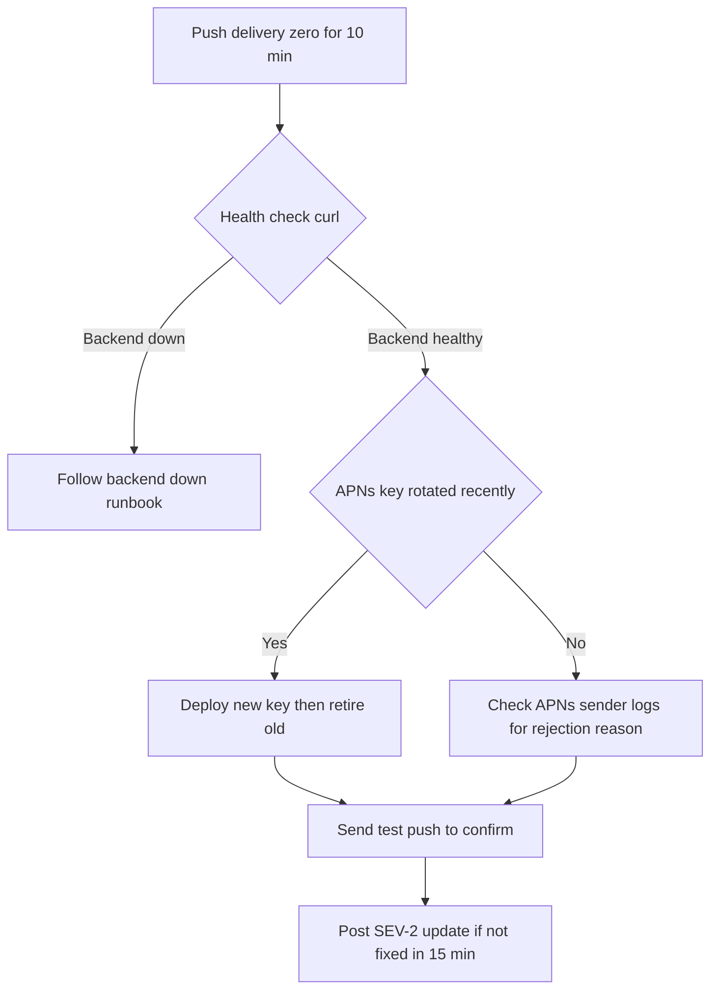
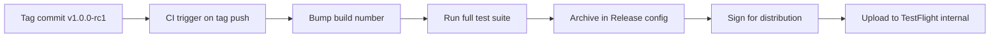

# Lecture 2 — ADRs, the Production Runbook, and the Release Candidate

Lecture 1 gave you the integration map and the review playbook. This lecture is about the three artifacts that make the review credible and the build shippable: the **architectural decision records** that justify your hard choices, the **production runbook** that proves you can operate the thing at 3 AM, and the **release-candidate discipline** that turns "it works on my Mac" into a signed build in TestFlight that next week ships to App Review. These are the deliverables that separate an engineer who *built* an app from one who can *operate* it — and the operating story is exactly what App Review, a beta cohort, and a hiring panel each probe.

We take them in the order you produce them this week: ADRs first (because they record the decisions the review interrogates), runbook second (because the review's operations segment reads it), release candidate last (because you lock the build only after the architecture is signed off).

All three share a property worth naming up front: they are artifacts you write *for someone else* — a reviewer, a future on-call engineer, a hiring manager, or yourself six months from now with no memory of today. That audience-for-someone-else framing is what keeps them honest. An ADR you write for yourself can be lazy; one a skeptical reviewer will read forces you to actually justify the choice. A runbook you write for yourself can say "you know how this works"; one a half-asleep future-you will read at 3 AM forces you to spell out the first command. The discipline of writing for a reader is the discipline that makes these artifacts good.

---

## 1. Architectural decision records — recording the "why"

An ADR is a short, dated, immutable document that records one architectural decision: the context, the options, the choice, and the consequences. The format is Michael Nygard's, it is one page, and it lives in `docs/adr/` in your repo, numbered (`0001-architecture.md`, `0002-sync-primary.md`, …). The point is not bureaucracy; it is that six months from now — or in an interview — you can say *why* you chose plain SwiftUI over TCA without reconstructing the reasoning from memory. A decision you cannot defend is a decision you got lucky on.

The skeleton every ADR follows:

```markdown
# ADR-0002: CloudKit is the sync primary; Vapor is the fallback

- **Status:** Accepted
- **Date:** 2026-06-10
- **Deciders:** <you>

## Context
What forces are at play? What problem are we solving, and what constraints
bind the choice (cost, the five-platform requirement, offline-first, the
$99 budget, the App Review timeline)?

## Options considered
1. Option A — with its pros and cons.
2. Option B — with its pros and cons.
3. Option C — with its pros and cons.

## Decision
The option chosen, stated in one sentence, and the single most important
reason.

## Consequences
What becomes easier, what becomes harder, what we now have to maintain, and
what we explicitly accept as a risk (this links to the known-limitations list).
```

A note on what makes an ADR *good* versus merely present. A weak ADR records the decision and stops: "We use CloudKit. Status: Accepted." A strong ADR records the decision *and the alternatives you rejected and why*, because the rejected options are where the reasoning lives. Six months from now, the question is never "what did we choose" — that is visible in the code — it is "why didn't we use the other thing," and that answer only survives if you wrote it down. The other mark of a good ADR is an honest *consequences* section that names what got worse, not just what got better; every real decision is a trade, and an ADR that lists only upside is marketing, not engineering.

You write **four** ADRs for the capstone. Here is the substance of each — the reasoning the review will test.

### ADR-0001 — The app architecture: plain `@Observable` vs MVVM vs TCA

This is the Week 11 decision, now made for real. The three options, honestly:

- **Plain SwiftUI + `@Observable`** ("use the language"). Views read `@Query` and a thin `@Observable` store; the data layer is a package. Minimal ceremony, maximal use of the platform, easy onboarding. Cost: no enforced unidirectional flow, so discipline lives in code review, not the type system.
- **MVVM.** A view-model per screen mediates between views and the data layer. Familiar to most teams, testable view-models. Cost: a layer of indirection that, with `@Observable` and `@Query`, often duplicates what SwiftUI already gives you.
- **TCA (The Composable Architecture).** Reducers, effects, dependencies, exhaustive testing. Powerful for complex state machines and large teams. Cost: a real learning curve, a dependency, and ceremony that a notes app rarely needs.

The defensible capstone decision is usually **plain `@Observable` with the data layer in `NotesCore`**, because the app's state is mostly server/SwiftData-derived rather than a complex in-memory state machine, and the team is one person. The ADR says exactly that: "I chose plain `@Observable` because the state is data-layer-derived, not a complex local machine; TCA's testability win does not pay for its ceremony at this scope; here is the threshold (a genuinely complex multi-step flow, or a team) at which I'd reach for TCA." That threshold sentence is what makes it a decision and not a default.

### ADR-0002 — The sync primary: CloudKit vs Vapor

The capstone syncs over **CloudKit (primary) with the Vapor backend as a fallback path.** Why CloudKit primary?

- It is free at the user's scale (their iCloud quota, not your server bill), it works device-to-device with no backend involvement, and it survives your Vapor box being down.
- The Vapor backend is required anyway for StoreKit validation and the shared-note push, so it is the natural fallback and the integration point for cross-account sharing (which CloudKit private databases do not do across Apple IDs).

The ADR records the constraint CloudKit imposes — all relationships optional, no `.unique`, additive-only schema once in production — and the consequence: "the SwiftData schema is shaped to be CloudKit-legal, which cost me the `.unique` constraint on `Tag.name`; I enforce tag uniqueness in application code instead." That is the kind of honest consequence a reviewer respects.

### ADR-0003 — The conflict-resolution policy

When two devices edit the same note, you resolve deterministically. The options:

- **Last-writer-wins (LWW) by `updatedAt`.** Simplest. The note with the later `updatedAt` wins wholesale. Cost: the earlier edit is *lost entirely*, even if it touched a different field.
- **Field-level merge.** Compare local, remote, and the common ancestor field by field; take the changed side for each field; if both changed the same field, fall back to LWW *for that field*. Cost: more code, needs an ancestor snapshot, but no edit is lost unless two devices fought over the same field.
- **CRDT-lite.** A merge type (e.g. an OR-set for tags, a last-writer-wins register per field) that converges by construction. Cost: a real data-structure investment; overkill for a notes app.

The defensible decision for the capstone is **field-level merge with per-field LWW as the tiebreak**, because it satisfies the "don't eat my edit" expectation for the common case (two devices edited different things) while staying simple. Critically, the ADR records that the resolver is a **pure function** `resolve(local:remote:ancestor:) -> Note` — same inputs, same output — because that determinism is what makes next week's conflict drill reproducible and what makes the test in Exercise 2 meaningful. (If you ship LWW instead, the ADR must be honest that a concurrent edit is lost, and that honesty is itself defensible.)

The detail the ADR must not skip is **where the ancestor comes from.** A three-way merge needs the common ancestor — the note as it was at the last successful sync — and you do not get that for free. You persist a *last-synced snapshot* per note (a small shadow record, or the `CKRecord.systemFields` plus the field values you last pushed), and the merge compares the local and remote against it. Without the ancestor, "field-level merge" collapses to last-writer-wins, because you cannot tell which side actually *changed* a field versus merely *carried it forward*. The consequence the ADR records: "the resolver needs a per-note ancestor snapshot, which costs one extra persisted record per note and one extra write per sync; I accept that cost to avoid eating concurrent edits." That sentence is the difference between an engineer who read about three-way merge and one who has implemented it.

### ADR-0004 — The StoreKit 2 validation flow

The subscription must be validated **server-side**, because client-only entitlement checks are trivially bypassed on a jailbroken or instrumented device. The flow:

1. The client purchases via StoreKit 2; on success it has a `Transaction`.
2. The client sends `transaction.jsonRepresentation` (the signed JWS) to the Vapor backend.
3. The backend verifies the JWS signature against Apple's published keys, checks the bundle ID, product ID, and expiry, and records the entitlement against the user.
4. The backend also subscribes to **App Store Server Notifications V2** so it learns about renewals, refunds, and billing retries without the client ever re-reporting.

The ADR records the consequence: "entitlement is a server fact, not a client claim; the client's `Transaction.currentEntitlements` is a UX hint, but the gate is the server's record." That distinction — UX hint vs authoritative gate — is the senior framing.

---

## 2. The production runbook — operating it at 3 AM

The runbook is the artifact that separates engineers who have *operated* systems from those who have only *built* them. The SYLLABUS is explicit: `production-runbook.md` answers "what to check at 3 AM when the push pipeline silently breaks, what to roll back, who to page" — and the discipline is the point even though you are paging yourself.

A good runbook has five sections.

### 2.1 — The on-call surface

List every external dependency that can page you, and how you would even know it broke:

| Surface | What breaks | How you detect it |
|---|---|---|
| APNs | Auth key invalidated/rotated; payload rejected | Push delivery drops to zero; (ideally) a synthetic prober fails |
| CloudKit | Quota exceeded; schema not deployed to production; account throttled | Sync stalls; `CKError` rate spikes in MetricKit/logs |
| Vapor backend | Box down; Postgres connection exhausted; deploy regression | `/health` returns non-200; structured-log error rate spikes |
| StoreKit / Server Notifications | Signature verification fails after an Apple key roll; webhook endpoint down | Subscription state stops updating; notification 4xx in Vapor logs |
| App Store Connect API | API key expired; rate-limited | CI upload fails; programmatic TestFlight ops 401 |

The honest admission most candidates skip: **the detection column is where the gaps are.** "Push delivery drops to zero" is not *detected* unless something is watching. Naming the missing prober (the §2.5 example) is more credible than pretending you have full coverage.

### 2.2 — The five most likely outages

For each, a one-paragraph "symptom → likely cause → first action":

1. **Silent push outage.** *Symptom:* users stop getting shared-note notifications; no crash, no error in the app. *Likely cause:* the APNs auth key was rotated or invalidated in App Store Connect and the backend still holds the old one. *First action:* verify the key in App Store Connect; deploy the new key to the Vapor backend (new key first, retire old key after — see next week's APNs rotation drill).
2. **Sync stalls.** *Symptom:* edits stop propagating between devices. *Likely cause:* a schema change was not deployed to the CloudKit production environment, or a `.unique`/non-optional relationship slipped in. *First action:* check the CloudKit dashboard schema; confirm the production schema matches the build.
3. **Backend down.** *Symptom:* StoreKit validation and shared-note push fail; device-to-device sync still works (CloudKit). *Likely cause:* the box crashed or Postgres connections exhausted. *First action:* `/health`; restart/redeploy; check the connection pool.
4. **Subscription state wrong.** *Symptom:* a paying user sees the paywall, or a refunded user keeps Pro. *Likely cause:* a missed/failed App Store Server Notification, or a verification regression. *First action:* re-fetch the user's entitlement from the App Store Server API; reconcile the server record.
5. **A bad build in beta.** *Symptom:* crash spike in the new TestFlight build. *Likely cause:* a regression. *First action:* flip the feature-flag killswitch (Exercise 3) to disable the offending feature; expire the build and promote the prior one.

### 2.3 — The rollback procedures

Three distinct rollbacks, each named with a mechanism and a time:

- **A TestFlight build.** Expire the bad build in App Store Connect (testers stop getting it) and notify the cohort; promote the prior build. Minutes.
- **An App Store build.** You *cannot* un-ship an App Store build instantly — App Review gates the replacement. The real lever is the **feature-flag killswitch**: a remote flag, read on launch and cached, that disables the broken feature without a resubmission. The "1.0.1 the day after launch" pattern (next week) is the slower path. This is why the killswitch (Exercise 3) is in the runbook.
- **A Vapor deploy.** Redeploy the prior image/commit; the deploy is one command and the backend is stateless except for Postgres, which you do not roll back casually (run forward-only migrations). Seconds-to-minutes.

### 2.4 — The communication template

A two-line template for telling your beta cohort something broke, borrowing PagerDuty's severity vocabulary:

```text
[SEV-2] Shared-note notifications delayed (since 02:14 UTC)
We're aware shared-note pushes are delayed for some testers. Edits and sync
are unaffected — your data is safe. Cause identified (APNs key rotation),
fix deploying now, ETA 20 min. Next update at 02:45 UTC or on resolution.
```

The discipline: lead with user impact ("your data is safe"), not internal cause; give an ETA; commit to a next-update time. A beta cohort forgives an outage; it does not forgive silence.

### 2.5 — The 3 AM walk

The runbook's headline, and the review's headline question. It is not a paragraph; it is a single first check and then a decision tree:

```text
PAGE: shared-note push delivery = 0 for 10 min
  1. Is this APNs or the backend?
       curl -fsS https://<your-vapor-host>/health || echo "BACKEND DOWN"
     - Backend non-200 -> go to "Backend down" runbook. STOP here.
     - Backend healthy -> it's the push path; continue.
  2. Is the APNs auth key still valid?
       Check App Store Connect -> Keys. Was a key rotated in the last 24h?
     - If a key was rotated: the backend holds a stale key. Deploy the new
       key (new-first, retire-old-after). Confirm with one test push.
     - If no rotation: check the backend's APNs sender logs for the
       rejection reason (BadDeviceToken, TopicDisallowed, ...).
  3. Mitigate first, investigate after. If you can't fix the push path in
     15 min, post the SEV-2 message (2.4) so testers know sync still works.
  4. Capture the failing payload + the APNs response for next week's
     postmortem before the logs roll.
```


*The first-five-minutes decision tree for a silent push outage.*

The point of putting this in the review is not that the reviewer reads the whole tree — they read the *first line* and judge whether your observability lets you answer "what's wrong" in one look. If your first step is "grep the logs," that is too vague. If your first step is one `curl` that bisects backend-vs-push, that is an operable system.

### 2.6 — A worked outage: the silent push failure

Reading the runbook is one thing; walking it is another. Here is the silent-push-outage scenario end to end, the way it would actually unfold, so the runbook's structure makes sense.

It is 02:14 UTC. You notice — or, better, a synthetic prober notices — that shared-note pushes have delivered zero notifications for ten minutes. There is no crash and no error in the app; sync still works, because sync is CloudKit, not push. This is the worst kind of outage: invisible to the app, invisible to most monitoring, visible only to a user who expected a notification and did not get one.

You open the runbook to the "push delivery = 0" page and run the first check: `curl -fsS https://<your-vapor-host>/health`. It returns 200 — the backend is up. So it is the push *path*, not the backend, and you have bisected the problem in one command. You go to App Store Connect → Keys and see that an APNs auth key was marked for rotation 18 hours ago by a teammate (or by you, half-asleep). The backend still holds the old key, and APNs has started rejecting it with `403 ExpiredProviderToken`.

You deploy the new key to the Vapor backend — new key first, the old key stays valid until you explicitly retire it, which is next week's rotation-drill discipline — and you send one test push. It arrives. The pipeline is recovered. Total time, because the runbook bisected the problem immediately: under fifteen minutes. While the fix deployed, you posted the SEV-2 message from §2.4 so the beta cohort knew sync was unaffected and a fix was inbound. Finally, you captured the failing `403` response and the timestamp for next week's postmortem, before the logs rolled.

Now read that back against the runbook structure: the *detection* came from a prober (the gap you'd otherwise have named in §2.1), the *first action* bisected backend-vs-push in one command (§2.5), the *fix* followed the new-key-first sequence (the §2.2 entry), the *comms* led with user impact (§2.4), and the *evidence* was captured for the postmortem. Every section of the runbook earned its place in one real outage. That is why you write it before you need it: at 02:14 you do not want to be *designing* the response; you want to be *executing* it.

---

## 3. Locking the release candidate

With the architecture signed off and the runbook written, you lock the build. The discipline is that you do **not** archive by hand and drag a build into App Store Connect; you drive the Week 22 CI pipeline so the build is reproducible and traceable to a commit. A build you cannot reproduce from a tag is a build you cannot debug.


*The release-candidate pipeline, from tag to internal TestFlight build.*

### 3.1 — Version and build number

`MARKETING_VERSION` (the user-facing `1.0.0`) and `CURRENT_PROJECT_VERSION` (the build number, monotonic). The rule: the marketing version is the release the App Store shows; the build number increments on *every* upload, even for the same marketing version, because App Store Connect rejects a duplicate `(version, build)` pair. For the RC you set `1.0.0` and let CI bump the build number:

```bash
# In the fastlane lane, before gym, bump the build number to the next
# available value for this app from App Store Connect.
increment_build_number(
  build_number: latest_testflight_build_number(version: "1.0.0") + 1
)
```

Tag the commit so the build maps to an exact source state:

```bash
git tag v1.0.0-rc1
git push origin v1.0.0-rc1
```

### 3.2 — The green-test gate

The RC does not ship unless the full suite is green. Your CI already runs this on every PR (Week 22); for the RC you run it once more, locally and in CI, and you do not proceed on a single failure:

```bash
# Swift Testing + XCUITest + snapshot tests, all targets, prettified output.
set -o pipefail && xcodebuild test \
  -workspace NotesSuite.xcworkspace \
  -scheme NotesApp \
  -destination 'platform=iOS Simulator,name=iPhone 16,OS=18.5' \
  | xcbeautify
```

You want the C20 marker — zero failures — across the unit, UI, and snapshot suites. A red test in the RC is a `git revert`, not a "we'll fix it in beta."

### 3.3 — Archive and upload to TestFlight internal

The distribution build uses the **Release** configuration (optimisations on, no debug-only code paths), is signed with a **distribution** certificate and an **App Store** provisioning profile, and goes to TestFlight *internal* testing first (your own devices and up to 100 internal testers, no App Review needed). The fastlane lane:

```ruby
# fastlane/Fastfile (excerpt)
lane :release_candidate do
  ensure_git_status_clean
  run_tests(
    workspace: "NotesSuite.xcworkspace",
    scheme: "NotesApp",
    devices: ["iPhone 16"]
  )
  increment_build_number(
    build_number: latest_testflight_build_number(version: "1.0.0") + 1
  )
  build_app(
    workspace: "NotesSuite.xcworkspace",
    scheme: "NotesApp",
    configuration: "Release",
    export_method: "app-store"
  )
  upload_to_testflight(
    skip_waiting_for_build_processing: false,
    distribute_external: false,          # internal only this week; external is next week
    groups: ["Internal"]
  )
end
```

The `distribute_external: false` is deliberate: **internal** testing needs no App Review, so you can validate the real distribution build on real devices *this* week. **External** beta (the five regions: US, UK, IN, BR, JP) needs a Beta App Review pass, which is next week's work. Locking the internal build now means next week is "flip to external + submit to App Review," not "build for the first time under deadline."

The lane is triggered the same way your Week 22 CI is triggered, so the RC is built by the same machine that builds every PR — not by your laptop with whatever local state it happens to carry. In GitHub Actions, the RC job runs on a `macos-14` (or newer) runner, with the distribution certificate and App Store provisioning profile installed from a secrets-backed `match` repository (or the equivalent keychain setup), and the App Store Connect API key supplied as a secret:

```yaml
# .github/workflows/release-candidate.yml (excerpt)
on:
  push:
    tags: ['v*.*.*-rc*']     # tagging v1.0.0-rc1 triggers the RC build
jobs:
  release-candidate:
    runs-on: macos-15
    steps:
      - uses: actions/checkout@v4
      - name: Run the release_candidate lane
        env:
          APP_STORE_CONNECT_API_KEY_ID:      ${{ secrets.ASC_KEY_ID }}
          APP_STORE_CONNECT_API_ISSUER_ID:   ${{ secrets.ASC_ISSUER_ID }}
          APP_STORE_CONNECT_API_KEY_CONTENT: ${{ secrets.ASC_KEY_CONTENT }}
          MATCH_PASSWORD:                    ${{ secrets.MATCH_PASSWORD }}
        run: bundle exec fastlane release_candidate
```

The discipline this enforces: **the build that goes to testers is reproducible from a tag.** Anyone — you next week, a teammate, a future maintainer — can check out `v1.0.0-rc1`, push the tag, and get the exact same build. A build that only exists because of something on your laptop is a build you cannot reproduce, and a build you cannot reproduce is a build you cannot debug when a tester reports a crash in it.

### 3.4 — The export-compliance answer

Every upload triggers the encryption-compliance question. The capstone uses HTTPS (TLS) and CryptoKit, which is "standard encryption" — you answer the App Store Connect question accordingly and, to stop the per-upload prompt, set `ITSAppUsesNonExemptEncryption` in the app's `Info.plist`:

```xml
<key>ITSAppUsesNonExemptEncryption</key>
<false/>
```

`false` is correct when your only cryptography is the platform's standard TLS/HTTPS and Apple-provided crypto (CryptoKit, Keychain) — which is the capstone's case. (If you shipped your *own* novel encryption you would answer differently and may need an export-compliance document; you did not, so `false` it is.) Recording this in the runbook saves the next person the research.

### 3.5 — The App Privacy nutrition label

Every App Store submission requires the App Privacy "nutrition label" — Apple's structured declaration of what data your app collects, how it is used, and whether it is linked to the user or used to track them. You prepare it this week so next week's submission does not stall on it. The rule is simple and unforgiving: **the label must match what the app actually does.** A label that under-declares is grounds for rejection (and, post-launch, removal); a label that over-declares scares users for no reason. You derive it from the code, not from a guess.

Walk the capstone's data flows and declare honestly:

- **The note content** (title, body, tags) — collected, linked to the user (it is their data), used for **App Functionality**, *not* used for tracking. It syncs via CloudKit (Apple-operated, the user's own iCloud) and your Vapor backend (yours).
- **The auth token** — stored in the Keychain, not "collected" for analytics; used for App Functionality (authenticating to your backend).
- **Purchase history** — the StoreKit subscription state. Used for App Functionality (gating Pro features); linked to the user.
- **Diagnostics** — if you ship MetricKit/crash data to anyone, declare it as Diagnostics. If it stays on-device or goes only to Apple, the declaration differs. Be precise.

The discipline that catches errors: for every "data type" Apple lists, ask "does my code touch this, and where does it go." If the answer is "we don't collect it," declare nothing for it — but be sure. A common miss is a third-party SDK (an analytics or crash library) that collects an identifier you never see in your own code; you are still responsible for declaring it. Since the capstone uses only Apple frameworks and your own backend, your label is short and honest, which is exactly what you want.

### 3.6 — The metadata and screenshots first pass

The last piece of App Store Connect prep is the store listing itself: the app name, subtitle, description, keywords, support URL, and the screenshots. You do a *first pass* this week — enough that next week is editing, not authoring. The screenshots are the part with a hard technical constraint: App Store Connect requires specific pixel dimensions per device class (e.g. 1290×2796 for the 6.7-inch iPhone), and a screenshot that reads as a wall of tiny text fails at the 1x thumbnail size most users actually see. The Week 22 snapshot-testing setup is useful here: you can generate clean, consistent device-framed captures programmatically rather than hand-cropping simulator screenshots. The description leads with the one sentence that says what the app is and who it is for; the keywords are the search terms a user would actually type, comma-separated, within the 100-character budget. None of this is graded for prose quality this week — it is graded for *being prepared*, so that next week's submission is a click, not a writing session.

---

## 4. The release-candidate checklist

Before you call the RC "locked," walk this list. It is the code-review checklist a release manager applies:

- **Architecture signed off.** The Friday review produced a risk list, and every "fix now" item is fixed; "fix later" items are in the known-limitations section.
- **Four ADRs written** and committed under `docs/adr/`. The reviewer can read *why* for every hard choice.
- **Runbook written.** The on-call surface, five outages, three rollbacks, the comms template, and the 3 AM walk — all present, no placeholders.
- **Full suite green** in CI: Swift Testing + XCUITest + snapshot, zero failures.
- **No credentials in the repo.** `grep -ri "BEGIN PRIVATE KEY\|aps.*key\|asc_api_key" .` returns nothing; secrets are in CI and the Keychain.
- **Version + build set,** the commit tagged `v1.0.0-rc1`, and the build maps to that tag.
- **TestFlight internal build live** and installable on a real device; the distribution (Release) build behaves like the debug build.
- **Export-compliance answered** (`ITSAppUsesNonExemptEncryption`).
- **App Store Connect record prepared:** app created, bundle ID + capabilities match, App Privacy nutrition label drafted from what the app actually collects.
- **The killswitch works** (Exercise 3): you can disable a feature remotely and the app respects it on next launch.

If every box is checked, next week is a submission week. If any is open, next week is a sprint — and a sprint the same week you are also running a chaos drill and presenting at demo day is exactly the crunch this curriculum is named to avoid.

---

## 5. Recap

Three artifacts make the capstone real this week. The **ADRs** record the four decisions the review interrogates — the architecture, the sync primary, the conflict policy, and the StoreKit validation — each with context, options, a decision, and honest consequences; a decision you cannot defend is one you got lucky on. The **production runbook** proves you can operate the system at 3 AM: the on-call surface, the five likely outages, the three rollbacks, the comms template, and the one-line-first-check 3 AM walk; the gaps in the detection column are more credible named than hidden. The **release candidate** is locked through CI, not by hand — version and build bumped, the full suite green, archived in Release, signed for distribution, and uploaded to TestFlight *internal* with export-compliance answered and the commit tagged.

Do all three this week and Week 24 is what it should be: ship to external beta in five regions, pass App Review, run the chaos drill, write the postmortem, and present. Lock the build now so the final week is a delivery, not a scramble.

One last framing, because it is the through-line of this whole track. The course is named for the thing it refuses to do: crunch. The discipline of this week — locking the build, writing the runbook before the outage, preparing the metadata before the deadline, rehearsing the demo before demo day — is the *anti-crunch* discipline. A team that ships the way this week teaches walks into its launch calm: the build is reproducible, the rollback is rehearsed, the on-call response is written down, and the demo is a re-take. A team that skips it spends launch week building the build for the first time, discovering the rollback under fire, and improvising the demo live. Both teams ship; only one of them shipped without burning down. The artifacts in this lecture are not bureaucracy — they are the difference between a release and a fire drill, and choosing the release is the senior move.

---

## 6. Appendix — the ADR and runbook quality bar

A reference you can grade your own artifacts against before the Friday review.

An ADR is *good* when:

- It names the alternatives you rejected, not just the option you chose.
- Its consequences section names something that got *worse*, not only what improved.
- It includes a *threshold* — the condition under which you would revisit the decision.
- It is dated and `Status: Accepted`, so it reads as a historical fact, not a living draft.

A runbook is *good* when:

- Each outage has a *first action*, not just a description.
- The 3 AM walk opens with a single bisecting command, not "look at the logs."
- The detection gaps are named honestly and pushed to the known-limitations list.
- The rollback procedures each name a mechanism *and* a rough time.
- The comms template leads with user impact and commits to a next-update time.

A release candidate is *locked* when:

- The full suite is green in CI (not just on your laptop), and the build came from a tag.
- The Release-signed build runs on a real device and behaves like the debug build.
- The export-compliance answer is set and justified, and the App Store Connect record is prepared.

Run these three bars over your artifacts. Anything that fails a bar is a thing the reviewer will catch — so catch it first.
