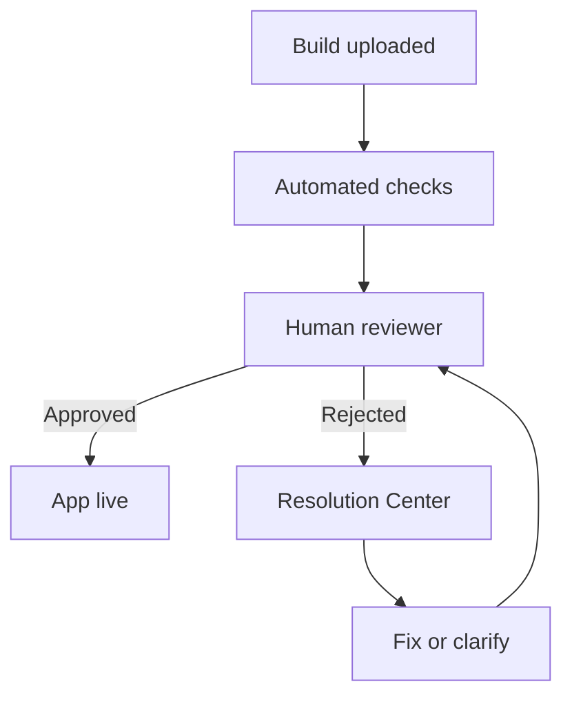
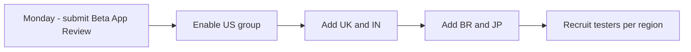

# Lecture 1 — App Review and Shipping to TestFlight

> "App Review is not a code review. It is a contract-compliance check, run by a human in a hurry, against a guideline document with about a dozen rules that actually have teeth. Know those dozen rules, pre-empt them, and you land on the first try."

This is the lecture that turns "I have a build" into "my app is live in five regions and cleared Apple's gate on the first attempt." It is a lecture about a bureaucratic process, and the temptation is to treat it as a checklist to skim. Resist that. The engineers who get rejected are not the ones with bad code; they are the ones who did not read the guidelines and tripped a rule they could have pre-empted in five minutes. The cost of a rejection is not the fix — it is the *days* you wait in the queue again, which in a launch week is the difference between shipping on schedule and shipping late. So we are going to be precise about what App Review actually checks, what it never checks, and how to walk in clean.

We build the lecture in three parts. First, **what App Review really is** — the process, the people, the timeline, and the dozen rules with teeth. Second, **the metadata and privacy details** — the parts of the submission that are not code and that reject more apps than crashes do. Third, **the TestFlight external rollout** — flipping the locked build to five regions, the Beta App Review, beta groups, and reading the crash reports that come back.

---

## 1. What App Review actually is

App Review is a human-plus-automation gate that every App Store build and every TestFlight *external* build passes through before it reaches users. (Internal TestFlight builds skip it — that is why last week's RC went to internal testing.) A reviewer installs your build, runs it, checks it against the App Store Review Guidelines, and either approves it or rejects it with a citation to a specific guideline number. The whole thing takes, in 2026, typically under 24 hours for a standard review and a few days at worst.

The participants in that gate are worth picturing concretely:

- **The automated checks** run first — static analysis for private-API use, the entitlements and capabilities check, the binary scan. These are fast and deterministic; you either trip them or you don't.
- **The human reviewer** installs the build and exercises it for a few minutes against the guidelines, using whatever path your metadata and notes point them toward.
- **You**, who can respond to a rejection in Resolution Center, supply a demo account, and (rarely) appeal.

Understanding that it is automation-then-human tells you why the two failure modes are so different: an automated rejection (a private API, a missing entitlement) is a hard, specific fix, while a human rejection (couldn't find the feature, metadata mismatch) is often a clarification or a metadata edit away from approval.


*App Review is automation first, then a human, with rejections looping back through Resolution Center rather than dead-ending.*

The single most important reframe: **App Review is not a code review and not a security audit.** The reviewer does not read your Swift. They do not check whether your conflict resolver is deterministic or whether your networking layer retries with jitter. They check *observable behaviour against a contract*: does the app crash on launch, does it do what the metadata says, does it follow the rules about privacy and payments, does it have enough functionality to justify being an app. The mental model is "a busy person with your build and a rulebook," not "a senior engineer reviewing your PR."

That reframe tells you where to spend effort. You do not harden the architecture for App Review — you did that for the Week 23 review. For App Review you make sure the app *launches clean, does what you said, and does not trip one of the dozen rules with teeth.*

### The dozen rules with teeth

The guidelines are long, but a small number of rules cause the overwhelming majority of rejections. Know these cold, because each is a five-minute pre-empt and a multi-day rejection if you miss it:

- **2.1 — App completeness.** It must not crash, and it must not have obvious bugs or placeholder content. A crash on the reviewer's device is an automatic rejection. (This is why the RC's green test suite and the device validation matter.) Note that "the reviewer's device" may be an older model or OS than yours, so a crash you never saw can still appear on review — another reason the beta crash stream and a fresh-device test are not optional.
- **2.3 — Accurate metadata.** The screenshots, description, and keywords must match what the app does. A screenshot of a feature the app does not have is a rejection. Do not put "AI-powered" in the description if there is no AI.
- **3.1.1 — In-app purchase.** Digital goods and subscriptions *must* use Apple's IAP. You may not link to an external purchase flow for digital content, and you may not even hint at one ("subscribe on our website"). The capstone's StoreKit subscription is compliant by construction — but make sure no stray "manage your subscription at example.com" copy slipped in.
- **4.2 — Minimum functionality.** The app must do enough to be an app, not a repackaged website or a thin wrapper. A multi-platform productivity suite clears this easily; just make sure the reviewer can *see* the functionality without a hard-to-reach account.
- **5.1.1 — Data collection and storage / privacy.** This is the big one for the capstone, and it has two sharp edges: the **App Privacy nutrition label must be accurate** (§2 below), and if your app supports **account creation, it must support in-app account deletion** (5.1.1(v)). Apps that let users sign up but not delete their account are routinely rejected. If your capstone has accounts, ship the delete-account path.
- **5.1.2 — Data use and sharing.** You must have a privacy policy URL, and you must not share data in ways the user did not consent to.

There are more, but these six (well, "a dozen" rounding up the sub-clauses) are where launches die. Read each one's actual text before submitting — the link is in `resources.md`.

Here is the same set as a pre-flight table you can paste into your submission checklist:

| Guideline | The rule | Your five-minute pre-empt |
|---|---|---|
| 2.1 | No crashes, no placeholder content | Fresh-device launch test; green RC suite |
| 2.3 | Metadata matches the app | Screenshots from the current build; honest description |
| 3.1.1 | Digital goods use Apple IAP only | No external purchase links or hints in copy |
| 4.2 | Enough functionality to be an app | Core feature obvious on launch; demo account in notes |
| 5.1.1 | Accurate privacy label | Label derived from code; every collected type declared |
| 5.1.1(v) | In-app account deletion if accounts exist | Ship the Delete Account button + `DELETE /account` |
| 5.1.2 | Privacy policy + no unconsented sharing | Resolving privacy-policy URL; honest data use |

If you can tick every row honestly, you have removed the overwhelming majority of rejection risk before you ever click submit.

### What App Review never checks

Knowing what it ignores keeps you from over-preparing the wrong things:

- It does not check your code quality, architecture, or test coverage.
- It does not check your backend's reliability or your sync correctness — it only sees the client.
- It does not deeply exercise edge cases; a reviewer spends minutes, not hours, and follows the happy path you make easy to find.
- It does not test your app under network failure, low memory, or a server outage — those are conditions only *you* will recreate, in the chaos drill.
- It does not check your accessibility (that is your Week 16 work and your own conscience), your performance budget (Week 15), or your test coverage.
- It does not guarantee your app works — passing review is necessary, not sufficient. The chaos drill (Lecture 2) is how *you* check the things App Review never will.

The asymmetry is the insight: App Review is a shallow check of a contract, so you pass it by making the happy path obvious and the contract honest. The *deep* checks — does it survive a region failure, does it lose a concurrent edit — are yours to run, which is the rest of this week.

One more reframe that calms the nerves: App Review is *adversarial in form but collaborative in intent.* Apple wants your app on the store — a healthy store is their business — so the gate is designed to catch the things that hurt users, not to fail you for sport. Reviewers approve far more than they reject. The engineers who experience App Review as hostile are usually the ones who skipped the guidelines and got surprised; the ones who read the dozen rules and pre-empted them experience it as a fast, predictable gate they walk through on the first try. Your job is to be in the second group, and this entire lecture is the recipe.

---

## 2. The metadata and privacy details — what rejects more apps than crashes

Most engineers assume rejections are about code. They are more often about the *submission*: the metadata, the privacy label, and the missing privacy policy. These are not code, they are easy to get wrong, and a reviewer checks them every time.

### Screenshots and the 1x test

App Store Connect requires screenshots at specific pixel sizes per device class — 1290×2796 for the 6.7-inch iPhone, plus iPad and (if you ship them) Mac and visionOS sizes. Two rules:

1. **They must reflect the actual app.** A screenshot showing a feature you do not ship is a 2.3 rejection.
2. **They must read at 1x.** Most users see your screenshots as small thumbnails in search results, not full-screen. A screenshot that is a wall of tiny text communicates nothing at thumbnail size. The first screenshot should say, at a glance, what the app is — a clean note view, the multi-device sync, the one thing that matters.

The Week 22 snapshot-testing setup helps: you can generate clean, consistent, device-framed captures programmatically instead of hand-cropping, which also means they regenerate correctly when the UI changes.

### The App Privacy nutrition label

Apple's privacy label is a structured declaration of what data you collect, how it is used, and whether it is linked to the user or used to track them. **The label must match what the app does** — under-declaring is grounds for rejection and post-launch removal; over-declaring scares users for nothing. You derive it from the code, not a guess.

For the capstone, the honest declaration is short:

- **User content** (notes: title, body, tags) — collected, linked to the user, used for **App Functionality**, *not* used for tracking. It syncs via CloudKit (the user's own iCloud) and your Vapor backend.
- **Purchase history** — the subscription state, linked to the user, App Functionality.
- **Identifiers** — only what you actually use (a user ID for your backend), linked, App Functionality.
- **Diagnostics** — only if you ship crash/metric data somewhere; if it stays on-device or goes only to Apple, declare accordingly.

The trap is a third-party SDK collecting an identifier you never see — you are still responsible for declaring it. The capstone uses only Apple frameworks and your own backend, so your label is short and honest, which is exactly what you want.

Concretely, the App Privacy questionnaire walks you through data types. For each, you answer "do you collect this," and if yes, "is it linked to the user" and "is it used for tracking." The capstone's honest answers:

| Data type | Collected? | Linked? | Tracking? | Purpose |
|---|---|---|---|---|
| User content (notes) | Yes | Yes | No | App Functionality |
| Purchase history | Yes | Yes | No | App Functionality |
| User ID | Yes | Yes | No | App Functionality |
| Coarse/precise location | No | — | — | — |
| Contacts | No | — | — | — |
| Browsing/search history | No | — | — | — |
| Diagnostics (crash) | If shipped off-device | No | No | App Functionality |

The "Tracking" column is the one Apple scrutinizes most, because "used to track you" triggers the App Tracking Transparency prompt and a different privacy posture. The capstone tracks nothing — it does not share data with data brokers or use it for cross-app advertising — so every Tracking answer is "No," and you do not need the ATT prompt. Declaring this honestly is both correct and the easiest possible privacy posture: collect only what the app needs, link it because it is the user's own data, track nothing.

### The account-deletion requirement

If your capstone supports account creation (most do, to authenticate to the Vapor backend), guideline **5.1.1(v)** requires an **in-app account-deletion** path — not "email us to delete," an actual button in the app that deletes the account and its server-side data. This is one of the most common rejections because it is easy to forget. Ship it: a "Delete Account" action that calls a `DELETE /account` endpoint on your Vapor backend, clears the local SwiftData store and the Keychain token, and signs the user out. Test it before you submit.

### The privacy policy and support URLs

You need a reachable **privacy policy URL** (5.1.2) and a **support URL**. They can be simple — a GitHub Pages page is fine — but they must exist and resolve. A submission with a dead privacy-policy link is rejected. Set these in the App Store Connect record this week, before you submit.

### The submission, field by field

The App Store Connect "App Information" and "Version Information" forms have a fixed set of fields. Here is what each wants and the capstone-appropriate answer, so you fill them once and correctly:

- **Name** (30 chars) — the app's store name. Distinct, not keyword-stuffed.
- **Subtitle** (30 chars) — the one-line value proposition: "Offline notes across your devices."
- **Promotional text** (170 chars, editable without a new build) — a line you can change between releases.
- **Description** — leads with the one sentence that says what the app is and who it is for, then the feature list. No marketing claims you cannot back up (no "AI" without AI).
- **Keywords** (100 chars total, comma-separated) — the actual search terms a user types: `notes,sync,offline,icloud,productivity,markdown`. No spaces between commas (they waste the budget).
- **Support URL** and **Marketing URL** (optional) — must resolve.
- **Age rating** — answer the questionnaire honestly; a notes app is typically 4+.
- **Category** — Productivity, secondarily Utilities.
- **Version** and **Copyright** — `1.0.0` and your name/year.

None of this is graded for prose quality; it is graded for being *accurate and complete*, because an empty required field blocks submission and an inaccurate one trips 2.3. Fill the form from the real app, not from aspiration.

---

## 3. Submitting — and landing on the first try

The mechanics, in order, and the discipline that lands you clean.

### Submit early in the week

Build processing takes minutes to an hour; App Review (and Beta App Review) takes hours to days. **Submit Monday.** If you submit Friday and get rejected, you lose the weekend and your demo day slips. If you submit Monday and get rejected, you have the week to land the resubmission. This single scheduling choice is the difference between a calm launch and a crunch, and it is the reason the build was *locked last week*: so that this week opens with "submit," not "build."

### The pre-submission audit

Before you click submit, run the readiness audit (Exercise 1) against the dozen rules:

- App launches clean on a fresh device, no crash, no placeholder content. (2.1)
- Screenshots and description match the real app; no vapor features. (2.3)
- No external-purchase links or hints for the subscription. (3.1.1)
- The functionality is reachable without a hard-to-reach account; if there is a login, provide a **demo account** in the App Review notes so the reviewer can get in. (4.2)
- The App Privacy label matches the code; account deletion is shipped; the privacy-policy and support URLs resolve. (5.1.1, 5.1.2)
- `ITSAppUsesNonExemptEncryption` is set; the export-compliance answer is correct.

The demo-account-in-the-notes detail is the most-missed easy win: if a reviewer cannot log in, they cannot see your app, and they reject for "could not review." Put a working demo account's credentials in the App Review notes field every time.

A good App Review notes field looks like this — short, specific, and answering the questions a reviewer would otherwise have to guess:

```text
Reviewer notes:

This is an offline-first productivity (notes) suite for iPhone, iPad, and Mac,
with a watchOS companion and a visionOS window. Sync is via CloudKit (the user's
own iCloud) with a Vapor backend fallback.

Demo account (already has sample data):
  email:    review@example.com
  password: <the password, here>

The subscription ("Notes Pro") is configured against the StoreKit sandbox; you
can complete a purchase with a sandbox Apple ID without real charges. The Pro
gate is the "Tags" filter screen.

Account deletion: Settings -> Account -> Delete Account (removes server + local
data). The privacy policy is at https://example.com/privacy.

There is no login wall on first launch — you can create and edit notes
immediately; the account is only needed for cross-device sync.
```

Every sentence there pre-empts a question a reviewer would otherwise resolve by guessing — and a reviewer who has to guess is a reviewer who rejects when the guess fails. The notes field is free; use it generously.

### Expedited review — the finite resource

App Store Connect lets you request an **expedited review** for genuine emergencies (a critical bug in production, a time-sensitive event). It is a finite resource — abuse it and Apple stops granting them. For the capstone you should not need it if you submit Monday. Know it exists for the "1.0.1 the day after launch" scenario; do not lean on it as a substitute for submitting early.

### What the timeline actually looks like

So you can plan, here is the realistic 2026 timeline for each gate:

- **Build processing** (after upload): minutes to about an hour. The build is not reviewable until processing finishes.
- **Beta App Review** (external TestFlight): typically a few hours, sometimes up to a day. Lighter than full review.
- **Full App Review** (App Store): typically under 24 hours in 2026, occasionally a few days for a first submission or a flagged category.

These are *typical*, not guaranteed — Apple does not commit to an SLA, and queues lengthen around major OS releases (September) and holidays. The planning implication is the same as before: submit early, because you are budgeting against a queue you do not control. If you submit Monday and the queue is slow, you still land mid-week. If you submit Thursday and the queue is slow, your demo day slips. Treat the review queue like any external dependency with variable latency: give yourself slack.

### The "1.0.1 the day after launch" pattern

Even a clean launch often ships a 1.0.1 within days, because beta does not catch everything and the first real users find the edge you missed. This is normal and healthy, not a failure. The discipline is to *expect* it: keep the next build ready, keep the killswitch (Week 23, Exercise 3) wired so you can disable a broken feature *without* waiting for a 1.0.1 review, and treat the first post-launch fix as part of the launch, not a surprise. An engineer who plans for 1.0.1 is calm when it arrives; one who assumed 1.0.0 was the end scrambles.

### If you do get rejected: how to respond

Even with a clean audit, you might get rejected — reviewers are human and sometimes misunderstand an app. The response discipline matters as much as the pre-empt:

1. **Read the citation.** The rejection names a specific guideline number and usually includes a note and sometimes a screenshot from the reviewer. Read it literally. Most rejections are a real, fixable issue.
2. **If it is a real issue, fix it and resubmit.** Do not argue; fix the metadata, ship the account-deletion path, remove the external-purchase link, whatever the citation says. Resubmit with a note saying what you changed.
3. **If you believe it is a misunderstanding, reply in Resolution Center.** You can respond to the reviewer with a clarification — "the feature in 4.2 you couldn't find is reached via the + button; here is a 20-second screen recording." A calm, specific reply with evidence often resolves a misunderstanding without an appeal.
4. **Use the App Review Board appeal only for genuine disputes.** If you and the reviewer disagree on whether you violated a guideline (not whether a bug exists), you can appeal to the App Review Board. Use this rarely and only when you are confident; it is for principled disputes, not "I disagree with the rule."

The meta-point: a rejection is a conversation, not a verdict. Reviewers resolve clarifications quickly when you make their job easy — exactly the same principle as the demo account in the notes. The engineers who spiral on a rejection are the ones who treat it as final; the ones who land treat it as one more round of making the reviewer's job easy.

---

## 4. The TestFlight external rollout to five regions

The capstone ships to **TestFlight external beta in five regions: US, UK, IN, BR, JP.** Here is how the rollout works and why it is structured this way.

### Internal vs external, and the Beta App Review

- **Internal testing** (last week) — up to 100 of your own team members, no App Review, instant. You used it to validate the RC.
- **External testing** (this week) — up to 10,000 testers via email invites or a public link, gated by a **Beta App Review**. The Beta App Review is lighter than full App Store review but checks the same teeth-having rules (no crash, accurate metadata, IAP compliance, privacy). Passing it is a strong signal you will pass full review.

You flip to external by creating one or more **beta groups**, assigning the build, and adding testers. The five-region requirement is about *territories*: TestFlight is global, but you recruit testers across the five regions so your beta exercises the app in different locales, App Store fronts, and (for the subscription) different storefronts and currencies. The fastlane lane from last week flips one parameter:

```ruby
lane :external_beta do
  upload_to_testflight(
    distribute_external: true,            # was false last week
    groups: ["Beta - US", "Beta - UK", "Beta - IN", "Beta - BR", "Beta - JP"],
    beta_app_review_info: {
      contact_email: "you@example.com",
      demo_account_name: "review@example.com",   # the reviewer's way in
      demo_account_password: ENV["DEMO_PASSWORD"],
      notes: "Productivity suite. Demo account provided. Subscription is sandbox."
    },
    changelog: "First external beta. Multi-device notes with CloudKit sync."
  )
end
```

Note the `beta_app_review_info` block — the demo account and notes go *here* for Beta App Review, the same way they go in the App Review notes for full review. Forgetting them is the same "could not log in, rejected" trap.

### Beta groups and the five-region structure

Why separate groups per region instead of one global group? Two reasons. First, you can roll out to one group at a time — start with US, confirm the build is healthy, then add the others — so a bad build does not hit all five regions at once. Second, the per-group crash and feedback data is segmented, so if the subscription breaks only in JP (a storefront/currency issue), you see it isolated instead of buried in a global average. The structure *is* the observability.

### Reading beta crash reports and feedback

TestFlight surfaces two streams from external testers: **crash reports** (symbolicated, in App Store Connect and Xcode Organizer) and **feedback** (testers can attach a screenshot and a note). Read both daily during the beta. A crash that only appears on a specific device or OS version, or only in one region, is exactly the kind of edge your simulator never showed you. The MetricKit collector you shipped in Phase III complements this — the crash reports tell you *what* crashed, MetricKit tells you about the hangs and hitches that do not crash but degrade. Together they are your launch-week dashboard.

The beta is also where the chaos drill lives (Lecture 2): a real beta cohort, a live backend, and a deliberate failure injected into a running system, so the postmortem reflects production conditions and not a simulator.

### The rollout sequence, step by step

The five-region external rollout is not one button; it is a sequence you run over the early part of the week:

1. **Monday — submit for Beta App Review.** Flip the build to external with the US group only, plus the `beta_app_review_info`. The Beta App Review processes the build.
2. **Once approved — enable the US group.** Confirm the build is healthy: install via TestFlight on a real device, complete a sandbox subscription, sync across two devices. Watch the crash stream for a few hours.
3. **Add UK and IN.** Now that US is healthy, widen. Different App Store fronts; watch for locale-specific issues (date formats, right-to-left if you localized, currency in the paywall).
4. **Add BR and JP.** The last two regions. JP in particular exercises a different storefront and currency for the subscription, and a non-Latin locale; if anything region-specific is going to break, it tends to show here.
5. **Recruit a handful of testers per region.** You do not need thousands; you need enough real installs per region that the per-group crash and feedback data is meaningful. Friends, cohort peers, and a public link are all fine.

The point of staging it — US first, then widen — is the same blast-radius discipline from the architecture review: a bad build hits one group, not five, and you catch it before it is everywhere. A team that flips all five regions at once and then finds the JP currency bug has a five-region incident; a team that staged it has a one-region observation.


*The five-region rollout widens one step at a time so a bad build only ever hits the current group.*

### What the crash report tells you that the simulator never did

Beta crash reports are valuable precisely because they come from *real* devices in *real* conditions — older OS versions, lower-memory devices, flaky networks, locales you never set. Read each one as a question: "what condition did this device have that mine didn't?" A crash that only appears on a two-generations-old iPhone is often a memory-pressure issue your modern Mac's simulator hid. A crash only in one region is often a locale or storefront assumption. The MetricKit payloads (Phase III) complement the crashes with the hangs and hitches that degrade without crashing. Together, the crash stream + MetricKit + the per-region segmentation are your launch-week observability — and the thing that makes the chaos drill's findings believable, because they sit on top of a system you are already watching.

---

## 5. The common rejections, pre-empted

To close, the rejections Apple's own "common rejections" page lists most, each with the one-line pre-empt:

- **Crashes and bugs.** Pre-empt: the green RC suite + a fresh-device launch test. (2.1)
- **Broken links / dead privacy-policy URL.** Pre-empt: click every URL in the record before submitting. (5.1.2)
- **Placeholder content.** Pre-empt: no "Lorem ipsum," no test data, no "Coming soon" screens. (2.1)
- **Inaccurate metadata / wrong screenshots.** Pre-empt: screenshots from the real, current build. (2.3)
- **Privacy label mismatch.** Pre-empt: derive the label from the code, declare every collected type. (5.1.1)
- **Missing account deletion.** Pre-empt: ship the in-app delete-account path if you have accounts. (5.1.1(v))
- **IAP rule violations.** Pre-empt: no external-purchase links or hints for digital goods. (3.1.1)
- **Could not log in.** Pre-empt: a working demo account in the review notes. (4.2)
- **Requires a hard-to-find feature to be functional.** Pre-empt: make the core functionality obvious on first launch. (4.2)

Every one of these is a five-minute check and a multi-day rejection. Run them all (Exercise 1) before you submit, and you walk in clean.

---

## 6. Recap

App Review is a shallow contract check run by a busy human against a rulebook — not a code review. You pass it by making the happy path obvious and the contract honest. The dozen rules with teeth (2.1 completeness, 2.3 metadata, 3.1.1 IAP, 4.2 minimum functionality, 5.1.1 privacy + account deletion, 5.1.2 privacy policy) cause almost all rejections, and each is a five-minute pre-empt. The metadata and privacy details — accurate screenshots that read at 1x, a code-derived App Privacy label, the account-deletion path, resolving privacy and support URLs, a demo account in the notes — reject more apps than crashes do. Submit *early in the week* so a rejection costs you days you have, not days you don't. Then flip the locked build to external TestFlight in five region-segmented groups, pass Beta App Review, and read the crash and feedback streams daily.

Lecture 2 takes the thing App Review never checks — does the system survive a real failure — and runs the chaos drill, writes the postmortem, and closes the course with demo day.

---

## 7. Appendix — the pre-submission checklist

Run this list before you click submit. Each line is a five-minute check that prevents a multi-day rejection.

**Build and stability:**

- [ ] The build is the locked RC (Release config, App-Store-signed), tagged to a commit.
- [ ] It launches clean on a fresh real device — no crash, no placeholder content.
- [ ] The full Swift Testing + XCUITest + snapshot suite is green.

**Metadata (2.3):**

- [ ] Screenshots are from the current build, at the required sizes, and read at 1x.
- [ ] The description matches the app; no unbacked claims.
- [ ] Keywords are comma-separated with no wasted spaces, within 100 chars.

**Purchases (3.1.1):**

- [ ] The subscription uses StoreKit; no external-purchase links or hints anywhere in the app or copy.
- [ ] A sandbox purchase completes and unlocks the Pro gate.

**Privacy (5.1.1, 5.1.2):**

- [ ] The App Privacy label is derived from the code; every collected type declared; tracking answers honest.
- [ ] In-app account deletion is shipped and tested (if accounts exist).
- [ ] The privacy-policy and support URLs resolve.

**Access (4.2):**

- [ ] A working demo account is in the App Review notes.
- [ ] The core functionality is reachable on first launch without a login wall.

**Compliance:**

- [ ] `ITSAppUsesNonExemptEncryption` is set; the export-compliance answer is correct.
- [ ] The age rating and category are set honestly.

If every box is ticked, submit Monday and you have given yourself the best possible odds of landing on the first try — and the whole week to recover if you do not. That margin, bought by submitting early and auditing thoroughly, is the difference between a launch and a scramble.
