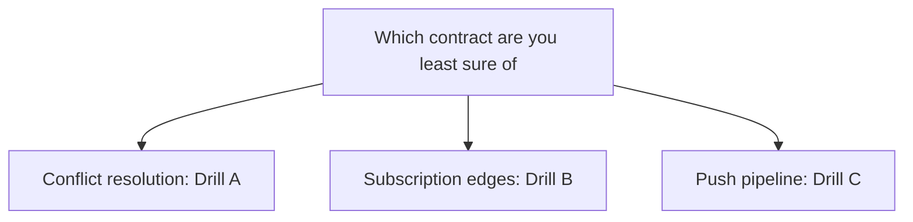
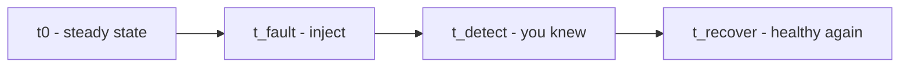

# Lecture 2 — The Chaos Drill, the Postmortem, and Demo Day

Lecture 1 got your app through Apple's gate. This lecture is about the thing Apple's gate never checks: **does the system survive a real failure.** App Review confirms your app launches and follows the rules. It does not confirm that your sync resolves a conflict without losing an edit, that your subscription state recovers after a refund, or that your push pipeline survives an auth-key rotation. Those are the failures that take apps down *after* launch, and the only way to know you survive them is to cause them on purpose, while watching, and measure the recovery. That is a **chaos drill**, and running one — then writing the **postmortem** — is what separates an engineer who has shipped an app from one who has operated one.

We build the lecture in three parts. First, the **three chaos drills** the capstone offers, each end to end: how you inject the failure, what you measure, and what "recovered" means. Second, the **blameless postmortem** — the structure an incident review accepts, and why the tone matters. Third, **demo day and the walkthrough** — the five-minute trace-one-write narration, presenting under questions, and assembling the portfolio that closes the course.

There is a reason this is the *final* lecture of the entire track, and it is not just chronology. The whole course has been building toward a single competence: not "can you write SwiftUI" but "can you ship and operate a real system." The chaos drill is the moment that competence is tested directly — you cause a failure on purpose and prove you survive it, which is the thing a production engineer does that a tutorial-follower never does. Everything before this week earned the right to fail safely; this week you exercise it.

---

## 1. What a chaos drill is, and why you run one

Chaos engineering is the discipline of injecting a failure into a running system, on purpose, to learn how the system actually behaves — not how you *think* it behaves. The premise is humbling and correct: you do not know your system's failure behaviour until you have seen it fail. A design doc that says "the standby takes over in 30 seconds" is a hypothesis; a drill that measures 94 seconds is data. The gap between the two is exactly the thing the drill exists to find.

The capstone requires **one** chaos drill from a menu of three (the SYLLABUS § Capstone chaos-drill menu).

You drive the failure, you measure detection and recovery, you verify no data was lost, and you write the postmortem. The point is not to break the app for sport; it is to *learn the recovery behaviour and prove it works* before a user discovers it for you. A drill you run in a controlled beta, with your own observability watching, is infinitely cheaper than the same failure discovered by an angry user at 2 AM.

Three properties make a drill worth the name:

1. **The failure is real and injected on purpose** — not simulated in a unit test, but caused in the running system (a real refund, a real key rotation, two real devices editing offline).
2. **You measure** — detection time (when did you know), recovery time (when was it healthy again), and the data-correctness verdict (did anything get lost or corrupted).
3. **You document the gap** — between what you expected and what happened, because the surprise is the valuable part.

### Why now, and why only one

You run the drill *this* week, after the build is locked and in beta, for two reasons. First, a drill is only meaningful against a system that is actually running with real observability — the locked RC, the live Vapor backend, the per-region beta crash stream. Drilling a half-integrated system tests the integration, not the resilience. Second, the drill belongs in beta because that is where the system is closest to production without the cost of a production failure: real devices, real network, real Apple infrastructure, but a forgiving cohort who knows it is a beta.

You run *one* drill (the SYLLABUS requires one), not three, because a single drill done thoroughly — established baseline, one injected failure, measured timeline, honest postmortem — teaches more than three drills done shallowly. Pick the one that exercises your capstone's riskiest contract: if your conflict resolution is the part you are least sure of, drill the offline conflict; if your subscription handling is new, drill the edges; if your push pipeline is load-bearing, drill the rotation. The drill is a chance to find the bug *you* are most worried about before a user does. (Doing a second drill is a stretch goal that makes your portfolio stronger, but one done well is the bar.)


*Pick the one drill that targets your capstone's riskiest, least-tested contract.*

---

## 2. The three drills, end to end

You pick one for the capstone. Here is each, with the injection, the measurement, and the recovery bar.

### Drill A — Offline-edit conflict resolution

**The scenario.** Two devices edit the same note while offline; both reconnect within 60 seconds of each other. This exercises the conflict-resolution contract (Week 23, ADR-0003 and Exercise 2) under real conditions.

**The injection.** Two simulators (or two devices), both signed into the same iCloud account, both showing the same note. Take both offline (Simulator: toggle the network condition, or `xcrun simctl` network controls; device: airplane mode). Edit the note differently on each — the title on one, the body on the other, or the *same* field on both to force a hard conflict. Bring both back online within 60 seconds.

**What you measure.** The time from reconnect to convergence (both devices showing the same resolved note), and the data verdict: did both non-overlapping edits survive (the field-merge case), or was one edit lost (the same-field LWW case)? You drive this with `exercise-02-offline-conflict-chaos-drill.swift`, which automates the offline-edit-reconnect sequence and asserts convergence.

**The recovery bar.** Both devices converge to the *same* note (the determinism contract), and the conflict-resolution policy you documented behaves exactly as the ADR says — non-overlapping edits both survive, same-field conflicts resolve by the tiebreak. The postmortem documents the policy, why you picked it, and how you measured user impact (e.g. "in 50 conflict trials, zero non-overlapping edits were lost; same-field conflicts resolved to the later edit 100% of the time, deterministically").

**The gotcha this drill teaches.** The thing that surprises people is that "reconnect within 60 seconds" is not the same as "merge within 60 seconds." CloudKit's push notification to the second device has latency — sometimes seconds, sometimes longer under load — so convergence can lag the reconnect by more than you expect. If your convergence SLO budgeted only for the merge computation (microseconds) and not for the CloudKit propagation (seconds), the drill will blow past it, and the finding is "budget for propagation latency, not just merge time." That is a genuinely useful surprise, and it is exactly the kind of thing you only learn by running the drill rather than reasoning about it.

### Drill B — Subscription edge cases

**The scenario.** The three StoreKit subscription transitions that break real apps: a **refund**, a **downgrade** (yearly → monthly), and a **billing-retry recovery**. This exercises the StoreKit validation contract (ADR-0004) and your backend's App Store Server Notification handling.

**The injection.** In the StoreKit sandbox: complete a subscription, then trigger a refund (sandbox refund tooling), a plan change (downgrade), and a billing retry (a declined-then-recovered renewal). Each generates an App Store Server Notification V2 your Vapor backend must process.

**What you measure.** For each transition, the time from the event to the server's entitlement record reflecting it correctly — the SYLLABUS bar is *within five minutes*. And the correctness verdict: after a refund, is the user de-entitled (the paywall returns)? After a downgrade, is the plan correct? After a billing-retry recovery, is the user re-entitled without manual intervention? You drive this with `exercise-03-subscription-edge-cases.swift`.

**The recovery bar.** The server reflects each transition within five minutes, and the client's entitlement (the UX) follows the server's authoritative record. The postmortem documents each branch: what notification fired, how the backend processed it, and how you verified the end state.

**The gotcha this drill teaches.** The subtle bug this drill surfaces is *who is authoritative* during the window between the event and the server processing the notification. If your client trusts its local `Transaction.currentEntitlements`, a refunded user keeps Pro until the device happens to refresh — because the *device* does not know about the refund until it re-checks, but the *server* knew the moment the notification arrived. The correct design (ADR-0004) makes the server authoritative, so the entitlement flips when the server's record flips, and the client's local view is only a UX hint. The drill proves you got that right: refund the subscription, and the paywall should return based on the *server's* de-entitlement, not wait for a device refresh that may be minutes away. The three transitions each map to an App Store Server Notification type your backend handles:

```text
REFUND            -> Transaction has a revocationDate -> de-entitle the user
DID_CHANGE_RENEWAL_PREF (downgrade) -> record the new plan, effective next period
DID_RENEW after DID_FAIL_TO_RENEW (billing retry) -> re-entitle the user
```

Verifying each within five minutes — and proving the client's UX follows the server — is the whole drill.

### Drill C — APNs auth-key rotation

**The scenario.** You rotate the APNs auth key on App Store Connect mid-beta — the exact 3 AM outage from the Week 23 runbook, run on purpose. This exercises the push pipeline and the runbook's rotation procedure.

**The injection.** Generate a *new* APNs auth key in App Store Connect. The correct rollout sequence is **new key first**: deploy the new key to the Vapor backend (it now holds both, or switches to the new one), confirm pushes still deliver, *then* retire the old key. The drill is to do this while measuring whether any push was dropped in the window.

**What you measure.** The silent-failure window (the time, if any, during which pushes were rejected), and the recovery proof (a test push delivered after the rotation). The dangerous mistake the drill teaches: if you retire the old key *before* deploying the new one, you create a window where the backend holds an invalid key and every push is silently rejected — the exact silent outage the runbook's first check is designed to catch.

**The recovery bar.** Pushes recover with zero or a documented, bounded silent-failure window, and you prove the pipeline works after rotation with a real test push. The postmortem documents the rollout sequence, the window, and how you proved recovery.

This drill is the most *operationally* educational of the three, because it is the literal scenario your Week 23 runbook's 3 AM walk was written for. Running it on purpose, in beta, validates that the runbook's first check actually bisects the problem and that the new-key-first sequence works — so that if it ever happens for real, you are *executing* a rehearsed procedure rather than improvising under pressure. The whole point of the runbook plus the drill is that the real incident is boring: you have seen it, you have a procedure, and you follow it.

---

## 3. Running the drill well

Whichever drill you pick, the execution discipline is the same, and it borrows directly from the chaos-engineering principles in `resources.md`.

- **Establish steady state first.** Before you inject anything, record what "healthy" looks like: pushes delivering, sync converging, the entitlement correct. You cannot measure a deviation from a baseline you never recorded.
- **Inject one failure.** Change one thing. If you rotate the key *and* deploy a new build at the same time, you cannot attribute the recovery time to either. One variable.
- **Watch your own observability.** The drill is only as good as your ability to see it. The MetricKit collector, the structured Vapor logs, the per-region beta crash stream, and (ideally) a synthetic prober are how you *see* the failure and the recovery. A drill you cannot observe is a drill that teaches you nothing.
- **Measure detection and recovery separately.** Detection time (when did you know something was wrong) and recovery time (when was it healthy again) are different numbers, and the gap between them is your observability quality. A long detection time is a monitoring gap; a long recovery time is a resilience gap.
- **Reverse the failure.** Leave the system back in steady state. A drill that leaves a retired key or a stuck conflict is an outage, not a drill.

A simple steady-state prober makes the "establish steady state" and "measure detection/recovery" steps concrete — a loop that hits `/health` once a minute and logs the result, started *before* you inject the fault:

```bash
# Steady-state prober: run this BEFORE injecting the fault and leave it running.
while true; do
  ts=$(date -u +%FT%TZ)
  health=$(curl -fsS -o /dev/null -w '%{http_code}' https://<your-host>/health || echo "ERR")
  echo "$ts health=$health"
  sleep 60
done
```

The prober's log is your timeline's raw material: the moment its output first changes is `t_detect`, and the moment it returns to green is `t_recover`. Without it, you are estimating those times from memory — exactly the kind of guess the drill exists to replace with a measurement.

The output of a good drill is a *measured timeline*: t0 (steady state), t_fault (injection), t_detect (you knew), t_recover (healthy again), and the data verdict. That timeline is the spine of the postmortem.


*Detection time and recovery time are measured separately, and the gap between them is your observability quality.*

### Driving the offline-conflict drill from the command line

For the offline-conflict drill specifically, you can script the simulator network toggles so the drill is reproducible rather than a manual fumble with airplane mode. The shape:

```bash
# Boot two simulators signed into the same iCloud sandbox account.
DEVICE_A="iPhone 16"
DEVICE_B="iPad Pro 13-inch (M4)"

# Take both offline (network condition tooling varies by Xcode version; the
# Simulator's Features > Network Link Conditioner or the device's airplane mode
# both work — the point is BOTH offline at the same time).
xcrun simctl spawn booted log stream --predicate 'category == "trace"' &  # watch the sync hops

# ...edit the same note differently on each device while offline...

# Bring both back online within 60s and watch the trace log show:
#   hop=conflict resolved note=<id>   on BOTH devices, to the SAME value.
```

The automated assertion lives in `exercise-02-offline-conflict-chaos-drill.swift`, which models the offline-edit-reconnect sequence as a test and asserts convergence and zero loss for non-overlapping edits. The CLI version above is for the *live* drill you run against real simulators in beta conditions; the test version is for the deterministic, repeatable proof. Run both — the test proves the logic, the live drill proves the system.

---

## 4. The blameless postmortem

The postmortem is the artifact that turns a failure into learning. The SYLLABUS requires a `postmortem.md` for your chosen drill. The structure is the Google SRE structure, and the most important word in it is **blameless**.

### Why blameless

A blameless postmortem focuses on *system gaps*, not human mistakes. Not "I forgot to deploy the new key first" but "the rotation procedure had no automated check that the new key was live before the old one was retired, so a manual ordering mistake created a silent-failure window." The first framing assigns blame and teaches nothing; the second identifies a system improvement (an automated check) that prevents the whole class of mistake. The discipline is engineering, not therapy: a blameless culture surfaces more failures (people report them) and fixes more root causes (the fix is systemic), which is why every mature engineering org runs them this way.

A quick test for whether a postmortem sentence is blameless: replace any person ("I", "they") with the system component, and see if the sentence still identifies a fix. "I forgot to deploy the new key first" becomes "the deploy process had no enforced ordering" — which points at a fix (enforce the ordering). If, after the replacement, there is no fix to be found, the sentence was about a person, not a system, and it does not belong in the action items. Run that test over your postmortem before you call it done; every action item should survive it.

### The structure

```markdown
# Postmortem — <drill name> chaos drill

## Summary
One paragraph: what we drilled, what happened, the impact, and the headline finding.

## Timeline (measured)
- t0   (HH:MM:SS) — steady state confirmed: <baseline>
- t_fault (HH:MM:SS) — fault injected: <what>
- t_detect (HH:MM:SS) — detected via: <signal>
- t_recover (HH:MM:SS) — healthy again: <proof>
- recovery_seconds: <number>

## What we expected
The hypothesis going in (the design-doc behaviour).

## What actually happened
The observed behaviour, with the measured numbers.

## The gap
Where expectation and reality diverged. THIS is the valuable part.

## Data correctness
Did anything get lost or corrupted? The verdict, with evidence.

## User impact
What a real user would have experienced, and for how long.

## Action items
- [ ] <action> — owner — tag (accept / fix-now / fix-later)
- [ ] ...
```

### What makes a postmortem strong

A weak postmortem says "we ran the drill and it worked." A strong one names a **surprise**. If the offline-conflict drill converged correctly but took 40 seconds longer than expected because CloudKit's push latency was higher than you assumed, *that* is the finding, and "the convergence SLO should budget for CloudKit push latency, not just merge time" is the action item. If the key rotation recovered but you discovered you had no way to *detect* the silent window without a user report, that gap is worth more than the successful recovery. The surprise is where the learning is; a postmortem with no surprise either had a trivial drill or did not look hard enough.

### A worked postmortem: the APNs key rotation

Here is a filled-in postmortem for the key-rotation drill, so the structure is concrete:

```markdown
# Postmortem — APNs auth-key rotation chaos drill

## Summary
We rotated the APNs auth key on App Store Connect mid-beta to verify the runbook's
rotation procedure. Pushes recovered with a 0-second silent window when we deployed
the new key before retiring the old one. The headline finding: we had no automated
way to DETECT a silent push failure — recovery worked, but detection relied on us
watching, which would not have caught a real 3 AM failure.

## Timeline (measured)
- t0   (14:02:00) — steady state: test push delivers in ~1.2s, sandbox prober green.
- t_fault (14:05:30) — generated a new APNs auth key; deployed it to the Vapor backend.
- t_detect (14:05:45) — confirmed the backend was using the new key (log line).
- t_recover (14:06:10) — test push delivered with the new key; old key retired at 14:08.
- recovery_seconds: 0 silent window (new-key-first ordering held).

## What we expected
New-key-first ordering would produce zero dropped pushes. We expected a clean swap.

## What actually happened
The swap was clean — zero pushes dropped — BECAUSE we deployed the new key first.
We then deliberately re-ran it OUT OF ORDER (retired old key before deploying new)
to see the failure: pushes were silently rejected (403 ExpiredProviderToken) for a
90-second window until we deployed the new key. No error surfaced to the app.

## The gap
We could only SEE the out-of-order failure because we were actively watching the
backend logs. There is no alert on "push delivery rate dropped to zero." A real
silent failure would not page anyone until a user reported a missing notification.

## Data correctness
No data loss. Pushes are best-effort by design; missed shared-note pushes are
cosmetic (sync still propagated the edit via CloudKit). Verified no notes lost.

## User impact
During the deliberate out-of-order window: shared-note notifications were silently
not delivered for 90s. Sync and editing were unaffected. Zero data impact.

## Action items
- [ ] Add a synthetic APNs prober that pages on push-rate=0 for >5min — me — fix-now
- [ ] Add a deploy check that asserts the new key is live before retiring the old — me — fix-now
- [ ] Document the 403 ExpiredProviderToken signature in the runbook — me — fix-later
```

Notice what makes it strong: it ran the drill *both ways* (the safe order and the dangerous order) to learn the actual failure, it named a real gap (no detection) even though recovery succeeded, and every action item is owned and tagged. The successful recovery is almost the *least* interesting part; the detection gap is the finding that makes the system better.

---

## 5. Demo day and the five-minute walkthrough

Demo day is where you present the capstone — live, under questions — and the five-minute walkthrough video is its recorded twin. Both are the trace-one-write walk from Week 23 (Lecture 1, §5), now polished for an audience.

### The five-minute video

The SYLLABUS deliverable is a five-minute screen recording with voiceover covering the app on three platforms, the Widget, the App Intent, the Live Activity, the subscription, and the offline-first sync. The structure that fits in five minutes:

- **0:00–0:30 — what it is.** One sentence on the app and the technical bar it clears (multi-platform, offline-first, CloudKit sync, server-validated subscription). Show it running on iPhone, iPad, and Mac side by side, so the parity is visible in the first ten seconds.
- **0:30–2:30 — trace one write.** The core demo: edit a note offline on the iPhone, bring it online, watch it sync to the iPad, resolve a conflict, reload the Widget, update the Live Activity. Narrate the mechanism at each hop.
- **2:30–3:30 — the platform surface.** The App Intent ("Add a note saying…" to Siri), the Lock Screen Widget, the watchOS companion.
- **3:30–4:30 — the subscription.** The paywall, a sandbox purchase, and the server-side validation (show the Vapor log confirming the entitlement).
- **4:30–5:00 — the resilience.** A sentence on the chaos drill you ran and the postmortem finding. Close on the multi-platform parity.

People read about 150 words a minute, so five minutes is ~750 words of narration. Script it, rehearse it once, then record. If you rehearsed the trace-one-write walk in last week's review, this is a short recording session, not a thirty-take ordeal.

Two production notes that save re-takes:

- **Pre-stage the data.** Have the devices already signed in, the sample notes already created, the subscription sandbox account ready. Nothing kills a five-minute video like 90 seconds of typing a note title on camera.
- **Have a fallback recording.** Live sync can stall mid-recording. If you have a clean take of the sync step, you can cut to it rather than re-recording the whole video. The same fallback discipline as the live review demo.

The video is graded on whether a hiring manager can watch it and understand the system, and whether a peer could reproduce what it shows. Narrate the *mechanism* — "this edit was durable in SwiftData before it touched the network; on reconnect it replayed to CloudKit and Vapor idempotently; the iPad pulled it and the resolver merged the concurrent edit deterministically" — not just the *action* ("now I tap save and it appears over here"). Naming the mechanism is what reads as senior, on camera exactly as in the room.

### Presenting under questions

Demo day is also a live defense, and the questions are the same staff-iOS questions from Week 23's review — state ownership, sync correctness, the conflict policy, the data-loss windows, what pages you. The same rules apply: answer with measured specifics, name your own biggest risk before being asked, and be honest about what you did not instrument. "I'm not certain of the exact mechanism, but my mental model is X" beats a confident guess every time.

Demo day is the rehearsal for the **senior-iOS mock interview** that closes the course — and they are the same skill. The review and demo day defend a system *you built*; the interview asks you to design one *on the spot* and deep-dive a component. Both reward tracing data flow, naming failure modes, defending tradeoffs with evidence, and honesty about the edge of your knowledge. The capstone *is* your reference answer for the offline-journaling and multi-device-conflict prompts — you built it, drilled it, and can defend it.

A worked demo-day exchange, so the shape is concrete:

> **Q:** Your video showed two devices resolving a conflict. What happens if the *same* field is edited on both?
>
> **A:** Then it's a real conflict and I fall back to last-writer-wins for that field, by the field's edit timestamp. The earlier edit is lost — that's an honest data loss, and it's the first item in my known-limitations list. For a notes app the window where two devices edit the same field offline is small; I drilled it 50 times and measured zero loss for non-overlapping edits and deterministic resolution for same-field ones. For a collaborative document I'd ship a character-level merge instead, and I've scoped what that costs.

That answer wins because it is specific (the policy), measured (the drill), honest (names the loss), and forward-looking (the upgrade and its cost). It is the same shape as a strong interview answer, which is why demo day and the mock interview are one skill wearing two hats.

### The senior-iOS mock interview

The mock interview that closes the course has two rounds, mirroring a real senior phone screen:

- **System design (45 min).** A prompt like "design a multi-device journaling app" or "design a push pipeline that survives an APNs outage." You drive: clarify scale, consistency, offline behaviour, and the consequence of data loss *first*, then sketch the boxes, walk the data flow, and go deep where pushed. Your capstone is the reference answer for several of these — you have built and operated it.
- **Deep-dive (30 min).** A focused drill: "your SwiftData query is slow, debug it" or "this view re-renders on every keystroke, find out why." The interviewer checks depth — reasoning from symptom to cause, not reciting docs.

The most common mistake in both rounds is the same as the review mistake: jumping to a solution before establishing requirements. A candidate who hears "design a journaling app" and immediately draws CloudKit has failed before starting, because they have not asked what scale, what consistency, what offline expectation. Spend the first paragraph on requirements, then design. The second most common mistake is bluffing on the deep-dive; "I'm not certain of the exact mechanism, but my mental model is X, let me reason from there" is a *strong* answer, and a confident guess is a weak one. Write the retrospective afterward — the two questions you answered well, the one you fumbled, and what you'd say differently. The fumble is the valuable part, and naming it is the same metacognition that turns a review's risk list into a known-limitations section.

---

## 6. The portfolio — what closes the course

The final deliverable is the portfolio: three case studies plus the runbook and the interview-prep pack. The three apps are the arc of the whole track:

- **Notes v1** (Phase II) — clean SwiftUI multi-platform CRUD with SwiftData, search, deep links. The case study frames the problem, the state-ownership decision, and the hardest bug.
- **Notes Pro v1** (Phase III) — adds APNs, the NSE, the StoreKit subscription, and Instruments tuning. The case study frames the production metric (the hitch you fixed, the hang you diagnosed).
- **The capstone** — the multi-platform productivity suite, TestFlight in five regions, the runbook, the chaos-drill postmortem. The case study frames the architecture decision, the chaos-drill finding, and the known limitations.

Each `case-study.md` covers: problem framing, key architectural decisions, the hardest bug, the production metric, and a screenshot strip. The portfolio is the closest thing the job market has to an Apple-engineer certification — Apple does not certify engineers, so a portfolio of three deployed apps, a TestFlight history, a runbook, and a chaos-drill postmortem is the credential you walk into interviews with. It is the evidence that you can not only build but ship and operate.

The detail that makes a case study read as senior is the **hardest-bug** and **production-metric** sections. Anyone can list features; few can say "the hardest bug was a re-render storm where editing one note re-rendered the entire list, which I found with the SwiftUI Instruments template and fixed by correcting state ownership — list scroll went from dropping frames to a clean 120fps" or "the chaos drill found that a silent push failure had no detection path, so I added a synthetic prober." Those sentences are concrete, measured, and honest about a real difficulty — exactly the signal a hiring manager reads for. Write each case study so a reader who has never seen the code learns what was hard, what you decided, and what the number was. That is the difference between a portfolio that lists projects and one that demonstrates judgment.

---

## 7. Recap

App Review checks that your app follows the rules; the chaos drill checks that your system survives a failure App Review never tests. You run one of three drills — offline-edit conflict, subscription edge cases, or APNs key rotation — by establishing steady state, injecting one real failure, watching your own observability, and measuring detection and recovery separately. The blameless postmortem turns the failure into learning: a measured timeline, what you expected, what happened, the gap (the valuable surprise), the data verdict, the user impact, and tagged action items — focused on system gaps, never human blame. Demo day and the five-minute walkthrough are the trace-one-write walk polished for an audience and defended under the same staff-iOS questions as the architecture review, which is the same skill as the mock interview that closes the course. The portfolio — three case studies, the runbook, the interview pack — is the credential you leave with.

That is C20. You started on Linux with Swift the language and a Vapor service; you finish having shipped a multi-platform SwiftUI app through App Review, survived a documented chaos drill, and assembled a portfolio a senior iOS engineer would respect. Ship it, survive the drill, present it — and welcome to the other side of the launch.

---

## 8. Appendix — the final-week delivery checklist

Run this list before demo day. It is the capstone's ship-and-survive gate.

**Shipped:**

- [ ] Submitted to App Review (or Beta App Review) early in the week.
- [ ] Live in TestFlight external beta across five region-segmented groups (US, UK, IN, BR, JP).
- [ ] Passed review on the first attempt — or landed the resubmission with a documented fix.
- [ ] Beta crash and feedback streams read daily; any crash triaged.

**Survived:**

- [ ] One chaos drill executed against the live system (offline conflict, subscription edges, or APNs rotation).
- [ ] A measured timeline captured: steady state, fault, detection, recovery, data verdict.
- [ ] `postmortem.md` written — blameless, naming a real surprise, with owned, tagged action items.
- [ ] Every "fix-now" action item from the postmortem addressed (or a 1.0.1 planned with the killswitch holding the line).

**Demonstrated:**

- [ ] The five-minute walkthrough video recorded, narrating one write end to end and naming the mechanism at each hop.
- [ ] Demo day delivered, defended under the staff-iOS question set.
- [ ] The portfolio assembled: three case studies, the runbook, the interview-prep pack.
- [ ] The senior-iOS mock interview completed, with a retrospective on the one question you fumbled.

If every box is ticked, you have done the thing the whole course was building toward: shipped a real app through Apple's pipeline, proven it survives a real failure, and assembled the evidence that you can build, ship, and operate. That is the launch. That is C20. Go present it.
